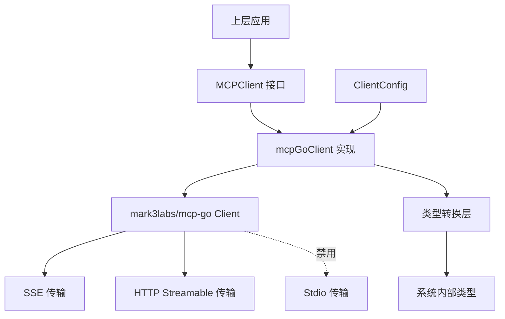

# MCP 客户端接口与传输实现技术深度解析

## 1. 概述

`mcp_client_interface_and_transport_impl` 模块是系统中负责与外部 MCP (Model Context Protocol) 服务通信的核心组件。它通过定义统一的接口和提供标准化的传输实现，使得系统能够以一致的方式集成各种外部 MCP 服务。

### 为什么需要这个模块？

在没有这个模块之前，系统可能需要为每个不同的 MCP 服务编写定制化的通信代码，这会导致代码重复、维护成本高，以及难以切换或扩展新的 MCP 服务。这个模块通过抽象 MCP 通信的通用模式，解决了以下问题：

- **协议复杂性封装**：隐藏了 MCP 协议的底层细节，提供了简单易用的接口
- **传输多样性处理**：支持多种传输协议（SSE、HTTP Streamable）
- **状态管理**：统一处理连接、断开、初始化等生命周期管理
- **错误处理**：提供标准化的错误处理机制
- **类型转换**：在第三方库类型和系统内部类型之间进行转换

## 2. 架构设计

### 2.1 核心架构图



### 2.2 核心组件角色

1. **MCPClient 接口**：定义了与 MCP 服务通信的完整契约，包括连接管理、初始化、工具调用、资源访问等操作。
2. **mcpGoClient 结构体**：`MCPClient` 接口的具体实现，基于 `mark3labs/mcp-go` 库进行封装。
3. **ClientConfig 结构体**：包含创建 MCP 客户端所需的所有配置信息。
4. **NewMCPClient 工厂函数**：根据配置创建适当类型的 MCP 客户端实例。

### 2.3 设计模式

该模块采用了几种经典的设计模式：

- **适配器模式**：`mcpGoClient` 作为适配器，将 `mark3labs/mcp-go` 库的接口转换为系统定义的 `MCPClient` 接口
- **工厂模式**：`NewMCPClient` 作为工厂函数，根据不同的传输类型创建相应的客户端实例
- **状态模式**：客户端内部维护连接和初始化状态，不同状态下的操作有不同的行为

## 3. 核心组件深度解析

### 3.1 MCPClient 接口

`MCPClient` 接口是整个模块的核心，它定义了与 MCP 服务交互的所有必要方法：

```go
type MCPClient interface {
    Connect(ctx context.Context) error
    Disconnect() error
    Initialize(ctx context.Context) (*InitializeResult, error)
    ListTools(ctx context.Context) ([]*types.MCPTool, error)
    ListResources(ctx context.Context) ([]*types.MCPResource, error)
    CallTool(ctx context.Context, name string, args map[string]interface{}) (*CallToolResult, error)
    ReadResource(ctx context.Context, uri string) (*ReadResourceResult, error)
    IsConnected() bool
    GetServiceID() string
}
```

这个接口的设计体现了几个重要原则：

1. **生命周期清晰**：明确区分了连接、初始化、使用、断开的完整生命周期
2. **功能完整**：涵盖了 MCP 协议的核心功能（工具、资源）
3. **上下文感知**：所有网络操作都接受 `context.Context` 参数，支持超时和取消
4. **状态查询**：提供了查询连接状态和服务 ID 的方法

### 3.2 mcpGoClient 结构体

`mcpGoClient` 是 `MCPClient` 接口的具体实现，它封装了 `mark3labs/mcp-go` 库的客户端：

```go
type mcpGoClient struct {
    service     *types.MCPService
    client      *client.Client
    connected   bool
    initialized bool
}
```

**内部状态管理**：
- `service`：保存服务配置信息
- `client`：底层第三方库客户端实例
- `connected`：连接状态标志
- `initialized`：初始化状态标志

这种状态跟踪设计使得客户端能够在不同阶段执行适当的操作，并防止非法状态转换（例如在未连接时尝试初始化）。

### 3.3 ClientConfig 结构体

`ClientConfig` 是一个简单但重要的配置结构：

```go
type ClientConfig struct {
    Service *types.MCPService
}
```

它目前只包含一个 `Service` 字段，但这种设计为将来的扩展留出了空间。`types.MCPService` 包含了连接 MCP 服务所需的所有信息，如 URL、传输类型、认证配置、超时设置等。

### 3.4 NewMCPClient 工厂函数

`NewMCPClient` 是创建 MCP 客户端的工厂函数，它根据配置中的传输类型创建相应的客户端实例：

```go
func NewMCPClient(config *ClientConfig) (MCPClient, error) {
    // ... 配置 HTTP 客户端和头部
    switch config.Service.TransportType {
    case types.MCPTransportSSE:
        // 创建 SSE 客户端
    case types.MCPTransportHTTPStreamable:
        // 创建 HTTP Streamable 客户端
    case types.MCPTransportStdio:
        // 禁用 Stdio 传输（安全原因）
    default:
        // 返回不支持的传输类型错误
    }
    // ... 设置连接丢失回调
}
```

**关键设计决策**：
1. **HTTP 客户端配置**：根据服务配置设置超时时间
2. **头部构建**：包括自定义头部和认证头部
3. **传输类型选择**：支持 SSE 和 HTTP Streamable 两种传输方式
4. **安全限制**：明确禁用 Stdio 传输，防止命令注入漏洞
5. **连接丢失处理**：设置连接丢失回调，确保状态正确更新

## 4. 数据流向分析

让我们追踪一个典型的 MCP 工具调用流程：

### 4.1 完整调用流程

1. **创建客户端**：上层应用调用 `NewMCPClient(config)` 创建客户端实例
2. **建立连接**：调用 `client.Connect(ctx)` 建立与 MCP 服务的连接
3. **初始化握手**：调用 `client.Initialize(ctx)` 执行 MCP 协议初始化握手
4. **列出工具**：调用 `client.ListTools(ctx)` 获取可用工具列表
5. **调用工具**：调用 `client.CallTool(ctx, name, args)` 执行具体工具
6. **处理结果**：处理返回的 `CallToolResult`
7. **断开连接**：调用 `client.Disconnect()` 关闭连接

### 4.2 数据转换层

在 `mcpGoClient` 的实现中，有一个重要的数据转换层，它在第三方库类型和系统内部类型之间进行转换：

- **工具列表转换**：将 `mcp.Tool` 转换为 `types.MCPTool`
- **资源列表转换**：将 `mcp.Resource` 转换为 `types.MCPResource`
- **工具调用结果转换**：将 `mcp.CallToolResult` 转换为 `CallToolResult`
- **资源读取结果转换**：将 `mcp.ReadResourceResult` 转换为 `ReadResourceResult`

这种转换层设计使得系统可以自由选择底层 MCP 库，而不会影响上层应用代码。

## 5. 设计决策与权衡

### 5.1 接口与实现分离

**决策**：定义了 `MCPClient` 接口，并提供了 `mcpGoClient` 实现。

**原因**：
- 便于测试：可以轻松创建 Mock 实现进行单元测试
- 灵活性：未来可以添加其他实现（例如基于不同的底层库）
- 依赖倒置：上层应用依赖于抽象接口，而不是具体实现

### 5.2 安全考虑：禁用 Stdio 传输

**决策**：在 `NewMCPClient` 中明确禁用 Stdio 传输方式。

**原因**：
- Stdio 传输可能导致命令注入漏洞
- 相比网络传输，Stdio 传输的安全风险更高
- 提供了更安全的替代方案（SSE 和 HTTP Streamable）

**权衡**：
- 损失了一些灵活性，但大大提高了安全性
- 注释中明确说明了禁用原因，有助于开发者理解

### 5.3 连接状态管理

**决策**：在 `mcpGoClient` 中维护 `connected` 和 `initialized` 两个状态标志。

**原因**：
- 防止非法操作：例如在未连接时尝试初始化
- 提供清晰的状态查询接口
- 便于错误处理和恢复

**实现细节**：
- 大多数操作在执行前都会检查状态
- 连接丢失时会自动更新状态
- 特殊处理了 SSE 传输中的 "Invalid session ID" 错误

### 5.4 错误处理策略

**决策**：
- 定义了专门的错误变量（在 `errors.go` 中）
- 使用 Go 的标准错误包装模式（`fmt.Errorf("failed to X: %w", err)`）
- 实现了 `checkErrorAndDisconnectIfNeeded` 方法处理特定错误

**原因**：
- 提供了统一的错误类型，便于上层应用处理
- 保留了原始错误信息，便于调试
- 自动处理需要断开连接的错误情况

## 6. 使用指南与最佳实践

### 6.1 创建客户端

```go
config := &mcp.ClientConfig{
    Service: &types.MCPService{
        ID:            "my-mcp-service",
        URL:           &serviceURL,
        TransportType: types.MCPTransportSSE,
        AuthConfig: &types.MCPAuthConfig{
            APIKey: "my-api-key",
        },
        AdvancedConfig: &types.MCPAdvancedConfig{
            Timeout: 60, // 60 秒超时
        },
    },
}

client, err := mcp.NewMCPClient(config)
if err != nil {
    // 处理错误
}
```

### 6.2 完整使用流程

```go
ctx := context.Background()

// 1. 连接
if err := client.Connect(ctx); err != nil {
    // 处理连接错误
}
defer client.Disconnect() // 确保最终断开连接

// 2. 初始化
if _, err := client.Initialize(ctx); err != nil {
    // 处理初始化错误
}

// 3. 列出可用工具
tools, err := client.ListTools(ctx)
if err != nil {
    // 处理错误
}

// 4. 调用工具
args := map[string]interface{}{
    "param1": "value1",
    "param2": 42,
}
result, err := client.CallTool(ctx, "tool_name", args)
if err != nil {
    // 处理工具调用错误
}

// 5. 处理结果
if result.IsError {
    // 处理工具返回的错误
} else {
    for _, content := range result.Content {
        if content.Type == "text" {
            // 处理文本内容
        } else if content.Type == "image" {
            // 处理图片内容
        }
    }
}
```

### 6.3 最佳实践

1. **始终使用 defer 断开连接**：确保在函数返回时释放资源
2. **合理设置超时**：根据服务特性调整超时时间，避免过长或过短
3. **错误处理**：检查并妥善处理每个步骤可能出现的错误
4. **状态检查**：在执行操作前可以使用 `IsConnected()` 检查连接状态
5. **上下文管理**：使用上下文传递超时和取消信号

## 7. 常见问题与陷阱

### 7.1 连接丢失处理

**问题**：在 SSE 传输模式下，连接丢失可能不会总是触发 `onConnectionLost` 回调。

**解决方案**：模块已经实现了 `checkErrorAndDisconnectIfNeeded` 方法，它会检测 "Invalid session ID" 错误并自动断开连接，确保下次操作时可以重新建立连接。

### 7.2 状态顺序依赖

**问题**：操作必须按照正确的顺序执行（连接 → 初始化 → 使用），否则会返回错误。

**解决方案**：始终遵循正确的操作顺序，并在每个步骤检查错误。

### 7.3 类型转换注意事项

**问题**：在 `ListTools` 中，`InputSchema` 被序列化为 JSON 存储在 `types.MCPTool` 中。

**解决方案**：使用时需要正确反序列化这个字段，注意处理可能的序列化错误。

### 7.4 资源泄漏风险

**问题**：如果忘记调用 `Disconnect()`，可能会导致资源泄漏。

**解决方案**：使用 `defer client.Disconnect()` 模式确保连接总是被关闭。

## 8. 总结

`mcp_client_interface_and_transport_impl` 模块是一个设计良好的组件，它成功地封装了 MCP 协议的复杂性，为上层应用提供了简洁、一致的接口。通过接口与实现分离、状态管理、安全考虑等设计决策，该模块在灵活性、安全性和可维护性之间取得了良好的平衡。

作为系统与外部 MCP 服务通信的桥梁，这个模块的设计体现了几个重要的软件工程原则：
- **关注点分离**：将通信细节与业务逻辑分离
- **开闭原则**：对扩展开放，对修改关闭
- **依赖倒置**：上层依赖抽象，而不是具体实现
- **安全优先**：在设计中优先考虑安全性

对于新加入团队的开发者来说，理解这个模块的设计思想和实现细节，将有助于更好地使用和扩展系统的 MCP 集成功能。
