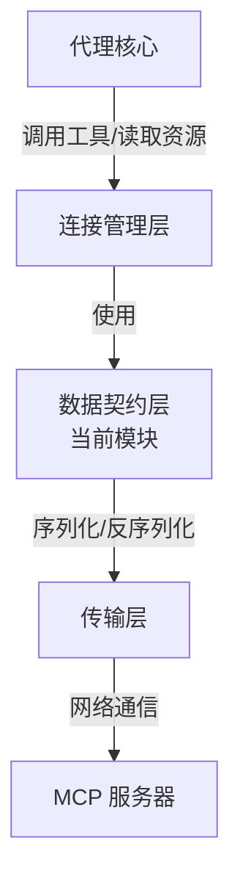

# MCP 资源和工具结果负载模型深度解析

## 1. 模块概述

`mcp_resource_and_tool_result_payload_models` 模块是 MCP（Model Context Protocol）协议栈中的核心数据契约层，负责定义 MCP 客户端与服务器之间交互的标准化消息格式。它解决了 MCP 生态系统中最基础的问题：**当多个不同的 MCP 服务需要交换数据时，如何确保每个参与方都能准确理解对方发送的信息？**

想象一下，如果你有多个来自不同供应商的 MCP 工具服务器，它们各自用不同的编程语言实现，但都需要与你的代理系统通信。如果没有统一的数据格式规范，每个服务器都可能以自己的方式返回工具执行结果或资源内容——有的可能用 JSON，有的可能用 XML，有的字段名是 `text`，有的是 `content`，这样的系统将无法互操作。

这个模块就是为了解决这个问题而存在的。它提供了一套精心设计的 Go 结构体，这些结构体直接映射到 MCP 协议规范中定义的 JSON 消息格式，确保了整个系统的数据交换一致性和类型安全。

## 2. 核心组件深度解析

### 2.1 ContentItem：多模态内容的基本单元

```go
type ContentItem struct {
    Type     string `json:"type"` // "text", "image", "resource"
    Text     string `json:"text,omitempty"`
    Data     string `json:"data,omitempty"`
    MimeType string `json:"mimeType,omitempty"`
}
```

**设计意图**：`ContentItem` 是一个多态容器，它封装了 MCP 工具返回结果中可能出现的各种内容类型。这是一个典型的**标记联合类型**（tagged union）模式的 Go 实现——通过 `Type` 字段标识内容类型，然后根据类型选择性地使用不同的字段。

**工作原理**：
- 当 `Type` 为 `"text"` 时，使用 `Text` 字段存储纯文本内容
- 当 `Type` 为 `"image"` 时，使用 `Data` 字段存储 Base64 编码的图像数据，配合 `MimeType` 说明图像格式
- 当 `Type` 为 `"resource"` 时，指向一个外部资源引用

**设计权衡**：使用单个结构体而不是接口层次结构是一个有意的选择。虽然 Go 的接口可以提供更好的类型安全，但这种扁平结构有几个关键优势：
1. 与 JSON 的动态特性自然映射
2. 简化了序列化和反序列化逻辑
3. 更容易进行版本兼容性处理

### 2.2 CallToolResult：工具调用的响应封装

```go
type CallToolResult struct {
    Content []ContentItem `json:"content"`
    IsError bool          `json:"isError,omitempty"`
}
```

**设计意图**：`CallToolResult` 是 MCP `tools/call` 请求的响应结构，它将工具执行的结果打包成一个标准化格式。这个结构体体现了 MCP 协议的一个重要设计理念：**工具执行结果应该是结构化的、多模态的，而不仅仅是一个简单的字符串**。

**关键特性**：
- `Content` 是一个 `ContentItem` 切片，允许工具返回混合类型的结果（例如一段文本 + 一张图片）
- `IsError` 标志位明确指示执行是否成功，而不是通过 HTTP 状态码或异常来表示

**为什么这样设计**：传统的工具调用接口通常只返回一个字符串或抛出异常，但 MCP 代理系统需要更丰富的信息来进行推理。通过使用 `[]ContentItem`，工具可以返回结构化的、带类型标注的结果，代理可以根据内容类型做出不同的处理决策。

### 2.3 ResourceContent 和 ReadResourceResult：资源读取的契约

```go
type ResourceContent struct {
    URI      string `json:"uri"`
    MimeType string `json:"mimeType,omitempty"`
    Text     string `json:"text,omitempty"`
    Blob     string `json:"blob,omitempty"` // Base64 encoded
}

type ReadResourceResult struct {
    Contents []ResourceContent `json:"contents"`
}
```

**设计意图**：这两个结构体定义了 MCP `resources/read` 请求的响应格式，用于从 MCP 服务器获取资源内容。`ResourceContent` 既可以表示文本资源，也可以表示二进制资源，通过 `Text` 和 `Blob` 字段的互斥使用来区分。

**设计亮点**：
- `URI` 字段不仅是标识符，还可以作为资源的定位符，支持代理系统后续引用
- `MimeType` 提供了内容类型的元数据，帮助代理正确解释资源
- `Blob` 字段明确标注为 Base64 编码，这是在 JSON 中传输二进制数据的标准做法

**与 ContentItem 的关系**：注意 `ResourceContent` 和 `ContentItem` 有相似的设计理念，但它们用于不同的协议端点。`ResourceContent` 专门用于资源读取操作，而 `ContentItem` 用于工具调用结果，这种分离保持了协议的清晰性。

### 2.4 初始化相关类型：协议握手的基础

```go
type InitializeResult struct {
    ProtocolVersion string             `json:"protocolVersion"`
    Capabilities    ServerCapabilities `json:"capabilities"`
    ServerInfo      ServerInfo         `json:"serverInfo"`
}

type ServerCapabilities struct {
    Tools        *ToolsCapability       `json:"tools,omitempty"`
    Resources    *ResourcesCapability   `json:"resources,omitempty"`
    Prompts      *PromptsCapability     `json:"prompts,omitempty"`
    Logging      map[string]interface{} `json:"logging,omitempty"`
    Experimental map[string]interface{} `json:"experimental,omitempty"`
}
```

**设计意图**：这些类型定义了 MCP 协议初始化阶段的消息格式。当 MCP 客户端连接到服务器时，首先交换初始化信息，这个过程类似于 TCP 的三次握手，确保双方使用兼容的协议版本并了解对方的能力。

**为什么使用指针字段**：注意 `ServerCapabilities` 中的字段都是指针类型（`*ToolsCapability` 等）。这是一个重要的设计细节：
- 使用指针允许这些字段为 `nil`，表示该功能不受支持
- 在 JSON 序列化时，`nil` 指针会被省略（`omitempty` 标签），减少不必要的网络传输
- 明确区分了"功能不存在"和"功能存在但为空"两种情况

## 3. 架构角色与数据流向

### 3.1 模块在系统中的位置

`mcp_resource_and_tool_result_payload_models` 模块位于 MCP 协议栈的**数据层**，它是连接协议传输层（[mcp_client_interface_and_transport_impl](platform_infrastructure_and_runtime-mcp_connectivity_and_protocol_models-mcp_client_interface_and_transport_impl.md)）和连接管理层（[mcp_connection_lifecycle_and_manager_orchestration](platform_infrastructure_and_runtime-mcp_connectivity_and_protocol_models-mcp_connection_lifecycle_and_manager_orchestration.md)）的桥梁。



### 3.2 典型数据流程

让我们追踪一个工具调用的完整数据流程：

1. **代理发起请求**：代理核心通过连接管理层请求调用某个 MCP 工具
2. **请求构建**：连接管理层使用本模块定义的类型（虽然请求类型不在此文件中，但响应类型在此）构建请求
3. **发送与执行**：传输层将请求发送到 MCP 服务器，服务器执行工具
4. **响应接收**：服务器返回 JSON 响应，传输层接收原始字节
5. **反序列化**：传输层使用 `CallToolResult` 结构体将 JSON 反序列化为 Go 对象
6. **内容处理**：连接管理层检查 `IsError` 标志，然后根据 `ContentItem` 的 `Type` 字段处理不同类型的内容
7. **结果返回**：处理后的结果返回给代理核心

这个流程中，本模块的类型扮演着**共享语言**的角色——每个环节都确切知道数据的格式和含义。

## 4. 设计决策与权衡

### 4.1 为什么使用结构体标签而不是自定义序列化？

你会注意到所有结构体都使用了标准的 Go JSON 标签（`json:"fieldName,omitempty"`），而不是实现 `json.Marshaler` 和 `json.Unmarshaler` 接口。这是一个有意的选择：

**选择标准标签的优势**：
- **可读性**：结构体定义本身就是文档，一眼就能看出 JSON 字段名和可选性
- **性能**：标准库的 JSON 序列化经过了高度优化
- **兼容性**：标准实现减少了出错的可能性
- **工具友好**：许多代码生成和分析工具都能理解这些标签

**权衡**：对于更复杂的验证逻辑（例如确保 `ContentItem` 中只有一个内容字段被设置），这种方法将验证责任推给了调用者。但在实践中，这是一个可以接受的权衡，因为：
1. 大多数验证可以在更高层次进行
2. 保持数据模型简单使模块更易于维护和演进

### 4.2 为什么是 Go 结构体而不是 Protocol Buffers？

考虑到这是一个 RPC 协议，你可能会疑惑为什么不使用 Protocol Buffers 或类似的 IDL。这里的关键是 MCP 协议的设计目标：

**MCP 是一个基于 JSON-RPC 的协议**，它强调：
- **可调试性**：JSON 消息人类可读，便于开发和调试
- **生态系统兼容性**：JSON 是 Web 通用语言，与现有工具链集成良好
- **渐进式演化**：JSON 的灵活性使得协议可以在不完全破坏兼容性的情况下演进

使用 Go 结构体直接映射 JSON 是最自然的实现方式，避免了 IDL 生成代码带来的间接层。

### 4.3 可选字段的指针 vs. 值类型

在 `ServerCapabilities` 中，我们看到：
```go
Tools     *ToolsCapability     `json:"tools,omitempty"`
```

而不是：
```go
Tools     ToolsCapability     `json:"tools,omitempty"`
```

**为什么使用指针**？这里有几个微妙但重要的原因：

1. **明确的存在性检查**：指针可以为 `nil`，这让我们能够区分"服务器不支持工具"和"服务器支持工具但配置为空"两种情况
2. **JSON 序列化行为**：`nil` 指针会被 `omitempty` 完全省略，而空值结构体仍然会被序列化为 `{}`
3. **内存效率**：对于不支持的功能，我们不需要分配内存

**权衡**：指针增加了 `nil` 引用的风险，但在这个模块中，这种风险是可控的，因为访问这些字段的代码会首先检查它们是否为 `nil`。

## 5. 使用指南与常见陷阱

### 5.1 正确构建 ContentItem

**常见错误**：设置多个内容字段
```go
// 错误示例
item := ContentItem{
    Type: "text",
    Text: "Hello",
    Data: "base64data...", // 不应该同时设置
}
```

**正确做法**：根据类型只设置相应的字段
```go
// 文本内容
textItem := ContentItem{
    Type: "text",
    Text: "Hello, world!",
}

// 图像内容
imageItem := ContentItem{
    Type:     "image",
    Data:     base64.StdEncoding.EncodeToString(imageData),
    MimeType: "image/png",
}
```

### 5.2 处理 CallToolResult 时的防御性编程

```go
func processToolResult(result CallToolResult) {
    // 首先检查是否是错误
    if result.IsError {
        // 处理错误情况...
        return
    }
    
    // 防御性检查：确保 Content 不为 nil
    if result.Content == nil {
        // 处理空结果...
        return
    }
    
    // 遍历内容项
    for _, item := range result.Content {
        switch item.Type {
        case "text":
            if item.Text == "" {
                // 空文本可能是合法的，也可能需要特殊处理
            }
            // 处理文本...
        case "image":
            if item.Data == "" || item.MimeType == "" {
                // 无效的图像内容
                log.Printf("Invalid image content: missing data or mimeType")
                continue
            }
            // 处理图像...
        default:
            log.Printf("Unknown content type: %s", item.Type)
        }
    }
}
```

### 5.3 ResourceContent 的互斥字段

`ResourceContent` 的 `Text` 和 `Blob` 字段是互斥的——同一时间只能设置其中一个：

```go
// 文本资源
textResource := ResourceContent{
    URI:      "file:///example.txt",
    MimeType: "text/plain",
    Text:     "Content of the file",
    // Blob 不设置
}

// 二进制资源
binaryResource := ResourceContent{
    URI:      "file:///image.png",
    MimeType: "image/png",
    Blob:     base64.StdEncoding.EncodeToString(imageData),
    // Text 不设置
}
```

## 6. 扩展与演进

### 6.1 如何添加新的内容类型

如果需要支持新的 `ContentItem` 类型，只需：
1. 在文档中定义新的类型标识符（例如 `"audio"`）
2. 确定需要哪些字段
3. 更新使用 `ContentItem` 的代码以处理新类型

注意，由于设计的灵活性，你**不需要修改本模块的代码**来添加新类型——这正是使用标记联合模式的优势之一。

### 6.2 协议版本兼容性

当 MCP 协议版本更新时，这个模块需要相应更新。处理版本兼容性的策略：
1. 保持新字段可选（使用 `omitempty`）
2. 对于重大变更，考虑创建新的结构体类型而不是修改现有类型
3. 在更高层次的代码中处理版本协商和适配

## 7. 总结

`mcp_resource_and_tool_result_payload_models` 模块虽然看起来只是一些简单的 Go 结构体定义，但它是整个 MCP 连接系统的基础。它的设计体现了几个重要的软件工程原则：

1. **简单性**：每个结构体都有清晰的单一职责
2. **兼容性**：设计考虑了协议的演进和版本兼容
3. **实用性**：在类型安全和灵活性之间取得了良好平衡
4. **明确性**：字段名和标签使意图一目了然

理解这个模块的设计思想，不仅能帮助你正确使用 MCP 功能，还能为你设计自己的数据契约层提供参考。
