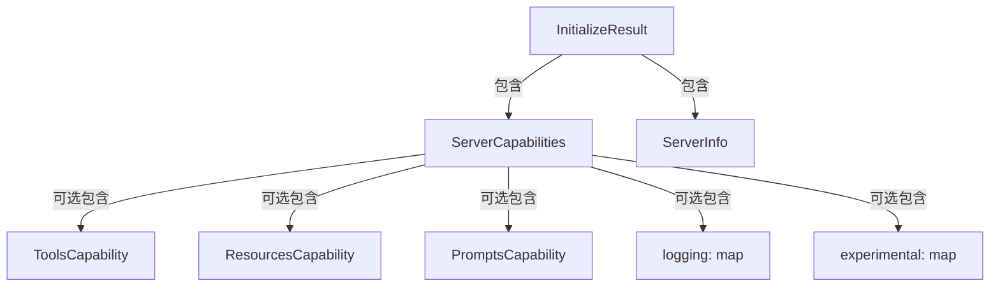

# MCP 服务器能力与初始化合约技术深度解析

## 1. 模块概述

**mcp_server_capabilities_and_initialization_contracts** 模块是 Model Context Protocol (MCP) 连接层的核心定义模块，它解决了 MCP 客户端与服务器之间握手阶段的"能力发现"和"协议版本协商"问题。在分布式系统中，当两个异构组件建立连接时，最关键的第一步是互相了解对方能做什么、不能做什么，以及使用什么语言交流——这个模块正是为 MCP 生态系统提供这种"共同语言"的基础设施。

想象一下，你是一位去陌生国家旅行的游客，你需要先和当地人确认：我们用什么语言沟通？你能帮我做什么（订酒店、叫车、推荐餐厅）？这个模块就像是 MCP 世界里的"旅游翻译手册"和"服务清单"，让客户端和服务器在开始正式工作前，先完成一次清晰、结构化的"自我介绍"。

## 2. 核心架构与数据模型

### 2.1 组件关系图



### 2.2 数据模型深度解析

#### InitializeResult：握手响应的核心载体

`InitializeResult` 是 MCP 初始化握手流程中的核心数据结构，它封装了服务器对客户端初始化请求的完整响应。这个结构体设计得简洁而富有扩展性，包含三个关键维度的信息：

```go
type InitializeResult struct {
	ProtocolVersion string             `json:"protocolVersion"`
	Capabilities    ServerCapabilities `json:"capabilities"`
	ServerInfo      ServerInfo         `json:"serverInfo"`
}
```

- **ProtocolVersion**：协议版本号，这是确保客户端和服务器能正确通信的基础。通过显式声明版本号，双方可以避免因协议演化而导致的兼容性问题。
- **Capabilities**：服务器能力声明，告诉客户端"我能提供哪些服务"。
- **ServerInfo**：服务器基本信息，用于标识和调试。

#### ServerCapabilities：能力声明的容器

`ServerCapabilities` 采用了可选字段的设计模式，每个能力都是一个指针类型，这样可以通过 `nil` 值来明确表示"不支持该能力"，而不是用空结构体或零值来模糊处理。

```go
type ServerCapabilities struct {
	Tools        *ToolsCapability       `json:"tools,omitempty"`
	Resources    *ResourcesCapability   `json:"resources,omitempty"`
	Prompts      *PromptsCapability     `json:"prompts,omitempty"`
	Logging      map[string]interface{} `json:"logging,omitempty"`
	Experimental map[string]interface{} `json:"experimental,omitempty"`
}
```

这种设计体现了**可扩展性优先**的原则：
- 核心能力（Tools、Resources、Prompts）有明确的类型定义，确保类型安全
- Logging 和 Experimental 字段使用 `map[string]interface{}`，为未来的功能扩展和实验性特性提供了灵活的容器
- 所有字段都有 `omitempty` 标签，序列化时会自动忽略空值，保持消息简洁

#### 具体能力类型：Tools、Resources、Prompts

这三个结构体都采用了极简设计，只包含布尔类型的标志位：

```go
type ToolsCapability struct {
	ListChanged bool `json:"listChanged,omitempty"`
}

type ResourcesCapability struct {
	Subscribe   bool `json:"subscribe,omitempty"`
	ListChanged bool `json:"listChanged,omitempty"`
}

type PromptsCapability struct {
	ListChanged bool `json:"listChanged,omitempty"`
}
```

这种设计反映了 MCP 协议的**事件驱动**理念：
- **ListChanged**：表示服务器支持在工具/资源/提示列表发生变化时主动通知客户端
- **Subscribe**（仅 Resources）：表示服务器支持客户端订阅特定资源的变化

这些标志位不是简单的"能力有无"声明，而是关于**动态行为**的契约——它们告诉客户端："不仅我现在有这些工具，而且当工具列表变化时，我会主动告诉你"。

#### ServerInfo：服务器标识信息

```go
type ServerInfo struct {
	Name    string `json:"name"`
	Version string `json:"version"`
}
```

这个结构体虽然简单，但在实际生产环境中非常重要：
- **Name**：服务器实现的名称，用于标识不同的 MCP 服务器实现
- **Version**：服务器实现的版本号，用于调试和问题追踪

## 3. 设计决策与权衡

### 3.1 指针类型 vs 值类型：明确表达"可选性"

在 `ServerCapabilities` 中，所有能力字段都使用指针类型（`*ToolsCapability` 而不是 `ToolsCapability`），这是一个深思熟虑的设计决策：

**选择指针类型的原因**：
- 明确区分"不支持该能力"（`nil`）和"支持该能力但无特殊配置"（空结构体）
- 序列化时可以自然地省略 `nil` 字段，减少消息体积
- 与 JSON 的"可选字段"语义完美匹配

**权衡**：
- 增加了空指针检查的负担
- 在某些情况下可能导致额外的堆分配

但在这个场景下，明确的语义表达比微小的性能损失更重要，因为这是协议定义的核心部分。

### 3.2 扩展点设计：预留未来空间

`ServerCapabilities` 中的 `Logging` 和 `Experimental` 字段使用了 `map[string]interface{}` 类型，这是一个经典的**扩展性设计模式**：

**设计意图**：
- 为协议的未来演进提供安全的试验场
- 允许不同实现添加自定义功能而不破坏兼容性
- 保持核心协议的稳定性，同时支持创新

**权衡**：
- 失去了类型安全，需要在运行时进行类型断言
- 增加了文档负担，需要清楚记录这些 map 中可以放什么
- 可能导致不同实现之间的碎片化

这种设计体现了**保守的核心，灵活的边缘**的架构哲学——核心能力有严格的类型定义，而扩展能力则保持灵活。

### 3.3 极简能力标志：专注于动态行为

三个具体能力类型都只包含布尔标志位，没有复杂的配置结构，这反映了 MCP 协议的**简单性原则**：

**设计理念**：
- 能力声明应该是关于"能做什么"，而不是"怎么做"
- 复杂的配置应该在后续的专门请求中处理，而不是在初始化阶段
- 保持初始化消息小而快，减少握手延迟

**权衡**：
- 某些复杂场景可能需要多轮交互才能完成配置
- 但对于大多数情况，这种简单性带来的好处超过了额外的轮次成本

## 4. 依赖关系与数据流向

### 4.1 模块在系统中的位置

这个模块位于 MCP 连接层的最底层，是整个 MCP 通信的基础。它的主要调用者是：

- **mcp_client_interface_and_transport_impl**：客户端传输实现，使用这些类型来解析服务器的初始化响应
- **mcp_connection_lifecycle_and_manager_orchestration**：连接生命周期管理器，使用这些类型来验证握手结果

### 4.2 典型数据流向

一个完整的 MCP 初始化流程如下：

1. 客户端发送初始化请求（包含客户端能力和协议版本）
2. 服务器接收请求，验证兼容性
3. 服务器构造 `InitializeResult` 对象，填充：
   - 协商后的协议版本
   - 服务器的能力声明（`ServerCapabilities`）
   - 服务器信息（`ServerInfo`）
4. 服务器将 `InitializeResult` 序列化为 JSON 并发送回客户端
5. 客户端解析响应，根据 `ServerCapabilities` 决定后续可用的操作
6. 双方建立正式通信通道，开始业务交互

在这个流程中，`InitializeResult` 是握手阶段的关键数据载体，它的正确性直接决定了后续通信能否成功。

## 5. 使用指南与常见模式

### 5.1 构造服务器初始化响应

```go
// 创建一个支持工具和资源的 MCP 服务器初始化响应
result := &mcp.InitializeResult{
    ProtocolVersion: "2024-11-05", // MCP 协议版本
    Capabilities: mcp.ServerCapabilities{
        Tools: &mcp.ToolsCapability{
            ListChanged: true, // 支持工具列表变化通知
        },
        Resources: &mcp.ResourcesCapability{
            Subscribe:   true, // 支持资源订阅
            ListChanged: true, // 支持资源列表变化通知
        },
    },
    ServerInfo: mcp.ServerInfo{
        Name:    "my-mcp-server",
        Version: "1.0.0",
    },
}
```

### 5.2 客户端解析和验证

```go
// 客户端解析服务器响应
var result mcp.InitializeResult
err := json.Unmarshal(responseBytes, &result)
if err != nil {
    // 处理解析错误
}

// 验证协议版本兼容性
if result.ProtocolVersion != expectedVersion {
    // 处理版本不兼容
}

// 检查服务器能力
if result.Capabilities.Tools != nil {
    // 服务器支持工具功能
    if result.Capabilities.Tools.ListChanged {
        // 准备接收工具列表变化通知
    }
}
```

### 5.3 常见模式与最佳实践

1. **版本协商策略**：服务器应该支持多个协议版本，并选择与客户端兼容的最新版本
2. **能力渐进式暴露**：如果服务器的某些功能需要特定权限，可以在初始化时隐藏这些能力，在权限验证后再通过 `listChanged` 机制暴露
3. **错误处理**：客户端应该优雅地处理不认识的能力字段，而不是拒绝整个响应
4. **日志记录**：始终记录 `ServerInfo`，这对调试生产问题至关重要

## 6. 边缘情况与注意事项

### 6.1 空指针陷阱

由于 `ServerCapabilities` 中的能力字段都是指针类型，访问它们之前必须检查是否为 `nil`：

```go
// 错误示例：可能导致空指针panic
hasTools := result.Capabilities.Tools.ListChanged

// 正确示例：先检查nil
hasTools := false
if result.Capabilities.Tools != nil {
    hasTools = result.Capabilities.Tools.ListChanged
}
```

### 6.2 前向兼容性

当处理来自未来版本服务器的响应时，可能会遇到不认识的字段。客户端应该：

- 忽略不认识的字段（这是 JSON 解析器的默认行为）
- 不要假设所有可能的能力都在当前结构体中定义
- 保持对 `Experimental` 字段的警惕，它们可能随时变化

### 6.3 能力声明与实际行为的一致性

服务器必须确保其能力声明与实际行为一致：

- 如果声明了 `ListChanged: true`，就必须在列表变化时真的发送通知
- 如果声明了 `Subscribe: true`，就必须真的支持订阅请求
- 不一致的能力声明会导致客户端困惑和难以调试的问题

## 7. 总结与延伸阅读

**mcp_server_capabilities_and_initialization_contracts** 模块是 MCP 协议的基石，它通过简洁而富有扩展性的设计，解决了客户端与服务器之间的能力发现和协议协商问题。其核心设计理念——**明确的可选语义、保守的核心与灵活的边缘、专注于动态行为**——不仅适用于 MCP 协议，也值得其他分布式协议设计借鉴。

### 相关模块

- [mcp_client_interface_and_transport_impl](platform_infrastructure_and_runtime-mcp_connectivity_and_protocol_models-mcp_client_interface_and_transport_impl.md)：MCP 客户端接口与传输实现
- [mcp_connection_lifecycle_and_manager_orchestration](platform_infrastructure_and_runtime-mcp_connectivity_and_protocol_models-mcp_connection_lifecycle_and_manager_orchestration.md)：MCP 连接生命周期管理
- [mcp_resource_and_tool_result_payload_models](platform_infrastructure_and_runtime-mcp_connectivity_and_protocol_models-mcp_resource_and_tool_result_payload_models.md)：MCP 资源与工具结果载荷模型

通过这些模块的协同工作，MCP 生态系统实现了客户端与服务器之间的高效、灵活、可扩展的通信。
