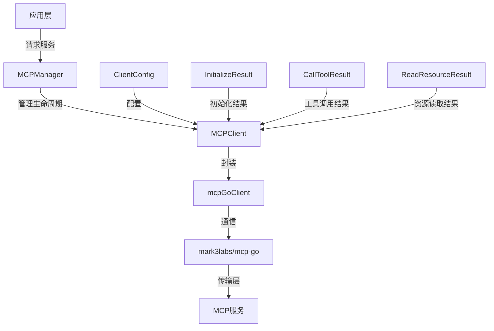

# MCP 连接性与协议模型

## 概述

想象一下，您的应用程序需要与多个外部工具和服务集成——这些服务可能是数据库、文件系统、代码执行环境，或者其他自定义服务。每个服务都有自己独特的 API、认证方式和数据格式。传统的集成方式需要为每个服务编写专门的适配器代码，这不仅繁琐而且难以维护。

**mcp_connectivity_and_protocol_models** 模块正是为了解决这个问题而存在的。它实现了 [Model Context Protocol (MCP)](https://modelcontextprotocol.io/)，这是一个开放标准，允许应用程序与各种外部工具和服务以统一的方式通信。这个模块就像是一个"智能插座"，让您的应用程序可以轻松地"插上"任何兼容 MCP 的服务，而无需关心底层的连接细节。

## 架构概览



这个模块的架构遵循清晰的分层设计：

1. **管理层**：由 `MCPManager` 负责，它就像是一个"连接池管理员"，管理多个 MCP 客户端的生命周期，包括创建、缓存、清理和关闭连接。
   
2. **客户端层**：由 `MCPClient` 接口定义，提供统一的操作接口，而 `mcpGoClient` 则是具体的实现，它封装了底层的 `mark3labs/mcp-go` 库，处理实际的协议细节。

3. **类型层**：定义了各种数据结构，如 `InitializeResult`、`CallToolResult` 等，用于标准化与 MCP 服务之间的数据交换。

## 核心组件详解

### MCPClient 接口

`MCPClient` 是整个模块的核心抽象，它定义了与 MCP 服务交互的所有必要操作。这个接口的设计理念是"屏蔽复杂性"——让调用者不需要了解底层的传输协议（SSE 或 HTTP Streamable），只需要调用简单的方法即可。

```go
type MCPClient interface {
    Connect(ctx context.Context) error
    Disconnect() error
    Initialize(ctx context.Context) (*InitializeResult, error)
    ListTools(ctx context.Context) ([]*types.MCPTool, error)
    ListResources(ctx context.Context) ([]*types.MCPResource, error)
    CallTool(ctx context.Context, name string, args map[string]interface{}) (*CallToolResult, error)
    ReadResource(ctx context.Context, uri string) (*ReadResourceResult, error)
    IsConnected() bool
    GetServiceID() string
}
```

### mcpGoClient 实现

`mcpGoClient` 是 `MCPClient` 接口的具体实现，它包装了 `mark3labs/mcp-go` 库的客户端。这个结构体的设计体现了几个重要的考虑：

1. **状态管理**：它维护了 `connected` 和 `initialized` 两个标志，确保操作按照正确的顺序执行（先连接，再初始化，然后才能调用工具或读取资源）。

2. **错误处理**：特别是针对 SSE 传输的连接丢失问题，实现了 `checkErrorAndDisconnectIfNeeded` 方法来处理"Invalid session ID"错误。

3. **类型转换**：将底层库的类型转换为系统内部使用的类型，如 `types.MCPTool` 和 `types.MCPResource`。

### MCPManager 管理器

`MCPManager` 是这个模块的"指挥官"，它负责管理多个 MCP 客户端的生命周期。它的设计体现了以下几个关键考虑：

1. **连接池**：使用 `map[string]MCPClient` 来缓存客户端，避免为每个请求创建新的连接，提高性能。

2. **线程安全**：使用 `sync.RWMutex` 来保护对客户端映射的访问，确保并发安全。

3. **生命周期管理**：
   - 提供 `GetOrCreateClient` 方法来获取或创建客户端
   - 实现了 `cleanupIdleConnections` 后台协程，每 5 分钟清理一次断开的连接
   - 提供 `Shutdown` 方法来优雅地关闭所有连接

4. **安全考虑**：明确禁用了 stdio 传输方式，以避免潜在的命令注入漏洞。

## 数据流程

让我们通过一个典型的使用场景来了解数据是如何在这个模块中流动的：

1. **获取客户端**：应用层调用 `MCPManager.GetOrCreateClient(service)`
   - 管理器首先检查服务是否已启用
   - 然后检查是否已经有一个连接的客户端
   - 如果没有，则创建一个新的客户端

2. **连接与初始化**：
   - 调用 `client.Connect(ctx)` 建立与 MCP 服务的连接
   - 调用 `client.Initialize(ctx)` 执行 MCP 初始化握手
   - 初始化成功后，客户端被缓存起来供后续使用

3. **工具调用**：
   - 应用层调用 `client.ListTools(ctx)` 获取可用工具列表
   - 或者调用 `client.CallTool(ctx, name, args)` 执行特定工具
   - 结果被转换为内部类型并返回给调用者

4. **资源读取**：
   - 应用层调用 `client.ListResources(ctx)` 获取可用资源列表
   - 或者调用 `client.ReadResource(ctx, uri)` 读取特定资源
   - 结果同样被转换为内部类型并返回

## 设计决策与权衡

### 1. 接口与实现分离

**决策**：定义了 `MCPClient` 接口，并提供 `mcpGoClient` 实现。

**原因**：这种设计提供了灵活性，如果将来需要切换底层库或添加新的传输方式，只需要创建新的实现而不需要修改调用代码。

**权衡**：增加了一层抽象，但带来的灵活性远远超过了额外的复杂性。

### 2. 连接缓存与复用

**决策**：`MCPManager` 缓存并复用客户端连接。

**原因**：创建和初始化 MCP 连接是一个昂贵的操作，涉及网络握手和协议协商。通过缓存连接，可以显著提高性能。

**权衡**：需要额外的代码来管理连接的生命周期，包括清理断开的连接，但这是值得的性能优化。

### 3. 禁用 stdio 传输

**决策**：明确禁用了 stdio 传输方式。

**原因**：stdio 传输涉及执行外部命令，存在潜在的命令注入漏洞，安全风险较高。

**权衡**：减少了一些使用场景，但大大提高了系统的安全性。

### 4. 错误处理与连接恢复

**决策**：实现了 `checkErrorAndDisconnectIfNeeded` 方法来处理特定的错误情况。

**原因**：在 SSE 传输模式下，底层库的连接丢失事件并不总是可靠触发，需要通过错误检测来主动处理。

**权衡**：增加了代码复杂性，但提高了系统的健壮性。

## 子模块

这个模块包含以下子模块，每个子模块负责特定的功能：

- [mcp_client_interface_and_transport_impl](platform_infrastructure_and_runtime-mcp_connectivity_and_protocol_models-mcp_client_interface_and_transport_impl.md)：客户端接口和传输实现
- [mcp_connection_lifecycle_and_manager_orchestration](platform_infrastructure_and_runtime-mcp_connectivity_and_protocol_models-mcp_connection_lifecycle_and_manager_orchestration.md)：连接生命周期和管理器编排
- [mcp_server_capabilities_and_initialization_contracts](platform_infrastructure_and_runtime-mcp_connectivity_and_protocol_models-mcp_server_capabilities_and_initialization_contracts.md)：服务器能力和初始化契约
- [mcp_resource_and_tool_result_payload_models](platform_infrastructure_and_runtime-mcp_connectivity_and_protocol_models-mcp_resource_and_tool_result_payload_models.md)：资源和工具结果负载模型

## 与其他模块的依赖关系

这个模块在系统中扮演着"连接层"的角色，它与以下模块有重要的交互：

- **core_domain_types_and_interfaces**：使用 `types.MCPService`、`types.MCPTool` 和 `types.MCPResource` 等类型
- **agent_runtime_and_tools**：通过 MCP 工具集成，为代理提供访问外部服务的能力
- **data_access_repositories**：可能使用 MCP 服务来访问外部数据源
- **platform_infrastructure_and_runtime**：作为平台基础设施的一部分，提供连接管理功能

## 使用指南与注意事项

### 基本使用

```go
// 1. 创建 MCP 管理器
manager := mcp.NewMCPManager()

// 2. 准备 MCP 服务配置
service := &types.MCPService{
    ID:             "my-service",
    Name:           "My MCP Service",
    Enabled:        true,
    TransportType:  types.MCPTransportSSE,
    URL:            pointer.String("https://example.com/mcp"),
    Headers:        map[string]string{"X-Custom-Header": "value"},
    AuthConfig:     &types.MCPAuthConfig{APIKey: "my-api-key"},
    AdvancedConfig: &types.MCPAdvancedConfig{Timeout: 30},
}

// 3. 获取或创建客户端
client, err := manager.GetOrCreateClient(service)
if err != nil {
    // 处理错误
}

// 4. 列出可用工具
tools, err := client.ListTools(ctx)
if err != nil {
    // 处理错误
}

// 5. 调用工具
result, err := client.CallTool(ctx, "tool-name", map[string]interface{}{"param": "value"})
if err != nil {
    // 处理错误
}

// 6. 关闭管理器（在应用退出时）
manager.Shutdown()
```

### 注意事项

1. **连接生命周期**：`MCPManager` 会自动管理连接的生命周期，但在应用退出时一定要调用 `Shutdown()` 方法来优雅地关闭所有连接。

2. **服务配置**：确保 `MCPService` 配置正确，特别是 `TransportType` 和 `URL`，否则连接会失败。

3. **错误处理**：所有的方法都可能返回错误，务必检查并适当处理。特别是 `CallTool` 和 `ReadResource` 方法，它们可能会因为服务端错误而失败。

4. **并发安全**：`MCPManager` 的所有方法都是并发安全的，可以在多个 goroutine 中同时调用。

5. **超时配置**：可以通过 `AdvancedConfig.Timeout` 来设置超时时间，但注意最大超时时间被限制为 60 秒。

## 总结

**mcp_connectivity_and_protocol_models** 模块是一个精心设计的组件，它通过实现 MCP 协议，为应用程序提供了与外部工具和服务统一集成的能力。它的设计注重灵活性、安全性和性能，通过接口抽象、连接池管理和错误处理等机制，为上层应用提供了简单易用的 API。

无论是需要连接数据库、访问文件系统，还是集成其他自定义服务，这个模块都能为您提供一个统一、可靠的解决方案。