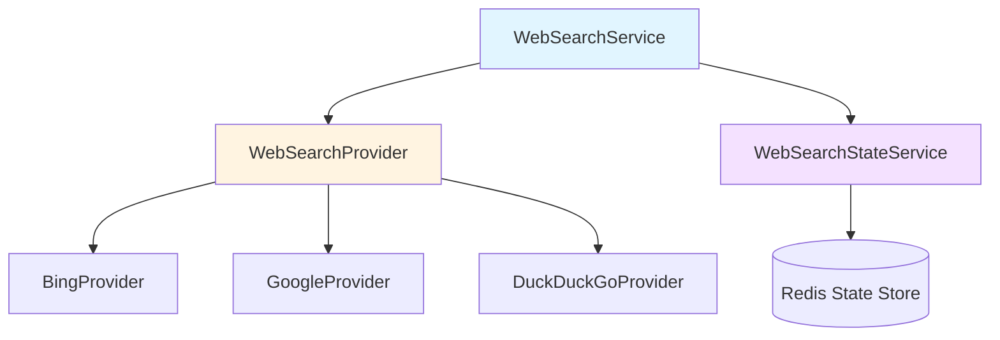

# Web Search Service and State Interfaces 技术深度解析

## 1. 模块概览

**Web Search Service and State Interfaces** 模块定义了系统中 Web 搜索功能的核心契约和抽象层。想象一下，这个模块就像是一个"搜索网关的蓝图"——它不直接执行搜索，而是规定了搜索服务应该如何工作、不同搜索提供商应该如何集成，以及搜索过程中的临时状态应该如何管理。

### 解决的核心问题

在构建一个支持多种 Web 搜索提供商（如 Bing、Google、DuckDuckGo）的系统时，我们面临几个关键挑战：

1. **提供商多样性**：不同搜索提供商有不同的 API、请求格式和响应结构
2. **状态管理**：在多轮对话中，需要记住已经搜索过的 URL，避免重复处理
3. **结果处理**：搜索结果需要临时存储和进一步处理（如 RAG 压缩）
4. **可扩展性**：需要轻松添加新的搜索提供商而不改变核心业务逻辑

这个模块通过定义清晰的接口契约，将这些复杂性抽象化，使得上层应用可以统一地使用搜索功能，而不必关心底层实现细节。

## 2. 核心架构

### 2.1 组件关系图



### 2.2 组件职责详解

#### WebSearchProvider 接口
这是搜索提供商的抽象契约，类似于"搜索引擎驱动程序"。任何想要集成到系统中的搜索提供商都必须实现这个接口。

**核心方法**：
- `Name()`: 返回提供商的唯一标识符
- `Search()`: 执行实际的 Web 搜索，返回标准化的搜索结果

#### WebSearchService 接口
这是搜索服务的核心编排层，负责协调整个搜索流程。

**核心方法**：
- `Search()`: 接收搜索配置和查询，选择合适的提供商执行搜索
- `CompressWithRAG()`: 使用临时知识库对搜索结果进行 RAG 压缩处理

#### WebSearchStateService 接口
这是搜索状态管理的契约，负责跟踪搜索过程中的临时状态。

**核心方法**：
- `GetWebSearchTempKBState()`: 从 Redis 获取临时知识库状态
- `SaveWebSearchTempKBState()`: 保存临时知识库状态到 Redis
- `DeleteWebSearchTempKBState()`: 删除临时知识库状态

## 3. 设计决策与权衡

### 3.1 接口分离原则

**决策**：将搜索功能拆分为三个独立的接口，而不是一个大一统的接口。

**为什么这样设计**：
- **单一职责**：每个接口只关注一个方面（提供商、服务编排、状态管理）
- **独立演进**：可以单独改变状态存储机制（如从 Redis 换成其他存储）而不影响搜索逻辑
- **测试友好**：可以轻松 mock 各个接口进行单元测试

**权衡**：
- ✅ 优点：高内聚、低耦合、易于测试和扩展
- ❌ 缺点：增加了接口数量，初次接触可能需要更多时间理解

### 3.2 临时知识库设计

**决策**：使用临时隐藏的知识库来处理搜索结果的 RAG 压缩。

**设计意图**：
```
搜索结果 → 临时知识库 → RAG 压缩 → 清理临时知识库
```

**为什么这样设计**：
- **复用现有基础设施**：利用已有的知识库和 RAG 管道，避免重复开发
- **用户体验**：临时知识库对用户不可见（通过 repo 过滤），不污染用户的知识库列表
- **自动清理**：使用后立即删除，避免资源泄漏

**权衡**：
- ✅ 优点：代码复用、用户体验好、资源自动管理
- ❌ 缺点：增加了知识库服务的依赖，需要处理临时知识库的创建和删除逻辑

### 3.3 状态管理的 Redis 依赖

**决策**：通过接口抽象状态管理，但设计暗示使用 Redis 作为后端存储。

**为什么这样设计**：
- **性能考虑**：Redis 适合存储会话级别的临时状态，读写速度快
- **分布式友好**：在微服务架构中，Redis 可以作为共享状态存储
- **接口抽象**：虽然当前设计倾向于 Redis，但接口定义保持了灵活性

**权衡**：
- ✅ 优点：性能好、支持分布式、接口灵活
- ❌ 缺点：隐含了对 Redis 的依赖，切换存储需要实现完整接口

## 4. 数据流程分析

### 4.1 完整搜索流程

让我们追踪一次典型的 Web 搜索请求的数据流动：

```
1. 上层应用调用 WebSearchService.Search()
   ↓
2. WebSearchService 根据配置选择合适的 WebSearchProvider
   ↓
3. 调用 WebSearchProvider.Search() 获取原始搜索结果
   ↓
4. (可选) 调用 WebSearchStateService 获取已有状态
   ↓
5. (可选) 调用 WebSearchService.CompressWithRAG() 处理结果
   ├─ 创建临时知识库
   ├─ 将搜索结果存入临时知识库
   ├─ 执行 RAG 压缩
   ├─ 保存新状态到 WebSearchStateService
   └─ 清理临时知识库
   ↓
6. 返回处理后的搜索结果
```

### 4.2 关键契约和依赖

这个模块与系统其他部分的关键交互：

1. **依赖 `types.WebSearchResult`**：标准化的搜索结果数据结构
2. **依赖 `types.WebSearchConfig`**：搜索配置，包含提供商选择等参数
3. **依赖 `KnowledgeBaseService` 和 `KnowledgeService`**：用于 RAG 压缩功能
4. **被 `application_services_and_orchestration` 模块使用**：实际的搜索编排逻辑

## 5. 使用指南与注意事项

### 5.1 实现新的搜索提供商

要添加新的搜索提供商，需要：

1. 实现 `WebSearchProvider` 接口
2. 在提供商注册表中注册（见相关的编排模块）

```go
type MySearchProvider struct{}

func (p *MySearchProvider) Name() string {
    return "my_search_provider"
}

func (p *MySearchProvider) Search(
    ctx context.Context, 
    query string, 
    maxResults int, 
    includeDate bool,
) ([]*types.WebSearchResult, error) {
    // 实现搜索逻辑
}
```

### 5.2 注意事项和陷阱

#### 临时知识库管理
- **重要**：`CompressWithRAG` 方法中创建的临时知识库必须确保被删除，否则会造成资源泄漏
- **建议**：使用 defer 语句或事务机制确保清理逻辑执行

#### 状态一致性
- `seenURLs` 和 `knowledgeIDs` 需要在多次搜索调用之间保持一致性
- 注意并发场景下的状态更新，可能需要考虑加锁机制

#### 错误处理
- 搜索提供商可能会因为各种原因失败（API 限流、网络问题等）
- 建议实现重试逻辑和降级策略（如切换到备用提供商）

## 6. 子模块说明

这个模块包含以下子模块，每个子模块都有更详细的文档：

- **web_search_service_contracts**：Web 搜索服务契约定义
- **web_search_provider_integration_contracts**：搜索提供商集成契约
- **web_search_state_management_contracts**：搜索状态管理契约

## 7. 总结

这个模块是整个 Web 搜索功能的"骨架"，它定义了游戏规则，但实际的游戏玩法在实现这些接口的模块中。理解这些接口的设计意图，将帮助你更好地理解整个搜索系统的工作原理。

通过将搜索功能抽象为这三个核心接口，系统实现了：
1. **提供商的可插拔性** - 可以轻松添加新的搜索提供商
2. **状态管理的灵活性** - 可以根据需要更换状态存储后端
3. **业务逻辑的复用性** - 通过临时知识库设计复用现有的 RAG 管道
