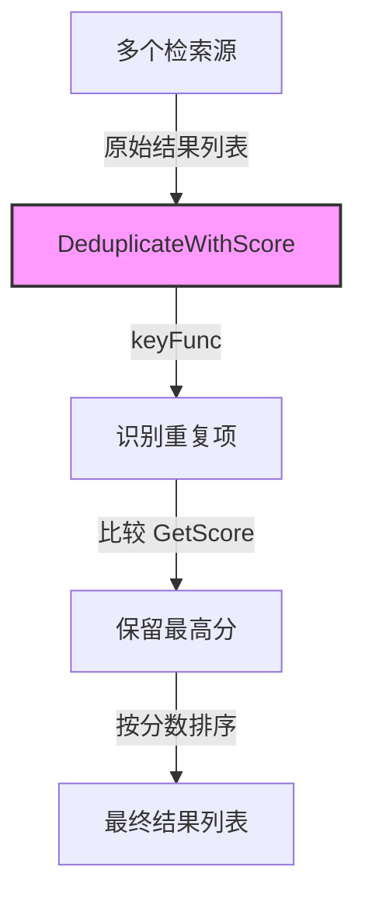

# common_scoring_and_comparison_contracts 模块技术深度解析

## 1. 问题定位与模块目标

在构建一个复杂的检索系统时，我们经常会遇到这样的场景：从多个来源获取的检索结果可能存在重复项，我们需要在去重的同时保留"最好"的结果。但什么是"最好"呢？通常这由一个分数决定——可能是相关性分数、置信度分数或其他质量指标。

一个朴素的解决方案可能是：先按分数排序，再简单地去重保留第一个出现的。但这种方法存在两个问题：
1. 它要求我们先排序再去重，效率可能不高
2. 更重要的是，它没有解决"如何定义分数"这个核心抽象问题

`common_scoring_and_comparison_contracts` 模块的核心洞察是：通过定义一个统一的 `ScoreComparable` 接口，我们可以将"具有分数的可比较对象"这个概念抽象出来，然后构建通用的、可复用的去重和排序逻辑。

## 2. 核心抽象与心智模型

### 2.1 核心接口：ScoreComparable

```go
type ScoreComparable interface {
    GetScore() float64
}
```

这个接口是整个模块的基石。它的设计哲学非常简单：**任何类型只要能返回一个 float64 类型的分数，就可以被视为"可评分比较的"**。

你可以把它想象成一场比赛中的参赛者——每个参赛者都有一个分数，裁判（我们的算法）不需要知道参赛者的具体身份，只需要知道他们的分数，就可以决定谁留下来、谁被淘汰。

### 2.2 主要功能：DeduplicateWithScore

这个函数是模块的核心实现，它做了三件关键的事情：
1. **去重**：根据提供的 keyFunc 识别重复项
2. **择优**：对于每个重复组，保留分数最高的项
3. **排序**：最终结果按分数降序排列

## 3. 数据流程与架构角色

让我们通过一个典型的使用场景来理解数据如何流经这个模块：



### 3.1 典型数据流程

1. **输入**：从多个检索引擎、知识库或其他来源收集的结果列表，这些结果都实现了 `ScoreComparable` 接口
2. **去重识别**：`keyFunc` 被用来为每个结果生成一个唯一键，相同键的结果被视为重复项
3. **择优保留**：对于每个键对应的结果组，比较它们的 `GetScore()` 返回值，只保留分数最高的那个
4. **排序输出**：所有保留下来的结果按分数降序排列，形成最终的有序列表

### 3.2 架构角色

这个模块在系统中扮演着**通用工具组件**的角色，它不依赖于特定的业务领域，而是提供了一个可复用的基础设施。从依赖关系来看，它被放置在 `platform_utilities_lifecycle_observability_and_security` 下，这进一步强调了它的平台级工具性质。

## 4. 组件深度解析

### 4.1 ScoreComparable 接口

**设计意图**：将"具有分数"这个行为抽象出来，使得我们可以编写不依赖于具体类型的通用算法。

**为什么是 float64？**：
- 浮点数可以表示连续的分数范围，适合表示相关性、置信度等连续值
- float64 提供了足够的精度，避免了在比较时出现精度问题
- 这是 Go 语言中处理数值比较的标准选择

**使用场景**：任何需要根据某个数值指标进行比较、排序或选择的类型都可以实现这个接口。

### 4.2 DeduplicateWithScore 函数

**函数签名**：
```go
func DeduplicateWithScore[T ScoreComparable, K comparable](keyFunc func(T) K, items ...T) []T
```

**参数解析**：
- `T ScoreComparable`：类型参数，要求输入类型必须实现 ScoreComparable 接口
- `K comparable`：另一个类型参数，要求键类型必须是可比较的（可以作为 map 的键）
- `keyFunc func(T) K`：一个函数，用于从每个元素中提取去重用的键
- `items ...T`：可变参数，接受要处理的元素列表

**返回值**：`[]T`，去重、择优并排序后的元素列表

**内部实现解析**：

```go
// 1. 使用 map 跟踪每个键的最佳结果
seen := make(map[K]T)
for _, item := range items {
    key := keyFunc(item)
    if existing, exists := seen[key]; !exists {
        // 如果是第一次看到这个键，直接保留
        seen[key] = item
    } else if item.GetScore() > existing.GetScore() {
        // 如果已经存在，比较分数，保留更高的
        seen[key] = item
    }
}

// 2. 收集结果
result := slices.Collect(maps.Values(seen))

// 3. 按分数降序排序
slices.SortFunc(result, func(a, b T) int {
    scoreA := a.GetScore()
    scoreB := b.GetScore()
    if scoreA > scoreB {
        return -1
    } else if scoreA < scoreB {
        return 1
    }
    return 0
})
```

**设计亮点**：
1. **单次遍历去重择优**：在一次遍历中同时完成去重和择优，时间复杂度为 O(n)
2. **使用 map 高效查找**：利用 map 的 O(1) 查找特性，快速判断是否已存在相同键
3. **最终排序**：只对去重后的结果进行排序，减少了排序的数据量

## 5. 设计决策与权衡

### 5.1 接口设计：极简 vs 完备

**决策**：只定义一个 `GetScore() float64` 方法

**权衡分析**：
- 优点：接口极其简单，易于实现，耦合度最低
- 缺点：没有提供更多的元数据或比较方式

**为什么这样设计**：
这个模块的设计遵循了"最小接口"原则——只定义完成任务所必需的方法。如果未来需要更复杂的比较逻辑，可以在这个基础上扩展，而不会破坏现有代码。

### 5.2 算法选择：先去重后排序 vs 先排序后去重

**决策**：先去重择优，最后统一排序

**权衡分析**：
- **先去重后排序**（当前方案）：
  - 优点：减少排序的数据量，特别是在重复率高的情况下
  - 缺点：需要额外的空间存储中间结果
  
- **先排序后去重**（替代方案）：
  - 优点：实现简单，可以利用稳定排序的特性
  - 缺点：排序的数据量更大，可能影响性能

**为什么这样设计**：
在检索场景中，重复率通常较高（多个检索源可能返回相同的文档），因此减少排序数据量的收益是显著的。同时，现代计算机的内存足够大，存储中间结果的成本可以忽略。

### 5.3 类型安全：使用泛型 vs 空接口

**决策**：使用 Go 1.18+ 的泛型特性

**权衡分析**：
- 优点：编译时类型安全，无需类型断言，代码更清晰
- 缺点：要求 Go 1.18+，对旧版本不兼容

**为什么这样设计**：
泛型提供了类型安全和代码复用的最佳平衡。在一个现代的 Go 项目中，使用泛型是理所当然的选择。

## 6. 使用指南与最佳实践

### 6.1 基本使用示例

假设我们有一个检索结果类型：

```go
type SearchResult struct {
    ID      string
    Content string
    Score   float64
}

func (s SearchResult) GetScore() float64 {
    return s.Score
}
```

使用 `DeduplicateWithScore` 去重：

```go
results := []SearchResult{
    {ID: "doc1", Content: "...", Score: 0.9},
    {ID: "doc2", Content: "...", Score: 0.8},
    {ID: "doc1", Content: "...", Score: 0.95}, // 同一个文档，但分数更高
}

// 按 ID 去重，保留分数最高的
uniqueResults := DeduplicateWithScore(
    func(s SearchResult) string { return s.ID },
    results...,
)
```

### 6.2 高级使用：复合键去重

有时我们需要基于多个字段去重：

```go
type CompositeKey struct {
    Source string
    DocID  string
}

results := []SearchResult{...}

uniqueResults := DeduplicateWithScore(
    func(s SearchResult) CompositeKey {
        return CompositeKey{Source: s.Source, DocID: s.ID}
    },
    results...,
)
```

### 6.3 最佳实践

1. **确保分数的可比性**：`GetScore()` 返回的分数应该在同一尺度上，否则比较没有意义
2. **选择合适的键**：keyFunc 应该能唯一标识一个"实体"，避免过度去重或去重不足
3. **处理浮点数精度**：虽然 Go 的 float64 精度足够，但在极端情况下可能需要考虑精度问题
4. **考虑分数的含义**：如果分数越低越好，可以在 `GetScore()` 中返回负值，或者修改排序逻辑

## 7. 边缘情况与注意事项

### 7.1 浮点数精度问题

虽然使用了 float64，但在比较极其接近的分数时仍可能遇到精度问题。如果分数是通过复杂计算得出的，考虑使用一个小的 epsilon 值来比较：

```go
const epsilon = 1e-9

func (a MyType) CompareScore(b MyType) bool {
    return math.Abs(a.GetScore()-b.GetScore()) < epsilon
}
```

### 7.2 相同分数的处理

当多个项具有相同的最高分，函数会保留最后遍历到的那个。这是因为 Go 的 map 遍历顺序是不确定的，所以不要依赖于相同分数项的保留顺序。

### 7.3 nil 处理

函数没有显式检查 nil 值。如果输入的 items 可能包含 nil，确保 `GetScore()` 方法能安全处理 nil 接收器，或者在调用前过滤掉 nil 值。

### 7.4 空输入

函数能优雅处理空输入，返回空切片。

## 8. 与其他模块的关系

这个模块是一个纯工具模块，它被设计为被其他模块使用，而不是依赖其他模块。从模块树来看，它位于：

```
platform_infrastructure_and_runtime
  └── platform_utilities_lifecycle_observability_and_security
      └── common_scoring_and_comparison_contracts
```

这种层级结构表明它是一个底层的基础设施组件，可能被更高层的模块使用，特别是：

- **检索相关模块**：如 `application_services_and_orchestration/retrieval_and_web_search_services`，需要合并和去重多个检索源的结果
- **知识库相关模块**：如 `core_domain_types_and_interfaces/knowledge_graph_retrieval_and_content_contracts`，可能需要对知识块进行评分和排序

## 9. 总结

`common_scoring_and_comparison_contracts` 模块是一个设计精良的小型工具模块，它通过一个简单的接口和一个通用的函数，解决了"去重并保留最优项"这个常见问题。

它的设计体现了几个重要的软件工程原则：
1. **接口隔离**：只定义必要的方法
2. **泛型编程**：利用 Go 1.18+ 的特性提供类型安全的复用
3. **性能考量**：算法设计考虑了实际场景中的性能特征
4. **简单性**：代码清晰易懂，易于维护和使用

对于新加入团队的开发者来说，理解这个模块的设计思想，比仅仅知道如何使用它更为重要——它展示了如何通过恰当的抽象，将一个特定场景的解决方案转化为一个通用的、可复用的工具。
