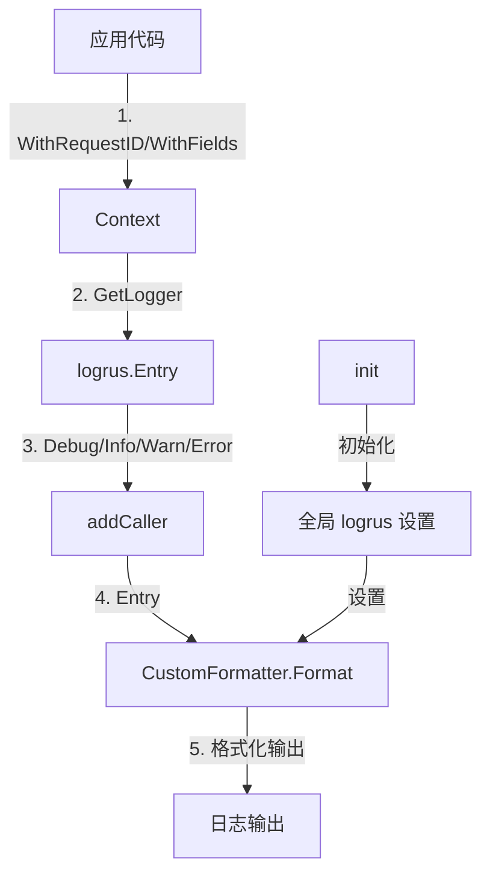

# logging_formatting_and_observability_helpers 模块技术深度解析

## 1. 模块存在的意义

在复杂的分布式系统中，日志不仅仅是"打印信息"——它是可观测性的基石。`logging_formatting_and_observability_helpers` 模块的核心使命是解决**日志格式标准化、上下文传递、以及人类可读性与机器可读性的平衡**这三个关键问题。

想象一下，当你在排查一个生产问题时：
- 每个请求跨多个服务，你需要追踪它的完整生命周期
- 日志没有统一格式，需要在不同组件之间进行心智转换
- 缺少结构化字段，无法快速过滤和定位问题

这就是为什么这个模块存在。它不是对 `logrus` 的简单封装，而是构建了一套完整的日志上下文传递机制和格式化策略，使得整个系统的日志变得**可追踪、可过滤、可理解**。

## 2. 核心设计理念与心智模型

理解这个模块的关键在于掌握两个核心抽象：

### 2.1 上下文传递模型

**类比**：把日志上下文想象成一个"旅行箱"，随着请求在系统中流动，每个组件可以往箱子里放东西（添加字段），也可以查看箱子里的内容。当记录日志时，箱子里的所有东西都会被打印出来。

核心设计是**基于 context 的日志传播机制**：
- 日志不应该是全局单例，而应该与请求上下文绑定
- 通过 `context.Context` 在函数调用链中传递日志实例
- 每个中间件或服务可以向上下文中添加自己关心的字段

### 2.2 字段优先级模型

不是所有日志字段都同等重要。模块采用了**三层字段优先级策略**：
1. **特殊字段**（request_id, caller）- 始终优先，格式固定
2. **结构化字段** - 按字母序排列，保证输出稳定性
3. **消息主体** - 人类可读的主要信息

## 3. 架构与组件分析

让我们通过 Mermaid 图理解模块的核心结构：



### 3.1 核心组件详解

#### CustomFormatter：格式化引擎

这是模块的核心，它实现了 `logrus.Formatter` 接口，负责将日志条目转换为最终的字节流。

**设计亮点**：
- **颜色智能切换**：通过 `ForceColor` 字段支持终端彩色输出和纯文本输出的无缝切换
- **字段优先级处理**：`request_id` 永远在最前面，便于追踪；其他字段按字母序排序保证输出稳定
- **特殊字段着色**：`error` 字段自动红色高亮，`caller` 紫色显示，快速抓住关键信息

让我们看看它是如何工作的：

```go
func (f *CustomFormatter) Format(entry *logrus.Entry) ([]byte, error) {
    // 1. 基础信息提取
    timestamp := entry.Time.Format("2006-01-02 15:04:05.000")
    level := strings.ToUpper(entry.Level.String())
    
    // 2. 颜色策略应用（仅在 ForceColor 为 true 时）
    // ...颜色代码设置...
    
    // 3. 特殊字段提取（caller）
    // ...caller 处理...
    
    // 4. 结构化字段构建（request_id 优先，其余排序）
    // ...字段拼接...
    
    // 5. 最终格式化输出
    // ...输出构建...
}
```

#### 上下文管理函数族

这是模块对外暴露的主要接口，包括：
- `GetLogger(c context.Context)` - 从上下文获取日志实例
- `WithRequestID/WithField/WithFields` - 向上下文中添加日志字段
- `Debug/Info/Warn/Error` 等日志级别函数 - 记录日志

**关键设计点**：
1. **addCaller 函数**：自动添加调用者信息（文件名:行号[函数名]），使用 `runtime.Caller` 跳过包装层
2. **CloneContext**：支持在 goroutine 之间安全传递日志上下文，避免并发问题

## 4. 数据与控制流分析

让我们追踪一个典型的日志记录场景：

```
1. 中间件接收请求
   ↓
2. 生成 request_id → WithRequestID(ctx, requestID) → 新上下文
   ↓
3. 业务函数接收上下文
   ↓
4. 业务函数调用 WithField(ctx, "user_id", 123) → 增强上下文
   ↓
5. 调用 Error(ctx, "something went wrong")
   ↓
6. GetLogger(ctx) 从上下文取出增强的日志实例
   ↓
7. addCaller(..., 2) 添加调用者信息（跳过 2 层包装）
   ↓
8. logrus.Entry 传递给 CustomFormatter.Format
   ↓
9. 格式化输出，包含 request_id, user_id, caller, error message
```

## 5. 设计决策与权衡

### 5.1 基于 context 的日志传递 vs 全局日志

**选择**：基于 context 的传递

**为什么**：
- ✅ 每个请求有独立的日志上下文，不会相互干扰
- ✅ 天然支持 request_id 等追踪字段的传递
- ✅ 符合 Go 的惯用模式
- ❌ 需要在所有函数签名中传递 context
- ❌ 忘记传递 context 会丢失日志字段

这是一个**正确性优先**的选择。在分布式系统中，日志的可追踪性比代码简洁性更重要。

### 5.2 caller 信息的添加方式

**选择**：在日志记录函数中动态添加，而非使用 logrus.SetReportCaller

**为什么**：
- logrus 的 ReportCaller 会显示包装函数（如 logger.Debug）而非实际调用者
- 我们需要精确控制跳过的栈层数（`skip=2`）
- 可以自定义 caller 信息的格式（`文件名:行号[函数名]`）

**代价**：每个日志记录调用都会有轻微的性能开销（runtime.Caller），但在日志系统中这个开销是可接受的。

### 5.3 字段排序策略

**选择**：request_id 优先，其余字段按字母序排序

**为什么**：
- request_id 是最重要的追踪字段，必须在最前面
- 字母序排序保证相同字段组合的日志输出顺序一致，便于人类阅读和机器解析
- 避免字段顺序随机变化导致的日志差异

## 6. 使用指南与最佳实践

### 6.1 基本使用模式

```go
// 1. 在请求入口设置 request_id
ctx := logger.WithRequestID(context.Background(), "req-123")

// 2. 添加上下文字段
ctx = logger.WithField(ctx, "user_id", 456)
ctx = logger.WithFields(ctx, logrus.Fields{
    "tenant_id": "tenant-789",
    "operation": "create_document",
})

// 3. 记录日志
logger.Info(ctx, "开始处理请求")
logger.Debugf(ctx, "参数: %v", params)
if err != nil {
    logger.ErrorWithFields(ctx, err, logrus.Fields{
        "attempt": 3,
    })
}
```

### 6.2 Goroutine 中的使用

当在 goroutine 中使用日志时，**必须**使用 `CloneContext` 复制上下文，避免并发访问问题：

```go
go func(ctx context.Context) {
    // 安全地复制上下文
    newCtx := logger.CloneContext(ctx)
    logger.Info(newCtx, "异步任务开始")
}(ctx)
```

### 6.3 配置与环境变量

- `LOG_LEVEL` 环境变量控制全局日志级别：`debug`/`info`/`warn`/`error`/`fatal`
- 默认使用彩色输出（`ForceColor: true`），适合开发环境
- 生产环境的日志收集系统可能需要纯文本输出

## 7. 边缘情况与注意事项

### 7.1 常见陷阱

1. **忘记传递 context**：如果函数没有接收或传递 context，日志会丢失字段，回到全局日志实例
2. **context 泄露**：`CloneContext` 创建的是新的 context，不会影响原 context 的取消信号
3. **字段覆盖**：多次使用相同字段名会覆盖之前的值，没有警告
4. **性能考虑**：虽然不大，但 `addCaller` 和字段排序确实有开销，超高频日志路径需要注意

### 7.2 隐式契约

- 模块假设你会在请求入口设置 `request_id`
- 字段名 `caller` 和 `request_id` 是保留的，有特殊处理逻辑
- `error` 字段会被特殊着色（红色）

### 7.3 与其他模块的关系

这个模块是**基础设施层**，被几乎所有其他模块依赖，特别是：
- [http_handlers_and_routing](http_handlers_and_routing.md) - 在中间件中设置 request_id
- [application_services_and_orchestration](application_services_and_orchestration.md) - 业务服务中记录日志
- [platform_infrastructure_and_runtime](platform_infrastructure_and_runtime.md) - 平台基础设施的其他部分

## 8. 总结

`logging_formatting_and_observability_helpers` 模块是一个看似简单但设计精良的基础设施组件。它的价值不在于复杂的算法，而在于**对日志可观测性本质的深刻理解**：

1. 日志必须与请求生命周期绑定
2. 结构化字段的优先级和稳定性很重要
3. 人类可读性和机器可读性需要平衡
4. 上下文传递是 Go 中实现跨层日志的最佳方式

下一次当你在生产环境中通过 request_id 快速追踪到一个请求的完整路径时，你会感谢这个模块所做的一切。
