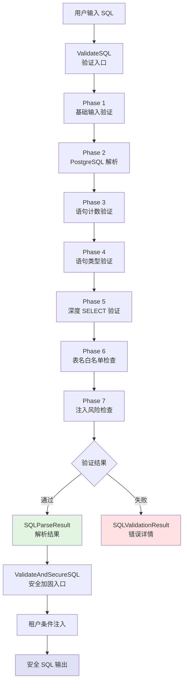

# SQL 验证与注入防护模块技术深度解析

## 1. 模块概览

`sql_validation_and_injection_safety` 模块是平台基础设施层的核心安全组件，负责在多租户环境中对 SQL 查询进行严格的安全验证和自动的租户隔离。它采用了"零信任"的安全模型，通过深度语法解析、多层安全检查和自动 SQL 重写，防止 SQL 注入攻击并确保跨租户数据隔离。

**为什么需要这个模块？**
在传统的 SQL 安全实践中，我们通常依赖参数化查询来防止注入攻击。但在某些场景下（如允许用户自定义查询、动态构建复杂查询），参数化查询可能不够灵活。同时，在多租户架构中，手动在每个查询中添加租户 ID 过滤既繁琐又容易出错。这个模块通过"验证 + 安全加固"的组合方案，在保持灵活性的同时提供了企业级的安全保障。

## 2. 架构与数据流程

### 2.1 核心架构



### 2.2 数据流程详解

整个验证流程分为两个主要阶段：

1. **验证阶段**（`ValidateSQL`）：对输入 SQL 进行多层安全检查
2. **加固阶段**（`ValidateAndSecureSQL`）：在验证通过后，自动注入租户隔离条件

关键数据流向：
- 输入：原始 SQL 字符串 + 验证选项
- 输出：解析结果、验证结果、安全加固后的 SQL

核心组件：
- `sqlValidator`：验证器配置和状态容器
- `SQLParseResult`：SQL 解析结果数据结构
- `SQLValidationResult`：验证结果和错误信息

## 3. 核心组件深度解析

### 3.1 sqlValidator 结构体

`sqlValidator` 是整个模块的核心配置容器，它采用了选项模式（Option Pattern）来灵活配置验证规则。

```go
type sqlValidator struct {
    // 基础验证
    checkInputValidation bool
    minLength            int
    maxLength            int
    
    // 语句类型验证
    checkSelectOnly      bool
    checkSingleStatement bool
    
    // 表和函数验证
    allowedTables        map[string]bool
    checkTableNames      bool
    allowedFunctions     map[string]bool
    checkFunctionNames   bool
    
    // 安全检查
    checkInjectionRisk   bool
    checkSubqueries      bool
    checkCTEs            bool
    checkSystemColumns   bool
    checkSchemaAccess    bool
    checkDangerousFuncs  bool
    
    // 租户隔离
    enableTenantInjection bool
    tenantID              uint64
    tablesWithTenantID    map[string]bool
}
```

**设计意图**：
- 每个验证开关都是独立的布尔值，允许精细控制
- 白名单使用 `map[string]bool` 实现 O(1) 时间复杂度的查找
- 租户隔离配置独立，便于在多租户环境中动态应用

### 3.2 SQLParseResult 结构体

`SQLParseResult` 封装了从 SQL 解析树中提取的关键信息。

```go
type SQLParseResult struct {
    IsSelect     bool     // 是否为 SELECT 语句
    TableNames   []string // FROM 子句中的表名
    SelectFields []string // SELECT 子句中的字段
    WhereFields  []string // WHERE 子句中的字段
    WhereClause  string   // 完整的 WHERE 子句文本
    OriginalSQL  string   // 原始 SQL
    ParseError   string   // 解析错误信息
}
```

**设计意图**：
- 将解析结果与验证逻辑分离，提高可测试性
- 提取关键信息以便后续验证使用
- 保留原始 SQL 和错误信息，便于调试

### 3.3 ValidateSQL 函数

`ValidateSQL` 是模块的主入口函数，它按照严格的阶段顺序执行验证。

**核心流程**：
1. **初始化验证器**：应用选项模式配置验证规则
2. **基础输入验证**：检查长度、空字节等基本问题
3. **PostgreSQL 解析**：使用官方 PostgreSQL 解析器进行语法解析
4. **语句验证**：检查语句数量、类型
5. **深度 SELECT 验证**：遍历解析树，验证每个节点
6. **表名和函数验证**：应用白名单检查
7. **注入风险检查**：正则表达式匹配常见注入模式

**设计亮点**：
- 采用"快速失败"策略，尽早发现问题
- 使用 PostgreSQL 官方解析器，避免正则表达式的局限性
- 深度遍历解析树，确保没有遗漏的验证点

### 3.4 validateNode 函数

`validateNode` 是整个验证逻辑中最关键的函数，它递归地验证解析树中的每个节点。

**设计意图**：
- 采用"默认拒绝"策略：如果不知道如何验证某个节点类型，就拒绝它
- 全面覆盖 PostgreSQL 表达式类型，防止绕过攻击
- 递归验证所有子节点，确保没有安全漏洞

**关键安全设计**：
```go
// SECURITY: 这个函数采用全面的方法验证所有节点类型
// 任何包含子表达式的节点类型都必须处理，以防止绕过攻击
// 原则是：如果我们不知道如何验证某个节点类型，就拒绝它
```

### 3.5 ValidateAndSecureSQL 函数

`ValidateAndSecureSQL` 在验证通过后，自动为 SQL 添加租户隔离条件。

**核心逻辑**：
1. 调用 `ValidateSQL` 进行验证
2. 如果验证通过，检查是否需要租户隔离
3. 使用正则表达式在合适的位置注入 `tenant_id` 条件
4. 特别注意：将原始 WHERE 子句用括号包裹，防止 OR 注入攻击

**安全设计**：
```go
// 添加租户过滤并将原始条件用括号包裹，防止 OR 注入
// 确保：WHERE tenant_filter AND (original_conditions)
// 而不是：WHERE tenant_filter AND original_conditions OR malicious_condition
```

## 4. 依赖分析

### 4.1 外部依赖

- **github.com/pganalyze/pg_query_go/v6**：PostgreSQL 官方解析器的 Go 绑定
  - 为什么选择它？提供准确的 SQL 语法解析，避免正则表达式的局限性
  - 替代方案：手写解析器（容易出错）、使用数据库驱动的解析功能（不完整）

### 4.2 内部依赖

从模块树来看，这个模块位于 `platform_infrastructure_and_runtime` 下的 `platform_utilities_lifecycle_observability_and_security` 子模块中，是一个底层基础设施组件，被上层的应用服务和数据访问层调用。

**预期调用者**：
- 数据访问层：需要验证动态 SQL 的安全性
- 应用服务层：需要为用户自定义查询添加租户隔离
- 工具执行层：需要安全执行用户提供的 SQL 查询

## 5. 设计决策与权衡

### 5.1 使用 PostgreSQL 官方解析器 vs 正则表达式

**决策**：使用 PostgreSQL 官方解析器

**原因**：
- 正则表达式无法处理 SQL 的复杂语法结构
- 官方解析器可以准确识别所有 SQL 构造
- 避免了"正则表达式军备竞赛"（攻击者总能找到绕过方法）

**权衡**：
- ✅ 优点：准确性高，覆盖全面
- ❌ 缺点：依赖外部库，增加了包大小

### 5.2 白名单 vs 黑名单

**决策**：主要使用白名单策略

**原因**：
- 白名单更安全：只允许已知安全的操作
- 黑名单容易遗漏：攻击者总能找到新的攻击方法

**实现**：
- 表名白名单：`WithAllowedTables`
- 函数白名单：`WithAllowedFunctions`、`WithDefaultSafeFunctions`

### 5.3 选项模式 vs 结构体配置

**决策**：使用选项模式（Option Pattern）

**原因**：
- 提供灵活的配置方式，不破坏 API 兼容性
- 可以组合多个验证规则
- 提供预设的安全配置（如 `WithSecurityDefaults`）

**示例**：
```go
ValidateSQL(sql,
    WithAllowedTables("users", "orders"),
    WithSelectOnly(),
    WithDefaultSafeFunctions(),
)
```

### 5.4 自动租户隔离 vs 手动添加

**决策**：自动注入租户隔离条件

**原因**：
- 减少人为错误：开发者可能忘记添加租户 ID 过滤
- 统一安全策略：在一个地方管理租户隔离逻辑
- 便于审计：可以确保所有查询都经过租户隔离

**权衡**：
- ✅ 优点：安全性高，减少重复代码
- ❌ 缺点：需要修改 SQL，可能影响复杂查询的性能

## 6. 使用指南与最佳实践

### 6.1 基本使用

**解析 SQL 并提取信息**：
```go
result := ParseSQL("SELECT * FROM users WHERE age > 18")
fmt.Printf("Tables: %v\n", result.TableNames)
fmt.Printf("WHERE fields: %v\n", result.WhereFields)
```

**简单验证**：
```go
parseResult, validation := ValidateSQL(
    "SELECT * FROM users WHERE age > 18",
    WithAllowedTables("users", "orders"),
)
if !validation.Valid {
    for _, err := range validation.Errors {
        fmt.Printf("Error: %s - %s\n", err.Type, err.Message)
    }
}
```

### 6.2 推荐的安全配置

**生产环境推荐使用 `WithSecurityDefaults`**：
```go
parseResult, validation := ValidateSQL(
    "SELECT * FROM knowledge_bases WHERE name LIKE '%test%'",
    WithSecurityDefaults(tenantID),
)
```

`WithSecurityDefaults` 包含了以下安全措施：
- 输入长度验证（6-4096 字符）
- 仅允许 SELECT 语句
- 仅允许单条语句
- 禁止子查询
- 禁止 CTE（WITH 子句）
- 禁止系统列访问
- 禁止非 public 架构访问
- 禁止危险函数
- 允许默认安全函数
- 启用租户隔离
- 允许默认表（knowledge_bases, knowledges, chunks）

### 6.3 租户隔离与安全加固

```go
securedSQL, validation, err := ValidateAndSecureSQL(
    "SELECT * FROM knowledge_bases",
    WithSecurityDefaults(tenantID),
)
// securedSQL 将自动注入 tenant_id 条件：
// "SELECT * FROM knowledge_bases WHERE knowledge_bases.tenant_id = 123"
```

## 7. 边缘情况与注意事项

### 7.1 常见陷阱

**1. 忘记添加租户隔离**
- 问题：直接使用 `ValidateSQL` 而不是 `ValidateAndSecureSQL`
- 解决方案：在多租户环境中始终使用 `ValidateAndSecureSQL`

**2. 过于宽松的白名单**
- 问题：允许访问过多的表或函数
- 解决方案：遵循最小权限原则，只允许必要的操作

**3. 忽略验证错误**
- 问题：不检查 `validation.Valid` 就继续执行
- 解决方案：始终检查验证结果

### 7.2 已知限制

**1. PostgreSQL 特定**
- 模块使用 PostgreSQL 解析器，对其他数据库的 SQL 方言支持有限
- 解决方案：如果需要支持其他数据库，需要添加相应的解析器

**2. 复杂查询可能被误拦截**
- 某些合法的复杂查询可能被验证规则拒绝
- 解决方案：可以通过自定义验证选项放宽限制，但需要仔细评估安全风险

**3. 性能考虑**
- 完整的验证流程需要解析 SQL 并遍历解析树，有一定的性能开销
- 解决方案：对于性能敏感的场景，可以考虑缓存验证结果

### 7.3 安全注意事项

**1. OR 注入防护**
- 模块在注入租户条件时，会将原始 WHERE 子句用括号包裹
- 这防止了 `OR 1=1` 类型的攻击绕过租户隔离

**2. 系统列保护**
- 禁止访问 PostgreSQL 系统列（如 xmin, xmax, ctid 等）
- 这些列可能被用于信息泄露或其他攻击

**3. 危险函数黑名单**
- 模块维护了一个全面的危险函数列表
- 包括文件操作、系统配置、代码执行等类型的函数

## 8. 总结

`sql_validation_and_injection_safety` 模块是一个设计精良的安全组件，它通过深度语法解析、多层安全检查和自动租户隔离，为多租户环境中的 SQL 查询提供了企业级的安全保障。

**核心价值**：
- 防止 SQL 注入攻击
- 确保跨租户数据隔离
- 提供灵活的验证配置
- 减少人为安全错误

**设计哲学**：
- 零信任模型：默认拒绝，只允许已知安全的操作
- 深度防御：多层验证，即使一层被绕过，还有其他层保护
- 安全便利：自动化常见的安全操作，让安全变得容易

这个模块展示了如何在保持灵活性的同时，构建一个高度安全的 SQL 验证系统，是多租户应用中不可或缺的基础设施组件。
