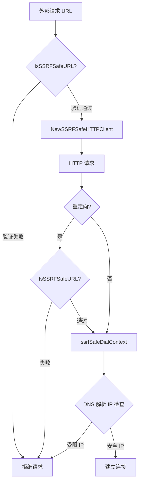

# SSRF 防护与 HTTP 安全配置模块技术深度解析

## 1. 问题空间与模块存在意义

在现代分布式系统中，服务经常需要向外部 URL 发出请求（例如网页抓取、Webhook 回调、第三方 API 调用等）。然而，这种功能如果不加防护，会成为攻击者的突破口——**服务器端请求伪造（SSRF）** 攻击允许攻击者诱使服务器向其本不应访问的内部资源发起请求，从而窃取敏感数据、扫描内网、甚至攻击内部服务。

传统的 SSRF 防护方案往往存在明显缺陷：
- 简单的域名黑名单容易被绕过（例如使用 IP 地址、DNS 重绑定、编码混淆等）
- 仅在请求前验证 URL 无法防范重定向攻击
- 缺乏对底层网络连接的控制，攻击者可能通过 DNS 解析绕过应用层检查
- 未考虑云环境特有的元数据服务端点（如 AWS、GCP、腾讯云的实例元数据服务）

本模块的核心设计洞察是：**SSRF 防护必须是多层的、深度防御的**——从 URL 解析到 DNS 解析，再到实际建立连接，每一层都需要进行安全检查，形成闭环防护。

## 2. 核心心智模型与架构

### 2.1 心智模型：多层门禁系统

可以将本模块想象成一个**多层门禁系统**：
- **第一道门（URL 解析层）**：检查访客的身份证明（URL 格式、协议、主机名），拒绝明显的可疑人员
- **第二道门（DNS 解析层）**：查询访客的实际地址（DNS 解析），确保其不在禁区（内部 IP、受限网段）内
- **第三道门（连接建立层）**：在开门前再次确认地址（连接时的 IP 验证），防止中途换地址（DNS 重绑定）
- **第四道门（重定向检查）**：如果访客要求换个房间（HTTP 重定向），重新走一遍完整的检查流程

### 2.2 架构数据流图



### 2.3 核心组件角色

- **`IsSSRFSafeURL`**：URL 安全验证器，负责第一道防线的全面检查
- **`ssrfSafeDialContext`**：安全拨号器，在网络连接层实施最终检查
- **`NewSSRFSafeHTTPClient`**：HTTP 客户端工厂，组装所有安全组件
- **`SSRFSafeHTTPClientConfig`**：配置结构体，允许灵活调整安全参数

## 3. 核心组件深度解析

### 3.1 SSRF 防护的核心：`IsSSRFSafeURL`

这是模块中最复杂、检查最全面的函数，它执行了一整套严格的验证流程。

**设计意图**：在应用层对 URL 进行全方位扫描，不放过任何可能的 SSRF 向量。

**内部工作流程**：
1. **基础验证**：检查 URL 非空、长度不超过 2048 字符（防止过长 URL 攻击）
2. **协议验证**：仅允许 `http` 和 `https`，拒绝 `file://`、`ftp://` 等危险协议
3. **主机名黑名单**：明确拒绝 `localhost`、`127.0.0.1`、云元数据服务等敏感主机名
4. **域名后缀黑名单**：拒绝 `.local`、`.internal`、`.svc.cluster.local` 等内部域名后缀
5. **IP 地址严格模式**：**完全禁止直接使用 IP 地址**，这是一个关键设计决策（详见下文设计权衡）
6. **IP 混淆检测**：使用正则表达式检测八进制、十六进制、十进制等 IP 地址混淆形式
7. **DNS 解析验证**：实际解析域名并检查所有返回的 IP 地址，防止 DNS 重绑定攻击
8. **端口检查**：拒绝 SSH、MySQL、Redis 等敏感服务端口

**关键代码片段解析**：
```go
// STRICT MODE: Completely block IP addresses in URLs
// This prevents all IP-based SSRF attacks including edge cases and bypasses
ip := net.ParseIP(hostname)
if ip != nil {
    return false, "direct IP address access is not allowed, use domain name instead"
}
```
这段代码体现了"安全优先"的设计哲学——即使会带来一些使用不便，也要彻底封堵 IP 地址这个最大的 SSRF 攻击面。

### 3.2 连接层防护：`ssrfSafeDialContext`

这是 HTTP 传输层的自定义拨号函数，它在实际建立 TCP 连接前进行最后一道安全检查。

**设计意图**：即使 URL 验证通过，也要在连接时再次确认目标 IP，因为：
- DNS 记录可能在验证和连接之间发生变化（DNS 重绑定攻击）
- 攻击者可能控制 DNS 服务器，在不同时间返回不同的 IP

**工作原理**：
1. 从地址中提取主机名
2. 再次检查主机名和后缀黑名单
3. 使用系统解析器解析 IP 地址
4. **验证所有解析到的 IP**，只要有一个受限就拒绝连接
5. 只有全部 IP 都安全时，才使用标准拨号器建立连接

**设计亮点**：这里没有尝试"挑选"安全 IP，而是采用"全有或全无"策略——只要有一个解析结果不安全，就完全拒绝连接。这防止了攻击者通过混合返回安全和不安全 IP 来绕过检查。

### 3.3 安全 HTTP 客户端：`NewSSRFSafeHTTPClient`

这个工厂函数将前面的组件组装成一个完整的安全 HTTP 客户端。

**设计意图**：提供一个"开箱即用"的安全客户端，开发者无需了解底层细节即可获得全面防护。

**关键组件**：
1. **自定义 Transport**：使用 `ssrfSafeDialContext` 作为拨号函数
2. **重定向检查器**：在 `CheckRedirect` 回调中对每个重定向目标重新调用 `IsSSRFSafeURL`
3. **超时控制**：防止长时间挂起的请求消耗资源

**重定向防护的重要性**：攻击者经常使用"无害"的外部 URL，该 URL 会重定向到内部服务。如果不在重定向时重新验证，前面的所有检查都将形同虚设。

### 3.4 配置结构体：`SSRFSafeHTTPClientConfig`

提供了灵活的配置选项，允许在安全性和性能之间进行权衡。

**可配置项**：
- `Timeout`：请求超时时间（默认 30 秒）
- `MaxRedirects`：最大重定向次数（默认 10 次）
- `DisableKeepAlives`：是否禁用 HTTP 长连接
- `DisableCompression`：是否禁用压缩

## 4. 依赖分析与数据流向

### 4.1 依赖关系

本模块是一个**底层安全基础设施**，它被上层的网络请求功能所依赖。从代码结构来看，它主要依赖标准库：
- `net`、`net/http`、`net/url`：网络相关功能
- `regexp`：正则表达式匹配
- `html`：HTML 转义
- `context`：上下文控制
- `time`：时间处理

### 4.2 典型数据流向

当应用程序需要发起外部 HTTP 请求时，典型的数据流如下：

1. **调用方**获取或构造目标 URL
2. **调用方**使用 `NewSSRFSafeHTTPClient` 创建安全客户端（或直接使用已创建的客户端）
3. **调用方**使用该客户端发起请求
4. **HTTP 客户端**首先检查 URL（如果是重定向）
5. **HTTP 传输层**调用 `ssrfSafeDialContext` 建立连接
6. **`ssrfSafeDialContext`** 执行 DNS 解析和 IP 验证
7. 验证通过后，建立连接并完成请求

## 5. 关键设计决策与权衡

### 5.1 严格禁止 IP 地址 vs 允许特定 IP

**决策**：完全禁止在 URL 中使用 IP 地址，要求必须使用域名。

**理由**：
- IP 地址是 SSRF 攻击的最常见载体，禁止它们可以消除一大类攻击
- 即使是"看起来安全"的公网 IP，也可能被攻击者通过某种方式利用
- 对于确实需要访问 IP 的场景，可以通过内部 DNS 或代理来解决

**权衡**：
- 缺点：某些合法用例（如测试环境、嵌入式设备）可能需要直接使用 IP 地址
- 缓解：如果业务确实需要，可以基于此模块创建一个"放宽版"，但必须非常谨慎

### 5.2 DNS 解析时验证所有 IP vs 只验证第一个

**决策**：验证 DNS 解析返回的所有 IP 地址，只要有一个受限就拒绝。

**理由**：
- 攻击者可以配置 DNS 服务器同时返回安全和不安全的 IP
- 如果只验证第一个 IP，攻击者可以让第一个是安全的，而实际连接时使用不安全的
- "全有或全无"策略是最安全的

**权衡**：
- 缺点：可能会误杀一些同时有内部和外部解析的合法域名
- 缓解：建议使用独立的外部域名，不要混用内外解析

### 5.3 连接时再次验证 DNS vs 只验证一次

**决策**：在 URL 验证和连接建立时都进行 DNS 解析和检查。

**理由**：
- 防止 DNS 重绑定攻击——攻击者可以在验证后、连接前更改 DNS 记录
- 即使应用层验证通过，传输层也要"不信任"，再次确认

**权衡**：
- 缺点：进行了两次 DNS 解析，增加了延迟和 DNS 服务器负载
- 缓解：对于大多数应用，这个额外开销是值得的；如果性能极其敏感，可以考虑 DNS 缓存，但必须注意缓存时间

### 5.4 拒绝 DNS 解析失败的 URL vs 允许通过

**决策**：如果 DNS 解析失败，直接拒绝 URL。

**理由**：
- DNS 解析失败可能意味着这是一个仅在内部网络可解析的域名
- 攻击者可能使用只能在受害者网络中解析的域名来绕过检查
- "疑罪从有"——不确定的情况下，拒绝是更安全的选择

**权衡**：
- 缺点：可能会误杀一些临时 DNS 故障的合法外部域名
- 缓解：调用方可以处理这个错误，在必要时进行重试

## 6. 使用指南与最佳实践

### 6.1 基本使用

创建安全 HTTP 客户端并发起请求：

```go
// 使用默认配置创建客户端
client := NewSSRFSafeHTTPClient(DefaultSSRFSafeHTTPClientConfig())

// 发起请求（和标准 http.Client 用法完全一致）
resp, err := client.Get("https://example.com")
if err != nil {
    // 处理错误，可能是 SSRF 防护拒绝
    log.Fatal(err)
}
defer resp.Body.Close()
```

### 6.2 自定义配置

如果需要调整参数：

```go
config := SSRFSafeHTTPClientConfig{
    Timeout:            60 * time.Second,  // 更长的超时
    MaxRedirects:       5,                  // 更少的重定向
    DisableKeepAlives:  true,               // 禁用长连接
    DisableCompression: false,
}

client := NewSSRFSafeHTTPClient(config)
```

### 6.3 单独验证 URL

如果只需要验证 URL 而不发起请求：

```go
url := "http://potential-ssrf-target.com"
if safe, reason := IsSSRFSafeURL(url); !safe {
    log.Printf("URL 不安全: %s", reason)
    // 处理不安全情况
} else {
    // URL 安全，可以继续
}
```

### 6.4 最佳实践

1. **始终使用安全客户端**：不要绕过这个模块直接使用标准 `http.Client`
2. **不要放宽 IP 地址限制**：除非有极其充分的理由，否则保持严格模式
3. **正确处理错误**：SSRF 防护拒绝请求时会返回明确的错误信息，应该记录并展示给用户
4. **定期更新受限列表**：云服务提供商可能会添加新的元数据端点，需要关注并更新
5. **结合其他安全措施**：这只是多层防御中的一层，还应配合网络隔离、防火墙规则等

## 7. 边缘情况与潜在陷阱

### 7.1 DNS 解析的一致性

**陷阱**：URL 验证和连接建立时使用不同的 DNS 服务器，可能导致不一致的结果。

**场景**：
- 验证时使用公共 DNS，返回公网 IP
- 连接时使用内部 DNS，返回内网 IP

**缓解**：确保整个系统使用一致的 DNS 配置，或者在 `ssrfSafeDialContext` 中强制使用特定的 DNS 服务器。

### 7.2 IPv6 支持

**陷阱**：代码对 IPv6 有一定处理，但某些复杂的 IPv6 地址格式可能未被完全覆盖。

**注意**：虽然代码检测了常见的 IPv6 格式，但新的混淆技术可能出现。建议监控并更新正则表达式。

### 7.3 性能考虑

**陷阱**：双重 DNS 解析（URL 验证时一次，连接时一次）可能在高并发场景下成为性能瓶颈。

**缓解**：
- 如果性能确实成为问题，可以考虑实现一个短时间的 DNS 缓存
- 缓存时间不宜过长（建议不超过 1 分钟），否则会降低对 DNS 重绑定的防护效果

### 7.4 误报处理

**陷阱**：某些合法的外部服务可能使用看起来像内部的域名或端口。

**处理流程**：
1. 确认服务确实是外部的、安全的
2. 评估是否可以更改服务配置（使用不同的端口、域名等）
3. 如确实需要，考虑添加特殊例外（但要非常谨慎，确保例外有范围限制）

## 8. 总结

`ssrf_protection_and_http_security_config` 模块是一个精心设计的安全基础设施，它通过**多层防御、深度检查**的策略，为系统提供了全面的 SSRF 防护。其核心设计理念是"安全优先"——即使会带来一些使用不便或性能开销，也要确保系统不受 SSRF 攻击的威胁。

对于新加入团队的开发者，理解这个模块的关键是：
1. 认识到 SSRF 攻击的严重性和多样性
2. 理解"多层防御"的设计思想
3. 知道什么时候该使用这个模块（几乎所有外部 HTTP 请求都应该使用）
4. 了解设计权衡，不要轻易放宽安全限制

这个模块是系统安全防线的重要组成部分，正确使用它可以显著降低系统被 SSRF 攻击的风险。
