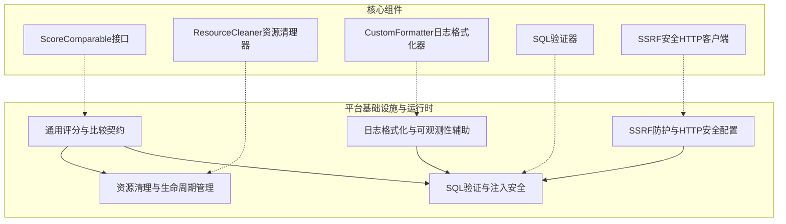

# 平台基础设施与运行时：生命周期、可观测性与安全

## 概述

这个模块是整个系统的"安全卫士"和"运营管家"，提供了一套全面的基础设施工具集，用于保障系统的安全性、可观测性和资源生命周期管理。它不直接处理业务逻辑，而是作为底层支撑，为上层应用提供统一的安全防护、日志记录、资源清理和通用工具函数。

想象一下，这个模块就像是一个现代化办公楼的基础设施系统：安全门禁系统（SSRF防护、SQL注入防护）、监控摄像头和日志系统（日志格式化）、清洁和维护团队（资源清理器），以及公共设施（通用工具函数）。没有这些基础设施，楼可以盖起来，但无法安全、可靠、长期地运行。

## 架构概览

### 核心组件说明

1. **通用评分与比较契约**：提供了`ScoreComparable`接口，允许类型实现分数比较功能，支持带分数的去重和排序操作。

2. **资源清理与生命周期管理**：通过`ResourceCleaner`实现了一个优雅的资源生命周期管理机制，支持注册清理函数并在适当时候逆序执行。

3. **日志格式化与可观测性辅助**：`CustomFormatter`提供了结构化、带颜色的日志输出，包含时间戳、请求ID、调用者信息等关键可观测性数据。

4. **SQL验证与注入安全**：提供了全面的SQL验证和安全功能，包括SQL解析、注入风险检测、表和函数白名单、租户隔离等。

5. **SSRF防护与HTTP安全配置**：实现了SSRF（服务器端请求伪造）防护机制，包括URL验证、DNS解析检查、IP限制等，并提供了安全的HTTP客户端配置。

## 设计决策

### 1. 安全防护的"纵深防御"策略

**决策**：采用多层安全防护机制，而不是依赖单一防护点。

**分析**：
- **SQL安全**：不仅做注入模式检测，还通过PostgreSQL官方解析器进行语法分析、表/函数白名单、租户隔离注入等多层防护
- **SSRF防护**：结合URL格式验证、主机名检查、DNS解析验证、连接时IP验证等多层防护
- **为什么这样做**：单一防护措施容易被绕过，多层防护提供了"防御深度"，即使一层被突破，其他层仍能提供保护

### 2. 资源清理的"逆序执行"模式

**决策**：资源清理函数按注册的逆序执行。

**分析**：
- **类比**：这类似于栈的"后进先出"原则，或者建筑拆除时"先建的后拆"
- **原因**：资源之间可能存在依赖关系，后注册的资源可能依赖先注册的资源，逆序清理可以避免依赖问题
- **示例**：先创建数据库连接，再创建基于该连接的Statement，清理时应该先关闭Statement，再关闭连接

### 3. 日志格式的"结构化优先"设计

**决策**：日志格式设计为结构化的键值对形式，而非自由文本。

**分析**：
- **优点**：便于日志解析、过滤和分析，支持自动化工具处理
- **特殊处理**：request_id优先输出，便于追踪整个请求链路
- **颜色编码**：不同日志级别使用不同颜色，提高人类可读性
- **权衡**：牺牲了一些自由文本的灵活性，换取了机器处理的便利性

### 4. SQL验证的"白名单"而非"黑名单"策略

**决策**：使用允许的表和函数列表（白名单），而不是禁止的列表（黑名单）。

**分析**：
- **安全性**：白名单策略更安全，因为它默认禁止一切，只允许明确许可的
- **维护性**：虽然初始配置需要更多工作，但长期来看更易维护，因为新的危险函数/表默认被禁止
- **示例**：默认只允许knowledge_bases、knowledges、chunks三个表，且只允许安全的SQL函数

## 子模块概览

### 1. 通用评分与比较契约

这个子模块提供了`ScoreComparable`接口和相关的工具函数，用于处理带分数的对象比较、去重和排序。这在检索结果处理、推荐系统等场景中非常有用。

[查看详情](platform_infrastructure_and_runtime-platform_utilities_lifecycle_observability_and_security-common_scoring_and_comparison_contracts.md)

### 2. 资源清理与生命周期管理

提供了一个灵活的资源清理机制，支持注册多个清理函数并按逆序执行，确保资源被正确释放。适用于数据库连接、文件句柄、网络连接等需要显式清理的资源。

[查看详情](platform_infrastructure_and_runtime-platform_utilities_lifecycle_observability_and_security-resource_cleanup_and_lifecycle_management.md)

### 3. 日志格式化与可观测性辅助

实现了一个功能丰富的日志格式化器，提供结构化、带颜色的日志输出，包含请求追踪信息，大大提高了系统的可观测性和调试效率。

[查看详情](platform_infrastructure_and_runtime-platform_utilities_lifecycle_observability_and_security-logging_formatting_and_observability_helpers.md)

### 4. SQL验证与注入安全

这是一个全面的SQL安全工具包，提供SQL解析、注入风险检测、表和函数白名单、租户隔离等功能，有效防止SQL注入攻击和未授权的数据访问。

[查看详情](platform_infrastructure_and_runtime-platform_utilities_lifecycle_observability_and_security-sql_validation_and_injection_safety.md)

### 5. SSRF防护与HTTP安全配置

提供了完整的SSRF防护机制，包括URL验证、DNS解析检查、IP限制等，并实现了一个安全的HTTP客户端，防止服务器端请求伪造攻击。

[查看详情](platform_infrastructure_and_runtime-platform_utilities_lifecycle_observability_and_security-ssrf_protection_and_http_security_config.md)

## 跨模块依赖

这个模块是一个基础设施模块，被系统中的许多其他模块依赖：

1. **被应用服务层依赖**：提供日志记录、安全验证等基础功能
2. **被数据访问层依赖**：提供SQL验证和资源清理功能
3. **被HTTP处理层依赖**：提供SSRF防护和日志功能
4. **被Agent运行时依赖**：提供资源清理和日志功能

## 注意事项

### 新贡献者指南

1. **SQL验证器的使用**：
   - 始终优先使用`WithSecurityDefaults()`选项，它包含了推荐的安全设置
   - 添加新表到允许列表时，确保它有适当的租户隔离机制
   - 避免修改核心验证逻辑，除非你完全理解所有安全含义

2. **资源清理器的使用**：
   - 记住清理函数是逆序执行的，按依赖顺序注册资源
   - 清理函数应该是幂等的，即使被多次调用也不会造成问题
   - 总是检查清理错误，但不要让单个清理失败阻止其他清理

3. **SSRF防护的注意事项**：
   - 不要绕过URL验证直接使用IP地址
   - 注意DNS解析可能随时间变化，验证和实际请求之间可能存在TOCTOU（检查时间到使用时间）问题
   - 在允许的端口列表中添加新端口时要非常谨慎

4. **日志系统的使用**：
   - 总是通过`WithRequestID()`传递请求ID，便于链路追踪
   - 不要在日志中记录敏感信息（密码、token等）
   - 使用适当的日志级别，避免生产环境中过多的DEBUG日志
