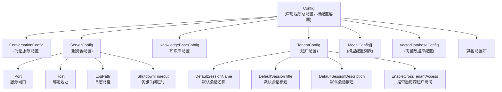
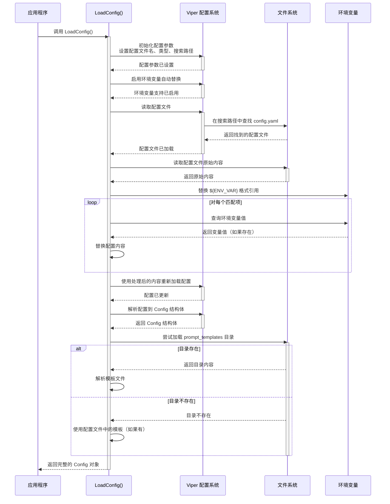

# 引导根配置与租户运行时配置深度解析

## 1. 模块概述

在现代多租户 SaaS 应用架构中，配置管理是一个核心挑战。`bootstrap_root_and_tenant_runtime_configuration` 模块（以下简称 "配置引导模块"）负责解决这个问题，它提供了一套完整的配置加载、解析和管理机制，支持从根配置到租户级配置的多层次配置体系。

### 为什么需要这个模块？

想象一下，当您需要部署一个支持多租户的 AI 助手平台时，您会面临以下配置挑战：

- 不同的部署环境（开发、测试、生产）需要不同的配置
- 敏感信息（如数据库密码、API 密钥）不应该直接硬编码在配置文件中
- 不同的租户可能需要不同的默认行为和限制
- 提示词模板等配置项可能需要频繁更新，而不希望重启整个应用
- 配置应该有明确的优先级和覆盖机制

这个模块的设计正是为了解决这些问题，它提供了一个灵活、安全且易于维护的配置管理方案。

## 2. 核心架构与数据流

### 2.1 核心组件

配置引导模块的核心由三个主要结构体组成：



### 2.2 数据加载流程

配置加载的完整流程如下：



## 3. 核心组件深度解析

### 3.1 Config 结构体

`Config` 是整个配置系统的核心容器，它聚合了所有其他配置结构体。这种设计提供了一个单一的配置入口点，使得在整个应用程序中传递配置变得简单。

```go
type Config struct {
    Conversation    *ConversationConfig    `yaml:"conversation"     json:"conversation"`
    Server          *ServerConfig          `yaml:"server"           json:"server"`
    KnowledgeBase   *KnowledgeBaseConfig   `yaml:"knowledge_base"   json:"knowledge_base"`
    Tenant          *TenantConfig          `yaml:"tenant"           json:"tenant"`
    // ... 其他配置项
}
```

**设计意图**：使用指针类型的配置字段有两个主要目的：
1. 允许配置字段为 `nil`，表示该配置项未设置
2. 在传递配置时避免复制整个结构体，提高性能

### 3.2 ServerConfig 结构体

`ServerConfig` 负责管理服务器级别的配置，这些配置通常在整个应用程序实例中是统一的。

```go
type ServerConfig struct {
    Port            int           `yaml:"port"             json:"port"`
    Host            string        `yaml:"host"             json:"host"`
    LogPath         string        `yaml:"log_path"         json:"log_path"`
    ShutdownTimeout time.Duration `yaml:"shutdown_timeout" json:"shutdown_timeout" default:"30s"`
}
```

**设计要点**：
- `ShutdownTimeout` 字段使用了 `time.Duration` 类型，这使得配置文件中可以使用人类可读的格式（如 "30s"、"5m"）
- 虽然有 `default:"30s"` 标签，但实际的默认值处理是在 Viper 配置系统中完成的，而不是通过这个标签

### 3.3 TenantConfig 结构体

`TenantConfig` 管理租户级别的默认配置，这些配置可以作为租户特定配置的基础。

```go
type TenantConfig struct {
    DefaultSessionName        string `yaml:"default_session_name"        json:"default_session_name"`
    DefaultSessionTitle       string `yaml:"default_session_title"       json:"default_session_title"`
    DefaultSessionDescription string `yaml:"default_session_description" json:"default_session_description"`
    EnableCrossTenantAccess   bool   `yaml:"enable_cross_tenant_access" json:"enable_cross_tenant_access"`
}
```

**设计意图**：
- 提供合理的默认值，减少租户配置的复杂性
- 支持跨租户访问控制，这是多租户系统中的关键安全特性
- 分离关注点：租户级别的默认配置与实例级别的服务器配置

## 4. 核心功能实现解析

### 4.1 配置加载机制

`LoadConfig` 函数是整个配置系统的入口点，它实现了一个复杂但灵活的配置加载流程。

```go
func LoadConfig() (*Config, error) {
    // 设置配置文件名和路径
    viper.SetConfigName("config")
    viper.SetConfigType("yaml")
    viper.AddConfigPath(".")
    viper.AddConfigPath("./config")
    viper.AddConfigPath("$HOME/.appname")
    viper.AddConfigPath("/etc/appname/")
    
    // 启用环境变量替换
    viper.AutomaticEnv()
    viper.SetEnvKeyReplacer(strings.NewReplacer(".", "_"))
    
    // ... 更多代码
}
```

**设计亮点**：
1. **多路径搜索**：配置文件可以在多个标准位置查找，适应不同的部署环境
2. **环境变量集成**：支持通过环境变量覆盖配置，这对容器化部署特别重要
3. **环境变量替换**：不仅支持 Viper 自带的环境变量覆盖，还实现了对配置文件内容中 `${ENV_VAR}` 格式的替换

### 4.2 环境变量替换机制

这个模块实现了两层环境变量替换机制：

1. **Viper 自带的环境变量覆盖**：
   ```go
   viper.AutomaticEnv()
   viper.SetEnvKeyReplacer(strings.NewReplacer(".", "_"))
   ```
   这允许通过 `CONVERSATION_MAX_ROUNDS` 这样的环境变量覆盖 `conversation.max_rounds` 配置项。

2. **配置文件内容中的环境变量引用替换**：
   ```go
   re := regexp.MustCompile(`\${([^}]+)}`)
   result := re.ReplaceAllStringFunc(string(configFileContent), func(match string) string {
       envVar := match[2 : len(match)-1]
       if value := os.Getenv(envVar); value != "" {
           return value
       }
       return match
   })
   ```

**设计权衡**：
- 为什么需要两层机制？Viper 的环境变量覆盖是基于配置结构的，而配置文件内容中的替换允许更灵活的引用方式，特别是对于包含敏感信息的字符串配置项。
- 为什么不直接使用 Viper 的机制？因为 Viper 的环境变量覆盖在处理嵌套结构和复杂字符串时可能不够灵活，而手动替换提供了更大的控制权。

### 4.3 提示词模板加载机制

提示词模板是 AI 应用中的关键配置项，这个模块实现了一个灵活的模板加载机制：

```go
configDir := filepath.Dir(viper.ConfigFileUsed())
promptTemplates, err := loadPromptTemplates(configDir)
if err != nil {
    fmt.Printf("Warning: failed to load prompt templates from directory: %v\n", err)
} else if promptTemplates != nil {
    cfg.PromptTemplates = promptTemplates
}
```

**设计特点**：
1. **容错设计**：如果模板加载失败，只会打印警告并继续使用配置文件中的模板（如果有）
2. **目录约定**：模板文件应该放在配置文件所在目录的 `prompt_templates` 子目录中
3. **文件映射**：通过文件名与配置结构的映射，实现了灵活的模板组织

## 5. 设计决策与权衡

### 5.1 使用 Viper 还是手动实现？

**决策**：使用 Viper 作为基础配置库，但在其上添加了自定义功能。

**理由**：
- Viper 提供了丰富的配置管理功能，包括多格式支持、环境变量集成、配置热重载等
- 但 Viper 在某些方面（如配置文件内容中的环境变量引用替换）不够灵活，需要自定义扩展
- 这种混合方案平衡了开发效率和灵活性

### 5.2 指针 vs 值类型

**决策**：Config 结构体中的所有子配置都使用指针类型。

**权衡**：
- **优点**：
  - 可以表示 "未设置" 状态
  - 避免大结构体的复制
  - 允许在运行时修改配置（虽然不推荐）
- **缺点**：
  - 可能引入空指针风险
  - 代码稍微冗长（需要检查 nil）

### 5.3 配置验证

**当前状态**：模块中没有显式的配置验证逻辑。

**可能的改进**：
- 添加配置验证函数，在加载后检查必填项和值范围
- 使用结构体标签定义验证规则

**不立即添加的原因**：
- 保持模块简单，专注于加载和解析
- 验证逻辑可以在使用配置的地方实现，更贴近实际需求

## 6. 使用指南与常见模式

### 6.1 基本使用

```go
// 加载配置
cfg, err := config.LoadConfig()
if err != nil {
    log.Fatalf("Failed to load config: %v", err)
}

// 使用服务器配置
fmt.Printf("Server will listen on %s:%d\n", cfg.Server.Host, cfg.Server.Port)

// 使用租户配置
fmt.Printf("Default session name: %s\n", cfg.Tenant.DefaultSessionName)
```

### 6.2 配置文件结构

```yaml
server:
  port: 8080
  host: 0.0.0.0
  log_path: /var/log/app.log
  shutdown_timeout: 30s

tenant:
  default_session_name: "新对话"
  default_session_title: "我的助手"
  default_session_description: "与 AI 助手的对话"
  enable_cross_tenant_access: false
```

### 6.3 环境变量使用

有两种方式使用环境变量：

1. **通过 Viper 的自动覆盖**：
   ```bash
   export SERVER_PORT=9090
   export TENANT_ENABLE_CROSS_TENANT_ACCESS=true
   ```

2. **在配置文件中引用**：
   ```yaml
   server:
     port: ${SERVER_PORT}
     host: ${SERVER_HOST}
   ```

## 7. 注意事项与常见陷阱

### 7.1 环境变量替换的边界情况

- 如果引用的环境变量不存在，配置文件中的 `${ENV_VAR}` 会保持原样，不会被替换
- 环境变量替换只在配置文件内容加载时进行一次，不会在运行时动态更新

### 7.2 提示词模板加载

- 如果 `prompt_templates` 目录不存在，会静默跳过，不会报错
- 单个模板文件缺失也会跳过，不会影响其他模板的加载
- 目录加载的模板会完全覆盖配置文件中的模板配置

### 7.3 配置路径优先级

Viper 会按照添加顺序搜索配置文件，第一个找到的配置文件会被使用：
1. 当前目录 (`.`)
2. `./config` 目录
3. `$HOME/.appname` 目录
4. `/etc/appname/` 目录

## 8. 扩展与集成点

### 8.1 配置加密

对于敏感配置，可以考虑在这个模块中添加配置解密功能：

```go
// 假设的扩展
type EncryptedConfig struct {
    Data      string `yaml:"data" json:"data"`
    Algorithm string `yaml:"algorithm" json:"algorithm"`
}

func decryptConfig(cfg *Config) error {
    // 解密逻辑
}
```

### 8.2 配置热重载

虽然 Viper 支持配置热重载，但当前模块没有暴露这个功能。可以考虑添加：

```go
func WatchConfig(cfg *Config, onChange func(*Config)) error {
    viper.WatchConfig()
    viper.OnConfigChange(func(e fsnotify.Event) {
        // 重新加载配置并调用回调
    })
}
```

## 9. 总结

`bootstrap_root_and_tenant_runtime_configuration` 模块提供了一个强大而灵活的配置管理解决方案，它通过以下设计特点解决了多租户 SaaS 应用的配置挑战：

1. **多层次配置结构**：从根配置到租户配置的清晰分离
2. **灵活的环境变量集成**：支持多种方式使用环境变量
3. **容错设计**：非关键配置加载失败不会导致整个应用崩溃
4. **可扩展性**：为未来的功能扩展（如配置加密、热重载）预留了空间

这个模块是整个应用架构的基础之一，它的设计既考虑了当前的需求，也为未来的发展预留了空间。
