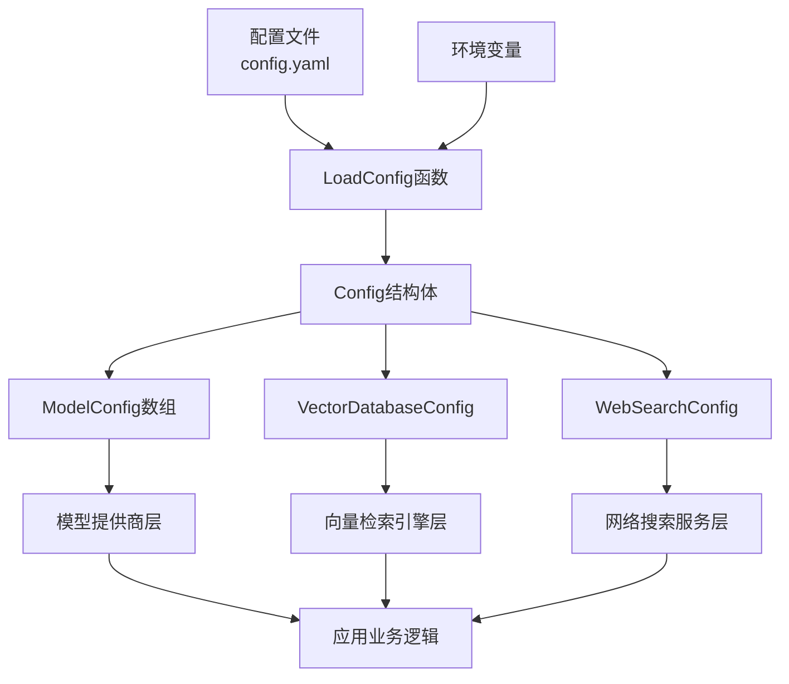

# 模型、向量检索与网络搜索配置模块技术深度解析

## 1. 为什么需要这个模块？

在构建一个支持多租户、可插拔的 AI 知识库系统时，我们面临着一个核心挑战：如何让不同的部署环境能够灵活地接入不同的模型提供商、向量数据库和网络搜索服务，同时保持代码的简洁性和一致性？

想象一下，在一个多租户场景中，有的租户可能使用阿里云的 Qwen 模型和 Milvus 向量数据库，有的租户可能使用 OpenAI 的 GPT 模型和 Elasticsearch，还有的租户可能需要同时配置 Bing 和 Google 两种网络搜索服务。如果我们将这些配置硬编码在业务逻辑中，系统将变得难以维护和扩展。

这个模块的核心价值在于：**将模型、向量数据库和网络搜索的基础设施配置与业务逻辑解耦**，通过统一的配置结构和加载机制，让系统能够在不同环境下无缝切换，同时保持核心业务代码的稳定性。

## 2. 核心抽象与心智模型

可以将这个模块想象成一个"配置集线器"——它接收不同来源的配置信息（文件、环境变量），并将它们组装成一个结构化的配置对象，供系统的其他部分使用。

### 关键抽象：

1. **`ModelConfig`** - 模型配置：定义了模型的类型、来源、名称和参数。可以将其看作是模型服务的"接入凭证"。
2. **`VectorDatabaseConfig`** - 向量数据库配置：目前主要定义了向量数据库的驱动类型，是向量检索系统的"基础设施选择器"。
3. **`WebSearchConfig`** - 网络搜索配置：目前主要定义了网络搜索的超时时间，是网络搜索服务的"行为控制器"。

这些配置不是孤立存在的，它们被组织在一个统一的 `Config` 结构体中，形成了一个完整的应用配置树。

## 3. 架构与数据流程

让我们通过一个简单的架构图来理解这个模块在系统中的位置和数据流向：



### 数据流程详解：

1. **配置加载阶段**：
   - `LoadConfig` 函数首先使用 Viper 库从多个可能的位置（当前目录、config 子目录、用户目录、/etc/appname/）查找并读取 `config.yaml` 文件。
   - 启用环境变量替换机制，将配置文件中的 `${ENV_VAR}` 格式的引用替换为实际的环境变量值。
   - 将解析后的配置映射到 `Config` 结构体中。

2. **配置使用阶段**：
   - 系统的其他部分通过 `Config` 结构体获取所需的配置信息。
   - 模型提供商层使用 `ModelConfig` 来初始化相应的模型客户端。
   - 向量检索引擎层使用 `VectorDatabaseConfig` 来选择和初始化向量数据库连接。
   - 网络搜索服务层使用 `WebSearchConfig` 来配置搜索行为。

## 4. 核心组件深度解析

### 4.1 `ModelConfig` - 模型配置

**设计意图**：提供一个灵活的模型配置结构，支持多种模型类型、来源和参数。

```go
type ModelConfig struct {
    Type       string                 `yaml:"type"       json:"type"`
    Source     string                 `yaml:"source"     json:"source"`
    ModelName  string                 `yaml:"model_name" json:"model_name"`
    Parameters map[string]interface{} `yaml:"parameters" json:"parameters"`
}
```

**字段详解**：
- `Type`：模型类型，如 "chat"、"embedding"、"rerank" 等，用于区分模型的用途。
- `Source`：模型来源，如 "openai"、"aliyun"、"ollama" 等，用于标识模型提供商。
- `ModelName`：具体的模型名称，如 "gpt-4"、"qwen-turbo" 等。
- `Parameters`：模型参数，使用 `map[string]interface{}` 类型，支持灵活的参数配置。

**设计亮点**：使用 `map[string]interface{}` 类型的 `Parameters` 字段，使得配置可以支持不同模型提供商的各种参数，无需为每个提供商定义单独的配置结构。这种设计在灵活性和类型安全之间做了权衡，优先考虑了灵活性。

### 4.2 `VectorDatabaseConfig` - 向量数据库配置

**设计意图**：提供向量数据库的基础配置，目前主要是驱动类型选择。

```go
type VectorDatabaseConfig struct {
    Driver string `yaml:"driver" json:"driver"`
}
```

**字段详解**：
- `Driver`：向量数据库驱动类型，如 "milvus"、"elasticsearch"、"postgres" 等。

**设计亮点**：虽然目前结构简单，但它为未来的扩展预留了空间。随着系统的发展，可以轻松地添加更多的向量数据库配置选项，如连接地址、认证信息等。

### 4.3 `WebSearchConfig` - 网络搜索配置

**设计意图**：提供网络搜索服务的行为配置。

```go
type WebSearchConfig struct {
    Timeout int `yaml:"timeout" json:"timeout"` // 超时时间（秒）
}
```

**字段详解**：
- `Timeout`：网络搜索的超时时间，单位为秒。

**设计亮点**：通过集中配置超时时间，可以统一控制网络搜索服务的行为，避免在多个地方硬编码超时值，提高了系统的可维护性。

## 5. 依赖关系分析

### 被依赖模块

这个模块是整个系统的基础设施配置中心，被以下核心模块依赖：

1. **[model_providers_and_ai_backends](../model_providers_and_ai_backends.md)** - 用于初始化不同的模型提供商客户端。
2. **[data_access_repositories-vector_retrieval_backend_repositories](../data_access_repositories-vector_retrieval_backend_repositories.md)** - 用于选择和初始化向量数据库连接。
3. **[application_services_and_orchestration-retrieval_and_web_search_services](../application_services_and_orchestration-retrieval_and_web_search_services.md)** - 用于配置网络搜索服务的行为。

### 依赖模块

这个模块依赖以下外部库：

- **viper** - 用于配置文件的读取和解析。
- **mapstructure** - 用于将配置映射到结构体。
- **yaml.v3** - 用于 YAML 文件的解析。

## 6. 设计决策与权衡

### 6.1 集中式配置 vs 分布式配置

**决策**：选择集中式配置。

**原因**：在这个系统中，模型、向量数据库和网络搜索的配置通常是在部署时确定的，并且在运行时不会频繁变化。集中式配置可以让管理员更容易地管理和修改配置，同时也简化了配置的加载和使用流程。

**权衡**：集中式配置的缺点是配置变更通常需要重启应用才能生效。不过，对于这个系统的使用场景来说，这是一个可以接受的 trade-off。

### 6.2 灵活的参数配置 vs 类型安全

**决策**：在 `ModelConfig` 中使用 `map[string]interface{}` 类型的 `Parameters` 字段，优先考虑灵活性。

**原因**：不同的模型提供商可能有不同的参数，使用灵活的 map 类型可以让配置支持各种参数，无需为每个提供商定义单独的配置结构。

**权衡**：这种设计牺牲了一定的类型安全，需要在使用配置的地方进行额外的类型检查和转换。不过，考虑到模型提供商的多样性和变化性，这种权衡是值得的。

### 6.3 环境变量替换

**决策**：支持在配置文件中使用 `${ENV_VAR}` 格式的环境变量引用。

**原因**：这种设计可以让敏感信息（如 API 密钥）不直接出现在配置文件中，提高了系统的安全性。同时，也使得配置可以根据不同的环境（开发、测试、生产）进行灵活调整。

**权衡**：实现这种功能需要额外的代码来处理环境变量的替换，增加了一定的复杂性。不过，考虑到安全性和灵活性的收益，这是一个合理的设计选择。

## 7. 使用指南与示例

### 7.1 基本配置示例

以下是一个简单的配置文件示例：

```yaml
models:
  - type: chat
    source: openai
    model_name: gpt-4
    parameters:
      api_key: ${OPENAI_API_KEY}
      temperature: 0.7
  - type: embedding
    source: aliyun
    model_name: text-embedding-v2
    parameters:
      api_key: ${ALIYUN_API_KEY}

vector_database:
  driver: milvus

web_search:
  timeout: 10
```

### 7.2 加载配置

在代码中加载配置的示例：

```go
import "github.com/Tencent/WeKnora/internal/config"

func main() {
    // 加载配置
    cfg, err := config.LoadConfig()
    if err != nil {
        log.Fatalf("Failed to load config: %v", err)
    }
    
    // 使用模型配置
    for _, model := range cfg.Models {
        fmt.Printf("Model: %s/%s\n", model.Source, model.ModelName)
    }
    
    // 使用向量数据库配置
    fmt.Printf("Vector database driver: %s\n", cfg.VectorDatabase.Driver)
    
    // 使用网络搜索配置
    fmt.Printf("Web search timeout: %d seconds\n", cfg.WebSearch.Timeout)
}
```

### 7.3 扩展配置

如果需要扩展配置，例如添加向量数据库的连接信息，可以按照以下步骤进行：

1. 在 `VectorDatabaseConfig` 结构体中添加新的字段：

```go
type VectorDatabaseConfig struct {
    Driver string `yaml:"driver" json:"driver"`
    Address string `yaml:"address" json:"address"`
    Username string `yaml:"username" json:"username"`
    Password string `yaml:"password" json:"password"`
}
```

2. 在配置文件中添加相应的配置：

```yaml
vector_database:
  driver: milvus
  address: ${MILVUS_ADDRESS}
  username: ${MILVUS_USERNAME}
  password: ${MILVUS_PASSWORD}
```

## 8. 注意事项与陷阱

### 8.1 环境变量替换的限制

环境变量替换功能只支持 `${ENV_VAR}` 格式的引用，不支持默认值或其他高级功能。如果环境变量不存在，引用将保持原样，这可能导致配置错误。

**解决方法**：确保所有在配置文件中引用的环境变量都已设置，或者在代码中添加额外的检查。

### 8.2 模型参数的类型安全

由于 `ModelConfig.Parameters` 使用 `map[string]interface{}` 类型，在使用参数时需要进行类型检查和转换，否则可能导致运行时错误。

**解决方法**：在使用参数的地方添加类型检查，或者为常用的模型提供商创建辅助函数来安全地获取参数。

### 8.3 配置文件的位置

`LoadConfig` 函数会从多个位置查找配置文件，但如果在多个位置都存在配置文件，它只会使用找到的第一个配置文件。

**解决方法**：确保在预期的位置只有一个配置文件，或者明确指定配置文件的位置。

## 9. 总结

这个模块是整个系统的基础设施配置中心，它通过统一的配置结构和加载机制，将模型、向量数据库和网络搜索的配置与业务逻辑解耦，提高了系统的灵活性和可维护性。

虽然目前的实现相对简单，但它为未来的扩展预留了空间。随着系统的发展，我们可以轻松地添加更多的配置选项和功能，同时保持核心设计的稳定性。
