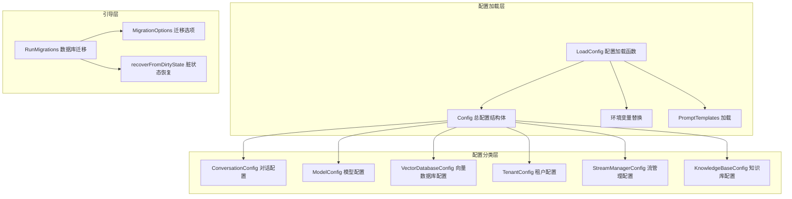

# 运行时配置与引导模块

## 模块概览

想象一下，你正在建造一艘大型游轮。这艘船需要同时处理成千上万名乘客的需求：餐厅需要知道菜单配置，娱乐系统需要加载节目单，导航系统需要设置航线参数，安全系统需要配置传感器阈值。如果每个系统都自己管理配置，这艘船很快就会陷入混乱。

`runtime_configuration_and_bootstrap` 模块就像是这艘游轮的**中央工程控制室**——它负责在系统启动时加载、验证和分发所有配置参数，确保每个子系统都能获得正确的设置，同时处理数据库迁移等关键的初始化任务。

这个模块解决的核心问题是：**如何在一个复杂的多租户 AI 助手系统中，统一管理从模型配置、对话参数到数据库连接的所有运行时设置，并确保系统启动时状态一致？**

## 核心架构



**架构说明**：

1. **配置加载层**：负责从 YAML 文件、环境变量和专用模板目录加载配置。`LoadConfig` 函数是这一层的核心，它处理环境变量替换、配置文件解析和提示词模板加载。

2. **配置分类层**：将配置按功能域划分为不同的结构体，每个结构体负责一类特定的配置项。这种划分使得配置管理更加模块化，也方便各子系统只依赖自己需要的配置部分。

3. **引导层**：处理数据库迁移等关键的启动任务。它提供了安全的迁移执行机制，包括脏状态检测和自动恢复功能。

## 核心组件详解

### Config 总配置结构体

`Config` 是整个系统的配置根对象，它像一棵树的主干，将所有功能域的配置聚合在一起。

**设计意图**：
- 通过组合模式将不同功能域的配置组织在一起
- 支持 YAML 和 JSON 序列化，便于配置文件读写
- 每个子配置都使用指针类型，允许部分配置缺失或可选

**关键子配置**：
- `Conversation`: 对话服务的核心参数，包括检索阈值、回退策略等
- `Models`: 可用模型列表，支持多个模型提供商
- `VectorDatabase`: 向量数据库驱动配置
- `Tenant`: 租户级默认设置
- `PromptTemplates`: 提示词模板集合

### 配置加载流程

`LoadConfig` 函数实现了一个灵活的配置加载机制，其工作流程如下：

1. **配置文件查找**：在多个路径（当前目录、config 子目录、用户目录、/etc 目录）中查找配置文件
2. **环境变量集成**：
   - 支持 `${ENV_VAR}` 语法在配置文件中引用环境变量
   - 通过 Viper 的 `AutomaticEnv` 支持直接用环境变量覆盖配置项
   - 使用点号到下划线的替换（如 `database.host` → `DATABASE_HOST`）
3. **提示词模板加载**：从配置文件同目录下的 `prompt_templates` 子目录加载专用模板文件

**设计亮点**：
- 环境变量替换是先读取整个配置文件内容，然后用正则表达式替换，这种方式比 Viper 内置的机制更灵活
- 提示词模板支持从独立文件加载，便于管理复杂的模板内容
- 配置加载失败时提供清晰的错误信息

### 数据库迁移系统

数据库迁移是系统启动的关键环节，`RunMigrations` 和相关函数提供了一个健壮的迁移执行机制。

**核心设计**：
- 使用 `golang-migrate` 库管理版本化迁移
- 支持"脏状态"检测和恢复
- 提供详细的日志记录和错误诊断

**脏状态处理**：
当迁移中途失败时，数据库会进入"脏状态"。系统提供两种处理方式：
1. **手动修复**（默认）：提供详细的修复指南，包括如何强制回退到上一个版本
2. **自动恢复**（可选）：通过 `AutoRecoverDirty` 选项启用，自动尝试回退并重试

**设计权衡**：
- 默认不启用自动恢复，因为自动修复可能掩盖潜在问题
- 提供详细的错误信息和手动修复步骤，让操作者了解发生了什么
- 对于版本 0（初始迁移）的特殊处理，认识到初始迁移通常使用 `IF NOT EXISTS` 子句，可以安全重试

## 关键设计决策

### 1. 配置源优先级

**决策**：环境变量 > 配置文件 > 默认值

**原因**：
- 环境变量适合容器化部署和敏感信息（密码、密钥）管理
- 配置文件适合静态的、非敏感的设置
- 这种设计遵循了 12-Factor App 的配置管理最佳实践

**替代方案考虑**：
- 曾考虑使用 etcd 或 Consul 等分布式配置中心，但对于当前规模来说增加了不必要的复杂性
- 最终选择了简单但足够灵活的文件+环境变量方案

### 2. 提示词模板的双轨制加载

**决策**：同时支持配置文件内嵌模板和独立目录模板文件

**原因**：
- 简单模板可以直接放在主配置文件中，便于快速修改
- 复杂模板（如系统提示词）可以放在独立文件中，便于版本控制和审查
- 独立文件也支持非技术人员编辑模板内容

### 3. 数据库迁移的保守策略

**决策**：默认不自动修复脏迁移状态，而是提供详细的修复指南

**权衡分析**：
- **安全性优先**：自动修复可能导致数据丢失或不一致
- **可观测性**：强制人工干预确保操作者了解发生了什么问题
- **灵活性**：提供 `AutoRecoverDirty` 选项，允许在开发环境或受控场景下启用自动恢复

### 4. 配置结构体的指针设计

**决策**：所有子配置都使用指针类型

**原因**：
- 允许部分配置缺失（nil 指针表示未设置）
- 便于在代码中检查某个配置段是否存在
- 减少内存占用（如果不需要某些配置，可以不分配内存）

## 数据流动分析

### 配置加载数据流

```
配置文件 (config.yaml) 
    ↓
[环境变量替换] → 处理 ${ENV_VAR} 语法
    ↓
[Viper 解析] → 反序列化为 Config 结构体
    ↓
[提示词模板加载] → 从 prompt_templates/ 目录补充模板
    ↓
最终 Config 对象 → 传递给各子系统初始化
```

### 数据库迁移数据流

```
应用启动
    ↓
[获取数据库 DSN] → 从环境变量或配置
    ↓
[检查当前版本] → 查询 schema_migrations 表
    ↓
{是否脏状态?}
    ├─ 是 → [尝试恢复 / 报错]
    └─ 否 → [执行待迁移版本]
    ↓
[记录新版本] → 更新 schema_migrations 表
    ↓
迁移完成
```

## 使用指南与注意事项

### 配置文件结构

一个典型的配置文件应该包含以下部分：

```yaml
conversation:
  max_rounds: 10
  keyword_threshold: 0.5
  # ... 更多对话配置

server:
  port: 8080
  host: 0.0.0.0

models:
  - type: chat
    source: openai
    model_name: gpt-4
    parameters:
      temperature: 0.7

vector_database:
  driver: milvus

# ... 更多配置段
```

### 环境变量使用

可以使用两种方式通过环境变量配置：

1. **在配置文件中引用**：
   ```yaml
   database:
     password: ${DB_PASSWORD}
   ```

2. **直接覆盖配置项**：
   ```bash
   export CONVERSATION_MAX_ROUNDS=20
   export SERVER_PORT=8081
   ```

### 常见陷阱

1. **环境变量替换限制**：
   - 当前实现只替换 `${ENV_VAR}` 格式，不支持 `$ENV_VAR`
   - 如果环境变量不存在，会保留原始字符串而不是报错

2. **提示词模板加载**：
   - 模板文件必须放在配置文件同目录下的 `prompt_templates` 子目录
   - 如果目录不存在，会静默跳过并使用配置文件中的模板（如果有）

3. **数据库迁移**：
   - 迁移文件必须放在 `migrations/versioned` 目录
   - 脏状态修复需要谨慎操作，建议先备份数据库

## 子模块文档

本模块包含以下子模块，详细信息请参考各自的文档：

- [引导根和租户运行时配置](platform_infrastructure_and_runtime-runtime_configuration_and_bootstrap-bootstrap_root_and_tenant_runtime_configuration.md)
- [对话流和缓存运行时配置](platform_infrastructure_and_runtime-runtime_configuration_and_bootstrap-conversation_streaming_and_cache_runtime_configuration.md)
- [模型、向量和网络检索配置](platform_infrastructure_and_runtime-runtime_configuration_and_bootstrap-model_vector_and_web_retrieval_configuration.md)
- [知识摄入、抽取和多模态配置](platform_infrastructure_and_runtime-runtime_configuration_and_bootstrap-knowledge_ingestion_extraction_and_multimodal_configuration.md)
- [提示词模板和 FebriText 配置](platform_infrastructure_and_runtime-runtime_configuration_and_bootstrap-prompt_template_and_febri_text_configuration.md)
- [数据库迁移引导选项](platform_infrastructure_and_runtime-runtime_configuration_and_bootstrap-database_migration_bootstrap_options.md)

## 与其他模块的关系

- **被依赖模块**：几乎所有其他模块都直接或间接依赖本模块提供的配置
- **上游依赖**：主要依赖标准库和第三方库（viper、mapstructure、golang-migrate）
- **初始化顺序**：本模块是系统启动时最早初始化的模块之一，其他模块的初始化都依赖于它

## 总结

`runtime_configuration_and_bootstrap` 模块是整个系统的"地基"和"指挥中心"。它通过清晰的配置分层、灵活的加载机制和健壮的迁移系统，确保了整个 AI 助手平台能够在不同环境下一致、安全地启动和运行。

这个模块的设计哲学是：**简单但不简陋，灵活但有边界**。它不试图解决所有可能的配置管理问题（比如动态配置更新），但在它专注的领域（启动时配置加载和迁移），它做得非常扎实和可靠。
