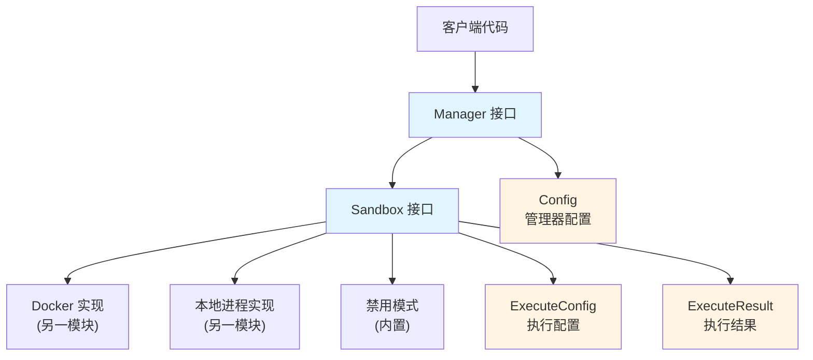

# Sandbox 合约与执行模型

## 概述

`sandbox_contracts_and_execution_models` 模块是整个系统安全执行不可信代码的核心契约层。它定义了一套标准化的接口和数据结构，用于在隔离环境中执行脚本，同时提供多种沙箱后端（Docker、本地进程）和灵活的安全策略。

想象一下，这个模块就像是一个"安全实验室"的建筑规范和设备接口。它不直接建造实验室，而是规定了实验室必须具备的功能：能够安全地运行危险实验、限制资源使用、提供统一的操作界面。具体的实验室建造则由其他模块（如 [docker_based_sandbox_runtime](platform_infrastructure_and_runtime-sandbox_execution_and_script_safety-sandbox_runtime_implementations-docker_based_sandbox_runtime.md) 和 [local_process_sandbox_runtime](platform_infrastructure_and_runtime-sandbox_execution_and_script_safety-sandbox_runtime_implementations-local_process_sandbox_runtime.md)）来完成。

## 架构



这个模块的设计遵循了清晰的关注点分离原则：

1. **接口层**：`Sandbox` 和 `Manager` 接口定义了核心能力
2. **配置层**：`Config` 和 `ExecuteConfig` 分别控制沙箱管理器和单次执行的行为
3. **结果层**：`ExecuteResult` 统一封装执行结果和状态
4. **枚举与常量**：定义沙箱类型、默认值和标准错误

## 核心组件深度解析

### Sandbox 接口

```go
type Sandbox interface {
    Execute(ctx context.Context, config *ExecuteConfig) (*ExecuteResult, error)
    Cleanup(ctx context.Context) error
    Type() SandboxType
    IsAvailable(ctx context.Context) bool
}
```

**设计意图**：这是整个模块的核心抽象，它将"执行不可信代码"这一复杂任务简化为四个基本操作。接口设计的精妙之处在于它既足够强大（能支持多种实现），又足够简单（易于理解和实现）。

- **Execute**：核心执行方法，接收上下文和执行配置，返回执行结果。注意它接收 `context.Context`，这使得执行可以被取消或超时控制。
- **Cleanup**：资源释放方法，这是一个重要的设计——沙箱执行可能会消耗资源（如 Docker 容器、临时文件），显式的 Cleanup 方法确保资源能被及时回收。
- **Type**：返回沙箱类型，用于调试和决策。
- **IsAvailable**：可用性检查，这是一个实用的设计，允许管理器在运行时检测沙箱是否可用（例如 Docker 是否正在运行）。

### Manager 接口

```go
type Manager interface {
    Execute(ctx context.Context, config *ExecuteConfig) (*ExecuteResult, error)
    Cleanup(ctx context.Context) error
    GetSandbox() Sandbox
    GetType() SandboxType
}
```

**设计意图**：Manager 是 Sandbox 的更高层次抽象，它引入了策略和回退机制。如果说 Sandbox 是"单个实验室"，Manager 就是"实验室管理中心"。

- 它复用了 Sandbox 的 Execute 和 Cleanup 方法，保持接口一致性
- GetSandbox 和 GetType 允许访问底层沙箱信息，便于调试和监控
- Manager 的存在使得沙箱选择、回退逻辑等可以封装在内部，客户端无需关心

### ExecuteConfig 结构体

```go
type ExecuteConfig struct {
    Script string
    Args []string
    WorkDir string
    Timeout time.Duration
    Env map[string]string
    AllowedCmds []string
    AllowNetwork bool
    MemoryLimit int64
    CPULimit float64
    ReadOnlyRootfs bool
    Stdin string
    SkipValidation bool
    ScriptContent string
}
```

**设计意图**：这个结构体是单次沙箱执行的"配方"。它的设计体现了两个重要原则：

1. **安全优先**：默认情况下是受限的，需要显式开启权限（如 AllowNetwork）
2. **渐进式配置**：提供合理的默认值，同时允许精细控制

让我们看几个关键字段的设计考量：

- **Script + ScriptContent**：既支持文件路径，也支持直接提供内容，这种灵活性很实用
- **AllowedCmds**：白名单机制，这是比黑名单更安全的设计
- **SkipValidation**：提供"紧急出口"，但命名清晰地警示了风险
- **Docker 特定字段**（AllowNetwork、MemoryLimit 等）：虽然标注了 Docker only，但放在通用配置中，这是一个权衡——简化了接口，但要求非 Docker 实现合理处理这些字段

### ExecuteResult 结构体

```go
type ExecuteResult struct {
    Stdout string
    Stderr string
    ExitCode int
    Duration time.Duration
    Killed bool
    Error string
}
```

**设计意图**：这是执行结果的统一封装，它不仅仅返回输出，还返回了丰富的元数据。特别值得注意的是：

- **Killed 字段**：区分"正常失败"和"被强制终止"（如超时、OOM），这对于调试和安全监控很重要
- **Error 字段**：与 Go 的错误返回不同，这个 Error 字段捕获的是执行过程中的错误，而不是沙箱系统本身的错误
- **Duration**：性能监控的基础数据

#### 辅助方法

```go
func (r *ExecuteResult) IsSuccess() bool {
    return r.ExitCode == 0 && !r.Killed && r.Error == ""
}

func (r *ExecuteResult) GetOutput() string {
    if r.Stdout != "" {
        return r.Stdout
    }
    return r.Stderr
}
```

这些方法是"便利 API"的典范——它们封装了常见的判断逻辑，使客户端代码更简洁且不易出错。

### Config 结构体

```go
type Config struct {
    Type SandboxType
    FallbackEnabled bool
    DefaultTimeout time.Duration
    DockerImage string
    AllowedCommands []string
    AllowedPaths []string
    MaxMemory int64
    MaxCPU float64
}
```

**设计意图**：这是沙箱管理器的全局配置。与 ExecuteConfig 不同，Config 关注的是"策略"而非"单次执行"：

- **FallbackEnabled**：体现了"优雅降级"的设计思想——优先使用强隔离的 Docker，但如果不可用，退回到本地进程
- **AllowedCommands**：全局白名单，配合 ExecuteConfig 的 AllowedCmds，可以实现"全局默认 + 局部微调"的策略
- **MaxMemory/MaxCPU**：全局资源限制，防止单个沙箱耗尽系统资源

## 依赖分析

### 被依赖关系

这个模块是整个沙箱系统的基础，被以下模块依赖：

- [sandbox_runtime_implementations](platform_infrastructure_and_runtime-sandbox_execution_and_script_safety-sandbox_runtime_implementations.md)：实现 Sandbox 接口
- [sandbox_manager_and_fallback_control](platform_infrastructure_and_runtime-sandbox_execution_and_script_safety-sandbox_manager_and_fallback_control.md)：实现 Manager 接口
- [script_validation_and_safety_checks](platform_infrastructure_and_runtime-sandbox_execution_and_script_safety-script_validation_and_safety_checks.md)：使用 ExecuteConfig 进行安全检查

### 依赖关系

这个模块非常简洁，几乎不依赖其他模块（除了标准库），这是接口层设计的最佳实践——它应该是稳定的，不随实现细节变化。

## 设计决策与权衡

### 1. 接口 vs 具体实现分离

**决策**：将 Sandbox 定义为接口，具体实现放在其他模块。

**为什么这样做**：
- 支持多种隔离策略（Docker、本地进程、未来的 gVisor 等）
- 便于测试（可以 mock Sandbox 接口）
- 实现可以独立演进，不影响客户端代码

**权衡**：
- 增加了一层间接性
- 接口设计需要足够谨慎，因为修改接口成本很高

### 2. 白名单而非黑名单

**决策**：使用 AllowedCommands 白名单机制，而不是危险命令黑名单。

**为什么这样做**：
- 安全实践：默认禁止一切，只允许已知安全的操作
- 可维护性：黑名单需要不断更新，而白名单相对稳定
- 防御深度：即使有新的危险命令出现，默认也会被阻止

**权衡**：
- 灵活性降低：用户想使用新命令需要显式添加
- 配置复杂度：对于复杂场景，白名单可能会很长

### 3. 显式 Cleanup vs 隐式资源管理

**决策**：提供显式的 Cleanup 方法，而不是依赖 finalizer 或 GC。

**为什么这样做**：
- 及时性：资源可以在不再需要时立即释放
- 可控性：客户端可以决定何时释放资源
- 可靠性：不依赖 Go 的 GC 行为（GC 时机不确定）

**权衡**：
- 客户端需要记得调用 Cleanup（容易忘记）
- 增加了使用复杂度

**缓解措施**：通常可以通过在 Manager 中实现资源池或自动清理来缓解这个问题。

### 4. 将 Docker 特定字段放在通用配置中

**决策**：AllowNetwork、MemoryLimit 等 Docker 特定字段放在 ExecuteConfig 中，而不是单独的 DockerConfig。

**为什么这样做**：
- 简化 API：客户端不需要根据沙箱类型使用不同的配置
- 渐进式增强：这些字段在其他沙箱类型中也可能实现（例如本地进程也可以设置内存限制）
- 文档清晰：字段标注了 "Docker only"，明确了适用范围

**权衡**：
- 有些字段在某些沙箱类型中会被忽略，可能导致困惑
- 配置结构体显得臃肿

## 使用指南与示例

### 基本使用模式

虽然这个模块主要是接口定义，但了解如何使用这些接口很重要：

```go
// 1. 创建管理器配置
config := sandbox.DefaultConfig()
config.Type = sandbox.SandboxTypeDocker
config.FallbackEnabled = true

// 2. 创建管理器（通常由其他模块提供）
manager := createSandboxManager(config)

// 3. 准备执行配置
execConfig := &sandbox.ExecuteConfig{
    Script:  "/path/to/script.py",
    Timeout: 30 * time.Second,
    Args:    []string{"arg1", "arg2"},
}

// 4. 执行脚本
result, err := manager.Execute(ctx, execConfig)
if err != nil {
    // 处理沙箱系统错误（不是脚本错误）
    log.Fatal(err)
}

// 5. 检查执行结果
if result.IsSuccess() {
    fmt.Println("Output:", result.GetOutput())
} else {
    fmt.Println("Error:", result.Error)
    fmt.Println("Stderr:", result.Stderr)
}

// 6. 清理资源
defer manager.Cleanup(ctx)
```

### 安全最佳实践

1. **永远不要跳过验证**，除非你完全信任脚本来源
2. **使用白名单**，而不是依赖默认值
3. **设置合理的超时和资源限制**
4. **尽量使用只读文件系统**（ReadOnlyRootfs: true）
5. **除非必要，否则禁用网络访问**（AllowNetwork: false）

## 边缘情况与陷阱

### 1. 错误的两层含义

注意 Execute 方法返回两个错误：
- 方法返回的 `error`：沙箱系统本身的错误（如无法创建容器）
- ExecuteResult 中的 `Error`：脚本执行过程中的错误

这是一个常见的混淆点，需要仔细区分。

### 2. SkipValidation 的风险

设置 `SkipValidation: true` 就像打开了保险箱——如果你确定里面的东西安全，没问题，但如果有任何疑问，千万不要这样做。

### 3. 资源泄漏

忘记调用 Cleanup 可能导致资源泄漏（Docker 容器、临时文件等）。始终使用 `defer` 来确保清理。

### 4. 路径问题

Script 字段需要是绝对路径。相对路径可能会在不同的沙箱实现中有不同的行为。

### 5. 环境变量隔离

Env 字段提供的环境变量是"附加"的，不是"唯一"的。不要依赖环境变量来传递敏感信息——沙箱实现可能会继承一些系统环境变量。

## 扩展点

这个模块设计了几个清晰的扩展点：

1. **实现新的 Sandbox**：只要实现 Sandbox 接口，就可以添加新的隔离机制（如 gVisor、Firecracker 等）
2. **实现自定义 Manager**：可以创建有特殊策略的 Manager（如基于负载选择沙箱、基于内容路由等）
3. **扩展 ExecuteConfig**：虽然不建议修改这个模块，但可以通过组合的方式创建更丰富的配置

## 相关模块

- [sandbox_runtime_implementations](platform_infrastructure_and_runtime-sandbox_execution_and_script_safety-sandbox_runtime_implementations.md)：沙箱的具体实现
- [sandbox_manager_and_fallback_control](platform_infrastructure_and_runtime-sandbox_execution_and_script_safety-sandbox_manager_and_fallback_control.md)：管理器实现
- [script_validation_and_safety_checks](platform_infrastructure_and_runtime-sandbox_execution_and_script_safety-script_validation_and_safety_checks.md)：安全验证逻辑
