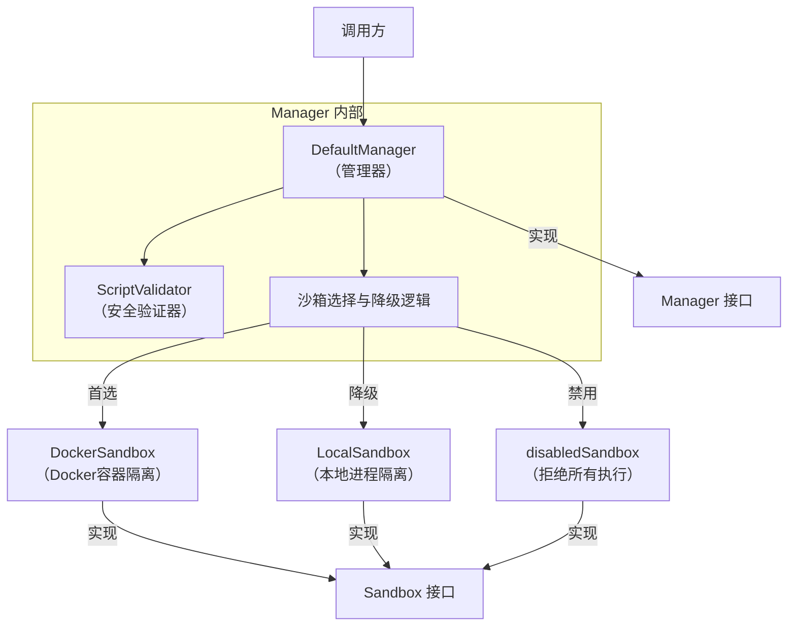

# Sandbox Manager and Fallback Control 模块深度解析

## 1. 模块概述

### 1.1 问题背景与存在意义

想象一下，你需要构建一个允许用户执行自定义脚本的系统——这可能是AI辅助编程平台、代码执行沙箱、或者数据分析工具。这里的核心困境是：**你需要执行不受信任的代码，但又不能让它破坏你的系统**。

直接执行用户脚本是极其危险的：恶意代码可能会删除文件、窃取机密、发起网络攻击，或者耗尽系统资源。一个简单的 `rm -rf /` 就能造成灾难性后果。

这就是 `sandbox_manager_and_fallback_control` 模块要解决的问题。它作为系统的"安全门卫"，负责：
- 为不受信任的脚本提供隔离的执行环境
- 在执行前进行全面的安全检查
- 提供多种沙箱实现的灵活选择和降级策略
- 确保即使首选沙箱不可用，系统也能安全运行

### 1.2 核心设计理念

该模块的设计遵循"**深度防御**"（Defense in Depth）原则：
1. **验证层**：执行前对脚本、参数和输入进行全面安全检查
2. **隔离层**：使用容器或进程隔离技术限制脚本的访问权限
3. **资源限制层**：控制CPU、内存和执行时间，防止资源耗尽攻击
4. **降级层**：当首选隔离方案不可用时，自动切换到次优但仍安全的方案

## 2. 架构设计与核心组件

### 2.1 整体架构图



### 2.2 核心组件角色与职责

#### 2.2.1 DefaultManager - 核心协调器

`DefaultManager` 是整个模块的"大脑"，负责：
- 初始化和配置沙箱环境
- 执行前的安全验证协调
- 沙箱的选择和降级逻辑
- 提供统一的执行接口

关键设计点：
- **线程安全**：使用 `sync.RWMutex` 保护沙箱实例的访问，确保并发安全
- **惰性初始化**：在创建时就确定好沙箱类型，避免运行时决策延迟
- **异步预加载**：对于 Docker 沙箱，异步预拉取镜像，提高首次执行性能

#### 2.2.2 Sandbox 接口 - 隔离抽象

`Sandbox` 接口定义了所有沙箱实现必须遵守的契约：
```go
type Sandbox interface {
    Execute(ctx context.Context, config *ExecuteConfig) (*ExecuteResult, error)
    Cleanup(ctx context.Context) error
    Type() SandboxType
    IsAvailable(ctx context.Context) bool
}
```

这是**策略模式**的典型应用，使得不同的隔离策略可以互换使用。

#### 2.2.3 三种沙箱实现

1. **DockerSandbox**：最强隔离方案
   - 使用 Docker 容器提供完全隔离的环境
   - 支持资源限制（CPU、内存）、网络控制、文件系统只读等安全特性
   - 作为非 root 用户运行，丢弃所有能力（capabilities）

2. **LocalSandbox**：降级隔离方案
   - 使用本地进程，通过命令白名单、工作目录限制、环境变量过滤提供基本安全
   - 始终可用，作为 Docker 不可用时的后备选项
   - 安全级别较低，但仍比直接执行安全得多

3. **disabledSandbox**：安全默认值
   - 拒绝所有执行请求，是最安全的选项
   - 用于配置明确禁用脚本执行的场景

#### 2.2.4 ScriptValidator - 安全验证器

这是模块的"安全检查官"，负责在执行前扫描：
- 脚本内容：查找危险命令、恶意模式、网络访问尝试、反向 Shell 等
- 命令参数：检测注入攻击
- 标准输入：查找嵌入式 Shell 命令

验证规则非常全面，包括：
- 40+ 种危险命令（如 `rm -rf /`、`mkfs`、`shutdown` 等）
- 30+ 种危险模式（如 Base64 解码、代码下载执行、`eval()`、Pickle 反序列化等）
- 20+ 种网络访问工具检测
- 多种反向 Shell 模式检测
- 10+ 种参数注入模式

## 3. 数据流程与核心操作

### 3.1 初始化流程

初始化是模块最关键的阶段之一，决定了后续使用哪种隔离策略：

```
NewManager(config)
    ↓
ValidateConfig(config)  [配置验证]
    ↓
创建 DefaultManager 实例
    ↓
initializeSandbox()  [沙箱选择]
    ├─→ 类型是 Disabled? → 创建 disabledSandbox
    ├─→ 类型是 Docker? 
    │   └─→ Docker 可用? 
    │       ├─→ 是 → 创建 DockerSandbox，异步预拉取镜像
    │       └─→ 否 → 降级启用? → 是 → 创建 LocalSandbox
    └─→ 类型是 Local? → 创建 LocalSandbox
```

**设计亮点**：
- Docker 镜像预拉取是异步的，不会阻塞初始化流程
- 降级决策是在初始化时做出的，而不是每次执行时，提高了运行时效率

### 3.2 脚本执行流程

这是模块的核心执行路径：

```
Execute(ctx, config)
    ↓
获取当前沙箱（读锁保护）
    ↓
沙箱禁用? → 返回 ErrSandboxDisabled
    ↓
跳过验证? → 否 → validateExecution()
    │               ├─→ 读取脚本内容（文件或直接提供）
    │               ├─→ ValidateScript()  [脚本内容验证]
    │               ├─→ ValidateArgs()    [参数验证]
    │               └─→ ValidateStdin()   [标准输入验证]
    ↓
沙箱.Execute()  [实际执行]
    ↓
返回 ExecuteResult
```

**关键安全点**：
- 即使沙箱提供了强隔离，验证层仍然作为第一道防线
- 验证是在管理器层进行的，而不是委托给沙箱，确保验证逻辑一致
- 验证失败时会记录所有错误，但只返回第一个错误，避免信息泄露

## 4. 设计决策与权衡

### 4.1 为什么需要管理器层，而不是直接使用沙箱？

**设计选择**：引入 `Manager` 接口和 `DefaultManager` 实现，而不是让调用者直接使用具体的沙箱。

**原因**：
1. **统一接口**：管理器提供了单一的入口点，隐藏了沙箱选择和降级的复杂性
2. **验证职责**：将安全验证逻辑集中在管理器层，确保所有沙箱实现都受益于相同的验证
3. **灵活性**：可以在不改变调用者代码的情况下，更改沙箱选择策略或添加新的沙箱类型

**权衡**：
- ✅ 优点：降低了调用者的复杂度，提供了一致的安全保障
- ⚠️ 缺点：增加了一层抽象，可能会让简单场景显得过度设计

### 4.2 降级策略：为什么选择 LocalSandbox 作为 Docker 的后备？

**设计选择**：当 Docker 不可用时，降级到 LocalSandbox（如果启用），而不是直接失败。

**原因**：
1. **可用性优先**：在许多场景下，即使是较弱的隔离也比完全无法执行要好
2. **深度防御**：即使使用 LocalSandbox，验证层仍然会阻止明显的恶意代码
3. **开发友好**：在开发环境中，Docker 可能不可用，但仍需要测试脚本执行功能

**权衡**：
- ✅ 优点：提高了系统的可用性和环境适应性
- ⚠️ 缺点：LocalSandbox 的安全级别较低，需要确保调用者了解这种降级的安全含义

**关键设计**：降级决策是可配置的（`FallbackEnabled`），让安全敏感的场景可以禁用降级。

### 4.3 验证设计：为什么在执行前验证，而不是依赖沙箱隔离？

**设计选择**：在执行脚本前进行全面的安全验证，即使沙箱已经提供了隔离。

**原因**：
1. **深度防御**：安全最佳实践是多层防御，而不是依赖单一机制
2. **提前拒绝**：在消耗资源启动沙箱之前就拒绝明显的恶意代码，提高效率
3. **一致保护**：为所有沙箱类型（包括安全级别较低的 LocalSandbox）提供相同的验证

**权衡**：
- ✅ 优点：提供了额外的安全层，提前阻止恶意代码
- ⚠️ 缺点：验证不是万无一失的，可能会有误报或漏报；增加了执行前的开销

**关键设计**：提供了 `SkipValidation` 选项，允许在完全信任脚本的场景下跳过验证（但强烈建议不要这样做）。

### 4.4 并发模型：为什么使用 RWMutex？

**设计选择**：使用 `sync.RWMutex` 而不是 `sync.Mutex` 来保护沙箱访问。

**原因**：
- 沙箱实例在初始化后很少改变（几乎是只读的）
- 执行操作是频繁的，且只需要读取沙箱引用
- 使用读写锁可以让多个执行并发进行，而不会相互阻塞

**权衡**：
- ✅ 优点：读操作并发性能好
- ⚠️ 缺点：代码稍复杂，需要正确管理锁的获取和释放

### 4.5 Docker 镜像预拉取：为什么异步？

**设计选择**：在初始化 DockerSandbox 时，异步预拉取镜像，而不是同步等待。

**原因**：
1. **启动性能**：拉取镜像可能需要几分钟，不应该阻塞服务启动
2. **容错**：即使预拉取失败，服务仍然可以启动（首次执行时会尝试拉取）
3. **用户体验**：首次执行时镜像已准备好，不会有长时间等待

**权衡**：
- ✅ 优点：提高了启动速度和用户体验
- ⚠️ 缺点：如果预拉取失败，首次执行仍会有延迟；需要正确处理异步错误（仅记录日志）

## 5. 依赖关系与契约

### 5.1 依赖关系

该模块的依赖关系非常清晰，保持了良好的封装性：

- **向下依赖**：
  - 依赖 `docker` 命令行工具（用于 DockerSandbox）
  - 依赖操作系统的进程执行能力（用于 LocalSandbox）
  - 依赖 Go 标准库（`context`、`sync`、`os/exec` 等）

- **向上依赖**：
  - 被需要执行不受信任脚本的组件调用，可能是 AI 代理执行引擎、代码执行服务等

### 5.2 关键契约

#### 5.2.1 Manager 接口契约

```go
type Manager interface {
    // Execute 执行脚本，返回执行结果或错误
    // 契约：
    // - 如果沙箱禁用，返回 ErrSandboxDisabled
    // - 如果验证失败，返回 ErrSecurityViolation/ErrArgInjection/ErrStdinInjection
    // - 执行成功返回 ExecuteResult，IsSuccess() 为 true
    Execute(ctx context.Context, config *ExecuteConfig) (*ExecuteResult, error)
    
    // Cleanup 释放所有资源
    // 契约：可以被多次调用，应该是幂等的
    Cleanup(ctx context.Context) error
    
    // GetSandbox 返回当前活动的沙箱
    GetSandbox() Sandbox
    
    // GetType 返回当前沙箱类型
    GetType() SandboxType
}
```

#### 5.2.2 ExecuteConfig 契约

使用 `ExecuteConfig` 时需要注意：
- `Script` 必须是绝对路径
- `ScriptContent` 可以选择性提供，避免从文件读取
- `SkipValidation` 应谨慎使用，仅用于完全信任的脚本
- Docker 特定选项（如 `MemoryLimit`、`CPULimit`）在使用 LocalSandbox 时会被忽略

#### 5.2.3 隐式契约

- **路径安全**：脚本路径应该是安全的，不包含路径遍历
- **超时处理**：调用者应该处理 `ErrTimeout`，这表示脚本执行时间过长
- **上下文取消**：调用者可以通过取消 context 来中止执行

## 6. 使用指南与最佳实践

### 6.1 基本使用

#### 创建管理器

```go
// 使用默认配置创建（本地沙箱，启用降级）
manager, err := sandbox.NewManager(nil)

// 使用 Docker 沙箱，启用降级
config := sandbox.DefaultConfig()
config.Type = sandbox.SandboxTypeDocker
config.FallbackEnabled = true
manager, err := sandbox.NewManager(config)

// 创建禁用的管理器（最安全）
manager := sandbox.NewDisabledManager()
```

#### 执行脚本

```go
config := &sandbox.ExecuteConfig{
    Script:        "/path/to/script.py",
    Args:          []string{"arg1", "arg2"},
    Timeout:       30 * time.Second,
    ScriptContent: "# 可以直接提供脚本内容，避免文件读取",
}

result, err := manager.Execute(ctx, config)
if err != nil {
    // 处理错误
    if errors.Is(err, sandbox.ErrSecurityViolation) {
        log.Println("安全验证失败")
    }
    return
}

if result.IsSuccess() {
    fmt.Println("输出:", result.GetOutput())
} else {
    fmt.Println("执行失败，退出码:", result.ExitCode)
    fmt.Println("错误:", result.Error)
}
```

### 6.2 配置最佳实践

#### 安全敏感场景

```go
config := sandbox.DefaultConfig()
config.Type = sandbox.SandboxTypeDocker  // 最强隔离
config.FallbackEnabled = false             // 不接受降级
config.MaxMemory = 512 * 1024 * 1024     // 512MB 内存限制
config.MaxCPU = 0.5                         // 0.5 CPU 核心
```

#### 开发环境

```go
config := sandbox.DefaultConfig()
config.Type = sandbox.SandboxTypeLocal   // 快速，不需要 Docker
config.FallbackEnabled = true
```

### 6.3 扩展与定制

虽然该模块设计为相对自包含，但有几个扩展点：

1. **自定义验证规则**：可以创建自定义的 `ScriptValidator`，添加或修改验证规则
2. **新的沙箱实现**：通过实现 `Sandbox` 接口，可以添加新的隔离策略（如 gVisor、Kata Containers 等）
3. **自定义管理器**：通过实现 `Manager` 接口，可以完全替换沙箱选择和管理逻辑

## 7. 边缘情况与陷阱

### 7.1 常见陷阱

1. **过度信任验证**：
   - ❌ 错误：认为验证可以阻止所有恶意代码
   - ✅ 正确：验证只是第一层防御，仍然需要沙箱隔离

2. **跳过验证**：
   - ❌ 错误：为了方便，总是设置 `SkipValidation: true`
   - ✅ 正确：仅在完全控制脚本内容且信任来源时才跳过

3. **忽略错误类型**：
   - ❌ 错误：将所有错误都视为执行失败
   - ✅ 正确：区分 `ErrSecurityViolation`（安全问题）和其他错误（执行问题）

### 7.2 边缘情况

1. **Docker 不可用但降级禁用**：
   - 场景：配置了 Docker 沙箱，但 Docker 未运行，且 `FallbackEnabled: false`
   - 结果：`NewManager()` 会返回错误
   - 处理：检查错误，考虑是否启用降级或使用不同的配置

2. **脚本既提供文件路径又提供内容**：
   - 场景：同时设置了 `Script` 和 `ScriptContent`
   - 结果：`ScriptContent` 会被用于验证，`Script` 路径仍会被用于执行
   - 注意：确保两者一致，否则可能导致验证和实际执行不一致

3. **超时时间为 0**：
   - 场景：设置 `Timeout: 0`
   - 结果：使用默认超时（60 秒）
   - 设计：这是有意的，避免无限制执行

## 8. 总结

`sandbox_manager_and_fallback_control` 模块是一个精心设计的安全组件，它通过多层防御策略解决了执行不受信任代码的难题。它的核心价值在于：

1. **灵活的隔离策略选择**：从最强的 Docker 容器到基本的本地进程，适应不同的安全需求和环境
2. **智能的降级机制**：在保持安全的前提下，最大限度地提高系统可用性
3. **全面的安全验证**：作为第一道防线，提前阻止明显的恶意代码
4. **简洁的统一接口**：隐藏了复杂的沙箱管理逻辑，让调用者可以轻松集成

这个模块是"安全默认值"（Secure by Default）设计原则的很好体现：它的默认配置是相对安全的，同时提供了足够的灵活性让用户根据自己的需求进行调整。

对于新加入团队的开发者，理解这个模块的关键是把握"深度防御"和"降级策略"这两个核心思想——这不仅是这个模块的设计精髓，也是构建安全系统的普遍原则。
