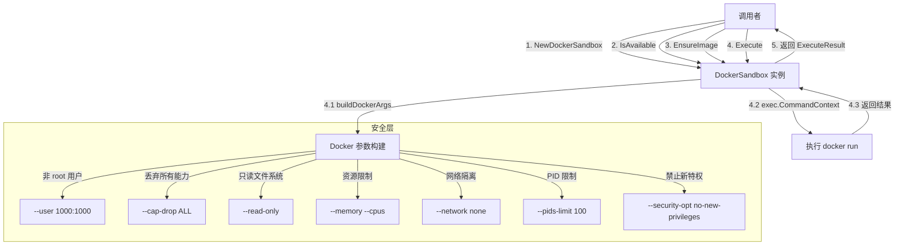

# Docker 沙箱运行时技术深度解析

## 1. 为什么需要这个模块？

在安全执行不可信脚本的场景中，我们面临着一个核心挑战：如何在一个可控、隔离的环境中运行用户提供的代码，同时防止恶意代码对宿主系统造成破坏。

想象一下，你需要执行来自用户的 Python、JavaScript 或 Shell 脚本。一个天真的做法是直接在宿主系统上运行这些脚本，但这会带来灾难性的安全风险——脚本可以读取文件系统、访问网络、消耗资源，甚至执行系统命令。

这就是 `docker_based_sandbox_runtime` 模块存在的原因。它通过 Docker 容器提供了一层强大的隔离屏障，就像为每个脚本执行创建了一个独立的"安全舱"。这个模块的设计洞见是：利用 Docker 容器的隔离特性，结合精心设计的安全配置，在保持执行灵活性的同时，将风险限制在容器内部。

## 2. 核心抽象与心智模型

理解这个模块的关键在于持有三个核心抽象：

### 2.1 沙箱即安全容器
把 `DockerSandbox` 想象成一个**智能安全舱**。它不仅仅是一个简单的 Docker 包装器，而是一个经过精心配置的隔离环境：
- **只读文件系统**：防止脚本修改容器内部
- **非 root 用户**：限制权限，防止提权攻击
- **资源限制**：防止资源耗尽攻击
- **网络隔离**：默认禁止网络访问

### 2.2 执行配置即安全策略
`ExecuteConfig` 不是一个简单的参数集合，而是一个**安全策略配置文件**。每个字段都对应着一个安全决策：
- `ReadOnlyRootfs`：决定是否启用最严格的文件系统隔离
- `AllowNetwork`：控制网络访问权限
- `MemoryLimit`/`CPULimit`：设置资源使用边界
- `Timeout`：定义执行时间窗口

### 2.3 生命周期管理即资源契约
模块通过 `IsAvailable`、`EnsureImage`、`Execute`、`Cleanup` 等方法定义了一个清晰的**资源生命周期契约**，确保：
- Docker 环境可用
- 所需镜像已准备就绪
- 执行过程可控
- 资源得到妥善清理

## 3. 架构与数据流程

让我们通过一个 Mermaid 图来可视化整个执行流程：



### 3.1 核心组件解析

#### 3.1.1 `DockerSandbox` 结构体
这是模块的核心，它封装了 Docker 沙箱的所有功能。它的设计非常简洁——只持有一个 `config` 指针，这种设计有几个重要考虑：

1. **配置即策略**：所有行为都由配置驱动，便于测试和定制
2. **无状态设计**：实例本身不保存执行状态，所有状态都在执行上下文中
3. **可重用性**：同一个实例可以多次执行不同的脚本

#### 3.1.2 关键方法解析

**`NewDockerSandbox(config *Config) *DockerSandbox`**
- **目的**：创建一个新的 Docker 沙箱实例
- **设计意图**：提供合理的默认值，确保即使传入 nil 配置也能正常工作
- **关键细节**：如果 `DockerImage` 为空，会使用 `DefaultDockerImage`，这确保了模块的即开即用性

**`IsAvailable(ctx context.Context) bool`**
- **目的**：检查 Docker 是否可用
- **设计意图**：让调用者可以在初始化时验证环境，而不是等到执行时才发现问题
- **实现方式**：执行 `docker version` 命令，这种方式简单但有效

**`EnsureImage(ctx context.Context) error`**
- **目的**：确保所需的 Docker 镜像存在
- **设计意图**：将镜像拉取这个潜在耗时的操作从执行路径中分离出来，让初始化阶段处理
- **用户体验考量**：这样可以避免第一次执行脚本时因为拉取镜像而导致的长时间等待

**`Execute(ctx context.Context, config *ExecuteConfig) (*ExecuteResult, error)`**
这是模块的核心方法，让我们深入分析其执行流程：

1. **参数验证**：首先检查 `config` 是否为 nil，这是防御性编程的体现
2. **超时处理**：建立三层超时机制（执行配置 → 沙箱配置 → 默认值），确保总有一个合理的超时
3. **上下文管理**：创建带超时的上下文，确保执行可以被正确取消
4. **命令构建**：通过 `buildDockerArgs` 构建完整的 Docker 命令
5. **执行与捕获**：执行命令并捕获 stdout、stderr
6. **结果处理**：根据执行结果构建 `ExecuteResult`，特别处理超时和退出码

这里有一个精妙的设计细节：即使命令执行失败，也会返回 `ExecuteResult`，这样调用者可以获得 stdout/stderr 进行调试，而不是只得到一个错误。

**`buildDockerArgs(config *ExecuteConfig) []string`**
这个方法是整个安全策略的核心，让我们逐一解析其安全设计：

1. **自动清理**：使用 `--rm` 标志，确保容器执行后自动删除，防止资源泄漏
2. **非 root 用户**：`--user 1000:1000` 以非特权用户运行，这是最小权限原则的体现
3. **能力丢弃**：`--cap-drop ALL` 移除所有 Linux 能力，即使容器被攻破，攻击者也没有特权操作
4. **只读文件系统**：可选的 `--read-only` 标志，配合 `/tmp` 的 tmpfs 挂载，提供最强的文件系统隔离
5. **资源限制**：内存和 CPU 限制，防止资源耗尽攻击
6. **网络隔离**：默认 `--network none`，除非明确允许网络访问
7. **PID 限制**：`--pids-limit 100` 防止 fork 炸弹
8. **特权限制**：`--security-opt no-new-privileges` 防止通过 setuid/setgid 提权
9. **只读挂载**：脚本目录以只读方式挂载，防止脚本修改宿主文件

每一个安全选项都不是随意添加的，而是针对特定攻击面的防御。

**`getInterpreter(scriptName string) string`**
这个看似简单的方法体现了模块的用户友好设计：根据文件扩展名自动选择合适的解释器，让调用者不需要关心底层细节。

## 4. 依赖分析

### 4.1 依赖的模块

这个模块的设计非常克制，依赖极少：

1. **内部契约**：依赖同层级的 `sandbox_contracts_and_execution_models` 模块定义的 `Sandbox` 接口、`Config`、`ExecuteConfig`、`ExecuteResult` 等类型
2. **标准库**：仅使用 Go 标准库，没有第三方依赖
3. **外部命令**：依赖系统中的 `docker` 命令行工具

这种极简依赖设计是有意为之的，它带来了几个好处：
- **可移植性**：不依赖特定的 Docker SDK，只要有 Docker CLI 就能工作
- **稳定性**：标准库和 Docker CLI 的兼容性有保障
- **简单性**：代码容易理解和维护

### 4.2 被依赖的模块

根据模块树，这个模块被 `sandbox_manager_and_fallback_control` 模块使用，这表明：
- 它是沙箱策略的一个实现选项
- 可能存在其他沙箱实现（如 [local_process_sandbox_runtime](platform_infrastructure_and_runtime-sandbox_execution_and_script_safety-sandbox_runtime_implementations-local_process_sandbox_runtime.md)）
- `sandbox_manager` 可能会根据环境或配置选择合适的沙箱实现

## 5. 设计权衡与决策

在这个模块的设计中，我们可以看到几个关键的权衡：

### 5.1 Docker CLI vs Docker SDK
**选择**：使用 Docker CLI 而不是官方 Docker SDK
**原因**：
- 简单性：CLI 调用比 SDK 更直接，代码更少
- 兼容性：CLI 接口比 SDK 更稳定
- 调试友好：可以直接复制命令在终端执行，便于调试
**代价**：
- 需要解析 CLI 输出（虽然在这个实现中没有复杂的解析）
- 依赖系统中的 Docker 命令

### 5.2 安全与灵活性的平衡
**选择**：默认采用最严格的安全配置，但允许通过参数调整
**原因**：
- 安全优先：默认情况下提供最强的保护
- 灵活性：让用户在需要时可以放宽限制
**体现**：
- 默认网络隔离，但可以通过 `AllowNetwork` 开启
- 默认可以写文件系统，但可以通过 `ReadOnlyRootfs` 启用只读模式

### 5.3 配置层叠策略
**选择**：三层配置机制（执行配置 → 沙箱配置 → 默认值）
**原因**：
- 细粒度控制：单次执行可以覆盖全局配置
- 合理默认：即使不配置任何参数也能安全使用
- 渐进式配置：可以从默认值开始，逐步根据需要调整

### 5.4 同步执行模型
**选择**：采用同步阻塞的执行模型
**原因**：
- 简单性：异步模型会增加复杂度
- 接口清晰：调用者可以明确知道何时执行完成
- 上下文可控：通过 `context.Context` 仍然可以取消执行
**代价**：
- 调用者需要自己处理并发（如果需要）

## 6. 使用指南与示例

### 6.1 基本使用

```go
// 创建沙箱实例
sandbox := NewDockerSandbox(nil) // 使用默认配置

// 检查 Docker 是否可用
if !sandbox.IsAvailable(context.Background()) {
    log.Fatal("Docker 不可用")
}

// 确保镜像存在
if err := sandbox.EnsureImage(context.Background()); err != nil {
    log.Fatalf("无法获取镜像: %v", err)
}

// 准备执行配置
config := &ExecuteConfig{
    Script:        "/path/to/script.py",
    Timeout:       30 * time.Second,
    ReadOnlyRootfs: true,
    MemoryLimit:   512 * 1024 * 1024, // 512MB
    CPULimit:      0.5, // 0.5 个 CPU
}

// 执行脚本
result, err := sandbox.Execute(context.Background(), config)
if err != nil {
    log.Printf("执行出错: %v", err)
}

// 处理结果
fmt.Printf("Stdout: %s\n", result.Stdout)
fmt.Printf("Stderr: %s\n", result.Stderr)
fmt.Printf("退出码: %d\n", result.ExitCode)
fmt.Printf("执行时间: %v\n", result.Duration)
if result.Killed {
    fmt.Println("执行被终止（超时）")
}
```

### 6.2 自定义配置

```go
// 创建自定义配置
config := &Config{
    DockerImage:   "my-custom-sandbox:latest",
    DefaultTimeout: 60 * time.Second,
    MaxMemory:     1024 * 1024 * 1024, // 1GB
    MaxCPU:        1.0, // 1 个 CPU
}

sandbox := NewDockerSandbox(config)
```

### 6.3 支持的脚本类型

模块通过文件扩展名自动选择解释器：
- `.py` → `python3`
- `.sh`, `.bash` → `bash`
- `.js` → `node`
- `.rb` → `ruby`
- `.pl` → `perl`
- 其他 → `sh`

## 7. 注意事项与常见陷阱

### 7.1 文件系统挂载的边界
- **问题**：脚本目录被以只读方式挂载到 `/workspace`，但脚本可能尝试访问其他路径
- **影响**：如果脚本依赖特定的绝对路径，可能会失败
- **解决**：确保脚本使用相对路径，或在自定义镜像中预置必要的目录结构

### 7.2 超时与上下文取消的区别
- **超时**：由 `ExecuteConfig.Timeout` 控制，会设置 `result.Killed = true` 和 `result.Error = ErrTimeout.Error()`
- **上下文取消**：由调用者通过 `context.Context` 控制，会返回一个普通的错误，不会设置 `Killed` 标志
- **注意**：两者都会终止执行，但处理方式不同

### 7.3 资源限制的实际效果
- **内存限制**：Docker 会尝试限制内存，但在某些系统上可能不会严格强制执行
- **CPU 限制**：是相对权重，不是绝对的时间分片
- **建议**：在实际环境中测试资源限制的效果

### 7.4 镜像的安全考虑
- **问题**：模块的安全性依赖于使用的 Docker 镜像
- **风险**：如果镜像包含漏洞或恶意软件，沙箱的保护会被削弱
- **最佳实践**：
  - 使用最小化的基础镜像
  - 定期更新镜像以包含安全补丁
  - 扫描镜像中的漏洞
  - 不要使用未知来源的镜像

### 7.5 并发执行的考虑
- `DockerSandbox` 实例本身是无状态的，可以并发使用
- 但是，Docker 守护进程本身有并发限制
- 建议：控制并发执行的数量，避免 overwhelm Docker 守护进程

## 8. 总结

`docker_based_sandbox_runtime` 模块是一个精心设计的安全执行环境，它通过 Docker 容器提供了强大的隔离能力。它的设计体现了几个重要的原则：

1. **安全优先**：默认采用最严格的安全配置
2. **简单性**：极简的依赖和清晰的接口
3. **灵活性**：允许根据需要调整安全策略
4. **用户友好**：提供合理的默认值和自动配置

这个模块不是万能的——它不能防止所有可能的攻击，特别是如果 Docker 本身有漏洞或者使用的镜像不安全。但它确实提供了一层强大的防御，大大降低了执行不可信脚本的风险。

对于新加入团队的开发者来说，理解这个模块的关键是要看到它不仅仅是一个 Docker 包装器，而是一个完整的安全策略实现。每一个配置选项、每一个 Docker 参数都有其安全考虑，这些都是经过深思熟虑的设计决策。
