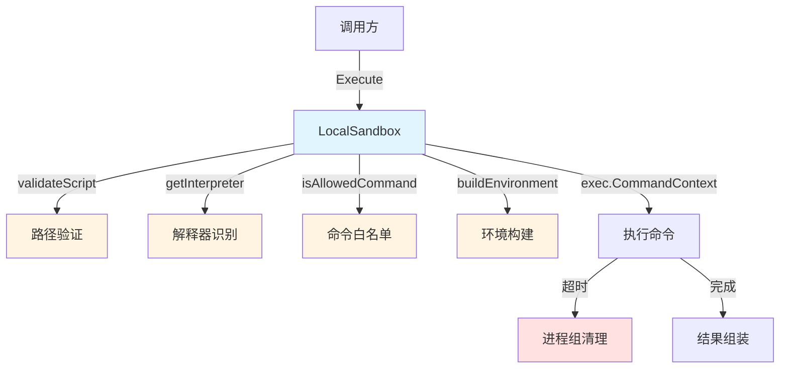

# Local Process Sandbox Runtime 技术深度解析

## 目录
1. [问题空间与解决方案](#问题空间与解决方案)
2. [架构设计与心智模型](#架构设计与心智模型)
3. [核心组件深度解析](#核心组件深度解析)
4. [数据流与执行流程](#数据流与执行流程)
5. [依赖关系分析](#依赖关系分析)
6. [设计决策与权衡](#设计决策与权衡)
7. [使用指南与最佳实践](#使用指南与最佳实践)
8. [边缘情况与注意事项](#边缘情况与注意事项)

---

## 问题空间与解决方案

### 为什么需要这个模块？

在构建安全的脚本执行环境时，我们面临着一个核心矛盾：**灵活性与安全性的平衡**。系统需要能够执行用户提交的脚本（如 Python、Shell 等），但同时必须防止恶意脚本对宿主系统造成危害。

传统的解决方案包括：
- **Docker 容器**：提供强隔离，但需要 Docker 守护进程运行，在某些环境中不可用
- **完全禁用脚本执行**：安全但牺牲了灵活性
- **无限制的本地执行**：灵活但极其危险

当 Docker 不可用时，我们需要一个轻量级的替代方案——这就是 `LocalSandbox` 的设计初衷。它不是完美的安全解决方案，而是在**可用性与安全性之间做出明智权衡**的实用选择。

### 解决的核心问题

1. **命令白名单控制**：只允许执行预定义的安全解释器
2. **工作目录限制**：防止脚本访问系统敏感路径
3. **超时强制执行**：避免脚本无限期占用资源
4. **环境变量过滤**：防止通过环境变量进行攻击
5. **进程组管理**：确保超时后能彻底清理所有子进程

---

## 架构设计与心智模型

### 核心抽象

将 `LocalSandbox` 想象成一个**带门禁的工作室**：
- **门禁检查**：验证脚本路径和解释器是否在白名单中（`validateScript`、`isAllowedCommand`）
- **工作室边界**：限制工作目录和环境变量（`buildEnvironment`、工作目录设置）
- **时间限制器**：确保会话不会无限期持续（超时机制）
- **紧急停止按钮**：超时后杀死整个进程组（进程组管理）

### 系统架构图



---

## 核心组件深度解析

### LocalSandbox 结构体

**设计意图**：作为沙箱执行的核心协调者，封装所有本地进程隔离逻辑。

```go
type LocalSandbox struct {
    config *Config
}
```

**关键特性**：
- 持有配置对象，允许灵活定制沙箱行为
- 实现了 `Sandbox` 接口，与 Docker 沙箱可互换使用

### NewLocalSandbox 工厂函数

```go
func NewLocalSandbox(config *Config) *LocalSandbox
```

**设计决策**：
- 接受可选的配置对象，`nil` 时使用默认配置
- 提供合理的默认值，降低使用门槛

### Execute 方法（核心执行逻辑）

这是模块的核心方法，负责协调整个执行流程。让我们分析其关键设计：

#### 1. 脚本验证阶段

```go
if err := s.validateScript(config.Script); err != nil {
    return nil, err
}
```

**设计意图**：在执行前进行严格的前置检查，防止路径遍历攻击和非法脚本执行。

#### 2. 解释器选择与验证

```go
interpreter := s.getInterpreter(config.Script)
if !s.isAllowedCommand(interpreter) {
    return nil, fmt.Errorf("interpreter not allowed: %s", interpreter)
}
```

**设计决策**：基于文件扩展名自动选择解释器，而不是让用户指定——这减少了攻击面。

#### 3. 超时机制

```go
timeout := config.Timeout
if timeout == 0 {
    timeout = s.config.DefaultTimeout
}
if timeout == 0 {
    timeout = DefaultTimeout
}

execCtx, cancel := context.WithTimeout(ctx, timeout)
defer cancel()
```

**设计意图**：三层超时配置（调用方→沙箱配置→全局默认），确保总有合理的超时限制。

#### 4. 进程组管理（关键安全设计）

```go
cmd.SysProcAttr = &syscall.SysProcAttr{
    Setpgid: true,
}
```

**为什么这样设计？**
- 脚本可能会创建子进程，如果只杀死主进程，子进程会变成孤儿进程继续运行
- 通过设置进程组 ID，我们可以一次性杀死整个进程树
- 这是本地沙箱中最关键的资源清理机制

#### 5. 超时后的清理

```go
if execCtx.Err() == context.DeadlineExceeded {
    if cmd.Process != nil {
        syscall.Kill(-cmd.Process.Pid, syscall.SIGKILL)
    }
    result.Killed = true
    result.Error = ErrTimeout.Error()
    result.ExitCode = -1
}
```

**注意**：使用 `-cmd.Process.Pid` 表示杀死整个进程组，而不仅仅是主进程。

### validateScript 方法

**设计意图**：确保脚本路径是安全的，符合预期的约束条件。

```go
func (s *LocalSandbox) validateScript(scriptPath string) error
```

**验证步骤**：
1. 检查文件是否存在且不是目录
2. 要求路径必须是绝对路径（防止相对路径遍历）
3. 如果配置了允许路径列表，验证脚本是否在允许路径内

**关键安全决策**：强制使用绝对路径——这是防止路径遍历攻击的基础防线。

### getInterpreter 方法

```go
func (s *LocalSandbox) getInterpreter(scriptPath string) string
```

**设计意图**：基于文件扩展名安全地选择解释器，而不是信任用户输入。

**支持的解释器**：
- `.py` → `python3`
- `.sh`, `.bash` → `bash`
- `.js` → `node`
- `.rb` → `ruby`
- `.pl` → `perl`
- `.php` → `php`
- 默认 → `sh`

### isAllowedCommand 方法

```go
func (s *LocalSandbox) isAllowedCommand(cmd string) bool
```

**设计意图**：实施命令白名单机制，只允许执行已知安全的解释器。

**设计决策**：
- 如果配置了允许命令列表，使用配置的列表
- 否则使用默认的安全命令列表
- 这种设计既保证了安全性，又提供了灵活性

### buildEnvironment 方法

```go
func (s *LocalSandbox) buildEnvironment(extra map[string]string) []string
```

**设计意图**：构建一个最小化、安全的环境变量集合，防止通过环境变量进行攻击。

**关键安全措施**：
1. 从最小化的基础环境开始
2. 过滤掉危险的环境变量（如 `LD_PRELOAD`、`PYTHONPATH` 等）
3. 只允许添加非危险的自定义环境变量

**被禁止的环境变量**：
- `LD_PRELOAD`、`LD_LIBRARY_PATH`：可用于劫持动态链接
- `PYTHONPATH`、`NODE_OPTIONS`：可用于注入恶意代码
- `BASH_ENV`、`ENV`：可用于自动执行脚本
- `SHELL`：可能暴露系统信息

---

## 数据流与执行流程

### 完整执行流程

让我们追踪一次脚本执行的完整数据流：

1. **输入准备**：调用方构造 `ExecuteConfig`，包含脚本路径、参数、超时等
2. **脚本验证**：`validateScript` 检查路径安全性
3. **解释器选择**：`getInterpreter` 根据扩展名选择解释器
4. **命令验证**：`isAllowedCommand` 确认解释器在白名单中
5. **超时设置**：创建带超时的 context
6. **命令构造**：构建 `exec.Cmd` 对象，设置工作目录、环境、进程组
7. **执行与监控**：启动命令，捕获 stdout/stderr
8. **结果处理**：
   - 正常完成：收集输出、退出码、执行时间
   - 超时：杀死进程组，标记为被杀死
   - 错误：提取退出码或错误信息
9. **返回结果**：构造 `ExecuteResult` 返回给调用方

---

## 依赖关系分析

### 模块依赖

`LocalSandbox` 依赖于以下模块：
- **标准库**：`os`、`os/exec`、`path/filepath`、`syscall`、`context`、`time`、`bytes`、`strings`、`fmt`
- **同包模块**：`Config`、`ExecuteConfig`、`ExecuteResult`、`Sandbox` 接口、错误常量

### 被依赖关系

根据模块树，`LocalSandbox` 被以下模块依赖：
- [sandbox_manager_and_fallback_control](platform_infrastructure_and_runtime-sandbox_execution_and_script_safety-sandbox_manager_and_fallback_control.md)：作为 Docker 沙箱的备用选项

---

## 设计决策与权衡

### 1. 安全性 vs 可用性

**决策**：选择了实用的安全措施，而不是追求完美的隔离。

**为什么？**
- 完美的隔离需要 Docker 或虚拟机，但这些在某些环境中不可用
- 本地沙箱是作为**降级选项**设计的，当 Docker 不可用时使用
- 通过多层防御（路径限制、白名单、超时、环境过滤）提供基本安全

**权衡**：
- ✅ 优势：轻量级、无外部依赖、始终可用
- ❌ 劣势：隔离强度不如 Docker，不适合执行不受信任的代码

### 2. 自动解释器选择 vs 用户指定

**决策**：基于文件扩展名自动选择解释器。

**为什么？**
- 防止用户指定危险的命令（如 `rm`、`dd` 等）
- 简化 API，减少误用
- 文件扩展名是脚本类型的可靠指示器

**权衡**：
- ✅ 优势：更安全、更简单
- ❌ 劣势：灵活性降低，无法轻松使用非标准解释器

### 3. 进程组管理 vs 仅杀死主进程

**决策**：使用进程组确保所有子进程都被清理。

**为什么？**
- 脚本经常创建子进程（如 Python 的 `subprocess`、Shell 的 `&`）
- 只杀死主进程会留下孤儿进程，造成资源泄漏
- 这是本地进程管理中最可靠的清理方式

**权衡**：
- ✅ 优势：彻底清理，无资源泄漏
- ❌ 劣势：Unix-specific（`syscall` 包的使用），跨平台兼容性受限

### 4. 绝对路径强制 vs 允许相对路径

**决策**：强制要求脚本路径必须是绝对路径。

**为什么？**
- 防止路径遍历攻击（`../../etc/passwd`）
- 明确脚本位置，避免歧义
- 与 `AllowedPaths` 验证配合更可靠

**权衡**：
- ✅ 优势：更安全，减少歧义
- ❌ 劣势：调用方需要确保提供绝对路径

### 5. 最小化环境 vs 继承系统环境

**决策**：从最小化环境开始，只添加必要的变量。

**为什么？**
- 系统环境可能包含敏感信息（API 密钥、密码）
- 许多环境变量可用于攻击（如 `LD_PRELOAD`）
- 最小化攻击面是安全设计的基本原则

**权衡**：
- ✅ 优势：更安全，减少信息泄露
- ❌ 劣势：某些依赖特定环境变量的脚本可能无法正常工作

---

## 使用指南与最佳实践

### 基本使用

```go
// 创建沙箱（使用默认配置）
sandbox := NewLocalSandbox(nil)

// 准备执行配置
config := &ExecuteConfig{
    Script:  "/absolute/path/to/script.py",
    Args:    []string{"arg1", "arg2"},
    Timeout: 30 * time.Second,
    WorkDir: "/safe/working/directory",
    Env:     map[string]string{"CUSTOM_VAR": "value"},
    Stdin:   "input data",
}

// 执行脚本
result, err := sandbox.Execute(ctx, config)
if err != nil {
    // 处理错误
}

// 使用结果
fmt.Println("Exit code:", result.ExitCode)
fmt.Println("Stdout:", result.Stdout)
fmt.Println("Stderr:", result.Stderr)
```

### 配置建议

#### 生产环境配置

```go
config := &Config{
    DefaultTimeout: 60 * time.Second,
    AllowedPaths: []string{
        "/safe/scripts/",
        "/tmp/execution/",
    },
    AllowedCommands: []string{
        "python3",
        "bash",
    },
}

sandbox := NewLocalSandbox(config)
```

**关键配置项**：
- `AllowedPaths`：限制脚本只能在特定目录中
- `AllowedCommands`：只允许必要的解释器
- `DefaultTimeout`：设置合理的默认超时

### 最佳实践

1. **始终配置 `AllowedPaths`**：不要让脚本可以在任意位置执行
2. **限制 `AllowedCommands`**：只启用实际需要的解释器
3. **设置合理的超时**：防止脚本长时间占用资源
4. **使用非特权用户运行**：即使沙箱逃逸，权限也有限
5. **记录所有执行**：保留审计日志，便于问题追踪
6. **将本地沙箱作为降级选项**：优先使用 Docker 沙箱

---

## 边缘情况与注意事项

### 已知限制

1. **不是强隔离**：与 Docker 不同，本地沙箱无法提供真正的隔离
2. **Unix-specific**：进程组管理使用 `syscall`，在 Windows 上可能无法正常工作
3. **无法限制资源使用**：不能限制 CPU、内存、磁盘 I/O 等资源
4. **网络访问不受限**：脚本仍然可以访问网络
5. **文件系统权限依赖宿主**：脚本的权限受运行用户的权限限制

### 危险的边缘情况

1. **符号链接绕过**：如果 `AllowedPaths` 中的目录包含指向外部的符号链接，脚本可能会逃脱限制
2. **解释器参数注入**：虽然解释器在白名单中，但某些解释器参数可能导致危险行为
3. **超时竞态条件**：在检查超时和实际杀死进程之间存在小的时间窗口
4. **环境变量大小写**：在某些系统上，环境变量名不区分大小写，可能绕过过滤

### 调试技巧

1. **检查 `AllowedPaths`**：确保脚本路径真正在允许的路径内
2. **验证解释器**：确认文件扩展名与预期的解释器匹配
3. **检查环境变量**：如果脚本行为异常，检查是否缺少必要的环境变量
4. **查看完整输出**：`Stderr` 通常包含有用的调试信息

### 故障排除

| 问题 | 可能原因 | 解决方案 |
|------|----------|----------|
| `script path must be absolute` | 提供了相对路径 | 使用 `filepath.Abs()` 转换为绝对路径 |
| `script path not in allowed paths` | 脚本不在 `AllowedPaths` 中 | 调整 `AllowedPaths` 或移动脚本 |
| `interpreter not allowed` | 解释器不在白名单中 | 添加解释器到 `AllowedCommands` |
| 超时但进程仍在运行 | 进程组清理失败 | 检查是否有子进程脱离了进程组 |
| 脚本找不到依赖 | 环境变量被过滤 | 检查是否需要添加特定的环境变量 |

---

## 参考资料

- [Sandbox 接口定义](platform_infrastructure_and_runtime-sandbox_execution_and_script_safety-sandbox_contracts_and_execution_models.md)
- [Docker Sandbox 实现](platform_infrastructure_and_runtime-sandbox_execution_and_script_safety-sandbox_runtime_implementations-docker_based_sandbox_runtime.md)
- [沙箱管理器与回退控制](platform_infrastructure_and_runtime-sandbox_execution_and_script_safety-sandbox_manager_and_fallback_control.md)
- [脚本验证与安全检查](platform_infrastructure_and_runtime-sandbox_execution_and_script_safety-script_validation_and_safety_checks.md)
