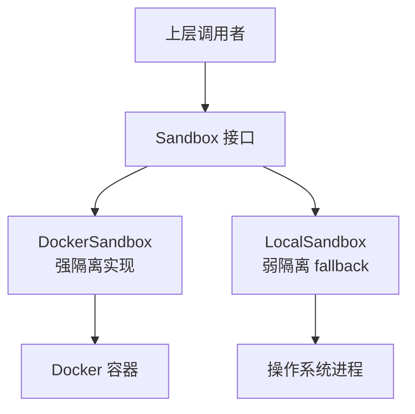
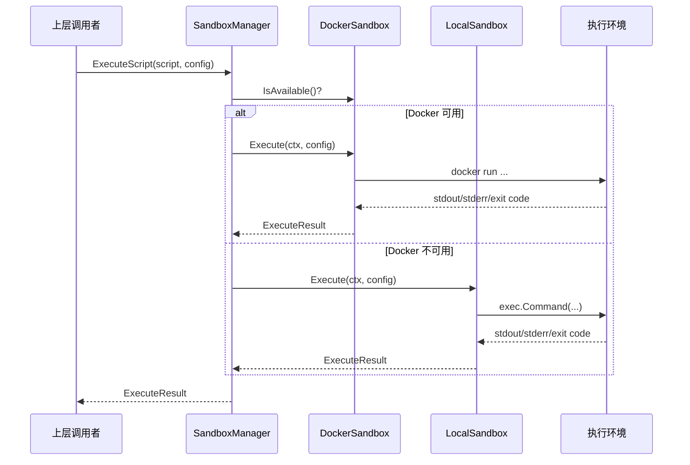

# sandbox_runtime_implementations 模块技术文档

## 1. 模块概述

### 1.1 问题空间

在现代 AI 助手系统中，允许执行用户或 Agent 生成的代码是一把双刃剑：
- 它提供了强大的功能，如数据分析、文件处理、工具调用等
- 但也带来了巨大的安全风险：恶意代码可能访问敏感数据、破坏系统、消耗资源

传统的安全措施（如代码审查）无法应对动态生成的代码执行场景。我们需要一个**隔离层**，既能让代码正常运行，又能限制其对宿主系统的影响。

这就是 `sandbox_runtime_implementations` 模块存在的意义：它提供了两种不同强度的代码执行隔离策略，让系统可以在不同的安全需求和环境约束下选择合适的方案。

### 1.2 核心价值

- **安全隔离**：将不可信的代码执行限制在受控环境中
- **灵活 fallback**：在 Docker 不可用时提供降级方案
- **资源控制**：限制执行时间、内存、CPU 等资源消耗
- **统一接口**：两种实现遵循相同的契约，方便上层使用

---

## 2. 架构设计

### 2.1 核心抽象

这个模块的设计遵循**策略模式**：
- `Sandbox` 接口定义了统一的执行契约（虽然在当前代码中未显式定义，但从两个实现的方法签名可以推断）
- `DockerSandbox` 和 `LocalSandbox` 是两种不同的策略实现
- 上层可以通过 `SandboxType` 或可用性检测选择合适的实现



### 2.2 两种实现的定位

| 特性 | DockerSandbox | LocalSandbox |
|------|---------------|--------------|
| **隔离强度** | 强（容器级隔离） | 弱（进程级限制） |
| **安全级别** | 高 | 中 |
| **环境要求** | 需要 Docker | 无特殊要求 |
| **资源控制** | 精细（内存、CPU、网络） | 基础（超时、工作目录） |
| **适用场景** | 生产环境、不可信代码 | 开发环境、可信代码 |

---

## 3. 核心组件详解

### 3.1 DockerSandbox：基于容器的强隔离实现

#### 设计意图

`DockerSandbox` 是生产环境的首选实现，它利用 Docker 容器提供真正的进程隔离。

#### 安全设计亮点

```go
// 核心安全配置在 buildDockerArgs 方法中
args = append(args, "--user", "1000:1000")           // 非 root 用户
args = append(args, "--cap-drop", "ALL")              // 丢弃所有 Linux capabilities
args = append(args, "--network", "none")              // 默认禁用网络
args = append(args, "--pids-limit", "100")            // 限制进程数
args = append(args, "--security-opt", "no-new-privileges") // 禁止提权
```

**为什么这样设计？**
- 非 root 用户：即使容器被突破，攻击者也没有 root 权限
- 丢弃所有 capabilities：即使有 root，也没有特权操作能力
- 只读根文件系统（可选）：防止恶意软件写入持久化
- 网络隔离：默认禁止访问网络，防止数据泄露或攻击

#### 资源控制

```go
// 内存限制
args = append(args, "--memory", fmt.Sprintf("%d", memLimit))
args = append(args, "--memory-swap", fmt.Sprintf("%d", memLimit)) // 禁用 swap

// CPU 限制
args = append(args, "--cpus", fmt.Sprintf("%.2f", cpuLimit))
```

**设计决策**：将 memory-swap 设置为与 memory 相同的值，这实际上禁用了 swap。为什么？
- Swap 会导致难以预测的性能下降
- 恶意代码可以通过消耗 swap 来拖慢系统
- 对于脚本执行场景，通常不需要 swap

#### 执行流程

```
1. 验证 ExecuteConfig
2. 设置超时上下文
3. 构建 docker run 命令参数
4. 执行命令并捕获 stdout/stderr
5. 处理超时、退出码等结果
6. 返回 ExecuteResult
```

### 3.2 LocalSandbox：基于进程的弱隔离 fallback

#### 设计意图

`LocalSandbox` 是一个降级方案，用于 Docker 不可用的环境（如开发笔记本、某些 CI 环境）。它不提供真正的隔离，但通过多层限制来降低风险。

#### 多层安全限制

1. **路径验证**：
   ```go
   // 脚本路径必须是绝对路径
   if !filepath.IsAbs(scriptPath) {
       return fmt.Errorf("script path must be absolute: %s", scriptPath)
   }
   
   // 必须在允许的路径下
   if len(s.config.AllowedPaths) > 0 {
       // 检查脚本是否在允许的路径前缀下
   }
   ```

2. **命令白名单**：
   ```go
   if !s.isAllowedCommand(interpreter) {
       return nil, fmt.Errorf("interpreter not allowed: %s", interpreter)
   }
   ```

3. **环境变量过滤**：
   ```go
   // 过滤掉危险的环境变量
   dangerous := map[string]bool{
       "LD_PRELOAD":      true,
       "LD_LIBRARY_PATH": true,
       "PYTHONPATH":      true,
       // ...
   }
   ```

4. **进程组管理**：
   ```go
   cmd.SysProcAttr = &syscall.SysProcAttr{
       Setpgid: true,  // 创建新进程组
   }
   
   // 超时时杀死整个进程组
   syscall.Kill(-cmd.Process.Pid, syscall.SIGKILL)
   ```

**设计决策**：为什么使用进程组？
- 脚本可能会 spawn 子进程
- 只 kill 主进程会留下孤儿进程
- 杀死进程组可以确保所有相关进程都被清理

---

## 4. 数据与控制流

### 4.1 典型执行流程

让我们追踪一次脚本执行的完整流程：



### 4.2 关键数据契约

虽然没有显式定义接口，但两个实现共享相同的方法签名：

```go
// 推断的 Sandbox 接口
type Sandbox interface {
    Type() SandboxType
    IsAvailable(ctx context.Context) bool
    Execute(ctx context.Context, config *ExecuteConfig) (*ExecuteResult, error)
    Cleanup(ctx context.Context) error
}
```

---

## 5. 设计决策与权衡

### 5.1 为什么两种实现？

**选择**：同时提供 Docker 和本地进程两种实现

**权衡分析**：
- ✅ Docker 提供强隔离，但增加了环境依赖
- ✅ Local 实现无依赖，但隔离性弱
- ✅ 组合使用可以在不同环境下获得最佳可用安全性

**替代方案考虑**：
- ❌ 只使用 Docker：会限制模块的适用场景
- ❌ 只使用本地进程：生产环境安全性不足
- ❌ 使用 gVisor 等更轻量的容器：增加复杂度，收益有限

### 5.2 为什么不使用虚拟机？

**选择**：使用容器而非虚拟机

**权衡分析**：
- ✅ 容器启动快（秒级 vs 分钟级）
- ✅ 容器开销小（共享内核）
- ✅ Docker 生态成熟
- ❌ 容器隔离性弱于虚拟机
- ❌ 内核漏洞可能突破容器

**决策理由**：对于脚本执行场景，启动速度和资源效率比极致的隔离更重要。如果需要更强的隔离，可以在虚拟机中运行 Docker。

### 5.3 为什么默认禁用网络？

**选择**：DockerSandbox 默认 `--network none`

**权衡分析**：
- ✅ 防止数据泄露
- ✅ 防止恶意网络攻击
- ✅ 限制攻击面
- ❌ 某些脚本需要网络访问

**设计**：将网络访问设为可选项（`AllowNetwork`），默认关闭，需要时显式启用。这遵循了"默认安全"的原则。

### 5.4 LocalSandbox 的安全定位

**重要提示**：`LocalSandbox` 不是真正的沙箱！

文档明确说明：
> This is a fallback option when Docker is not available
> It provides basic isolation through...

**为什么还要提供它？**
- 开发环境：开发者信任自己的代码
- 测试环境：运行已知的测试脚本
- 演示场景：快速上手，不需要 Docker

**使用原则**：在生产环境中，如果 Docker 不可用，应该**禁用代码执行功能**，而不是降级到 LocalSandbox。

---

## 6. 使用与扩展指南

### 6.1 正确初始化

```go
// 推荐做法：先检测可用性，再选择实现
var sandbox Sandbox

dockerSandbox := NewDockerSandbox(config)
if dockerSandbox.IsAvailable(ctx) {
    if err := dockerSandbox.EnsureImage(ctx); err != nil {
        // 处理镜像拉取失败
    }
    sandbox = dockerSandbox
} else {
    // 评估是否接受 LocalSandbox 的安全风险
    sandbox = NewLocalSandbox(config)
}
```

### 6.2 配置最佳实践

**DockerSandbox 配置**：
```go
config := &Config{
    DockerImage: "your-custom-image:tag",  // 使用自己的镜像
    MaxMemory: 512 * 1024 * 1024,         // 512MB
    MaxCPU: 1.0,                             // 1 核
    DefaultTimeout: 30 * time.Second,       // 30 秒超时
}
```

**LocalSandbox 配置**：
```go
config := &Config{
    AllowedPaths: []string{"/safe/scripts"},  // 限制脚本路径
    AllowedCommands: []string{"python3"},      // 只允许 Python
    DefaultTimeout: 30 * time.Second,
}
```

### 6.3 扩展点

如果需要添加新的沙箱实现（如 gVisor、Kata Containers 等）：

1. 创建新的 struct 实现与现有方法相同的签名
2. 实现 `Type()`、`IsAvailable()`、`Execute()`、`Cleanup()`
3. 在 `SandboxType` 枚举中添加新类型
4. 更新 `SandboxManager`（如果存在）以支持新实现

---

## 7. 陷阱与注意事项

### 7.1 DockerSandbox 常见问题

**问题 1：容器启动慢**
- 原因：镜像拉取或容器创建开销
- 解决：使用 `EnsureImage()` 在初始化时预拉取镜像

**问题 2：脚本无法写入文件**
- 原因：默认挂载为 `:ro`（只读）
- 解决：如果需要写入，使用 `/tmp` 目录（配置 `ReadOnlyRootfs` 时会挂载 tmpfs）

**问题 3：权限被拒绝**
- 原因：容器内用户（1000:1000）没有宿主文件的权限
- 解决：确保挂载的目录对其他用户可读（`chmod o+r`）

### 7.2 LocalSandbox 安全陷阱

**陷阱 1：路径遍历**
- 风险：`AllowedPaths` 检查使用 `strings.HasPrefix`，可能被绕过
- 例子：`AllowedPaths = ["/safe"]`，脚本路径 `/safe/../etc/passwd`
- 解决：在检查前解析所有路径符号链接（当前代码未完全解决此问题）

**陷阱 2：命令注入**
- 风险：即使限制了解释器，脚本内容仍然可能执行危险操作
- 解决：LocalSandbox 只适用于可信代码

**陷阱 3：资源耗尽**
- 风险：没有内存/CPU 限制，fork bomb 可以耗尽系统资源
- 解决：在生产环境始终使用 DockerSandbox

### 7.3 运维注意事项

- **Docker 镜像管理**：定期更新基础镜像以修复安全漏洞
- **资源监控**：监控沙箱的资源使用，设置合理的限制
- **日志审计**：记录所有沙箱执行，便于事后分析
- **隔离级别**：根据代码来源选择合适的沙箱实现：
  - 不可信代码 → DockerSandbox（网络禁用、只读文件系统）
  - 半可信代码 → DockerSandbox（网络可选）
  - 可信代码 → LocalSandbox（仅开发/测试环境）

---

## 8. 与其他模块的关系

- **父模块**：[sandbox_execution_and_script_safety](platform_infrastructure_and_runtime-sandbox_execution_and_script_safety.md)
- **相关模块**：
  - [sandbox_manager_and_fallback_control](platform_infrastructure_and_runtime-sandbox_execution_and_script_safety-sandbox_manager_and_fallback_control.md)：管理沙箱选择和 fallback
  - [script_validation_and_safety_checks](platform_infrastructure_and_runtime-sandbox_execution_and_script_safety-script_validation_and_safety_checks.md)：执行前的脚本验证

---

## 总结

`sandbox_runtime_implementations` 模块是系统安全的关键防线，它通过两种互补的实现提供了灵活的代码执行隔离方案：

- **DockerSandbox**：生产环境的首选，提供强隔离、细粒度资源控制
- **LocalSandbox**：降级方案，提供基本限制，适用于可信环境

使用这个模块的核心原则是：**根据代码的可信度选择合适的隔离级别，并始终优先使用 DockerSandbox**。
