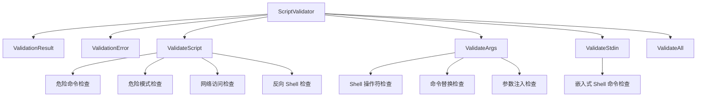

# script_validation_and_safety_checks 模块技术深度解析

## 1. 问题空间与设计意图

在任何允许执行用户脚本或命令的系统中，安全都是首要关注点。`script_validation_and_safety_checks` 模块正是为了解决这个核心问题而设计的——它作为沙箱执行环境的安全哨兵，在脚本、参数和标准输入进入实际执行环境之前，对它们进行全面的安全扫描和验证。

想象一下，如果没有这个模块，用户可能会尝试执行 `rm -rf /` 来删除整个文件系统，或者使用反向 shell 建立与外部服务器的连接，或者通过命令注入在参数中嵌入恶意代码。这个模块的存在就是为了在这些危险操作发生之前就将它们拦截下来。

## 2. 核心架构与数据流程

### 2.1 架构概览

这个模块的架构相对简洁但功能强大，主要由以下几个核心组件组成：



### 2.2 数据流程

当需要验证脚本时，数据流程如下：

1. **初始化**：通过 `NewScriptValidator()` 创建验证器实例，加载默认的危险命令列表、危险模式和参数注入模式。
2. **验证入口**：通常调用 `ValidateAll()` 作为统一入口，它会依次调用 `ValidateScript()`、`ValidateArgs()` 和 `ValidateStdin()`。
3. **逐层检查**：每个验证方法会执行一系列特定的安全检查，将发现的问题收集到 `ValidationResult` 中。
4. **结果返回**：最终返回包含所有验证错误的结果对象，调用者可以根据 `Valid` 字段决定是否继续执行。

## 3. 核心组件深度解析

### 3.1 ScriptValidator 结构体

`ScriptValidator` 是整个模块的核心，它封装了所有的安全验证逻辑和配置。

```go
type ScriptValidator struct {
    dangerousCommands     []string
    dangerousPatterns     []*regexp.Regexp
    argInjectionPatterns  []*regexp.Regexp
}
```

**设计意图**：
- `dangerousCommands`：使用字符串匹配来检测那些不应该出现在脚本中的命令，如 `rm -rf /`。
- `dangerousPatterns`：使用正则表达式来检测更复杂的危险模式，如 base64 解码后执行。
- `argInjectionPatterns`：专门用于检测命令行参数中的注入尝试。

这种分层设计允许不同类型的检查使用最适合的技术——简单的字符串匹配对于精确的命令检测更高效，而正则表达式则提供了更大的灵活性来检测复杂模式。

### 3.2 ValidationResult 和 ValidationError

这两个结构体用于传递验证结果：

```go
type ValidationResult struct {
    Valid  bool
    Errors []*ValidationError
}

type ValidationError struct {
    Type    string
    Pattern string
    Context string
    Message string
}
```

**设计亮点**：
- `ValidationResult` 不仅告诉调用者是否通过验证，还提供了所有发现的问题的详细信息。
- `ValidationError` 包含了足够的上下文信息，帮助开发者理解问题所在——类型、匹配的模式、出现的位置和人类可读的描述。

### 3.3 核心验证方法

#### ValidateScript()

这个方法负责验证脚本内容本身，执行以下检查：

1. **危险命令检查**：使用字符串匹配查找预定义的危险命令。
2. **危险模式检查**：使用正则表达式检测更复杂的危险模式。
3. **网络访问检查**：检测是否有尝试建立网络连接的代码。
4. **反向 Shell 检查**：查找常见的反向 Shell 模式。

**设计决策**：为什么要同时使用字符串匹配和正则表达式？因为字符串匹配对于精确的命令检测更高效且不易误报，而正则表达式则可以处理更复杂的模式，如变量替换和编码 payload。

#### ValidateArgs()

这个方法专注于验证命令行参数，防止注入攻击：

1. **Shell 操作符检查**：查找 `&amp;&amp;`、`||`、`;` 等可以用于命令链接的操作符。
2. **命令替换检查**：检测 `$(...)` 和 `` `...` `` 等命令替换语法。
3. **参数注入检查**：使用正则表达式检测路径遍历、环境变量注入等模式。

**安全考量**：参数验证是防止命令注入的关键防线，因为即使脚本本身是安全的，恶意参数也可能导致意外行为。

#### ValidateStdin()

标准输入也是一个潜在的攻击面，这个方法专门检查 stdin 内容中是否包含嵌入式 Shell 命令。

#### ValidateAll()

这是一个便捷方法，它组合了上述所有验证步骤，提供一站式的安全检查。

## 4. 安全检查策略与模式

### 4.1 危险命令列表

模块预定义了一个全面的危险命令列表，涵盖：

- **系统修改**：如 `rm -rf /`、`mkfs` 等
- ** Fork 炸弹**：各种形式的递归函数调用
- **进程和系统控制**：`shutdown`、`reboot` 等
- **权限提升**：`chmod 777 /`、`chown root` 等
- **凭据访问**：尝试读取 `/etc/passwd`、私钥文件等
- **环境操纵**：修改 `PATH`、`LD_PRELOAD` 等环境变量
- **容器逃逸**：`docker`、`kubectl`、`nsenter` 等命令

### 4.2 危险模式检测

使用正则表达式检测更复杂的攻击模式：

- **编码 payload**：base64 解码、hex 解码后执行
- **代码下载和执行**：`curl | bash` 模式
- **代码注入**：`eval()`、`exec()`、`os.system()` 等
- **反序列化攻击**：`pickle.loads()`、`yaml.load()` 等
- **历史记录操纵**：清除命令历史

### 4.3 网络访问限制

模块会检测各种网络访问尝试，包括：

- 网络工具：`curl`、`wget`、`nc`、`ssh` 等
- 编程语言的网络库：Python 的 `urllib`、`requests`，JavaScript 的 `fetch`、`axios` 等

### 4.4 反向 Shell 检测

反向 Shell 是攻击者常用的技术，模块专门检测常见的反向 Shell 模式：

- `/dev/tcp/`、`/dev/udp/` 访问
- 交互式 Shell：`bash -i`、`sh -i`
- 各种编程语言的反向 Shell 实现

## 5. 设计决策与权衡

### 5.1 静态分析 vs 动态分析

当前实现使用的是**静态分析**方法，即在执行前检查脚本内容。

**优点**：
- 性能好，不需要实际执行代码
- 安全，在危险代码执行前就能拦截
- 简单，不需要复杂的运行时环境

**缺点**：
- 可能误报，有些看似危险的模式可能是合法使用
- 可能漏报，攻击者可以使用更复杂的混淆技术绕过检测

**为什么选择静态分析**：对于沙箱环境来说，安全性优先于便利性。静态分析提供了一个快速且相对安全的第一道防线，结合沙箱的其他安全机制（如资源限制、权限隔离），可以形成多层次的防御。

### 5.2 字符串匹配 vs 正则表达式

模块同时使用了这两种技术：

- **字符串匹配**：用于精确的危险命令检测，高效且不易误报
- **正则表达式**：用于检测更复杂的模式，提供更大的灵活性

**权衡**：正则表达式更强大，但也更容易误报，且性能较差。因此，模块只在必要时使用正则表达式，对于简单的精确匹配则使用字符串匹配。

### 5.3 全面性 vs 性能

模块的检查列表非常全面，涵盖了大量已知的攻击模式。

**优点**：提高了安全性，覆盖了更多的攻击面
**缺点**：增加了验证时间，可能影响性能

**设计考量**：对于沙箱执行来说，安全通常比性能更重要。而且，大多数脚本都不会包含这些危险模式，因此实际性能影响通常是可接受的。

### 5.4 内置规则 vs 可配置性

当前实现使用的是内置的规则集，虽然提供了默认的全面保护，但不太灵活。

**可能的改进方向**：
- 允许用户添加自定义规则
- 支持规则的启用/禁用
- 提供不同的安全级别配置

**为什么当前这样设计**：内置规则确保了即使没有额外配置，也能提供基本的安全保护。对于大多数使用场景，默认规则已经足够。

## 6. 使用指南与最佳实践

### 6.1 基本使用

```go
// 创建验证器
validator := sandbox.NewScriptValidator()

// 验证脚本、参数和标准输入
script := "#!/bin/bash\necho hello"
args := []string{"arg1", "arg2"}
stdin := ""

result := validator.ValidateAll(script, args, stdin)

if !result.Valid {
    fmt.Println("验证失败:")
    for _, err := range result.Errors {
        fmt.Printf("- %s\n", err.Message)
    }
} else {
    fmt.Println("验证通过，可以安全执行")
}
```

### 6.2 最佳实践

1. **始终使用 ValidateAll()**：即使你认为只需要验证脚本，也最好使用 ValidateAll() 来确保全面的安全检查。
2. **不要只依赖这个模块**：这是第一道防线，但不是唯一的防线。结合沙箱的其他安全机制，如资源限制、权限隔离等。
3. **审查误报**：如果遇到误报，仔细分析脚本是否真的安全，而不是简单地绕过验证。
4. **保持更新**：随着新的攻击技术出现，这个模块的规则也需要更新。

### 6.3 集成点

这个模块通常与 [sandbox_runtime_implementations](platform_infrastructure_and_runtime-sandbox_execution_and_script_safety-sandbox_runtime_implementations.md) 模块一起使用，在脚本执行前进行验证。

## 7. 边缘情况与陷阱

### 7.1 误报与漏报

**误报**：有些合法的脚本可能包含看似危险的模式，例如：
- 脚本中包含 `rm` 命令，但只删除特定的临时文件
- 使用 `eval` 来动态构建合法的命令

**漏报**：攻击者可能使用各种技术绕过检测，例如：
- 字符串拼接：`r${a}m -rf /`
- 编码：先 base64 编码，然后解码执行
- 间接调用：通过变量或函数间接调用危险命令

### 7.2 上下文缺失

静态分析的一个主要限制是缺乏运行时上下文。例如，一个脚本可能包含 `rm -rf $DIR`，但不运行脚本就无法知道 `$DIR` 的值是什么。

### 7.3 不同 Shell 的差异

不同的 Shell（bash、sh、zsh 等）可能有不同的语法和特性，当前实现主要针对常见的 bash 语法，可能无法检测到所有 Shell 特定的危险模式。

### 7.4 性能考量

对于非常大的脚本，验证可能需要一些时间。在性能敏感的场景中，可以考虑：
- 缓存验证结果
- 异步执行验证
- 对脚本大小设置合理的限制

## 8. 总结

`script_validation_and_safety_checks` 模块是沙箱执行环境的重要安全组件，它通过静态分析技术在脚本执行前进行全面的安全检查。虽然它不是完美的（存在误报和漏报的可能），但它提供了一个快速且相对可靠的第一道防线。

这个模块的设计体现了安全领域的一个重要原则：**深度防御**。它不依赖单一的检查方法，而是组合了多种检查技术（字符串匹配、正则表达式、专门的模式检测），并且应该与其他安全机制（如沙箱隔离、资源限制）结合使用，形成多层次的防御体系。

对于新加入团队的开发者，理解这个模块的设计意图、限制和最佳实践是非常重要的，这样才能正确地使用它，并在必要时对其进行改进。
