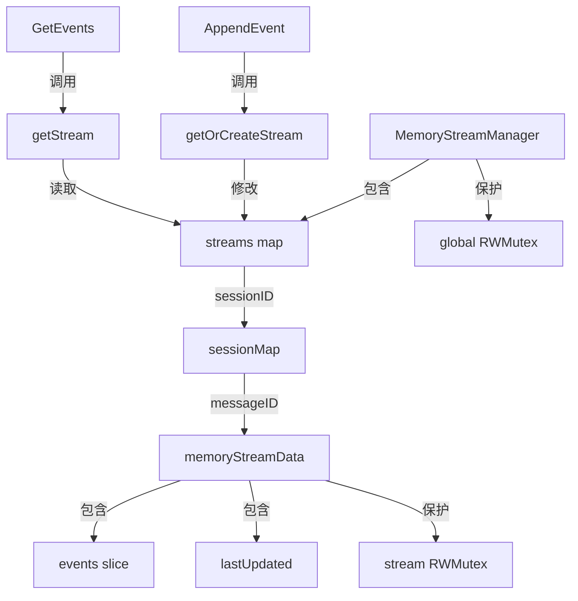

# in_memory_stream_state_manager 模块深度解析

## 1. 模块概述与问题空间

在现代 AI 对话系统中，流式响应是一种关键的用户体验增强技术。当 LLM 生成响应时，用户需要实时看到结果，而不是等待完整响应生成完毕。这种场景带来了几个关键挑战：

- **状态持久化**：需要在流式传输过程中保存中间事件，以便网络中断或客户端重新连接时能够恢复
- **并发安全**：多个生产者（LLM 响应生成器）和消费者（前端 SSE 推送）同时访问同一份流数据
- **高效读取**：客户端需要按偏移量增量获取事件，避免重复传输已接收的数据
- **临时存储**：流数据通常只在会话期间有用，不需要长期持久化

`in_memory_stream_state_manager` 模块正是为了解决这些问题而设计的。它提供了一个基于内存的轻量级流状态管理器，专门用于临时存储和管理会话中的流式事件。

## 2. 核心抽象与 mental model

理解这个模块的关键在于掌握两个核心抽象：

### 2.1 分层存储结构

想象一个文件系统的目录结构：
- 第一层是会话（session）目录，对应 `sessionID`
- 第二层是消息（message）文件，对应 `messageID`
- 每个消息文件中包含按时间顺序排列的事件（events）列表

这种分层结构反映了系统的业务语义：一个会话可以包含多条消息，每条消息有自己的流式响应事件序列。

### 2.2 双重锁保护机制

模块采用了**两级锁策略**来平衡并发性能和数据一致性：
- **全局锁**：保护 `streams` 映射表的结构变更（创建新会话或新消息流）
- **流级锁**：保护单个流数据的读写操作

这种设计类似于读写锁的变种，但在更细粒度上进行了优化。

## 3. 架构与数据流程

### 3.1 核心组件关系



### 3.2 关键操作流程

#### 3.2.1 AppendEvent 流程

当 LLM 生成一个新的流式事件时：

1. 调用 `getOrCreateStream` 获取或创建流数据
2. 获取全局写锁，确保会话和消息流存在
3. 释放全局锁，获取流级写锁
4. 如果事件没有时间戳，自动设置当前时间
5. 将事件追加到 `events` 切片
6. 更新 `lastUpdated` 时间
7. 释放流级锁

这个流程的关键优化点在于：全局锁只在需要创建流时短暂持有，实际的事件追加操作在流级锁的保护下进行，大大提高了并发性能。

#### 3.2.2 GetEvents 流程

当客户端请求获取事件时：

1. 调用 `getStream` 获取现有流数据（只读）
2. 获取全局读锁，查找会话和消息流
3. 释放全局锁，如果流不存在则返回空结果
4. 获取流级读锁
5. 检查偏移量是否超出范围
6. 如果在范围内，返回从偏移量开始的所有事件的**副本**
7. 计算并返回下一个偏移量
8. 释放流级锁

这里的一个重要设计决策是返回事件的副本而不是原始切片，这避免了调用者在持有返回值时与后续的 `AppendEvent` 操作产生竞态条件。

## 4. 组件深度解析

### 4.1 memoryStreamData 结构体

```go
type memoryStreamData struct {
	events      []interfaces.StreamEvent
	lastUpdated time.Time
	mu          sync.RWMutex
}
```

这个结构体是流数据的实际容器。它的设计体现了几个关键考虑：

- **events 切片**：使用动态切片存储事件，支持高效的追加和范围读取
- **lastUpdated 时间戳**：记录最后一次修改时间，为潜在的清理策略提供基础
- **mu 读写锁**：保护对流数据的并发访问，允许多个读者同时读取，但写操作独占

### 4.2 MemoryStreamManager 结构体

```go
type MemoryStreamManager struct {
	streams map[string]map[string]*memoryStreamData
	mu      sync.RWMutex
}
```

这个结构体是整个模块的入口点。它的设计特点：

- **双层 map 结构**：`sessionID -> messageID -> streamData`，精确反映了业务层次
- **全局读写锁**：保护 map 结构的并发访问，确保创建和查找操作的安全性

### 4.3 核心方法分析

#### 4.3.1 getOrCreateStream

这是一个内部辅助方法，负责确保流数据存在。它的关键特性：

- **原子性检查与创建**：在全局锁的保护下，一次性完成流的存在性检查和创建
- **延迟初始化**：只有在真正需要时才创建流数据，节省内存
- **即时时间戳**：新创建的流会立即设置 `lastUpdated` 时间

#### 4.3.2 AppendEvent

这个方法是模块的核心写入接口。设计亮点：

- **自动时间戳**：如果事件没有设置时间戳，会自动填充当前时间，简化调用方逻辑
- **更新时间戳**：每次追加都会更新 `lastUpdated`，为清理策略提供支持
- **细粒度锁**：实际的追加操作在流级锁下进行，不阻塞其他流的操作

#### 4.3.3 GetEvents

这个方法是模块的核心读取接口。关键设计决策：

- **副本返回**：返回事件的副本而不是原始切片，避免并发安全问题
- **偏移量机制**：支持增量读取，客户端可以记住上次读取的位置，只获取新事件
- **优雅处理不存在的流**：当流不存在时，返回空结果而不是错误，简化调用方逻辑

## 5. 依赖关系分析

### 5.1 依赖接口

模块依赖于 `interfaces.StreamManager` 接口和 `interfaces.StreamEvent` 类型。这种设计确保了：

- **可替换性**：可以轻松替换为 [redis_stream_state_manager](platform_infrastructure_and_runtime-stream_state_backends-redis_stream_state_manager.md) 等其他实现
- **契约明确**：接口定义了清晰的契约，便于测试和维护

### 5.2 调用关系

从模块树可以看出，这个模块通常会被以下组件调用：

- **会话消息和流式 HTTP 处理器**：特别是 [streaming_endpoints_and_sse_context](http_handlers_and_routing-session_message_and_streaming_http_handlers-streaming_endpoints_and_sse_context.md) 模块
- **LLM 响应生成服务**：在生成流式响应时追加事件
- **会话管理服务**：可能在会话结束时清理流数据

## 6. 设计决策与权衡

### 6.1 内存存储 vs 持久化存储

**选择**：使用纯内存存储  
**原因**：
- 流数据的生命周期通常与会话绑定，不需要长期持久化
- 内存操作比磁盘/网络操作快得多，符合流式传输的低延迟要求
- 简化了部署，不需要额外的基础设施

**权衡**：
- ✅ 优点：高性能、部署简单、无外部依赖
- ❌ 缺点：数据丢失风险（进程重启）、内存占用可能较高

### 6.2 两级锁策略 vs 单级锁

**选择**：使用全局锁+流级锁的两级策略  
**原因**：
- 全局锁只在创建流时短暂持有，大部分操作在流级锁下进行
- 不同会话/消息的流操作互不阻塞，大大提高并发性能

**权衡**：
- ✅ 优点：高并发性能、细粒度控制
- ❌ 缺点：代码复杂度增加、锁的获取释放开销

### 6.3 返回副本 vs 返回原始数据

**选择**：返回事件的副本  
**原因**：
- 避免调用者在持有返回值时与后续的 `AppendEvent` 操作产生竞态条件
- 确保数据一致性，即使后续有新事件追加，已返回的数据也不会改变

**权衡**：
- ✅ 优点：线程安全、数据一致性
- ❌ 缺点：内存开销增加、复制操作的 CPU 开销

### 6.4 没有自动清理机制

**选择**：当前实现没有自动清理过期流数据的机制  
**原因**：
- 保持模块简单，专注于核心功能
- 清理策略可能因业务场景而异，最好由上层调用者决定

**权衡**：
- ✅ 优点：模块简洁、职责单一
- ❌ 缺点：需要调用者手动管理流数据生命周期，否则可能内存泄漏

## 7. 使用指南与示例

### 7.1 基本使用

```go
// 创建管理器
manager := stream.NewMemoryStreamManager()

// 追加事件
event := interfaces.StreamEvent{
    Type: "content",
    Data: []byte("Hello"),
}
err := manager.AppendEvent(ctx, "session1", "message1", event)

// 获取事件（从偏移量 0 开始）
events, nextOffset, err := manager.GetEvents(ctx, "session1", "message1", 0)

// 后续获取新事件（使用上次返回的偏移量）
newEvents, nextOffset, err := manager.GetEvents(ctx, "session1", "message1", nextOffset)
```

### 7.2 典型集成模式

在 HTTP SSE 处理器中的典型使用方式：

```go
func streamHandler(w http.ResponseWriter, r *http.Request) {
    sessionID := r.URL.Query().Get("session_id")
    messageID := r.URL.Query().Get("message_id")
    offset := 0 // 或从请求中获取
    
    // 设置 SSE 响应头
    w.Header().Set("Content-Type", "text/event-stream")
    w.Header().Set("Cache-Control", "no-cache")
    w.Header().Set("Connection", "keep-alive")
    
    // 循环推送事件
    for {
        events, nextOffset, err := manager.GetEvents(r.Context(), sessionID, messageID, offset)
        if err != nil {
            // 处理错误
            break
        }
        
        for _, event := range events {
            // 将事件写入 SSE 响应
            fmt.Fprintf(w, "data: %s\n\n", event.Data)
            flusher.Flush()
        }
        
        offset = nextOffset
        
        // 检查是否完成（根据业务逻辑）
        if isStreamComplete(sessionID, messageID) {
            break
        }
        
        // 等待一段时间后再检查新事件
        time.Sleep(100 * time.Millisecond)
    }
}
```

## 8. 边缘情况与注意事项

### 8.1 内存管理

**问题**：如果不及时清理流数据，内存使用会持续增长  
**建议**：
- 在会话结束或消息处理完成后，考虑添加清理方法
- 可以基于 `lastUpdated` 时间戳实现定期清理策略
- 对于长时间运行的服务，监控内存使用情况

### 8.2 并发安全

**注意**：虽然模块内部是并发安全的，但调用者需要注意：
- 不要依赖事件的返回顺序和追加顺序的关系（虽然当前实现是一致的）
- 由于返回的是副本，修改返回的事件不会影响存储的事件

### 8.3 偏移量处理

**边缘情况**：
- 如果 `fromOffset` 为负数，行为未定义（当前实现会返回所有事件）
- 如果 `fromOffset` 大于等于事件数量，返回空切片和相同的偏移量
- 流被重新创建后，偏移量会重置为 0

### 8.4 时间戳

**注意**：
- `AppendEvent` 会自动设置时间戳，但如果事件已经有时间戳，会保留原值
- 时间戳使用的是服务器本地时间，可能存在时钟同步问题

## 9. 扩展与改进方向

### 9.1 潜在的功能增强

1. **流清理方法**：添加 `ClearStream`、`ClearSession` 等方法，支持手动清理
2. **过期自动清理**：添加后台 goroutine，定期清理超过一定时间未更新的流
3. **事件限制**：支持限制单个流的最大事件数量，防止内存无限增长
4. **统计信息**：添加获取流数量、内存使用等统计信息的方法
5. **事件订阅**：支持实时订阅新事件，而不是轮询

### 9.2 与 Redis 实现的对比

当需要更高的可靠性或分布式部署时，可以考虑使用 [redis_stream_state_manager](platform_infrastructure_and_runtime-stream_state_backends-redis_stream_state_manager.md)：

| 特性 | 内存实现 | Redis 实现 |
|------|----------|------------|
| 性能 | 极高 | 高（受网络影响） |
| 持久性 | 无 | 有 |
| 分布式 | 不支持 | 支持 |
| 部署复杂度 | 简单 | 需要 Redis |
| 内存占用 | 进程内存 | Redis 内存 |

## 10. 总结

`in_memory_stream_state_manager` 模块是一个精心设计的轻量级流状态管理解决方案。它通过巧妙的两级锁策略、分层存储结构和副本返回机制，在保证并发安全的同时提供了出色的性能。

这个模块的设计体现了几个重要的软件工程原则：
- **职责单一**：专注于流状态管理，不涉及其他功能
- **接口驱动**：通过 `StreamManager` 接口定义契约，便于替换和测试
- **性能优先**：针对流式场景进行了专门优化
- **简单实用**：避免过度设计，保持代码简洁易懂

对于需要高效、临时存储流式事件的场景，这个模块是一个理想的选择。而在需要持久性或分布式支持的场景，则可以考虑使用 Redis 实现作为替代。
