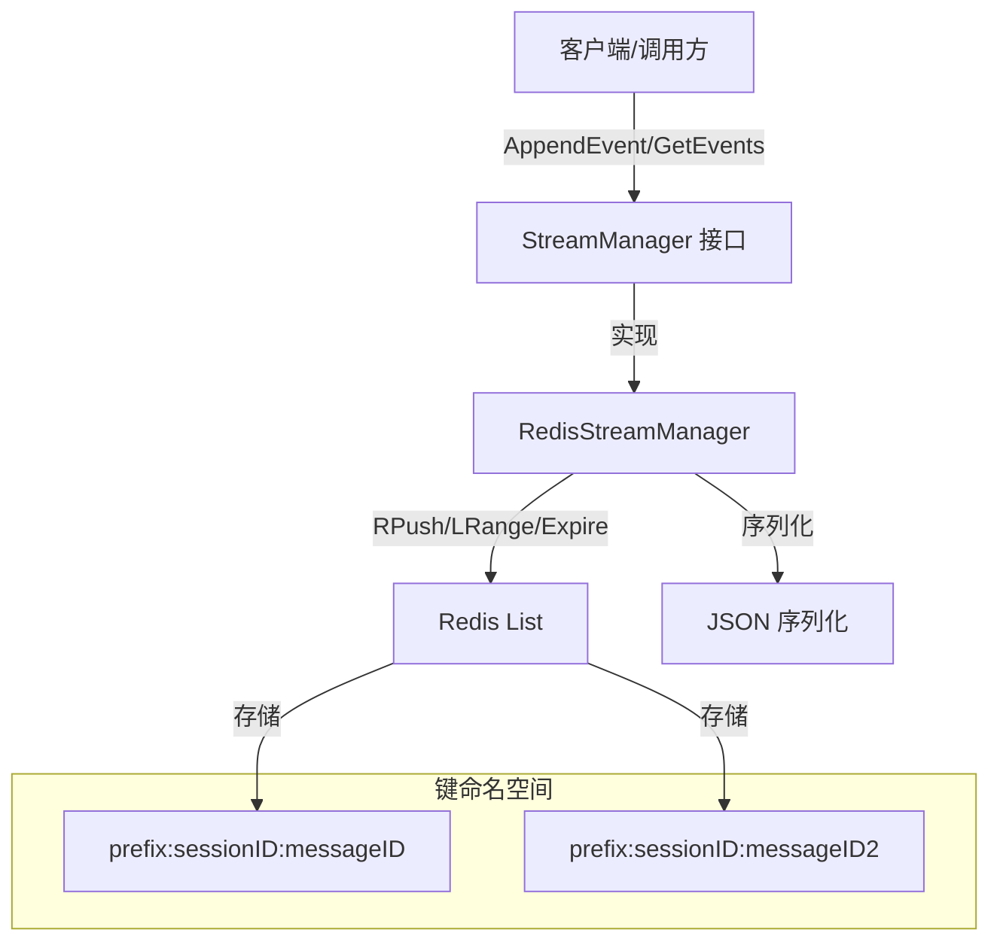

# Redis Stream State Manager 技术深度分析

## 1. 模块概览

**RedisStreamManager** 是一个基于 Redis List 实现的事件流状态管理器，用于在分布式系统中持久化和检索会话消息的流式事件。

### 为什么需要这个模块？

想象一下实时聊天场景：用户发送一条消息，AI 正在生成回复，这个过程中会产生多个中间事件——比如开始生成、工具调用、思考过程、最终回复等。如果客户端在这个过程中刷新页面或网络中断，我们需要能够恢复这些事件流，让用户看到完整的交互过程。

在分布式环境中，简单的内存存储无法满足需求：
- 多实例部署时，内存状态无法共享
- 服务重启会丢失所有流式状态
- 无法支持客户端重连恢复

**RedisStreamManager** 正是为了解决这个问题而设计的——它提供了一个轻量级、高性能、可持久化的事件流存储方案，支持事件的追加和按偏移量读取，同时通过 TTL 自动清理过期数据。

## 2. 核心架构与数据模型

### 架构图



### 核心概念

1. **事件流（Stream）**：与特定 `sessionID` 和 `messageID` 关联的一系列有序事件
2. **偏移量（Offset）**：事件在流中的位置索引，从 0 开始
3. **键构建策略**：使用 `prefix:sessionID:messageID` 格式的 Redis 键
4. **TTL 机制**：每个流键都有过期时间，自动清理旧数据

### 数据结构选择

**为什么使用 Redis List 而不是 Redis Stream？**

这是一个有趣的设计选择。Redis 5.0+ 提供了专门的 Stream 数据类型，但这里选择了 List：

- **简单性**：List 的 API 更简单直观，RPUSH/LRANGE 足以满足需求
- **性能**：对于小规模事件流，List 的性能足够好
- **兼容性**：List 在所有 Redis 版本中都可用
- **功能匹配**：我们只需要"追加到末尾"和"从某点读取"，不需要消费者组等高级功能

## 3. 核心组件深度解析

### RedisStreamManager 结构体

```go
type RedisStreamManager struct {
    client *redis.Client  // Redis 客户端连接
    ttl    time.Duration  // 流数据的 TTL
    prefix string         // Redis 键前缀
}
```

这个结构体封装了三个核心依赖：
- **Redis 客户端**：实际的存储后端
- **TTL**：数据过期时间，防止 Redis 内存无限增长
- **键前缀**：提供命名空间隔离，避免键冲突

### NewRedisStreamManager - 构造函数

构造函数的设计体现了"默认值 + 验证"的模式：

1. **连接验证**：创建客户端后立即 Ping，确保连接可用
2. **默认 TTL**：如果未指定 TTL，使用 24 小时
3. **默认前缀**：如果未指定前缀，使用 "stream:events"

这种设计使得组件既易于使用（零配置即可工作），又足够灵活（支持完全自定义）。

### AppendEvent - 事件追加

这是写入路径的核心方法，执行流程如下：

```
构建键 → 设置时间戳 → 序列化为 JSON → RPUSH → 设置 TTL
```

**关键设计点**：

1. **时间戳自动填充**：如果事件没有时间戳，自动设置为当前时间
   - 确保事件有序性，即使调用方忘记设置

2. **每次追加都刷新 TTL**：
   - 这意味着活跃的流会一直保持，只有不活跃的流才会被清理
   - 权衡：增加了一次 Redis 调用，但保证了数据生命周期的合理性

3. **使用 RPush**：O(1) 时间复杂度，保证追加操作的高性能

### GetEvents - 事件读取

读取路径的核心方法，支持偏移量读取：

```
构建键 → LRange 获取数据 → 反序列化 → 计算下一个偏移量
```

**关键设计点**：

1. **LRange 的使用**：`LRange key fromOffset -1` 获取从偏移量到末尾的所有事件
   - 简单高效，避免了复杂的分页逻辑

2. **错误处理策略**：
   - 如果键不存在（redis.Nil），返回空切片而不是错误
   - 如果单个事件反序列化失败，跳过该事件继续处理其他事件
   - 这种"尽力而为"的策略提高了系统的韧性

3. **下一个偏移量计算**：`fromOffset + len(results)`
   - 调用方可以直接使用这个值进行下一次读取，实现轮询模式

## 4. 数据流动与依赖关系

### 依赖分析

**上游依赖**：
- `github.com/redis/go-redis/v9`：Redis 客户端库
- `interfaces.StreamManager`：定义了组件的契约

**下游使用者**：
- 会话流式处理服务
- Agent 运行时事件记录
- SSE（Server-Sent Events）端点

### 典型数据流

#### 写入流程（事件产生）：

1. Agent 运行时产生一个事件
2. 调用 `AppendEvent(sessionID, messageID, event)`
3. RedisStreamManager 构建键 `prefix:sessionID:messageID`
4. 事件序列化为 JSON
5. 执行 RPush 将事件追加到 Redis List
6. 刷新 TTL
7. 返回成功

#### 读取流程（事件消费）：

1. 客户端通过 SSE 端点请求事件流
2. 端点调用 `GetEvents(sessionID, messageID, fromOffset)`
3. RedisStreamManager 执行 LRange 获取数据
4. 反序列化事件（跳过无效事件）
5. 返回事件列表和下一个偏移量
6. 客户端使用新的偏移量继续轮询

## 5. 设计决策与权衡

### 决策 1：使用 Redis List 而非 Redis Stream

| 维度 | Redis List | Redis Stream |
|------|-----------|--------------|
| 复杂度 | 简单 | 较高 |
| 功能 | 基本的追加和范围查询 | 支持消费者组、确认、回溯等 |
| 性能 | O(1) 追加，O(n) 范围查询 | 类似，但有更多元数据开销 |
| 兼容性 | 所有 Redis 版本 | 需要 Redis 5.0+ |

**选择理由**：当前需求只需要简单的追加和范围查询，List 足够且更简单。

### 决策 2：每次追加都刷新 TTL

**权衡**：
- ✅ 活跃的流不会意外过期
- ✅ 流的生命周期与其活跃度自然关联
- ❌ 每次追加多一次 Redis 调用
- ❌ 如果有频繁的小批量追加，会产生多次 Expire 调用

**选择理由**：数据可用性优先于微小的性能开销。

### 决策 3：反序列化失败时跳过而非报错

**权衡**：
- ✅ 单个坏事件不会影响整个流的可用性
- ✅ 系统具有更好的韧性
- ❌ 可能丢失重要事件且调用方无感知
- ❌ 需要额外的监控来发现这类问题

**选择理由**：在流式场景中，部分数据可用通常比完全不可用更好。

### 决策 4：键设计为 prefix:sessionID:messageID

**考虑**：
- 为什么不是 prefix:messageID？因为 messageID 可能在不同 session 间重复
- 为什么不是 prefix:sessionID？因为一个 session 可能有多个 message，每个都有独立的流
- 三级结构提供了精确的粒度控制

## 6. 使用指南与最佳实践

### 基本使用

```go
// 创建管理器
manager, err := NewRedisStreamManager(
    "localhost:6379",  // Redis 地址
    "",                // 用户名（可选）
    "",                // 密码（可选）
    0,                 // 数据库
    "myapp:stream",    // 键前缀
    24*time.Hour,      // TTL
)

// 追加事件
event := interfaces.StreamEvent{
    Type: "message_chunk",
    Data: []byte("Hello"),
}
err = manager.AppendEvent(ctx, "session1", "msg1", event)

// 读取事件
events, nextOffset, err := manager.GetEvents(ctx, "session1", "msg1", 0)
```

### 轮询模式

```go
offset := 0
for {
    events, nextOffset, err := manager.GetEvents(ctx, sessionID, messageID, offset)
    if err != nil {
        // 处理错误
        break
    }
    
    for _, event := range events {
        // 处理事件
    }
    
    if nextOffset == offset {
        // 没有新事件，等待一段时间
        time.Sleep(100 * time.Millisecond)
        continue
    }
    
    offset = nextOffset
}
```

### 配置建议

1. **TTL 设置**：根据业务需求设置合理的 TTL。对于聊天场景，24-72 小时通常足够
2. **键前缀**：使用环境特定的前缀（如 `prod:stream:`、`staging:stream:`），避免环境间干扰
3. **监控**：监控 Redis 中 stream 相关键的数量和内存使用，防止 TTL 失效导致的内存泄漏

## 7. 注意事项与潜在陷阱

### 陷阱 1：偏移量管理不当

如果调用方保存偏移量失败或丢失，可能会导致重复读取或遗漏事件。建议：
- 在客户端状态中持久化偏移量
- 或者在重新连接时从 0 开始读取（幂等事件可以处理重复）

### 陷阱 2：大事件导致的性能问题

单个事件太大可能会：
- 增加网络传输时间
- 占用更多 Redis 内存
- 减慢反序列化速度

建议限制单个事件的大小，或者将大数据拆分到多个事件。

### 陷阱 3：忽视反序列化失败

当前实现会静默跳过反序列化失败的事件。建议：
- 添加日志记录这些失败
- 考虑添加指标监控失败率
- 确保事件生产者产生格式正确的 JSON

### 陷阱 4：键冲突

如果多个环境共享同一个 Redis 实例且使用相同的前缀，会导致键冲突。始终使用环境特定的前缀。

## 8. 扩展与演进方向

### 可能的改进

1. **批量追加**：添加 `AppendEvents` 方法支持批量操作，减少 Redis 调用次数
2. **截断支持**：添加 `Truncate` 方法，允许手动清理旧事件
3. **元数据存储**：在 Redis Hash 中存储流的元数据（如事件总数、创建时间等）
4. **可选的 Redis Stream**：在需要消费者组等高级功能时，可以考虑添加 Redis Stream 作为可选后端

### 与其他组件的关系

- [InMemoryStreamManager](platform_infrastructure_and_runtime-stream_state_backends-in_memory_stream_state_manager.md)：内存实现，适用于单机开发和测试
- StreamManager 接口：定义了统一的契约，使得可以在不同实现间切换

## 9. 总结

RedisStreamManager 是一个精心设计的组件，它通过巧妙地使用 Redis List 提供了一个简单、高效、可靠的事件流存储方案。它的设计体现了"够用即可"的原则——不追求功能的完备性，而是聚焦于解决核心问题：事件的有序存储和按偏移量检索。

该组件的关键优势在于：
- **简单性**：API 直观，易于理解和使用
- **可靠性**：Redis 提供持久化和高可用支持
- **性能**：利用 Redis List 的高效操作
- **自清洁**：通过 TTL 自动管理数据生命周期

对于需要在分布式系统中管理流式事件状态的场景，RedisStreamManager 是一个理想的选择。
