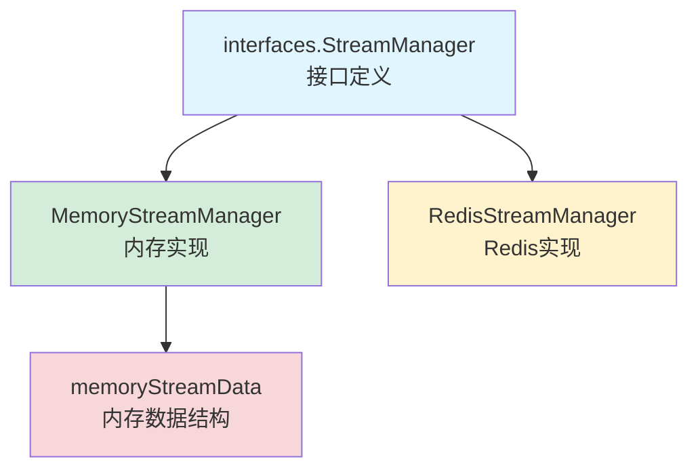

# Stream State Backends 模块深度解析

## 1. 模块概述

想象一下，当用户与 AI 助手进行对话时，系统正在生成实时的流式响应——每个字符、每个工具调用、每个推理步骤都需要被即时记录和追踪。如果这是一个单实例系统，内存存储可能足够；但在分布式环境中，我们需要一种机制来持久化这些流式状态，确保用户在网络中断或多实例部署时仍能无缝恢复对话。

这就是 `stream_state_backends` 模块的使命。它提供了一套统一的接口来管理 AI 会话的流式状态数据，支持内存和 Redis 两种存储后端，让系统可以根据部署场景灵活选择。

## 2. 核心设计理念

### 2.1 统一接口，多种实现

模块的核心设计思想是通过 `interfaces.StreamManager` 接口定义统一的行为契约，然后提供多种实现。这种设计类似于"插件架构"——系统的其他部分只需要依赖接口，而不必关心底层是内存还是 Redis。

### 2.2 两层命名空间组织

流式数据采用两层命名空间组织：

```
sessionID → messageID → stream data
```

这种设计反映了业务领域的自然结构：
- 一个会话（session）包含多条消息（message）
- 每条消息可能有自己的流式生成过程

### 2.3 追加式事件日志

所有流数据都以"事件"（`StreamEvent`）的形式追加存储，形成不可变的事件日志。这种模式有几个关键优势：
- 支持时间旅行调试和重放
- 允许客户端从任意偏移量开始消费
- 简化了并发控制（只需要追加，不需要修改）

## 3. 架构详解

### 3.1 组件关系图



### 3.2 数据流向解析

当系统产生一个流式事件时，数据流向如下：

1. **事件追加路径**：
   - 调用者通过 `StreamManager.AppendEvent()` 接口提交事件
   - 实现层（内存或 Redis）将事件追加到对应存储
   - 时间戳自动填充（如果未设置）

2. **事件读取路径**：
   - 调用者提供 `sessionID`、`messageID` 和起始偏移量
   - 实现层从指定位置读取事件
   - 返回事件列表和下一个偏移量（用于分页）

## 4. 核心组件深度解析

### 4.1 MemoryStreamManager - 内存实现

`MemoryStreamManager` 是一个基于内存的流式状态管理器，适用于单实例部署或开发测试环境。

#### 设计亮点

**1. 双重锁保护机制**

```go
// 外层锁保护 streams map
streams map[string]map[string]*memoryStreamData
mu      sync.RWMutex

// 内层锁保护具体的 stream 数据
type memoryStreamData struct {
    events      []interfaces.StreamEvent
    lastUpdated time.Time
    mu          sync.RWMutex  // 内层锁
}
```

这种设计既保证了 map 结构的线程安全，又允许不同会话/消息的流操作并发执行，是一种平衡的并发控制策略。

**2. 延迟创建与安全访问**
- `getOrCreateStream()` 在需要时才创建数据结构
- `getStream()` 提供只读访问，不存在时返回 nil
- 这种懒加载模式避免了不必要的内存占用

**3. 防御性复制**
在 `GetEvents()` 中，返回的是事件的副本而非引用：

```go
eventsCopy := make([]interfaces.StreamEvent, len(events))
copy(eventsCopy, events)
```

这防止了调用者意外修改内部状态，是一种重要的安全设计。

#### 适用场景
- 单实例部署
- 开发和测试环境
- 对性能要求极高且数据持久化不是必需的场景

#### 局限性
- 进程重启后数据丢失
- 多实例部署时无法共享状态

### 4.2 RedisStreamManager - Redis 实现

`RedisStreamManager` 利用 Redis 的 List 数据结构实现分布式环境下的流式状态管理。

#### 设计亮点

**1. Redis List 作为追加日志**
- 使用 `RPush` 进行事件追加（O(1) 操作）
- 使用 `LRange` 进行范围查询
- 这种设计完美契合事件日志的访问模式

**2. 自动 TTL 管理**
每个流数据都有独立的 TTL（默认 24 小时），防止 Redis 内存无限增长：

```go
if err := r.client.Expire(ctx, key, r.ttl).Err(); err != nil {
    return fmt.Errorf("failed to set TTL: %w", err)
}
```

**3. 优雅的错误处理**
在 `GetEvents()` 中，对于单个事件的反序列化失败，采用了"继续处理其他事件"的策略，而不是整体失败。

**4. 键命名空间隔离**
通过 `prefix` 参数支持多租户或多环境部署：

```go
func (r *RedisStreamManager) buildKey(sessionID, messageID string) string {
    return fmt.Sprintf("%s:%s:%s", r.prefix, sessionID, messageID)
}
```

#### 适用场景
- 多实例分布式部署
- 需要数据持久化的生产环境
- 需要在不同服务实例间共享流式状态的场景

#### 性能考虑
- `AppendEvent` 是 O(1) 操作，性能优秀
- `GetEvents` 的性能取决于返回的事件数量，但 Redis 的 List 范围查询非常高效

## 5. 设计决策与权衡

### 5.1 为什么选择追加式日志而非状态快照？

**选择**：追加式事件日志
**替代方案**：保存最新状态快照

**权衡分析**：
- ✅ **支持历史回放**：可以重放任意时刻的事件序列，便于调试和审计
- ✅ **增量消费**：客户端可以记录偏移量，只获取新事件
- ✅ **并发友好**：追加操作不会产生冲突
- ❌ **存储空间**：会累积历史数据（通过 TTL 缓解）
- ❌ **读取成本**：需要重放事件才能重建状态（在本场景中不是问题，因为主要使用模式是顺序读取）

### 5.2 为什么用 Redis List 而非 Redis Stream？

**选择**：Redis List
**替代方案**：Redis Stream（专为事件流设计的数据结构）

**权衡分析**：
- ✅ **List 更简单**：API 简洁直观，无需学习 Stream 的复杂概念
- ✅ **偏移量语义清晰**：List 的偏移量就是简单的数组索引
- ❌ **Stream 功能更丰富**：支持消费者组、ACK 机制等高级功能
- ❌ **Stream 更适合大规模**：在超大规模场景下 Stream 可能更有优势

**决策理由**：在当前的业务场景中，List 已经完全满足需求，过度设计没有必要。

### 5.3 为什么两层命名空间（sessionID + messageID）？

**选择**：sessionID → messageID → stream data
**替代方案**：单层命名空间（如只用 messageID）

**权衡分析**：
- ✅ **业务语义清晰**：反映了会话-消息的层级关系
- ✅ **支持批量操作**：可以方便地清理整个会话的所有流数据
- ❌ **键结构稍复杂**：需要两个参数才能定位流数据
- ❌ **内存占用略高**：多了一层 map 结构（在 MemoryStreamManager 中）

## 6. 使用指南与注意事项

### 6.1 初始化配置

**MemoryStreamManager**：

```go
manager := stream.NewMemoryStreamManager()
```

**RedisStreamManager**：

```go
manager, err := stream.NewRedisStreamManager(
    "localhost:6379",  // Redis 地址
    "",                 // 用户名（如需要）
    "",                 // 密码（如需要）
    0,                  // Redis DB
    "stream:events",    // 键前缀
    24*time.Hour,       // TTL
)
```

### 6.2 典型使用模式

**追加事件**：

```go
event := interfaces.StreamEvent{
    Type: "content",
    Data: []byte("Hello"),
}
err := manager.AppendEvent(ctx, sessionID, messageID, event)
```

**读取事件（轮询模式）**：

```go
offset := 0
for {
    events, nextOffset, err := manager.GetEvents(ctx, sessionID, messageID, offset)
    if err != nil {
        // 处理错误
    }
    
    for _, event := range events {
        // 处理事件
    }
    
    offset = nextOffset
    time.Sleep(100 * time.Millisecond) // 避免忙等待
}
```

### 6.3 注意事项与陷阱

**1. 时间戳处理**
- 如果事件没有设置时间戳，系统会自动填充当前时间
- 不要依赖客户端设置的时间戳，因为可能存在时钟偏差

**2. Redis 连接管理**
- `RedisStreamManager` 提供了 `Close()` 方法，使用完毕后应该调用
- 在应用关闭时，确保优雅关闭 Redis 连接

**3. 偏移量的语义**
- 偏移量是从 0 开始的整数
- 如果偏移量超过当前事件数量，会返回空列表和相同的偏移量
- 这是设计使然，允许客户端"轮询"新事件

**4. 内存占用考虑**
- 在高流量场景下，MemoryStreamManager 可能占用大量内存
- 生产环境建议使用 RedisStreamManager，并合理设置 TTL

**5. 序列化开销**
- RedisStreamManager 使用 JSON 序列化事件，有一定的性能开销
- 如果性能成为瓶颈，可以考虑更高效的序列化格式（如 msgpack）

## 7. 扩展点与未来演进

### 7.1 当前扩展点

模块已经为未来的扩展预留了空间：
- 实现新的 `StreamManager`（如基于 Kafka、Pulsar 等消息队列）
- 自定义序列化方式
- 添加事件过滤和转换能力

### 7.2 可能的演进方向

1. **支持更丰富的查询能力**：如按事件类型过滤、时间范围查询等
2. **事件压缩**：对历史事件进行压缩存储
3. **指标和监控**：内置流状态的指标收集
4. **事务支持**：保证多个事件追加的原子性

## 8. 总结

`stream_state_backends` 模块是一个专注于解决特定问题的小型模块——管理 AI 会话的流式状态。它的设计体现了几个重要的软件设计原则：

1. **接口与实现分离**：通过 `StreamManager` 接口实现了良好的抽象
2. **简单性原则**：在满足需求的前提下，选择最简单的方案
3. **可观测性**：通过事件日志保留了完整的历史信息
4. **灵活性**：提供多种实现，适应不同的部署场景

这个模块虽然小，但它在整个系统中扮演着重要的角色，为流畅的 AI 对话体验提供了可靠的基础设施。
