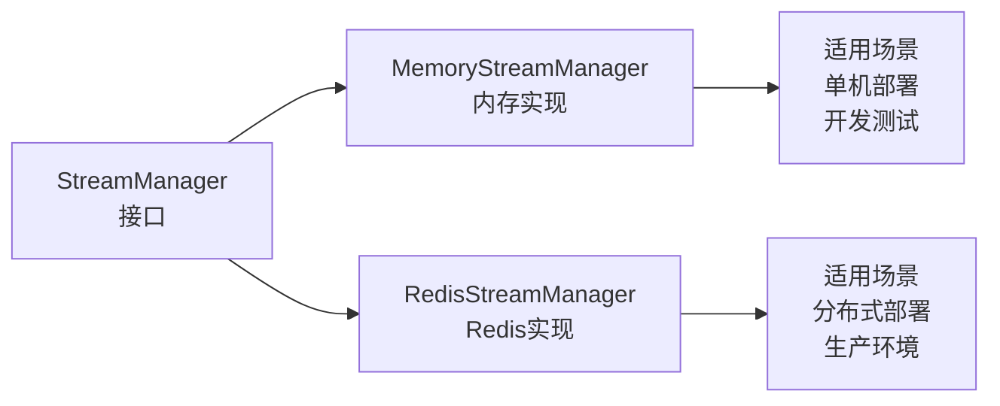
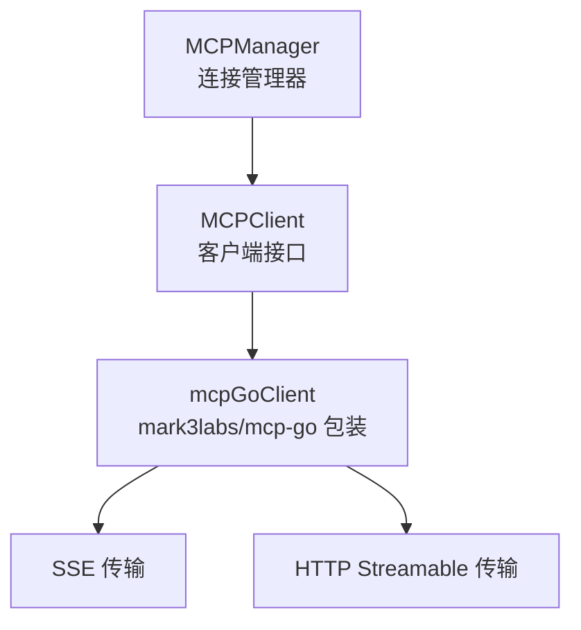
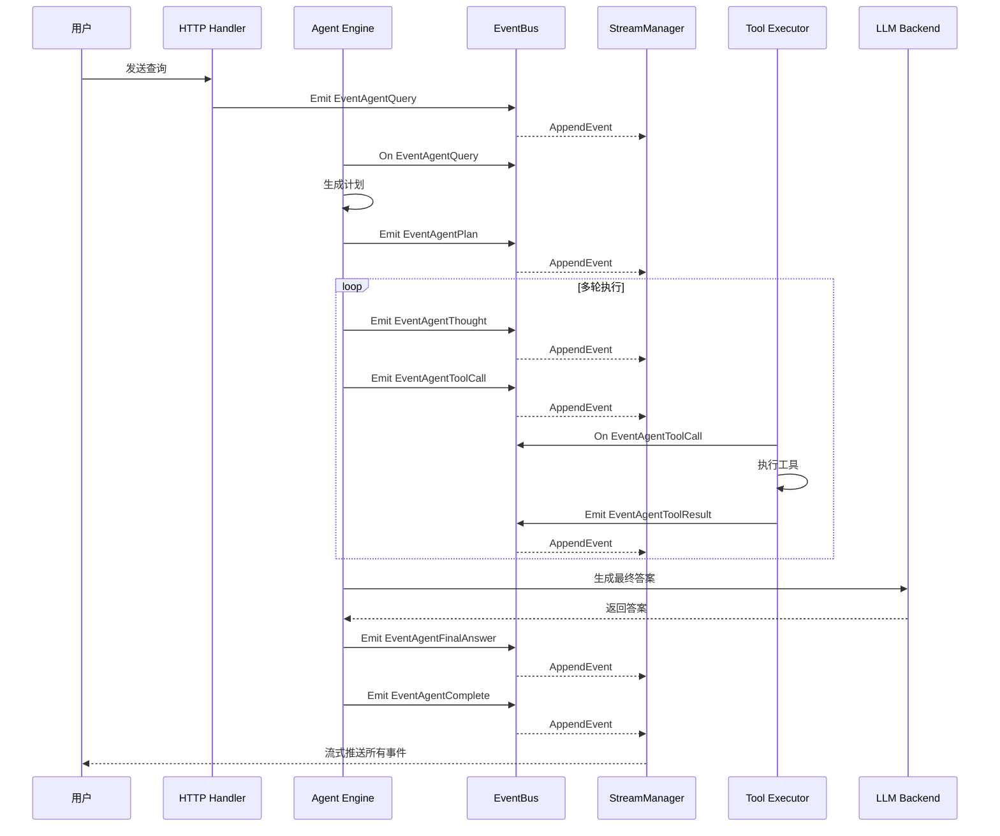
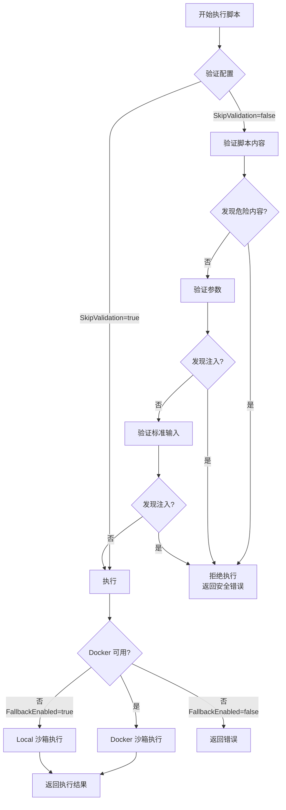
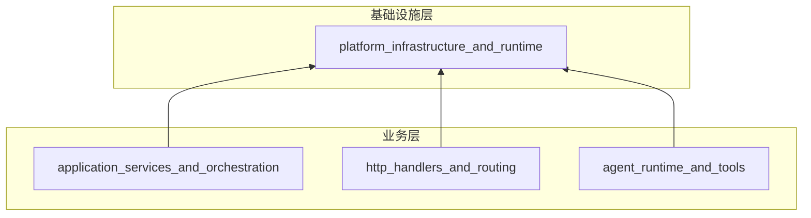

# platform_infrastructure_and_runtime 模块技术深度解析

## 1. 模块概述

**platform_infrastructure_and_runtime** 是整个系统的基础设施核心，它提供了应用程序运行所需的跨领域支持能力。如果将整个系统比作一座城市，这个模块就是城市的"市政基础设施"——包括电网、供水系统、通讯网络、公共安全系统等。它不直接处理业务逻辑，但没有它，业务系统将无法运行。

### 核心价值主张

这个模块解决了以下关键问题：
- **配置管理**：如何统一管理多环境、多租户的复杂配置？
- **事件驱动**：如何实现松耦合的组件间通信？
- **安全执行**：如何安全地运行不可信的代码和脚本？
- **流状态管理**：如何处理长连接会话的状态持久化？
- **安全防护**：如何防止 SQL 注入、SSRF、XSS 等常见安全威胁？
- **MCP 集成**：如何标准化地连接外部服务和工具？

## 2. 架构概览

```mermaid
graph TB
    subgraph "配置层"
        Config[Config 配置中心]
        PromptTemplates[PromptTemplatesConfig]
        TenantConfig[TenantConfig]
        ModelConfig[ModelConfig]
    end
    
    subgraph "通信层"
        EventBus[EventBus 事件总线]
        EventBusAdapter[EventBusAdapter]
    end
    
    subgraph "执行层"
        SandboxManager[SandboxManager]
        DockerSandbox[DockerSandbox]
        LocalSandbox[LocalSandbox]
        ScriptValidator[ScriptValidator]
    end
    
    subgraph "流状态层"
        MemoryStreamManager[MemoryStreamManager]
        RedisStreamManager[RedisStreamManager]
    end
    
    subgraph "集成层"
        MCPManager[MCPManager]
        MCPClient[MCPClient]
    end
    
    subgraph "安全层"
        SQLValidator[SQLValidator]
        SSRFSafeHTTPClient[SSRFSafeHTTPClient]
        XSSSanitizer[XSS 防护]
    end
    
    subgraph "工具层"
        ResourceCleaner[ResourceCleaner]
        CustomFormatter[CustomFormatter]
        ScoreComparable[ScoreComparable]
    end
    
    Config --> PromptTemplates
    Config --> TenantConfig
    Config --> ModelConfig
    
    EventBus --> EventBusAdapter
    
    SandboxManager --> DockerSandbox
    SandboxManager --> LocalSandbox
    SandboxManager --> ScriptValidator
```



### 架构设计理念

这个模块采用了**分层基础设施**的设计模式，将不同关注点的基础设施能力清晰分离：

1. **配置层**：位于最底层，提供全局配置支持
2. **通信层**：实现组件间的解耦通信
3. **执行层**：提供安全的代码执行环境
4. **流状态层**：管理长会话的状态持久化
5. **集成层**：标准化外部服务连接
6. **安全层**：提供全方位的安全防护
7. **工具层**：提供通用的辅助能力

## 3. 核心组件详解

### 3.1 配置系统（Config）

#### 设计意图

配置系统采用了"**单一配置源**"的设计理念，将应用程序的所有配置聚合到一个 `Config` 结构体中。这种设计解决了以下问题：

- **配置分散**：不再需要在代码库中四处查找配置
- **环境不一致**：通过统一的加载机制确保多环境配置一致
- **类型安全**：使用强类型结构体替代字符串键值对

#### 核心组件

```go
// Config 是应用程序总配置，聚合了所有子系统的配置
type Config struct {
    Conversation    *ConversationConfig    // 对话服务配置
    Server          *ServerConfig          // 服务器配置
    KnowledgeBase   *KnowledgeBaseConfig   // 知识库配置
    Tenant          *TenantConfig          // 租户配置
    Models          []ModelConfig          // 模型配置列表
    VectorDatabase  *VectorDatabaseConfig  // 向量数据库配置
    DocReader       *DocReaderConfig       // 文档阅读器配置
    StreamManager   *StreamManagerConfig   // 流管理器配置
    ExtractManager  *ExtractManagerConfig  // 抽取管理器配置
    WebSearch       *WebSearchConfig       // 网络搜索配置
    PromptTemplates *PromptTemplatesConfig // 提示词模板配置
}
```

#### 设计亮点

1. **环境变量注入**：支持 `${ENV_VAR}` 语法在 YAML 配置中引用环境变量，敏感信息（如密码）不需要提交到代码库
2. **提示词模板分离**：将提示词模板从主配置中分离到独立文件，支持热加载和版本控制
3. **租户级配置**：通过 `TenantConfig` 支持多租户场景下的差异化配置

#### 使用示例

```go
// 加载配置（会自动处理环境变量替换）
cfg, err := config.LoadConfig()
if err != nil {
    log.Fatalf("Failed to load config: %v", err)
}

// 访问具体配置
fmt.Printf("Server port: %d\n", cfg.Server.Port)
fmt.Printf("Max conversation rounds: %d\n", cfg.Conversation.MaxRounds)
```

---

### 3.2 事件总线（EventBus）

#### 设计意图

事件总线采用了**发布-订阅模式**，解决了组件间紧耦合的问题。在一个复杂系统中，如果组件直接相互调用，会导致：

- 代码耦合度高，难以测试和维护
- 难以添加新的观察者
- 同步调用导致性能瓶颈

EventBus 通过"fire-and-forget"的模式，让组件间通过事件进行通信，而不是直接依赖。

#### 核心设计

```go
// EventBus 管理事件的发布和订阅
type EventBus struct {
    mu        sync.RWMutex
    handlers  map[EventType][]EventHandler
    asyncMode bool // 支持同步和异步两种模式
}
```

#### 事件类型设计

系统定义了完整的事件类型谱系，覆盖了整个对话流程：

```go
// 查询处理事件
EventQueryReceived   // 用户查询到达
EventQueryRewrite    // 查询改写
EventQueryRewritten  // 查询改写完成

// 检索事件
EventRetrievalStart    // 检索开始
EventRetrievalVector   // 向量检索
EventRetrievalComplete // 检索完成

// Agent 事件
EventAgentPlan     // Agent 计划生成
EventAgentStep     // Agent 步骤执行
EventAgentTool     // Agent 工具调用
EventAgentComplete // Agent 完成

// 流式事件（用于实时反馈）
EventAgentThought     // Agent 思考过程
EventAgentToolCall    // 工具调用通知
EventAgentToolResult  // 工具结果
EventAgentFinalAnswer // 最终答案
```

#### 同步 vs 异步模式

EventBus 支持两种处理模式，这是一个重要的设计权衡：

| 模式 | 优点 | 缺点 | 适用场景 |
|------|------|------|----------|
| 同步 | 错误可传递、执行顺序可控 | 阻塞调用者、性能瓶颈 | 需要确认处理完成的场景 |
| 异步 | 非阻塞、高吞吐量 | 错误处理复杂、顺序不保证 | 日志、监控、通知等场景 |

#### 适配器模式

为了避免循环依赖，设计了 `EventBusAdapter`：

```go
// EventBusAdapter 将 *EventBus 适配为 types.EventBusInterface
type EventBusAdapter struct {
    bus *EventBus
}
```

这是一个经典的**依赖倒置**应用——核心业务逻辑依赖于抽象接口（`types.EventBusInterface`），而不是具体实现。

---

### 3.3 沙箱执行系统（Sandbox）

#### 设计意图

沙箱系统是安全执行不可信代码的基础设施。在 AI 应用中，我们经常需要执行用户提供的脚本、调用外部工具，这带来了巨大的安全风险。

沙箱系统的设计目标是：
- **隔离性**：执行环境与宿主系统隔离
- **可控性**：可以限制资源使用（CPU、内存、网络）
- **可观测性**：可以监控执行过程和结果
- **可恢复性**：出现问题时可以快速清理

#### 多层安全架构

沙箱系统采用了**纵深防御**的设计，不是依赖单一的安全机制，而是多层叠加：

```
第一层：脚本验证
   ↓
第二层：命令白名单
   ↓
第三层：沙箱执行（Docker/Local）
   ↓
第四层：资源限制
```

#### 核心组件

```go
// Sandbox 定义了隔离脚本执行的接口
type Sandbox interface {
    Execute(ctx context.Context, config *ExecuteConfig) (*ExecuteResult, error)
    Cleanup(ctx context.Context) error
    Type() SandboxType
    IsAvailable(ctx context.Context) bool
}
```

#### Docker Sandbox 设计

Docker 沙箱是首选的执行环境，它提供了最强的隔离性：

```go
// DockerSandbox 使用 Docker 容器实现 Sandbox 接口
type DockerSandbox struct {
    config *Config
}
```

**安全特性**：
- 非 root 用户运行：`--user 1000:1000`
- 丢弃所有能力：`--cap-drop ALL`
- 只读文件系统：`--read-only`（可选）
- 资源限制：内存、CPU、PID 数量
- 网络隔离：默认禁用网络
- 无新权限：`--security-opt no-new-privileges`

#### Local Sandbox 设计

Local Sandbox 是 Docker 不可用时的降级方案，它提供了基本的隔离：

```go
// LocalSandbox 使用本地进程隔离实现 Sandbox 接口
type LocalSandbox struct {
    config *Config
}
```

**安全特性**：
- 命令白名单验证
- 工作目录限制
- 环境变量过滤
- 超时强制执行

#### 脚本验证器（ScriptValidator）

在执行脚本之前，`ScriptValidator` 会进行全面的安全检查：

```go
// ScriptValidator 验证脚本和参数的安全性
type ScriptValidator struct {
    dangerousCommands     []string
    dangerousPatterns     []*regexp.Regexp
    argInjectionPatterns  []*regexp.Regexp
}
```

**检查内容**：
- 危险命令检测（`rm -rf /`、`mkfs` 等）
- 危险模式检测（Base64 编码 payload、eval 执行等）
- 网络访问尝试检测
- 反向 shell 模式检测
- 参数注入检测
- 标准输入注入检测

#### 管理器的降级策略

`DefaultManager` 实现了智能的降级策略：

```go
// initializeSandbox 根据配置创建和配置沙箱
func (m *DefaultManager) initializeSandbox(ctx context.Context) error {
    switch m.config.Type {
    case SandboxTypeDocker:
        dockerSandbox := NewDockerSandbox(m.config)
        if dockerSandbox.IsAvailable(ctx) {
            m.sandbox = dockerSandbox
            // 异步预拉取镜像
            go func() {
                dockerSandbox.EnsureImage(context.Background())
            }()
            return nil
        }
        
        // 如果 Docker 不可用且启用了降级，则使用 Local
        if m.config.FallbackEnabled {
            m.sandbox = NewLocalSandbox(m.config)
            return nil
        }
        
        return fmt.Errorf("docker is not available and fallback is disabled")
    // ...
    }
}
```

---

### 3.4 流状态管理（Stream Managers）

#### 设计意图

在长连接的对话场景中，需要维护流式输出的状态。传统的 HTTP 请求-响应模式无法满足实时反馈的需求，因此需要一个专门的流状态管理系统。

设计目标：
- **支持长轮询**：客户端可以从断点继续获取事件
- **可扩展**：支持单机内存和分布式 Redis 两种后端
- **自动清理**：过期数据自动清理，避免内存泄漏

#### 双重实现策略

系统提供了两种流状态管理器实现，适应不同的部署场景：



#### MemoryStreamManager 设计

```go
// MemoryStreamManager 使用内存存储实现 StreamManager
type MemoryStreamManager struct {
    // 映射: sessionID -> messageID -> stream data
    streams map[string]map[string]*memoryStreamData
    mu      sync.RWMutex
}
```

**特点**：
- 零延迟，高性能
- 无外部依赖
- 进程重启数据丢失
- 适合单机部署

#### RedisStreamManager 设计

```go
// RedisStreamManager 使用 Redis Lists 实现追加式事件流
type RedisStreamManager struct {
    client *redis.Client
    ttl    time.Duration // Redis 中流数据的 TTL
    prefix string        // Redis 键前缀
}
```

**特点**：
- 数据持久化，进程重启不丢失
- 支持分布式部署
- 依赖 Redis 服务
- 有网络开销

**关键实现细节**：
- 使用 Redis List 的 `RPUSH` 实现追加（O(1) 操作）
- 使用 `LRANGE` 实现从偏移量读取
- 自动设置 TTL，避免数据无限增长

---

### 3.5 MCP（Model Context Protocol）集成

#### 设计意图

MCP（Model Context Protocol）是连接 AI 代理与外部工具和数据源的开放协议。这个模块提供了标准化的 MCP 客户端实现，解决了以下问题：

- **协议复杂性**：封装了 MCP 协议的复杂性，提供简洁的接口
- **连接管理**：自动处理连接的建立、维护和重连
- **安全性**：禁用了有安全风险的 Stdio 传输，只允许 SSE 和 HTTP Streamable
- **资源池化**：复用连接，避免频繁创建销毁

#### 核心架构



#### MCPManager 设计

```go
// MCPManager 管理 MCP 客户端连接
type MCPManager struct {
    clients   map[string]MCPClient // serviceID -> client
    clientsMu sync.RWMutex
    ctx       context.Context
    cancel    context.CancelFunc
}
```

**关键特性**：
- 连接池化：通过 `serviceID` 缓存和复用连接
- 生命周期管理：有专用的 goroutine 清理空闲连接
- 优雅关闭：`Shutdown()` 方法确保资源正确释放

**安全决策**：
```go
// Stdio 传输因安全原因被禁用（潜在的命令注入漏洞）
if service.TransportType == types.MCPTransportStdio {
    return nil, fmt.Errorf("stdio transport is disabled for security reasons; please use SSE or HTTP Streamable transport instead")
}
```

这是一个重要的安全权衡——Stdio 传输虽然灵活，但风险太高，因此被明确禁用。

#### MCPClient 接口

```go
// MCPClient 定义了 MCP 客户端实现的接口
type MCPClient interface {
    Connect(ctx context.Context) error
    Disconnect() error
    Initialize(ctx context.Context) (*InitializeResult, error)
    ListTools(ctx context.Context) ([]*types.MCPTool, error)
    ListResources(ctx context.Context) ([]*types.MCPResource, error)
    CallTool(ctx context.Context, name string, args map[string]interface{}) (*CallToolResult, error)
    ReadResource(ctx context.Context, uri string) (*ReadResourceResult, error)
    IsConnected() bool
    GetServiceID() string
}
```

---

### 3.6 安全工具箱

#### 设计意图

这个模块提供了全面的安全防护工具，解决了 Web 应用中最常见的安全威胁：
- SQL 注入
- SSRF（服务端请求伪造）
- XSS（跨站脚本攻击）
- 日志注入

这些工具不是零散的函数，而是有体系的安全层。

#### SQL 验证器（SQLValidator）

SQL 验证器是一个特别精巧的设计，它不只是简单的模式匹配，而是**使用 PostgreSQL 官方解析器进行语法分析**。

```go
// ParseSQL 使用 pg_query_go 解析 SQL 语句
func ParseSQL(sql string) *SQLParseResult {
    // 使用 PostgreSQL 官方解析器，而不是正则表达式
    parseResult, err := pg_query.Parse(sql)
    // ...
}
```

**多层验证策略**：
1. **输入验证**：长度、空字节检查
2. **语法解析**：使用 PostgreSQL 解析器确保是合法 SQL
3. **语句类型**：只允许 SELECT 语句
4. **表名白名单**：只能访问指定的表
5. **函数白名单**：只允许安全的函数
6. **子查询禁止**：防止复杂的注入攻击
7. **CTE 禁止**：防止 WITH 子句注入
8. **系统列禁止**：防止访问 xmin、xmax 等系统列
9. **租户隔离**：自动注入 `tenant_id` 条件

**租户隔离注入**：
```go
// injectTenantConditions 向查询添加 tenant_id 过滤
func (v *sqlValidator) injectTenantConditions(sql string, tablesInQuery map[string]string) string {
    // 构建租户条件
    var conditions []string
    for tableName, alias := range tablesInQuery {
        if v.tablesWithTenantID[tableName] {
            conditions = append(conditions, fmt.Sprintf("%s.tenant_id = %d", alias, v.tenantID))
        }
    }
    // ...
}
```

这是一个**深度防御**的例子——即使前面的验证都被绕过，租户隔离仍然能防止跨租户数据访问。

#### SSRF 防护

SSRF（服务端请求伪造）是一个常见但难以防护的攻击。这个模块提供了全面的 SSRF 防护：

```go
// IsSSRFSafeURL 验证 URL 以防止 SSRF 攻击
func IsSSRFSafeURL(rawURL string) (bool, string) {
    // 1. 协议检查：只允许 http/https
    // 2. 主机名检查：禁止 restrictedHostnames
    // 3. 主机名后缀检查：禁止 .local、.internal 等
    // 4. 直接 IP 禁止：完全禁止 IP 地址访问
    // 5. IP 格式检查：禁止 octal、hex、decimal 等伪装格式
    // 6. DNS 解析检查：解析后检查 IP 是否在受限范围
    // 7. 端口检查：禁止敏感端口
}
```

**严格模式决策**：
```go
// 严格模式：完全禁止 URL 中的 IP 地址
// 这可以防止所有基于 IP 的 SSRF 攻击，包括边界情况和绕过
ip := net.ParseIP(hostname)
if ip != nil {
    return false, "direct IP address access is not allowed, use domain name instead"
}
```

这是一个**安全优先**的设计决策——可用性有所降低，但安全得到了保证。

#### SSRF 安全 HTTP 客户端

不仅仅是验证 URL，还提供了自定义的 HTTP 客户端：

```go
// NewSSRFSafeHTTPClient 创建一个验证重定向目标的 HTTP 客户端
func NewSSRFSafeHTTPClient(config SSRFSafeHTTPClientConfig) *http.Client {
    transport := &http.Transport{
        // 使用自定义 DialContext，在连接前验证解析的 IP
        DialContext: ssrfSafeDialContext,
    }
    
    return &http.Client{
        Transport: transport,
        CheckRedirect: func(req *http.Request, via []*http.Request) error {
            // 验证重定向目标
            redirectURL := req.URL.String()
            if safe, reason := IsSSRFSafeURL(redirectURL); !safe {
                return fmt.Errorf("%w: %s", ErrSSRFRedirectBlocked, reason)
            }
            return nil
        },
    }
}
```

这是**深度防御**的另一个例子——即使 URL 验证通过，重定向和拨号阶段仍然有防护。

---

## 4. 关键设计决策与权衡

### 4.1 配置管理：集中式 vs 分布式

**决策**：采用集中式配置管理，所有配置聚合到单个 `Config` 结构体

**权衡分析**：

| 方面 | 集中式（选择） | 分布式 |
|------|----------------|--------|
| 可见性 | 高，一处查看所有配置 | 低，分散在各处 |
| 一致性 | 易保证 | 易出现不一致 |
| 耦合性 | 较高，模块依赖总配置 | 较低，模块只依赖自己的配置 |
| 灵活性 | 较低，添加配置需要修改结构体 | 较高，可以独立扩展 |

**为什么选择集中式**：
- 对于 AI 应用，配置的一致性和可见性比灵活性更重要
- 可以通过接口抽象来降低耦合（模块只依赖自己需要的配置子集）

### 4.2 事件总线：同步 vs 异步默认

**决策**：默认使用同步模式，异步模式可选

**权衡分析**：

| 模式 | 优点 | 缺点 |
|------|------|------|
| 同步（默认） | 错误可传递、执行顺序可控 | 阻塞调用者、性能瓶颈 |
| 异步 | 非阻塞、高吞吐量 | 错误处理复杂、顺序不保证 |

**为什么选择同步作为默认**：
- 安全性和可预测性优先于性能
- 同步模式更容易调试和推理
- 对于关键路径（如 Agent 执行），需要确认处理完成

### 4.3 沙箱：Docker 优先，Local 降级

**决策**：Docker 作为首选，Local 作为降级方案

**权衡分析**：

| 方案 | 隔离性 | 性能 | 依赖 | 安全性 |
|------|--------|------|------|--------|
| Docker（首选） | 强 | 中 | 需要 Docker | 高 |
| Local（降级） | 弱 | 高 | 无外部依赖 | 中 |

**为什么选择这个组合**：
- 安全优先，Docker 提供最强隔离
- 但不能假设所有环境都有 Docker，需要降级方案
- 降级方案需要明确标注安全风险

### 4.4 流状态：内存 vs Redis 双重实现

**决策**：同时提供内存和 Redis 两种实现，让用户选择

**权衡分析**：

| 实现 | 性能 | 持久化 | 分布式 | 适用场景 |
|------|------|--------|--------|----------|
| Memory | 极高 | 无 | 不支持 | 单机、开发测试 |
| Redis | 高 | 有 | 支持 | 生产、分布式 |

**为什么提供双重实现**：
- 不同场景有不同需求
- 开发时不想依赖 Redis
- 生产时需要持久化和分布式
- 通过接口抽象，切换实现无需修改业务代码

### 4.5 SSRF 防护：禁止直接 IP 访问

**决策**：完全禁止 URL 中的 IP 地址，只允许域名

**权衡分析**：

| 策略 | 安全性 | 可用性 |
|------|--------|--------|
| 禁止 IP（选择） | 高 | 中（某些合法场景受影响） |
| 允许 IP + 检查 | 中（有绕过风险） | 高 |

**为什么选择禁止 IP**：
- IP 伪装技术太多（octal、hex、decimal、IPv4-mapped IPv6 等）
- 完全禁止是最可靠的方式
- 合法的 IP 使用场景可以通过域名 workaround

---

## 5. 数据流与典型用例

### 5.1 Agent 执行的完整事件流

让我们通过一个典型的 Agent 执行场景，看看事件总线如何串联各个组件：



### 5.2 沙箱执行的完整流程



---

## 6. 与其他模块的依赖关系

`platform_infrastructure_and_runtime` 是一个**基础设施模块**，它被其他模块依赖，而不依赖其他业务模块。



### 关键依赖点

1. **配置依赖**：几乎所有模块都依赖 `Config` 来获取配置
2. **事件依赖**：业务模块通过 `EventBus` 进行通信
3. **沙箱依赖**：Agent 运行时依赖沙箱执行代码
4. **流状态依赖**：HTTP 处理器依赖流管理器推送实时更新
5. **安全依赖**：数据访问层依赖 SQL 验证器防止注入

---

## 7. 新贡献者指南

### 7.1 首先要理解的概念

1. **接口驱动设计**：这个模块大量使用接口来解耦，如 `Sandbox`、`MCPClient`、`StreamManager`
2. **配置加载流程**：理解 `LoadConfig()` 如何处理环境变量和提示词模板
3. **事件总线模式**：理解发布-订阅模式如何工作
4. **深度防御**：理解安全模块的多层防护策略

### 7.2 常见陷阱

#### 陷阱 1：忘记在 EventBus 中生成 ID

**问题**：
```go
// 错误示例
event := Event{
    Type: EventAgentThought,
    Data: data,
}
bus.Emit(ctx, event) // ID 为空！
```

**正确做法**：
```go
// 正确示例 - Emit 会自动生成 ID
event := NewEvent(EventAgentThought, data)
bus.Emit(ctx, event)
```

#### 陷阱 2：SQL 验证器的租户隔离需要手动启用

**问题**：
```go
// 错误示例 - 忘记启用租户隔离
parseResult, validation := ValidateSQL(sql, WithAllowedTables("knowledges"))
```

**正确做法**：
```go
// 正确示例 - 使用安全默认值，包含租户隔离
parseResult, validation := ValidateSQL(sql, WithSecurityDefaults(tenantID))
```

#### 陷阱 3：MCP 的 Stdio 传输已被禁用

**问题**：
```go
// 错误示例 - 尝试使用 Stdio 传输
service.TransportType = types.MCPTransportStdio
client, err := mcpManager.GetOrCreateClient(service) // 会失败！
```

**正确做法**：
```go
// 正确示例 - 使用 SSE 或 HTTP Streamable
service.TransportType = types.MCPTransportSSE
client, err := mcpManager.GetOrCreateClient(service)
```

#### 陷阱 4：ResourceCleaner 的清理顺序是反向的

**问题**：
```go
// 注册顺序：先 A，再 B，再 C
cleaner.Register(cleanupA)
cleaner.Register(cleanupB)
cleaner.Register(cleanupC)

// 执行顺序：C → B → A（可能不是你想要的！）
cleaner.Cleanup(ctx)
```

**注意**：清理函数按注册的**反向**顺序执行，这类似 defer 的行为。

### 7.3 扩展点

#### 扩展点 1：添加新的沙箱实现

如果需要支持新的沙箱类型（如 gVisor、Kata Containers）：

1. 实现 `Sandbox` 接口
2. 在 `DefaultManager.initializeSandbox()` 中添加支持
3. 更新 `SandboxType` 枚举

#### 扩展点 2：添加新的流状态后端

如果需要支持新的流状态存储（如 Kafka、Pulsar）：

1. 实现 `interfaces.StreamManager` 接口
2. 在配置中添加新的类型选项
3. 在初始化代码中添加分支

#### 扩展点 3：自定义 SQL 验证规则

如果需要添加特定的 SQL 验证规则：

1. 创建新的 `SQLValidationOption` 函数
2. 在 `validateSelectStmt()` 或 `validateNode()` 中添加检查
3. 可以使用 `WithSecurityDefaults()` 组合多个选项

---

## 8. 子模块详解

本模块包含以下子模块，每个子模块都有详细的技术文档：

### 8.1 运行时配置与引导
[runtime_configuration_and_bootstrap](platform_infrastructure_and_runtime-runtime_configuration_and_bootstrap.md) - 深入探讨配置系统的设计、环境变量处理、提示词模板管理等。

### 8.2 事件总线与 Agent 运行时事件契约
[event_bus_and_agent_runtime_event_contracts](platform_infrastructure_and_runtime-event_bus_and_agent_runtime_event_contracts.md) - 详细解析事件总线的实现、事件类型体系、适配器模式的应用。

### 8.3 MCP 连接与协议模型
[mcp_connectivity_and_protocol_models](platform_infrastructure_and_runtime-mcp_connectivity_and_protocol_models.md) - 深入了解 MCP 协议集成、连接管理、安全策略。

### 8.4 沙箱执行与脚本安全
[sandbox_execution_and_script_safety](platform_infrastructure_and_runtime-sandbox_execution_and_script_safety.md) - 全面解析沙箱系统的多层安全架构、Docker/Local 双实现、脚本验证器。

### 8.5 流状态后端
[stream_state_backends](platform_infrastructure_and_runtime-stream_state_backends.md) - 详细对比内存和 Redis 两种流状态实现的设计、优缺点、适用场景。

### 8.6 平台工具、生命周期、可观测性与安全
[platform_utilities_lifecycle_observability_and_security](platform_infrastructure_and_runtime-platform_utilities_lifecycle_observability_and_security.md) - 深入了解资源清理、日志格式化、SQL 验证、SSRF 防护等安全工具。

## 9. 总结

`platform_infrastructure_and_runtime` 模块是整个系统的"基础设施骨架"，它提供了：

- **配置管理**：统一、类型安全、环境感知的配置系统
- **事件驱动**：同步/异步双模式的事件总线
- **安全执行**：多层防护的沙箱系统
- **流状态管理**：内存/Redis 双实现的流状态管理
- **MCP 集成**：标准化的外部服务连接
- **安全防护**：全方位的 SQL 注入、SSRF、XSS 防护

这个模块的设计哲学是：
- **安全优先**：在安全和可用性之间，优先选择安全
- **深度防御**：不依赖单一安全机制，多层叠加
- **接口驱动**：通过接口抽象，实现可替换性
- **权衡明确**：每个设计决策都有明确的权衡分析

对于新加入的团队成员，理解这个模块是理解整个系统的关键——它不是业务逻辑，但它是业务逻辑赖以运行的基础。
