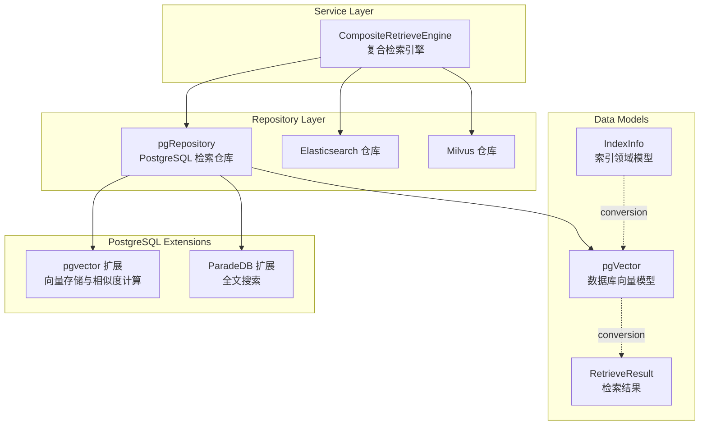
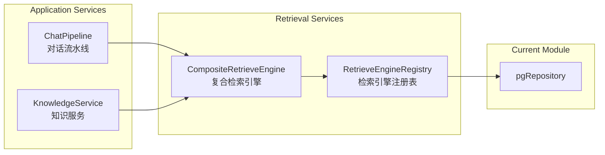
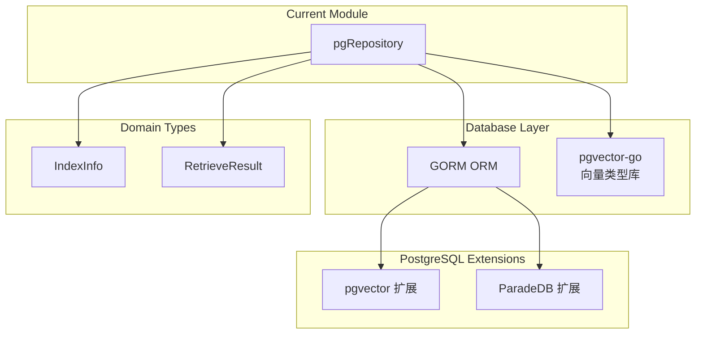

# PostgreSQL 检索仓库实现深度解析

## 概述：为什么需要这个模块

想象一下，你正在构建一个企业级知识库问答系统。用户输入一个问题，系统需要在毫秒级时间内从数百万文档片段中找到最相关的内容。这时候你有两个选择：

1. **简单方案**：用普通的 `LIKE '%keyword%'` 查询 —— 但这既慢又不准确，无法理解语义
2. **专业方案**：引入专门的向量数据库（如 Milvus、Qdrant）—— 但这意味着额外的基础设施、运维成本和系统复杂性

`postgres_retrieval_repository_implementation` 模块走的是第三条路：**把 PostgreSQL 变成向量检索引擎**。通过 `pgvector` 扩展存储和查询向量，通过 `ParadeDB` 扩展实现全文搜索，这个模块让团队能够用单一数据库同时处理关系型数据和向量检索，显著降低了架构复杂度。

这个模块的核心价值在于：
- **统一技术栈**：不需要维护独立的向量数据库集群
- **混合检索能力**：同时支持关键词搜索（全文检索）和向量相似度搜索（语义检索）
- **事务一致性**：向量数据和业务数据可以在同一事务中更新，避免数据不一致
- **成本效益**：利用现有的 PostgreSQL 基础设施，无需额外硬件投入

但这也带来了独特的挑战：PostgreSQL 本质上不是为向量检索设计的，如何在关系型数据库上实现高效的向量搜索？如何在保证查询性能的同时支持复杂的多维度过滤？这就是本模块要解决的核心问题。

## 架构全景：模块在系统中的位置



### 数据流 walkthrough

当用户发起一次知识检索请求时，数据流经本模块的典型路径如下：

1. **请求入口**：`CompositeRetrieveEngine` 根据租户配置选择合适的检索引擎（PostgreSQL、Elasticsearch 或 Milvus）
2. **参数传递**：`RetrieveParams` 对象携带查询文本、向量嵌入、过滤条件（知识库 ID、标签 ID 等）、TopK 和阈值
3. **路由分发**：`pgRepository.Retrieve()` 根据 `RetrieverType` 路由到 `KeywordsRetrieve` 或 `VectorRetrieve`
4. **查询执行**：
   - 关键词搜索：使用 ParadeDB 的 `paradedb.match()` 函数进行全文检索
   - 向量搜索：使用 pgvector 的 `<=>` 操作符计算余弦距离，利用 HNSW 索引加速
5. **结果转换**：`pgVectorWithScore` → `IndexWithScore` → `RetrieveResult`
6. **返回上层**：检索结果返回给服务层进行重排序、融合等后续处理

## 核心组件深度解析

### pgRepository：PostgreSQL 检索的实现中枢

`pgRepository` 是整个模块的核心结构体，它实现了 `interfaces.RetrieveEngineRepository` 接口。这个设计遵循了**仓库模式（Repository Pattern）**，将数据访问逻辑封装在统一的接口背后，上层服务无需关心底层是 PostgreSQL 还是其他向量数据库。

```go
type pgRepository struct {
    db *gorm.DB // Database connection
}
```

#### 设计意图

为什么使用 `*gorm.DB` 而不是原生 `*sql.DB`？这里体现了几个设计考量：

1. **ORM 便利性**：GORM 提供了链式调用、自动映射、事务管理等高级功能，减少了样板代码
2. **混合查询需求**：本模块既需要 ORM 的便利性（如 `Create`、`Delete`），也需要原生 SQL 的性能（向量搜索的复杂查询），GORM 允许两者混用
3. **团队技术栈统一**：项目中其他仓库层也使用 GORM，保持一致性降低认知负担

但这也带来了 tradeoff：GORM 的抽象层会损失一些性能，对于极度敏感的向量检索路径，模块选择了在关键查询上使用 `Raw()` 原生 SQL 来绕过 ORM 开销。

#### 关键方法详解

##### Retrieve()：检索请求的路由器

```go
func (g *pgRepository) Retrieve(ctx context.Context, params types.RetrieveParams) ([]*types.RetrieveResult, error)
```

这个方法的核心职责是**策略路由**。它检查 `params.RetrieverType` 并分发到具体的实现：

- `KeywordsRetrieverType` → `KeywordsRetrieve()`
- `VectorRetrieverType` → `VectorRetrieve()`

这种设计体现了**开闭原则**：如果需要支持新的检索类型（比如混合检索），只需添加新的 case 分支，无需修改现有逻辑。

##### KeywordsRetrieve()：全文搜索的实现

关键词检索使用 ParadeDB 扩展，这是 PostgreSQL 的一个全文搜索增强插件。关键代码片段：

```go
conds = append(conds, clause.Expr{
    SQL:  "id @@@ paradedb.match(field => 'content', value => ?, distance => 1)",
    Vars: []interface{}{params.Query},
})
```

这里的 `@@@` 是 ParadeDB 的自定义操作符，用于全文匹配。`distance => 1` 参数控制匹配的宽松程度。

**过滤条件的 AND 逻辑**是一个重要的设计细节：

```go
// KnowledgeBaseIDs 和 KnowledgeIDs 使用 AND 逻辑
// - 如果只有 KnowledgeBaseIDs：搜索整个知识库
// - 如果只有 KnowledgeIDs：搜索特定文档
// - 如果两者都有：在指定知识库内搜索特定文档（AND）
```

这意味着如果用户同时指定了知识库 ID 和文档 ID，系统会取交集而非并集。这种设计符合直觉：当你既指定了"在 A 知识库中"又指定了"文档 B"时，你期望的是"在 A 知识库里的文档 B"，而不是"A 知识库的所有文档 + 文档 B（可能在其他知识库）"。

##### VectorRetrieve()：向量相似度搜索的优化艺术

这是整个模块最复杂、最体现技术深度的方法。让我们逐层剖析其设计思路。

**挑战 1：HNSW 索引与 WHERE 过滤的协同**

PostgreSQL 的 HNSW 索引（通过 pgvector 实现）在纯向量相似度查询上非常快，但一旦加上 WHERE 条件（如 `knowledge_base_id IN (...)`），性能会急剧下降。这是因为 HNSW 索引无法有效利用传统 B-tree 索引的过滤条件。

模块的解决方案是**手动构建参数化查询**：

```go
whereParts := make([]string, 0)
allVars := make([]interface{}, 0)

// 添加查询向量（用于 HNSW 索引的 ORDER BY）
allVars = append(allVars, queryVector)

// 维度过滤器（HNSW 索引 WHERE 子句必需）
whereParts = append(whereParts, fmt.Sprintf("dimension = $%d", len(allVars)+1))
allVars = append(allVars, dimension)
```

注意 `dimension` 过滤器的存在：这是 pgvector HNSW 索引的要求，必须在 WHERE 子句中指定维度才能使用索引。

**挑战 2：阈值过滤与 TopK 的平衡**

一个直观的实现是：

```sql
SELECT * FROM embeddings 
WHERE knowledge_base_id IN (...) 
ORDER BY embedding <=> query_vector 
LIMIT 10
```

但这有个问题：如果前 10 个结果的相似度都低于阈值怎么办？用户期望的是"最多 10 个且都满足阈值"，而不是"不管阈值，硬给 10 个"。

模块的解决方案是**两阶段查询**：

```sql
SELECT ... FROM (
    SELECT ..., embedding <=> query_vector as distance
    FROM embeddings
    WHERE ...
    ORDER BY embedding <=> query_vector
    LIMIT 100  -- 扩大候选集
) AS candidates
WHERE distance <= threshold  -- 外层过滤
ORDER BY distance ASC
LIMIT 10  -- 最终限制
```

这里的关键洞察是：**先扩大候选集（expandedTopK），再过滤，最后截断**。`expandedTopK` 的计算也经过深思熟虑：

```go
expandedTopK := params.TopK * 2
if expandedTopK < 100 {
    expandedTopK = 100 // 最少 100 个候选
}
if expandedTopK > 1000 {
    expandedTopK = 1000 // 最多 1000 个候选
}
```

这个启发式策略平衡了召回率和性能：对于小的 TopK（如 10），扩大 10 倍确保有足够候选；对于大的 TopK（如 500），限制在 1000 避免过度查询。

**挑战 3：避免重复计算向量距离**

向量距离计算（尤其是高维向量）是 CPU 密集型操作。 naive 的实现可能在 SELECT、ORDER BY、WHERE 中各计算一次：

```sql
-- 低效：计算三次
SELECT embedding <=> query_vector as score, ...
FROM embeddings
WHERE embedding <=> query_vector <= threshold
ORDER BY embedding <=> query_vector
```

模块通过子查询结构确保**距离只计算一次**：

```sql
SELECT (1 - distance) as score FROM (
    SELECT ..., embedding <=> query_vector as distance
    FROM ...
    ORDER BY distance
    LIMIT ...
) AS candidates
WHERE distance <= threshold
```

##### CopyIndices()：知识库复制的批处理策略

当用户复制知识库时，需要将所有向量索引从源知识库复制到目标知识库。这个操作面临两个挑战：

1. **内存限制**：如果知识库有 10 万条向量，一次性加载会耗尽内存
2. **ID 映射**：目标知识库的 ChunkID 和 KnowledgeID 与源不同，需要转换

模块采用**分页批处理**策略：

```go
batchSize := 500
offset := 0

for {
    // 分页查询源数据
    var sourceVectors []*pgVector
    g.db.Limit(batchSize).Offset(offset).Find(&sourceVectors)
    
    if len(sourceVectors) == 0 {
        break // 无更多数据
    }
    
    // 转换 ID 映射
    targetVectors := make([]*pgVector, 0, batchCount)
    for _, sourceVector := range sourceVectors {
        targetChunkID, ok := sourceToTargetChunkIDMap[sourceVector.ChunkID]
        // ... 处理映射
    }
    
    // 批量插入
    g.db.Clauses(clause.OnConflict{DoNothing: true}).Create(targetVectors)
    
    offset += batchCount
}
```

**SourceID 的特殊处理**是一个容易踩坑的细节：

```go
// 生成的问题有 SourceID 格式：{chunkID}-{questionID}
// 普通 chunk 的 SourceID == ChunkID
var targetSourceID string
if sourceVector.SourceID == sourceVector.ChunkID {
    targetSourceID = targetChunkID
} else if strings.HasPrefix(sourceVector.SourceID, sourceVector.ChunkID+"-") {
    // 这是生成的问题，保留 questionID 部分
    questionID := strings.TrimPrefix(sourceVector.SourceID, sourceVector.ChunkID+"-")
    targetSourceID = fmt.Sprintf("%s-%s", targetChunkID, questionID)
}
```

这个逻辑确保了从 chunk 生成的 FAQ 问题在复制后仍然保持正确的父子关系。

##### BatchUpdateChunkEnabledStatus() 和 BatchUpdateChunkTagID()：批量更新的分组优化

当用户批量启用/禁用 chunk 或修改标签时，naive 的实现是对每个 chunk 执行一次 UPDATE：

```go
// 低效：N 次查询
for chunkID, enabled := range chunkStatusMap {
    db.Update("is_enabled", enabled).Where("chunk_id = ?", chunkID)
}
```

模块采用**按值分组**策略，将 N 次查询优化为 2 次（启用组和禁用组）：

```go
enabledChunkIDs := make([]string, 0)
disabledChunkIDs := make([]string, 0)

for chunkID, enabled := range chunkStatusMap {
    if enabled {
        enabledChunkIDs = append(enabledChunkIDs, chunkID)
    } else {
        disabledChunkIDs = append(disabledChunkIDs, chunkID)
    }
}

// 2 次查询完成
if len(enabledChunkIDs) > 0 {
    db.Where("chunk_id IN ?", enabledChunkIDs).Update("is_enabled", true)
}
if len(disabledChunkIDs) > 0 {
    db.Where("chunk_id IN ?", disabledChunkIDs).Update("is_enabled", false)
}
```

`BatchUpdateChunkTagID` 更进一步，按 `tagID` 分组，确保每个 tagID 只需一次 UPDATE。

### 数据模型：pgVector 与 pgVectorWithScore

#### pgVector：持久化模型

```go
type pgVector struct {
    ID              uint
    SourceID        string              // 源 ID（chunkID 或 questionID）
    SourceType      int                 // 源类型枚举
    ChunkID         string              // 所属 chunk ID
    KnowledgeID     string              // 所属知识 ID
    KnowledgeBaseID string              // 所属知识库 ID
    TagID           string              // 标签 ID（用于 FAQ 优先级过滤）
    Content         string              // 文本内容（用于关键词搜索）
    Dimension       int                 // 向量维度
    Embedding       pgvector.HalfVector // 半精度向量
    IsEnabled       bool                // 启用状态
}
```

**为什么使用 HalfVector 而不是 FloatVector？**

这是一个空间与精度的权衡：
- `Float32`：每个维度 4 字节，1024 维 = 4KB/向量
- `HalfFloat`：每个维度 2 字节，1024 维 = 2KB/向量

对于百万级向量，这意味著 2GB vs 4GB 的存储差异。经验表明，半精度对于检索任务的精度损失可以忽略不计，但存储和内存带宽节省显著。

#### pgVectorWithScore：查询结果模型

这个结构体扩展了 `pgVector`，添加了 `Score` 字段。它专门用于接收带相似度的查询结果，通过 GORM 的 `Select()` 映射 SQL 计算的分数。

### 转换函数：领域模型与数据库模型的桥梁

#### toDBVectorEmbedding()：IndexInfo → pgVector

这个函数负责将领域层的 `IndexInfo` 转换为数据库层的 `pgVector`。关键设计点：

1. **embedding 数据在 additionalParams 中**：向量数据不直接放在 `IndexInfo` 中，而是通过 `additionalParams["embedding"]` 传递。这种设计分离了元数据和大数据，避免在不需向量时传输大对象。

2. **UTF8 清理**：`common.CleanInvalidUTF8()` 确保内容不包含无效的 UTF-8 序列，防止数据库插入错误。

3. **默认启用**：新创建的索引默认 `IsEnabled = true`，符合"新建即可用"的直觉。

#### fromDBVectorEmbeddingWithScore()：pgVectorWithScore → IndexWithScore

这个函数将查询结果转换回领域模型。注意 `MatchType` 参数由调用者传入（`MatchTypeKeywords` 或 `MatchTypeEmbedding`），因为数据库层不关心匹配类型，这是业务逻辑的概念。

## 依赖关系分析

### 上游调用者



- **CompositeRetrieveEngine**：根据租户配置动态选择检索引擎（PostgreSQL、Elasticsearch、Milvus 等）。它调用 `pgRepository.Retrieve()` 执行实际查询。
- **RetrieveEngineRegistry**：维护 `RetrieverEngineType` 到具体实现的映射，支持运行时扩展。

### 下游依赖



- **GORM**：提供数据库访问抽象，处理连接管理、事务、SQL 生成
- **pgvector-go**：提供 `HalfVector` 类型定义和构造函数
- **pgvector 扩展**：PostgreSQL 服务器端扩展，提供向量类型和相似度计算函数
- **ParadeDB 扩展**：PostgreSQL 服务器端扩展，提供全文搜索能力

### 数据契约

#### 输入：RetrieveParams

```go
type RetrieveParams struct {
    Query             string    // 查询文本（关键词搜索用）
    Embedding         []float32 // 查询向量（向量搜索用）
    KnowledgeBaseIDs  []string  // 知识库 ID 过滤
    KnowledgeIDs      []string  // 文档 ID 过滤
    TagIDs            []string  // 标签 ID 过滤（FAQ 优先级）
    TopK              int       // 返回结果数量
    Threshold         float64   // 相似度阈值（向量搜索用）
    RetrieverType     RetrieverType // 检索类型（Keywords 或 Vector）
}
```

**隐式契约**：
- 当 `RetrieverType = VectorRetrieverType` 时，`Embedding` 必须非空且维度与存储的向量一致
- `KnowledgeBaseIDs` 和 `KnowledgeIDs` 是 AND 关系，不是 OR
- `Threshold` 范围是 [0, 1]，1 表示完全匹配

#### 输出：RetrieveResult

```go
type RetrieveResult struct {
    Results             []*IndexWithScore   // 检索结果
    RetrieverEngineType RetrieverEngineType // 引擎类型（用于结果融合）
    RetrieverType       RetrieverType       // 检索类型（用于指标统计）
    Error               error
}
```

**重要**：即使没有结果，`Results` 也是空切片而非 `nil`，调用者可以安全地 `range` 而无需判空。

## 设计决策与权衡

### 决策 1：为什么选择 PostgreSQL 而不是专用向量数据库？

**选择**：使用 PostgreSQL + pgvector 而非 Milvus/Qdrant

**权衡分析**：

| 维度 | PostgreSQL + pgvector | 专用向量数据库 |
|------|----------------------|----------------|
| 架构复杂度 | 低（单一数据库） | 高（额外集群） |
| 事务支持 | 完整 ACID | 有限或无 |
| 查询灵活性 | 高（SQL 任意过滤） | 中（有限过滤语法） |
| 检索性能 | 中（HNSW 优化后） | 高（专为向量优化） |
| 运维成本 | 低（复用现有设施） | 高（新组件监控备份） |
| 规模上限 | ~千万级向量 | ~十亿级向量 |

**适用场景**：本系统面向企业知识库，向量规模通常在百万级以内，对事务一致性和查询灵活性要求高于极致性能，因此 PostgreSQL 是更合适的选择。

**风险**：如果未来向量规模增长到千万级以上，可能需要迁移到专用向量数据库。模块通过 `RetrieveEngineRepository` 接口抽象降低了迁移成本。

### 决策 2：为什么同时支持关键词和向量检索？

**选择**：在同一个仓库中实现两种检索策略

**原因**：
1. **用户场景多样性**：有些查询适合关键词（如精确的产品型号），有些适合向量（如语义相似的问题）
2. **混合检索需求**：上层服务可以对两种结果进行融合（如 RRF 算法），提升整体召回质量
3. **渐进式迁移**：从传统关键词搜索过渡到向量搜索时，可以并行运行两种策略对比效果

**代价**：代码复杂度增加，需要维护两套查询逻辑。但通过统一的 `Retrieve()` 入口和 `RetrieveParams` 参数结构，这种复杂度被有效封装。

### 决策 3：为什么使用原生 SQL 而非 GORM 构建向量查询？

**选择**：`VectorRetrieve()` 使用 `g.db.Raw()` 而非 GORM 链式调用

**原因**：
1. **HNSW 索引优化**：GORM 无法生成 pgvector 所需的特殊 SQL 结构（子查询 + 距离别名 + 外层过滤）
2. **性能敏感**：向量检索是热点路径，原生 SQL 避免 ORM 的反射和解析开销
3. **参数化安全**：手动构建参数化查询（`$1, $2, ...`）既保证性能又防止 SQL 注入

**风险**：原生 SQL 难以跨数据库移植。但本模块明确定位为 PostgreSQL 专用实现，其他数据库有独立的仓库实现（如 `elasticsearchRepository`、`milvusRepository`）。

### 决策 4：为什么 IsEnabled 字段允许 NULL？

**观察**：查询条件使用 `(is_enabled IS NULL OR is_enabled = true)`

**历史原因**：早期版本的表结构没有 `is_enabled` 字段，后来添加时为了兼容历史数据（NULL 值），查询条件必须同时处理 NULL 和 false。

**改进建议**：未来迁移时可以将历史数据的 NULL 更新为 true，然后添加 `NOT NULL` 约束简化查询。

## 使用指南与最佳实践

### 初始化仓库

```go
import "github.com/Tencent/WeKnora/internal/application/repository/retriever/postgres"

// 假设已有 GORM 数据库连接
db, err := gorm.Open(postgres.Open(dsn), &gorm.Config{})
if err != nil {
    panic(err)
}

// 创建仓库实例
repo := postgres.NewPostgresRetrieveEngineRepository(db)

// 注册到引擎注册表
registry.Register(types.PostgresRetrieverEngineType, repo)
```

### 执行向量检索

```go
params := types.RetrieveParams{
    Query:             "如何重置密码？",
    Embedding:         queryEmbedding, // []float32, 维度必须与存储的一致
    KnowledgeBaseIDs:  []string{"kb-123"},
    TopK:              10,
    Threshold:         0.75, // 余弦相似度阈值
    RetrieverType:     types.VectorRetrieverType,
}

results, err := repo.Retrieve(ctx, params)
if err != nil {
    // 处理错误
}

for _, result := range results {
    fmt.Printf("Chunk: %s, Score: %.4f, Content: %s\n", 
        result.ChunkID, result.Score, result.Content)
}
```

### 批量插入向量

```go
indexInfos := []*types.IndexInfo{
    {
        SourceID:        "chunk-001",
        ChunkID:         "chunk-001",
        KnowledgeID:     "know-001",
        KnowledgeBaseID: "kb-123",
        Content:         "重置密码的步骤...",
    },
    // ... 更多索引
}

additionalParams := map[string]any{
    "embedding": map[string][]float32{
        "chunk-001": embedding1, // 向量数据
        // ... 更多向量
    },
}

err := repo.BatchSave(ctx, indexInfos, additionalParams)
```

### 知识库复制

```go
sourceToTargetKBIDMap := map[string]string{
    "know-001": "know-101",
    "know-002": "know-102",
}

sourceToTargetChunkIDMap := map[string]string{
    "chunk-001": "chunk-201",
    "chunk-002": "chunk-202",
}

err := repo.CopyIndices(
    ctx,
    "kb-source",              // 源知识库 ID
    sourceToTargetKBIDMap,    // 知识 ID 映射
    sourceToTargetChunkIDMap, // Chunk ID 映射
    "kb-target",              // 目标知识库 ID
    768,                      // 向量维度
    "manual",                 // 知识类型
)
```

## 边界情况与陷阱

### 陷阱 1：向量维度不匹配

**问题**：插入的向量维度与查询时指定的维度不一致，导致 HNSW 索引无法使用或查询结果错误。

**症状**：查询性能急剧下降（全表扫描），或返回空结果。

**预防**：
```go
// 在 VectorRetrieve 中，维度从 params.Embedding 推导
dimension := len(params.Embedding)

// WHERE 子句强制维度匹配
whereParts = append(whereParts, fmt.Sprintf("dimension = $%d", len(allVars)+1))
```

确保嵌入模型变更时，历史数据需要重新计算向量或添加维度迁移逻辑。

### 陷阱 2：阈值与 TopK 的交互

**问题**：设置过高的阈值（如 0.95）可能导致返回结果少于 TopK，甚至为空。

**预期行为**：这是设计意图——用户明确要求"只返回相似度 > 0.95 的结果"，如果没有，返回空是正确的。

**建议**：在 UI 上给用户提示"未找到足够相关的结果，请降低相似度要求或调整查询"。

### 陷阱 3：批量操作的内存限制

**问题**：`BatchSave` 一次性加载所有向量到内存，大数据量可能导致 OOM。

**当前限制**：没有内置分页，调用者需要自行分批。

**建议**：
```go
batchSize := 500
for i := 0; i < len(indexInfos); i += batchSize {
    end := min(i+batchSize, len(indexInfos))
    err := repo.BatchSave(ctx, indexInfos[i:end], additionalParams)
}
```

### 陷阱 4：ParadeDB 扩展依赖

**问题**：`KeywordsRetrieve` 依赖 ParadeDB 扩展，如果数据库未安装该扩展，查询会失败。

**症状**：`function paradedb.match(...) does not exist`

**预防**：在初始化时检查扩展：
```sql
SELECT * FROM pg_extension WHERE extname = 'paradedb';
```

### 陷阱 5：HNSW 索引的创建时机

**问题**：HNSW 索引不会自动创建，需要手动创建才能享受性能提升。

**建议**：在数据库迁移脚本中添加：
```sql
CREATE INDEX ON embeddings 
USING hnsw (embedding halfvec_cosine_ops) 
WITH (m = 16, ef_construction = 64);
```

参数 `m` 和 `ef_construction` 需要根据数据规模和性能要求调整。

## 性能优化建议

### 1. 索引策略

确保以下索引存在：
```sql
-- HNSW 向量索引（核心）
CREATE INDEX ON embeddings USING hnsw (embedding halfvec_cosine_ops);

-- 过滤字段索引
CREATE INDEX ON embeddings (knowledge_base_id);
CREATE INDEX ON embeddings (knowledge_id);
CREATE INDEX ON embeddings (tag_id);
CREATE INDEX ON embeddings (is_enabled);
```

### 2. 查询参数调优

- `expandedTopK`：当前实现是 `TopK * 2`，范围 [100, 1000]。对于高阈值场景（>0.9），可以适当扩大。
- `batchSize`（CopyIndices）：当前 500。根据可用内存调整，一般 500-2000 是安全范围。

### 3. 连接池配置

向量检索是 CPU 密集型操作，建议增加连接池大小：
```go
sqlDB, _ := db.DB()
sqlDB.SetMaxOpenConns(50)  // 根据 CPU 核心数调整
sqlDB.SetMaxIdleConns(25)
sqlDB.SetConnMaxLifetime(time.Hour)
```

## 扩展点

### 添加新的检索类型

1. 在 `types.RetrieverType` 中添加新类型
2. 在 `Retrieve()` 中添加新的 case 分支
3. 实现对应的检索方法

### 支持其他向量距离度量

当前使用余弦相似度（`<=>`），如需支持欧氏距离或内积：

```go
// 余弦相似度（当前）
queryVector := pgvector.NewHalfVector(params.Embedding)
// ORDER BY embedding <=> query_vector

// 欧氏距离
queryVector := pgvector.NewHalfVector(params.Embedding)
// ORDER BY embedding <-> query_vector

// 内积
queryVector := pgvector.NewHalfVector(params.Embedding)
// ORDER BY embedding <#> query_vector
```

注意需要同时修改 HNSW 索引的操作符类（`halfvec_cosine_ops` → `halfvec_l2_ops` 等）。

## 相关模块参考

- [RetrieveEngine 接口定义](core_domain_types_and_interfaces.md)：检索引擎的统一接口契约
- [CompositeRetrieveEngine](application_services_and_orchestration.md)：复合检索引擎，负责多引擎路由和结果融合
- [Elasticsearch 检索仓库](data_access_repositories.md)：基于 Elasticsearch 的替代实现
- [Milvus 检索仓库](data_access_repositories.md)：基于 Milvus 的替代实现
- [KnowledgeService](application_services_and_orchestration.md)：知识管理服务，调用检索仓库的上层服务

## 总结

`postgres_retrieval_repository_implementation` 模块展示了如何在关系型数据库上构建高效的向量检索能力。它的核心设计哲学是：

1. **实用主义**：选择 PostgreSQL 不是因为它在向量检索上最强，而是在功能、成本、运维复杂度之间取得最佳平衡
2. **接口抽象**：通过 `RetrieveEngineRepository` 接口隔离上层服务与底层实现，为未来迁移留有余地
3. **性能敏感**：在关键路径上使用原生 SQL 和 HNSW 索引优化，确保查询延迟在可接受范围
4. **渐进式优化**：通过 `expandedTopK`、批处理、分组更新等策略，在不改变架构的前提下持续优化性能

对于新加入的工程师，理解这个模块的关键是把握一个核心矛盾：**PostgreSQL 本质上不是向量数据库，但我们要让它表现得像向量数据库**。所有的优化技巧（HNSW 索引、子查询结构、参数化查询）都是围绕这个矛盾展开的。
