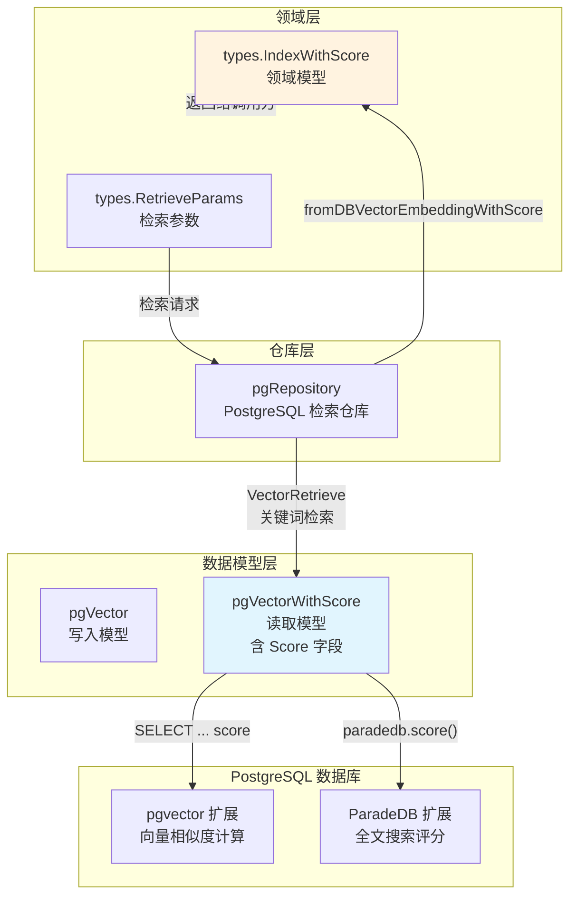

# postgres_scored_vector_result_models 模块深度解析

## 模块概述

想象一下你正在图书馆找书：如果你只关心"找到书"，图书管理员只需告诉你书名和位置；但如果你想知道"这本书与你的需求有多匹配"，管理员就需要额外给出一个**相关度评分**。`postgres_scored_vector_result_models` 模块扮演的就是这个"带评分的图书卡片"角色。

在向量检索系统中，原始的向量数据（`pgVector`）只负责**存储**——它保存嵌入向量、元数据和内容。但当执行相似度搜索时，数据库需要返回每个结果与查询向量的**距离分数**。这个模块定义了 `pgVectorWithScore`，一个专门用于**读取场景**的扩展模型，它在原始向量数据的基础上增加了一个 `Score` 字段，用于承载相似度计算的结果。

这个设计的核心洞察是：**写入模型和读取模型的关注点不同**。写入时我们关心向量的完整表示（包括 embedding 本身），读取时我们关心的是匹配结果及其评分（embedding 反而不再需要）。这种分离避免了在查询结果中传输不必要的大向量数据，同时保持了领域模型与数据库模型之间的清晰边界。

## 架构定位与数据流



### 数据流解析

1. **检索请求入口**：上层服务（如 [`KeywordsVectorHybridRetrieveEngineService`](application_services_and_orchestration.md)）通过 `RetrieveParams` 发起检索请求，指定查询向量、过滤条件和 TopK 参数。

2. **仓库层路由**：`pgRepository.Retrieve()` 根据 `RetrieverType` 路由到 `VectorRetrieve`（向量检索）或 `KeywordsRetrieve`（关键词检索）。

3. **查询执行**：
   - **向量检索**：使用 pgvector 的 `<=>` 操作符计算余弦距离，通过子查询先获取候选集再按阈值过滤
   - **关键词检索**：使用 ParadeDB 的 `paradedb.score()` 函数计算文本匹配分数

4. **结果映射**：查询结果填充到 `pgVectorWithScore` 切片，然后通过 `fromDBVectorEmbeddingWithScore()` 转换为领域模型 `IndexWithScore`。

5. **返回调用方**：最终结果被包装成 `RetrieveResult` 返回给服务层，进入后续的 Rerank、Merge 等处理流程（参见 [`chat_pipeline_plugins_and_flow`](application_services_and_orchestration.md)）。

## 核心组件深度解析

### pgVectorWithScore：带评分的读取模型

```go
type pgVectorWithScore struct {
    // ... 继承 pgVector 的所有字段 ...
    Embedding       pgvector.HalfVector `json:"embedding" gorm:"column:embedding;not null"`
    Score           float64             `json:"score"     gorm:"column:score"`  // 关键扩展
}
```

**设计意图**：这个结构体是典型的 **Read Model** 模式。与 `pgVector` 相比，它多了一个 `Score` 字段，用于接收 SQL 查询中计算的相似度分数。注意 `TableName()` 方法返回的仍然是 `"embeddings"`——这意味着它和 `pgVector` 映射到同一张表，只是查询时选择的字段不同。

**为什么需要分离**：
- **性能考量**：向量检索查询通常只需要返回元数据和分数，不需要返回几百维的 embedding 本身。分离模型可以避免不必要的数据传输。
- **语义清晰**：`pgVector` 用于写入（INSERT/UPDATE），`pgVectorWithScore` 用于读取（SELECT with score calculation），职责分离使代码意图更明确。
- **GORM 兼容性**：GORM 的 `Select()` 可以动态选择字段，但使用独立的结构体可以让 `Score` 字段在类型层面得到保证。

**使用场景**：
- `VectorRetrieve()` 中通过子查询计算 `(1 - distance) as score`
- `KeywordsRetrieve()` 中通过 `paradedb.score(id) as score` 获取全文搜索分数

### fromDBVectorEmbeddingWithScore：数据库到领域的转换器

```go
func fromDBVectorEmbeddingWithScore(embedding *pgVectorWithScore, matchType types.MatchType) *types.IndexWithScore {
    return &types.IndexWithScore{
        ID:              strconv.FormatInt(int64(embedding.ID), 10),
        SourceID:        embedding.SourceID,
        SourceType:      types.SourceType(embedding.SourceType),
        ChunkID:         embedding.ChunkID,
        KnowledgeID:     embedding.KnowledgeID,
        KnowledgeBaseID: embedding.KnowledgeBaseID,
        TagID:           embedding.TagID,
        Content:         embedding.Content,
        Score:           embedding.Score,  // 核心字段
        MatchType:       matchType,        // 标记匹配来源
    }
}
```

**设计意图**：这是一个典型的 **Mapper/Converter** 函数，负责将数据库模型转换为领域模型。关键设计点：

1. **MatchType 注入**：函数接收 `matchType` 参数（`MatchTypeKeywords` 或 `MatchTypeEmbedding`），用于标记结果的来源。这在混合检索场景中至关重要——上层需要知道每个结果是通过向量匹配还是关键词匹配找到的，以便进行后续的融合处理。

2. **ID 类型转换**：数据库使用 `uint`，领域模型使用 `string`。这种转换避免了前端处理大整数时的精度问题（JavaScript 的 Number 类型限制）。

3. **Score 透传**：数据库计算的分数直接传递给领域模型，不做任何修改。分数的语义（越大越相关 vs 越小越相关）由上层服务统一处理。

**调用链**：
```
pgRepository.VectorRetrieve() 
    → 执行 SQL 查询 
    → 填充 []pgVectorWithScore 
    → fromDBVectorEmbeddingWithScore() 
    → []types.IndexWithScore 
    → 包装为 RetrieveResult 返回
```

### toDBVectorEmbedding：领域到数据库的转换器

```go
func toDBVectorEmbedding(indexInfo *types.IndexInfo, additionalParams map[string]any) *pgVector {
    pgVector := &pgVector{
        SourceID:        indexInfo.SourceID,
        SourceType:      int(indexInfo.SourceType),
        // ... 其他字段映射 ...
        Content:         common.CleanInvalidUTF8(indexInfo.Content),  // 数据清洗
        IsEnabled:       true,  // 默认启用
    }
    // 从 additionalParams 提取 embedding 向量
    if additionalParams != nil && slices.Contains(...) {
        if embeddingMap, ok := additionalParams["embedding"].(map[string][]float32); ok {
            pgVector.Embedding = pgvector.NewHalfVector(embeddingMap[indexInfo.SourceID])
            pgVector.Dimension = len(pgVector.Embedding.Slice())
        }
    }
    // ...
}
```

**设计意图**：这个函数负责将领域模型持久化到数据库。有几个值得注意的设计选择：

1. **additionalParams 模式**：embedding 向量不直接放在 `IndexInfo` 中，而是通过 `additionalParams` 传递。这种设计避免了领域模型被存储细节污染——`IndexInfo` 作为通用索引元数据，不需要知道底层使用哪种向量数据库。

2. **UTF-8 清洗**：调用 `common.CleanInvalidUTF8()` 确保内容不会导致数据库写入失败。这是防御性编程的体现，因为原始文档可能包含无效的 UTF-8 字节序列。

3. **半精度向量**：使用 `pgvector.HalfVector`（16 位浮点）而非全精度向量，这是存储优化的权衡——半精度足以保持检索质量，但存储空间减半。

## 依赖关系分析

### 上游依赖（谁调用这个模块）

| 调用方 | 调用方式 | 期望 |
|--------|----------|------|
| [`pgRepository`](data_access_repositories.md) | 直接使用 `pgVectorWithScore` 接收查询结果 | 需要 Score 字段承载相似度分数 |
| [`types.IndexWithScore`](core_domain_types_and_interfaces.md) | 通过 `fromDBVectorEmbeddingWithScore()` 转换 | 需要完整的元数据 + 分数 + MatchType |

### 下游依赖（这个模块依赖什么）

| 被依赖方 | 依赖内容 | 耦合程度 |
|----------|----------|----------|
| `pgvector-go` 库 | `pgvector.HalfVector` 类型 | 紧耦合——更换向量库需要修改模型 |
| `gorm` | ORM 映射、查询构建 | 紧耦合——查询语法依赖 GORM |
| `types.IndexInfo` | 领域模型定义 | 松耦合——通过转换函数隔离 |
| `common.CleanInvalidUTF8` | 数据清洗工具 | 松耦合——可替换实现 |

### 数据契约

**输入契约**（`toDBVectorEmbedding`）：
- `indexInfo`：必须包含有效的 `SourceID`、`SourceType`、`Content`
- `additionalParams["embedding"]`：必须是 `map[string][]float32` 类型，key 为 SourceID
- `additionalParams["chunk_enabled"]`：可选，用于覆盖默认启用状态

**输出契约**（`fromDBVectorEmbeddingWithScore`）：
- 返回的 `IndexWithScore` 中 `Score` 字段必须有值（由 SQL 保证）
- `MatchType` 由调用方指定，反映检索方式
- 所有 ID 字段转换为字符串格式

## 设计决策与权衡

### 1. 读写模型分离 vs 单一模型

**选择**：分离为 `pgVector`（写）和 `pgVectorWithScore`（读）

**权衡分析**：
- **优点**：
  - 查询结果不包含不必要的 embedding 数据，减少内存占用和网络传输
  - 代码意图清晰，读取模型明确表达"需要分数"的语义
  - 可以独立演进读写模型（例如读取模型增加新字段不影响写入）
  
- **缺点**：
  - 需要维护两个几乎相同的结构体，存在重复代码
  - 新增字段时需要同步修改两个模型

**替代方案**：使用单一模型，查询时用 `Select()` 动态选择字段。但这样 `Score` 字段在类型系统中无法保证存在，容易在后续代码中误用。

### 2. Score 字段的位置

**选择**：放在 `pgVectorWithScore` 结构体中，而非查询结果的临时 map

**权衡分析**：
- **优点**：类型安全，IDE 可以自动补全，编译器可以检查字段访问
- **缺点**：需要为每种查询变体定义对应的结构体（如果未来需要更多变体）

**替代方案**：使用 `map[string]interface{}` 或匿名结构体接收查询结果。但这样会失去类型安全，且代码可读性差。

### 3. MatchType 作为参数而非模型字段

**选择**：`fromDBVectorEmbeddingWithScore()` 接收 `matchType` 参数，而不是从数据库读取

**权衡分析**：
- **优点**：
  - 避免在数据库中存储冗余信息（MatchType 可以从查询类型推断）
  - 保持数据库模型简洁
  - 转换函数可以灵活设置 MatchType（例如混合检索时标记来源）
  
- **缺点**：调用方必须正确传递 MatchType，否则会导致领域模型信息错误

**替代方案**：在数据库中添加 `match_type` 字段。但这会增加存储开销，且 MatchType 本质上是查询时的派生信息，不应持久化。

### 4. 半精度向量存储

**选择**：使用 `pgvector.HalfVector`（16 位浮点）

**权衡分析**：
- **优点**：存储空间减半，对于百万级向量库可节省显著存储成本
- **缺点**：精度损失可能影响检索质量（但在 NLP 嵌入场景中通常可接受）

**行业实践**：这是向量数据库的常见优化策略。Milvus、Qdrant 等也支持半精度或量化存储。

## 使用指南与示例

### 向量检索场景

```go
// 服务层调用
params := types.RetrieveParams{
    RetrieverType:  types.VectorRetrieverType,
    Embedding:      queryVector,  // []float32
    TopK:          10,
    Threshold:      0.7,
    KnowledgeBaseIDs: []string{"kb-123"},
}

// 仓库层执行
results, err := pgRepo.VectorRetrieve(ctx, params)

// 结果处理
for _, result := range results {
    for _, item := range result.Results {
        // item.Score 已在 fromDBVectorEmbeddingWithScore 中设置
        fmt.Printf("Chunk %s, Score: %.4f, MatchType: %s\n", 
            item.ChunkID, item.Score, item.MatchType)
    }
}
```

### 关键词检索场景

```go
params := types.RetrieveParams{
    RetrieverType:  types.KeywordsRetrieverType,
    Query:          "人工智能 技术",
    TopK:          10,
}

results, err := pgRepo.KeywordsRetrieve(ctx, params)
// results 中的 Score 来自 paradedb.score()
```

### 混合检索融合

```go
// 并行执行两种检索
vectorResults, _ := pgRepo.VectorRetrieve(ctx, vectorParams)
keywordResults, _ := pgRepo.KeywordsRetrieve(ctx, keywordParams)

// 合并结果（参见 PluginMerge 实现）
allResults := append(vectorResults[0].Results, keywordResults[0].Results...)
// 注意：每个结果的 MatchType 已正确标记，可用于加权融合
```

## 边界情况与注意事项

### 1. 分数语义不一致

**问题**：向量检索的分数是 `1 - distance`（越大越相关），关键词检索的分数是 ParadeDB 的内部评分（也是越大越相关）。虽然方向一致，但量纲不同，直接比较可能导致偏差。

**缓解措施**：
- 上层服务（如 [`PluginRerank`](application_services_and_orchestration.md)）应使用 Rerank 模型统一重排序
- 或使用归一化方法（如 Min-Max Scaling）将不同来源的分数映射到同一量纲

### 2. 阈值过滤的时机

**问题**：`VectorRetrieve()` 使用子查询先获取 `TopK * 2` 个候选，再在外层按阈值过滤。如果阈值设置过高，可能返回少于 TopK 个结果。

**设计意图**：这是为了平衡召回率和性能。如果直接在 HNSW 索引查询中应用阈值，可能因为索引近似搜索的特性而漏掉一些边界结果。

**建议**：
- 生产环境中阈值建议设置为 0.6-0.8 之间
- 如果需要保证返回数量，可在服务层设置降级策略（阈值过高时自动降低）

### 3. is_enabled 字段的 NULL 处理

**问题**：查询条件使用 `(is_enabled IS NULL OR is_enabled = true)`，这是为了兼容历史数据。

**背景**：早期版本的记录可能没有 `is_enabled` 字段（NULL），这些记录应被视为启用状态。

**注意事项**：
- 新写入的记录应显式设置 `IsEnabled: true`
- 删除操作应使用软删除（设置 `IsEnabled: false`）而非物理删除，以保留历史追溯能力

### 4. 向量维度匹配

**问题**：查询向量的维度必须与数据库中存储的向量维度一致，否则相似度计算会失败。

**防护措施**：
- `VectorRetrieve()` 在 WHERE 条件中加入 `dimension = ?` 过滤
- 写入时通过 `toDBVectorEmbedding()` 自动设置 `Dimension` 字段

**调试建议**：如果遇到检索结果为空，首先检查查询向量维度是否与知识库配置的维度一致。

### 5. GORM 查询的 SQL 注入风险

**观察**：`VectorRetrieve()` 使用 `Raw()` 执行原生 SQL，但通过 `$1, $2, ...` 占位符和 `allVars` 参数列表传递值，这是安全的参数化查询方式。

**注意**：不要直接拼接用户输入到 SQL 字符串中。代码中的 `whereParts` 构建的是 SQL 结构（如 `knowledge_base_id IN (...)`），参数值通过 `allVars` 传递，这种模式是安全的。

## 扩展点

### 添加新的评分字段

如果未来需要返回更多计算字段（如多样性分数、时效性分数），可以：

1. 创建新的读取模型（如 `pgVectorWithScoreAndDiversity`）
2. 或扩展现有模型（添加 `DiversityScore` 字段）
3. 修改查询的 `SELECT` 子句
4. 更新 `fromDBVectorEmbeddingWithScore()` 映射逻辑

### 支持其他向量数据库

当前实现紧耦合 PostgreSQL + pgvector。如果需要支持 Milvus 或 Qdrant：

1. 定义统一的 `RetrieveEngineRepository` 接口（已存在，参见 [`types/interfaces/retriever`](core_domain_types_and_interfaces.md)）
2. 为其他数据库实现该接口
3. 通过 [`RetrieveEngineRegistry`](application_services_and_orchestration.md) 注册
4. 上层服务通过接口调用，无需感知底层实现

## 相关模块

- [`postgres_vector_embedding_models`](data_access_repositories.md)：`pgVector` 写入模型定义
- [`pgRepository`](data_access_repositories.md)：使用本模块的仓库实现
- [`IndexWithScore`](core_domain_types_and_interfaces.md)：领域层的结果模型
- [`chat_pipeline_plugins_and_flow`](application_services_and_orchestration.md)：检索结果的上游处理流程（Rerank、Merge）
- [`milvus_vector_retrieval_repository`](data_access_repositories.md)：Milvus 向量检索实现（对比参考）
