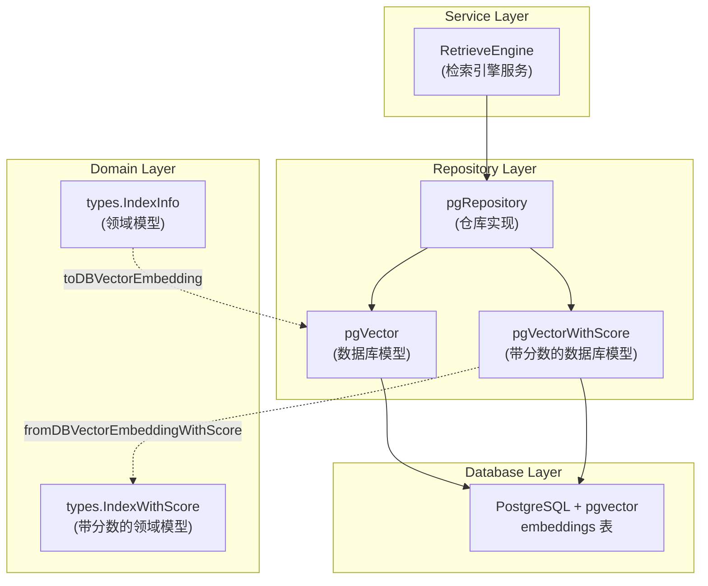

# postgres_vector_embedding_models 模块深度解析

## 概述：为什么需要这个模块

想象一下，你正在构建一个大规模的知识检索系统。用户输入一个问题，系统需要从海量文档片段中找到最相关的内容。核心挑战在于：**如何高效地存储和查询高维向量嵌入（embeddings）**？

通用的关系型数据库（如 PostgreSQL）本身并不理解"向量相似度"这个概念。如果你简单地把向量存成 JSON 或数组，每次查询都需要在应用层计算所有向量的相似度——这在数据量达到百万级时是完全不可行的。

`postgres_vector_embedding_models` 模块正是为解决这个问题而存在。它定义了 PostgreSQL 向量存储的**数据模型契约**，利用 `pgvector` 扩展的原生向量类型和索引能力，使得向量相似度搜索可以直接在数据库层高效执行。这个模块不直接执行查询，而是作为 [postgres_vector_retrieval_repository](postgres_vector_retrieval_repository.md) 的数据映射层，负责在领域模型和数据库模型之间进行转换。

**核心设计洞察**：将向量存储的"结构定义"与"操作逻辑"分离。这个模块只关心"数据长什么样"，而把"怎么查"交给仓库层。这种分离使得向量模型的演进（比如从 float32 切换到 half-precision）不会污染业务逻辑代码。

---

## 架构定位与数据流

### 模块在系统中的位置



### 数据流追踪

**写入路径（向量入库）**：
1. [knowledgeService](knowledge_ingestion_extraction_and_graph_services.md) 处理文档后生成 `IndexInfo` 领域对象
2. 调用 [pgRepository](postgres_vector_retrieval_repository.md) 的存储方法
3. `toDBVectorEmbedding()` 将 `IndexInfo` 转换为 `pgVector`，同时从 `additionalParams` 中提取向量数据和启用状态
4. GORM 将 `pgVector` 持久化到 `embeddings` 表

**读取路径（向量检索）**：
1. [RetrieveEngine](retrieval_and_web_search_services.md) 发起相似度查询请求
2. [pgRepository](postgres_vector_retrieval_repository.md) 执行 SQL 查询（使用 pgvector 的 `<->` 距离算子）
3. 数据库返回 `pgVectorWithScore` 结果集（包含计算好的相似度分数）
4. `fromDBVectorEmbeddingWithScore()` 将数据库模型转换回 `IndexWithScore` 领域模型
5. 结果向上传递给 [PluginSearch](chat_pipeline_plugins_and_flow.md) 进行后续处理

---

## 核心组件深度解析

### pgVector 结构体：向量嵌入的数据库表示

```go
type pgVector struct {
    ID              uint                `gorm:"primarykey"`
    CreatedAt       time.Time           `gorm:"column:created_at"`
    UpdatedAt       time.Time           `gorm:"column:updated_at"`
    SourceID        string              `gorm:"column:source_id;not null"`
    SourceType      int                 `gorm:"column:source_type;not null"`
    ChunkID         string              `gorm:"column:chunk_id"`
    KnowledgeID     string              `gorm:"column:knowledge_id"`
    KnowledgeBaseID string              `gorm:"column:knowledge_base_id"`
    TagID           string              `gorm:"column:tag_id;index"`
    Content         string              `gorm:"column:content;not null"`
    Dimension       int                 `gorm:"column:dimension;not null"`
    Embedding       pgvector.HalfVector `gorm:"column:embedding;not null"`
    IsEnabled       bool                `gorm:"column:is_enabled;default:true;index"`
}
```

**设计意图**：这个结构体不是简单的数据容器，而是一个**多租户、多来源的向量索引记录**。每个字段都承载着特定的检索语义：

- **`SourceID` + `SourceType`**：构成向量的"来源指纹"。`SourceType` 是枚举类型（在 `types` 包中定义），区分向量来自文档切片、FAQ 条目还是手动录入的知识。这种设计允许系统对不同类型的知识应用不同的检索策略。

- **`KnowledgeBaseID` + `KnowledgeID`**：实现**两级知识隔离**。`KnowledgeBase` 是知识库容器（类似文件夹），`Knowledge` 是具体知识单元。检索时可以按知识库过滤，实现权限控制和数据隔离。

- **`TagID` 带索引**：支持**标签维度的快速过滤**。当用户想"只搜索标记为重要的文档"时，这个索引就派上用场了。

- **`Embedding` 使用 `pgvector.HalfVector`**：这是关键的性能优化。Half-precision（16 位浮点）相比标准的 float32 节省 50% 存储空间，在向量维度很高（如 1536 维）时，这意味着内存占用和磁盘 I/O 的大幅降低。代价是精度略有损失，但对于语义检索场景，这种损失通常可以接受。

- **`IsEnabled` 带索引**：支持**软删除和动态启用/禁用**。当用户删除一个文档时，系统不需要物理删除向量记录（避免索引重建开销），只需设置 `is_enabled = false`。查询时加上 `WHERE is_enabled = true` 即可过滤。

**为什么不用 JSON 存储向量**？如果用 JSON，PostgreSQL 无法理解向量空间结构，每次相似度计算都要把向量加载到应用层，逐条计算余弦相似度。使用 `pgvector.HalfVector` 后，数据库可以利用 HNSW 或 IVFFlat 索引，在百万级向量中实现亚秒级检索。

### pgVectorWithScore 结构体：查询结果的载体

```go
type pgVectorWithScore struct {
    // ... 所有 pgVector 的字段 ...
    Score           float64             `gorm:"column:score"`
}
```

**设计模式**：这是典型的**查询投影模式（Query Projection Pattern）**。`pgVector` 用于写入和全量读取，`pgVectorWithScore` 专用于相似度查询场景。

**为什么需要单独的带分数结构**？在 SQL 查询中，相似度分数是通过 `embedding <-> query_vector AS score` 动态计算的，它不是表的物理列。使用单独的结构体可以：
1. 明确区分"存储模型"和"查询结果模型"
2. 避免在写入时误操作 `Score` 字段
3. 利用 GORM 的 `Scan` 功能自动映射查询结果

**分数语义**：这里的 `Score` 是**距离**而非相似度。pgvector 的 `<->` 算子返回的是 L2 距离或余弦距离（取决于索引类型），值越小表示越相似。调用方需要理解这个约定，必要时进行转换（如 `similarity = 1 - distance`）。

### toDBVectorEmbedding 函数：领域模型到数据库模型的转换器

```go
func toDBVectorEmbedding(indexInfo *types.IndexInfo, additionalParams map[string]any) *pgVector
```

**参数设计解析**：

- **`indexInfo *types.IndexInfo`**：核心领域数据，包含来源、内容、关联关系等元信息。使用指针避免不必要的拷贝。

- **`additionalParams map[string]any`**：这是一个**扩展参数包**，设计非常巧妙。它解决了两个问题：
  1. **向量数据的可选性**：在某些场景（如只更新元信息），调用方可能不携带向量数据
  2. **避免结构体膨胀**：如果为每个可选参数都在 `IndexInfo` 中加字段，会导致领域模型污染

**内部逻辑分析**：

```go
if additionalParams != nil && slices.Contains(slices.Collect(maps.Keys(additionalParams)), "embedding") {
    if embeddingMap, ok := additionalParams["embedding"].(map[string][]float32); ok {
        pgVector.Embedding = pgvector.NewHalfVector(embeddingMap[indexInfo.SourceID])
        pgVector.Dimension = len(pgVector.Embedding.Slice())
    }
}
```

这段代码使用 `SourceID` 作为 key 从 `embeddingMap` 中查找对应的向量数据。为什么用 map 而不是直接传 slice？因为**批量插入场景**下，多个 `IndexInfo` 可能共享同一个 `additionalParams`，每个 `IndexInfo` 根据自己的 `SourceID` 取对应的向量。

**UTF-8 清理**：
```go
Content: common.CleanInvalidUTF8(indexInfo.Content),
```
这是一个防御性编程实践。文档解析过程中可能产生无效的 UTF-8 序列（特别是 OCR 或 PDF 解析），直接存入数据库会导致后续查询或序列化失败。在入库前清理，避免问题向下游传播。

**启用状态的继承逻辑**：
```go
if chunkEnabledMap, ok := additionalParams["chunk_enabled"].(map[string]bool); ok {
    if enabled, exists := chunkEnabledMap[indexInfo.ChunkID]; exists {
        pgVector.IsEnabled = enabled
    }
}
```
这支持**细粒度的切片启用控制**。在某些场景（如 FAQ 导入），系统可能批量处理多个切片，其中部分切片因质量问题被标记为禁用。通过 `ChunkID` 映射，可以精确控制每个切片的启用状态。

### fromDBVectorEmbeddingWithScore 函数：查询结果到领域模型的映射

```go
func fromDBVectorEmbeddingWithScore(embedding *pgVectorWithScore, matchType types.MatchType) *types.IndexWithScore
```

**设计要点**：

- **`matchType` 参数**：这个参数不是从数据库读取的，而是由调用方（通常是 [pgRepository](postgres_vector_retrieval_repository.md)）根据查询类型注入的。它标识这个结果是通过**向量匹配**、**关键词匹配**还是**混合匹配**得到的。上层 [PluginRerank](chat_pipeline_plugins_and_flow.md) 可以根据这个信息应用不同的重排序策略。

- **ID 的类型转换**：
  ```go
  ID: strconv.FormatInt(int64(embedding.ID), 10),
  ```
  数据库使用 `uint`（自增主键），但领域模型使用 `string`。这种设计允许未来切换到非自增 ID（如 UUID）而不改变领域模型接口。

- **分数直接透传**：`Score` 字段不做任何转换，保持数据库计算的原始值。转换逻辑（如距离转相似度）由调用方根据具体场景决定，因为不同嵌入模型的距离语义可能不同。

---

## 依赖关系分析

### 上游依赖（谁调用这个模块）

| 调用方 | 依赖关系 | 期望契约 |
|--------|----------|----------|
| [pgRepository](postgres_vector_retrieval_repository.md) | 直接依赖 | 期望 `toDBVectorEmbedding` 能正确处理 `additionalParams` 中的向量和启用状态；期望 `fromDBVectorEmbeddingWithScore` 返回的 `IndexWithScore` 包含完整的元信息 |
| [knowledgeService](knowledge_ingestion_extraction_and_graph_services.md) | 间接依赖 | 通过仓库层间接使用，期望向量数据能正确持久化并与知识记录关联 |
| [RetrieveEngine](retrieval_and_web_search_services.md) | 间接依赖 | 通过仓库层间接使用，期望查询结果包含准确的相似度分数和来源信息 |

### 下游依赖（这个模块调用谁）

| 被调用方 | 使用方式 | 耦合风险 |
|----------|----------|----------|
| `pgvector-go` 库 | 使用 `HalfVector` 类型和 `NewHalfVector` 构造函数 | **中等耦合**：如果切换向量库（如从 pgvector 切换到其他扩展），需要修改 `Embedding` 字段类型和转换逻辑 |
| `internal/types` | 使用 `IndexInfo`、`IndexWithScore`、`SourceType`、`MatchType` | **低耦合**：这些是领域模型，稳定性高。但如果 `IndexInfo` 增加必填字段，需要更新转换函数 |
| `internal/common` | 使用 `CleanInvalidUTF8` 工具函数 | **低耦合**：工具函数接口稳定，风险低 |

### 数据契约

**输入契约（toDBVectorEmbedding）**：
- `indexInfo` 不能为 nil
- `indexInfo.SourceID` 必须非空（用于查找向量数据）
- `additionalParams["embedding"]` 如果存在，必须是 `map[string][]float32` 类型
- `additionalParams["chunk_enabled"]` 如果存在，必须是 `map[string]bool` 类型

**输出契约（fromDBVectorEmbeddingWithScore）**：
- 返回的 `IndexWithScore` 中 `ID` 是字符串格式的数据库主键
- `Score` 是原始距离值（非相似度），调用方需根据索引类型理解其语义
- `MatchType` 由调用方注入，函数不做验证

---

## 设计决策与权衡

### 权衡 1：Half-precision vs Full-precision 向量存储

**选择**：使用 `pgvector.HalfVector`（16 位浮点）而非 `pgvector.Vector`（32 位浮点）

**理由**：
- 嵌入向量通常维度很高（768~1536 维），存储开销差异显著
- 语义检索对精度不敏感，half-precision 的量化损失在可接受范围内
- 减少内存占用意味着可以在相同硬件上缓存更多向量，提升查询性能

**代价**：
- 如果未来需要高精度场景（如金融文档的精确匹配），可能需要迁移数据
- 某些嵌入模型（如专门训练的全精度模型）可能无法充分利用

**扩展点**：如果未来需要支持全精度，可以添加 `EmbeddingFull pgvector.Vector` 字段，根据配置选择使用哪个字段。

### 权衡 2：additionalParams 的 map[string]any 设计

**选择**：使用动态类型的 map 而非定义专门的结构体

**理由**：
- 向量数据在某些场景（如元信息更新）不需要传递，使用 map 可以避免 nil 指针问题
- 批量插入时，多个记录可以共享同一个 map，减少内存分配
- 未来添加新参数（如自定义元数据）不需要修改函数签名

**代价**：
- 类型不安全：如果调用方传错类型，运行时才会报错
- IDE 无法提供自动补全和类型检查
- 需要类型断言和存在性检查，代码略显冗长

**替代方案**：可以定义 `VectorEmbeddingParams` 结构体，但会增加 API 复杂度。当前设计在灵活性和安全性之间选择了偏向灵活性。

### 权衡 3：软删除（IsEnabled）vs 硬删除

**选择**：使用 `IsEnabled` 字段实现软删除

**理由**：
- 向量索引（如 HNSW）重建成本高，物理删除会导致索引碎片化
- 支持"恢复误删文档"的用户需求
- 审计需求：保留删除记录用于追溯

**代价**：
- 表数据量只增不减，需要定期归档清理
- 所有查询都需要加上 `WHERE is_enabled = true`，忘记加会导致数据泄露
- 索引大小随时间增长，影响查询性能

**缓解措施**：[pgRepository](postgres_vector_retrieval_repository.md) 应该在所有查询方法中内置 `is_enabled` 过滤，避免调用方遗忘。

### 权衡 4：TableName 方法的设计

**选择**：两个结构体都返回相同的表名 `"embeddings"`

**理由**：
- `pgVectorWithScore` 不是独立的表，而是查询结果的投影
- GORM 需要知道扫描到哪个表的字段
- 避免硬编码表名在多个地方重复

**潜在问题**：如果未来需要分表（如按 `KnowledgeBaseID` 分表），需要在仓库层动态指定表名，而不是依赖 `TableName()` 方法。

---

## 使用指南与示例

### 场景 1：批量插入向量嵌入

```go
// 假设从 embedding 服务获取了向量数据
embeddingMap := map[string][]float32{
    "doc-001": {0.1, 0.2, 0.3, ...}, // 1536 维向量
    "doc-002": {0.4, 0.5, 0.6, ...},
}

// 准备 additionalParams
additionalParams := map[string]any{
    "embedding": embeddingMap,
    "chunk_enabled": map[string]bool{
        "chunk-001": true,
        "chunk-002": false, // 质量差的切片禁用
    },
}

// 转换并插入
for _, indexInfo := range indexInfos {
    pgVec := toDBVectorEmbedding(indexInfo, additionalParams)
    db.Create(pgVec)
}
```

**注意事项**：
- 确保 `embeddingMap` 的 key 与 `indexInfo.SourceID` 一一对应
- 批量插入时使用 `db.CreateInBatches()` 避免单次事务过大
- 插入前检查 `Dimension` 是否与索引配置一致

### 场景 2：相似度查询结果处理

```go
// pgRepository 执行查询后返回 []pgVectorWithScore
var results []pgVectorWithScore
db.Model(&pgVectorWithScore{}).
    Select("*, embedding <-> ? AS score", queryVector).
    Order("score").
    Limit(10).
    Scan(&results)

// 转换为领域模型
var indexedResults []*types.IndexWithScore
for _, r := range results {
    indexedResults = append(indexedResults, 
        fromDBVectorEmbeddingWithScore(r, types.MatchTypeVector))
}
```

**注意事项**：
- `queryVector` 必须与存储的向量维度相同
- 距离阈值过滤：可以加 `HAVING score < 0.5` 过滤低质量结果
- 如果启用混合检索（向量 + 关键词），需要合并结果并重新计算 `MatchType`

### 场景 3：按知识库过滤查询

```go
db.Model(&pgVectorWithScore{}).
    Where("knowledge_base_id = ? AND is_enabled = true", kbID).
    Select("*, embedding <-> ? AS score", queryVector).
    Order("score").
    Limit(20).
    Scan(&results)
```

**注意事项**：
- `is_enabled = true` 必须显式添加（除非仓库层内置）
- 如果 `KnowledgeBaseID` 有高基数，考虑添加复合索引 `(knowledge_base_id, is_enabled)`

---

## 边界情况与陷阱

### 陷阱 1：向量维度不匹配

**问题**：如果嵌入模型升级（如从 768 维切换到 1536 维），旧数据的 `Dimension` 字段与新向量不匹配，会导致查询错误或结果质量下降。

**检测**：在插入时验证 `len(embedding) == expectedDimension`

**缓解**：
- 在 [KnowledgeBaseConfig](knowledge_and_knowledgebase_domain_models.md) 中记录期望的向量维度
- 迁移时批量更新旧数据的向量（成本高，需离线执行）

### 陷阱 2：additionalParams 类型断言失败

**问题**：如果调用方传错类型（如 `embedding` 传成 `[]float32` 而非 `map[string][]float32`），类型断言会失败，向量字段为空。

**症状**：查询时返回空向量或数据库报错

**防御措施**：
```go
// 建议添加验证
if pgVector.Embedding.Slice() == nil {
    return errors.New("embedding data is missing")
}
```

### 陷阱 3：Score 语义混淆

**问题**：pgvector 支持多种距离度量（L2、余弦、内积），不同度量的分数范围和语义不同。调用方如果误以为分数是相似度（0~1），会导致逻辑错误。

**示例**：
- L2 距离：范围 `[0, +∞)`，越小越相似
- 余弦距离：范围 `[0, 2]`，越小越相似
- 内积：范围 `(-∞, +∞)`，越大越相似

**缓解**：
- 在 [pgRepository](postgres_vector_retrieval_repository.md) 中统一距离类型（建议使用余弦距离）
- 在文档中明确说明分数语义
- 考虑在 `IndexWithScore` 中添加 `ScoreType` 字段

### 陷阱 4：并发写入时的 ID 冲突

**问题**：虽然 `ID` 是自增主键，但在高并发批量插入时，如果多个事务同时插入，可能出现死锁或性能下降。

**缓解**：
- 使用 `db.CreateInBatches()` 减少锁竞争
- 按 `KnowledgeBaseID` 分组插入，减少行锁范围
- 考虑使用 UUID 作为主键（牺牲顺序性，换取并发性能）

### 边界情况：空向量处理

**问题**：如果 `additionalParams["embedding"]` 不存在或为空，`pgVector.Embedding` 会是零值。PostgreSQL 的 `NOT NULL` 约束会拒绝插入。

**当前行为**：函数不做验证，依赖数据库约束报错

**建议**：在函数开头添加验证：
```go
if additionalParams == nil || additionalParams["embedding"] == nil {
    return nil, errors.New("embedding data is required")
}
```

---

## 运维考量

### 索引维护

`embeddings` 表需要为向量列创建专门的索引才能发挥性能优势：

```sql
-- HNSW 索引（推荐用于高维向量，查询快，构建慢）
CREATE INDEX ON embeddings USING hnsw (embedding vector_cosine_ops);

-- IVFFlat 索引（适用于超大表，构建快，查询稍慢）
CREATE INDEX ON embeddings USING ivfflat (embedding vector_cosine_ops) WITH (lists = 100);
```

**注意**：索引类型必须与查询时使用的算子一致（如 `vector_cosine_ops` 对应余弦距离）。

### 数据归档策略

由于软删除导致数据只增不减，需要定期归档：

```sql
-- 将一年前的禁用数据移到归档表
CREATE TABLE embeddings_archive AS 
SELECT * FROM embeddings 
WHERE is_enabled = false AND updated_at < NOW() - INTERVAL '1 year';

DELETE FROM embeddings 
WHERE is_enabled = false AND updated_at < NOW() - INTERVAL '1 year';
```

### 监控指标

建议监控以下指标：
- 表大小：`SELECT pg_size_pretty(pg_total_relation_size('embeddings'))`
- 向量维度分布：`SELECT dimension, COUNT(*) FROM embeddings GROUP BY dimension`
- 启用/禁用比例：`SELECT is_enabled, COUNT(*) FROM embeddings GROUP BY is_enabled`
- 查询延迟：在 [pgRepository](postgres_vector_retrieval_repository.md) 中添加查询耗时埋点

---

## 相关模块参考

- [postgres_vector_retrieval_repository](postgres_vector_retrieval_repository.md)：使用本模块的仓库实现，执行实际的向量查询
- [retrieval_and_web_search_services](retrieval_and_web_search_services.md)：上层检索引擎服务，发起向量检索请求
- [knowledge_ingestion_extraction_and_graph_services](knowledge_ingestion_extraction_and_graph_services.md)：知识入库服务，生成向量嵌入数据
- [chat_pipeline_plugins_and_flow](chat_pipeline_plugins_and_flow.md)：检索结果在对话流水线中的处理
- [knowledge_and_knowledgebase_domain_models](knowledge_and_knowledgebase_domain_models.md)：领域模型定义，包括 `IndexInfo` 和 `IndexWithScore`

---

## 总结

`postgres_vector_embedding_models` 模块虽然代码量不大，但承载着系统向量检索能力的**数据模型基石**。它的核心设计哲学是：

1. **分离关注点**：存储模型与查询结果模型分离，领域模型与数据库模型分离
2. **性能优先**：使用 half-precision 向量、软删除索引、扩展参数包等优化手段
3. **防御性编程**：UTF-8 清理、类型断言验证、可选参数处理
4. **可扩展性**：通过 `additionalParams` 支持未来扩展，通过 `MatchType` 支持混合检索

理解这个模块的关键在于认识到它不是独立工作的——它是 [pgRepository](postgres_vector_retrieval_repository.md) 的数据映射伙伴，是 [RetrieveEngine](retrieval_and_web_search_services.md) 的底层支撑。当你在调试向量检索问题时，这个模块往往是排查数据一致性和类型转换问题的第一站。
