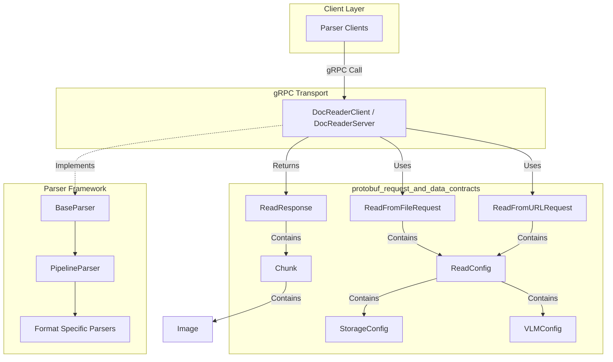

# protobuf_request_and_data_contracts 模块深度解析

## 模块概述：为什么需要这一层协议定义

想象一下，你的系统中有多个服务需要处理文档解析：一个 Python 写的 OCR 引擎、一个 Go 写的文档分块服务、一个 Java 写的知识图谱构建器。它们之间如何通信？如果每个服务都用自己的 JSON 格式，字段名不一致、类型不匹配、版本不兼容的问题会迅速让系统变得脆弱。

`protobuf_request_and_data_contracts` 模块正是为了解决这个问题而存在的。它是 `docreader_pipeline` 的**协议边界层**，使用 Protocol Buffers 定义了一套强类型、版本可控的数据契约。这套契约就像机场的登机口检查 —— 所有进出文档解析服务的请求和响应都必须通过这个检查点，确保数据格式的一致性、完整性和可演进性。

这个模块的核心价值在于：
- **跨语言互操作性**：Protobuf 生成的代码可以在 Go、Python、Java 等多种语言中使用，使得文档解析能力可以作为一个独立服务被不同技术栈的系统调用
- **强类型约束**：相比 JSON 的弱类型，Protobuf 在编译期就能捕获类型错误，减少运行时异常
- **向后兼容的演进能力**：通过字段编号和可选字段机制，可以在不破坏现有客户端的情况下添加新功能
- **性能优化**：二进制序列化比 JSON 更紧凑，解析速度更快，对于大文档处理场景尤为重要

## 架构定位与数据流



### 架构角色解析

这个模块在系统中扮演**协议翻译官**的角色：

1. **请求侧（下行流）**：客户端发起 `ReadFromFile` 或 `ReadFromURL` 调用时，请求参数被序列化为 `ReadFromFileRequest` 或 `ReadFromURLRequest`。这两个请求结构体都包含一个 `ReadConfig`，它像是一个"解析指令集"，告诉解析器如何处理文档。

2. **配置层（横向传递）**：`ReadConfig` 是核心配置枢纽，它聚合了：
   - 分块策略（`ChunkSize`、`ChunkOverlap`、`Separators`）
   - 多模态开关（`EnableMultimodal`）
   - 存储配置（`StorageConfig`）—— 用于处理图片等外部资源
   - VLM 配置（`VLMConfig`）—— 用于视觉语言模型处理

3. **响应侧（上行流）**：解析完成后，返回 `ReadResponse`，其中包含一个 `Chunk` 数组。每个 `Chunk` 不仅包含文本内容和位置信息，还可以携带 `Image` 数组，实现图文混排文档的完整表达。

### 调用链路追踪

以 `ReadFromURL` 为例，数据流动路径如下：

```
HTTP/gRPC Client 
  → ReadFromURLRequest { url, title, ReadConfig, request_id }
  → DocReaderServer (grpc_service_interfaces_and_clients 模块)
  → PipelineParser (parser_framework_and_orchestration 模块)
  → FormatSpecificParser (如 WebParser、PDFParser 等)
  → Chunk 数组生成
  → ReadResponse { chunks[], error }
  → Client
```

值得注意的是，`request_id` 字段贯穿整个调用链，用于日志追踪和调试。这是一个简单但关键的可观测性设计。

## 核心组件深度解析

### 请求契约：ReadFromFileRequest 与 ReadFromURLRequest

这两个结构体是文档解析服务的**入口契约**，它们的设计体现了"输入源抽象"的模式。

**ReadFromFileRequest** 用于直接上传文件内容进行解析：
```go
type ReadFromFileRequest struct {
    FileContent []byte        // 文件原始字节
    FileName    string        // 文件名（用于推断类型）
    FileType    string        // 显式指定文件类型
    ReadConfig  *ReadConfig   // 解析配置
    RequestId   string        // 追踪 ID
}
```

**ReadFromURLRequest** 用于从远程 URL 拉取文档：
```go
type ReadFromURLRequest struct {
    Url        string        // 文档地址
    Title      string        // 文档标题（可选）
    ReadConfig *ReadConfig   // 解析配置
    RequestId  string        // 追踪 ID
}
```

**设计意图**：为什么需要两个独立的请求类型，而不是用一个带 `oneof` 的结构体？这是因为两种输入源的处理逻辑有本质差异：
- 文件上传需要处理二进制流、内容类型推断、大小限制
- URL 拉取需要处理 HTTP 客户端、重定向、认证、超时

分开定义可以让 gRPC 服务层针对每种场景做专门的验证和错误处理，同时也让 API 文档更清晰。

**关键参数说明**：
- `FileType`：虽然可以从 `FileName` 推断，但显式指定可以避免歧义（例如 `.txt` 文件实际是 CSV 格式）
- `ReadConfig` 是指针类型，允许为 `nil`，此时使用默认配置。这是一个重要的灵活性设计，让简单场景不需要配置所有参数

### 配置中枢：ReadConfig

`ReadConfig` 是整个模块的**配置枢纽**，它决定了文档如何被切分和处理：

```go
type ReadConfig struct {
    ChunkSize        int32           // 分块大小（字符数或 token 数）
    ChunkOverlap     int32           // 分块重叠量
    Separators       []string        // 自定义分隔符
    EnableMultimodal bool            // 是否启用多模态处理
    StorageConfig    *StorageConfig  // 对象存储配置
    VlmConfig        *VLMConfig      // VLM 配置
}
```

**分块策略的设计考量**：

分块（Chunking）是文档解析的核心环节，直接影响下游检索和生成的质量。`ChunkSize` 和 `ChunkOverlap` 的组合使用是一个经典模式：

- `ChunkSize` 控制每个块的大小。太小会导致上下文碎片化，太大会超出 LLM 的上下文窗口或降低检索精度
- `ChunkOverlap` 在相邻块之间创建重叠区域，避免关键信息被切分在两个块的边界上。想象一下用重叠的窗口扫描文档 —— 每个窗口看到的内容有一部分是重复的，但这确保了没有信息被遗漏

**Separators 的灵活性**：

默认情况下，解析器会使用常见的分隔符（如段落换行、标题标记）。但某些场景需要自定义分隔逻辑，例如：
- 法律文档按条款编号分割
- 代码文件按函数定义分割
- 对话记录按说话人分割

`Separators` 字段允许传入一个分隔符数组，解析器会按优先级尝试匹配。

**多模态扩展点**：

`EnableMultimodal`、`StorageConfig` 和 `VlmConfig` 这三个字段是为多模态处理预留的扩展点。当启用多模态时：
1. 解析器会提取文档中的图片
2. 使用 `StorageConfig` 将图片上传到对象存储
3. 使用 `VlmConfig` 调用视觉语言模型生成图片描述
4. 将描述文本插入到 `Chunk` 的 `Images` 字段中

这种设计将多模态能力作为可选插件，而不是强制依赖，使得纯文本处理场景不需要承担额外的配置复杂度。

### 存储抽象：StorageConfig

`StorageConfig` 是一个**多云存储适配器**，它抽象了不同对象存储服务的差异：

```go
type StorageConfig struct {
    Provider        StorageProvider  // COS 或 MINIO
    Region          string           // COS 区域
    BucketName      string           // 桶名
    AccessKeyId     string           // MinIO/S3 密钥 ID
    SecretAccessKey string           // MinIO/S3 密钥 Secret
    AppId           string           // COS 应用 ID
    PathPrefix      string           // 路径前缀
}
```

**设计权衡分析**：

这里采用了"联合配置"模式 —— 一个结构体同时包含 COS 和 MinIO 的认证参数，而不是为每种存储类型定义独立的结构体。这种设计的优点是：
- **配置统一**：上游服务不需要根据存储类型切换不同的配置结构
- **运行时切换**：可以在不重启服务的情况下切换存储后端

但代价是：
- **配置冗余**：使用 COS 时 `AccessKeyId` 字段无意义，使用 MinIO 时 `AppId` 字段无意义
- **验证复杂**：需要在运行时根据 `Provider` 字段验证对应的必填字段

这是一个典型的"以空间换灵活性"的权衡。在文档解析场景中，存储配置的变化频率远低于请求频率，因此运行时验证的开销可以接受。

**StorageProvider 枚举**：
```go
type StorageProvider int32
const (
    StorageProvider_STORAGE_PROVIDER_UNSPECIFIED
    StorageProvider_COS    // 腾讯云 COS
    StorageProvider_MINIO  // MinIO/S3 兼容
)
```

使用枚举而不是字符串的好处是编译期类型检查，避免拼写错误导致的运行时失败。

### VLM 配置：VLMConfig

`VLMConfig` 用于配置视觉语言模型服务，支持多种接口协议：

```go
type VLMConfig struct {
    ModelName     string  // 模型名称
    BaseUrl       string  // 服务地址
    ApiKey        string  // 认证密钥
    InterfaceType string  // "ollama" 或 "openai"
}
```

**InterfaceType 的设计意图**：

不同的 VLM 服务使用不同的 API 协议。`InterfaceType` 字段允许解析器在运行时选择合适的适配器：
- `"ollama"`：使用 Ollama 的本地部署协议
- `"openai"`：使用 OpenAI 兼容的 REST API

这种设计避免了为每种 VLM 服务定义独立的结构体，同时保持了协议层的清晰性。

### 输出契约：Chunk 与 Image

`Chunk` 是文档解析的**核心输出单元**，它的设计反映了对下游检索系统的深刻理解：

```go
type Chunk struct {
    Content string   // 块内容
    Seq     int32    // 块在文档中的次序
    Start   int32    // 块在原文档中的起始位置
    End     int32    // 块在原文档中的结束位置
    Images  []*Image // 块中包含的图片信息
}
```

**位置追踪的价值**：

`Start` 和 `End` 字段看似冗余（毕竟 `Content` 已经包含了文本），但它们对于以下场景至关重要：
- **引用溯源**：当检索系统返回某个 chunk 时，用户可以定位到原文档的具体位置
- **去重检测**：通过位置信息可以判断两个 chunk 是否来自同一文档的同一区域
- **增量更新**：当文档更新时，可以通过位置映射判断哪些 chunk 需要重新生成

**Seq 字段的作用**：

`Seq`（Sequence）字段记录块在文档中的逻辑顺序。这与 `Start` 位置的区别在于：
- `Start` 是字符级别的物理位置
- `Seq` 是块级别的逻辑顺序

当文档经过复杂处理（如多栏 PDF 解析、目录重排）时，物理位置和逻辑顺序可能不一致。`Seq` 字段确保下游可以按正确的阅读顺序重组内容。

**Image 结构的多模态表达**：

```go
type Image struct {
    Url         string  // 图片 URL（存储后）
    Caption     string  // 图片描述
    OcrText     string  // OCR 提取的文本
    OriginalUrl string  // 原始图片 URL
    Start       int32   // 图片在文本中的开始位置
    End       int32   // 图片在文本中的结束位置
}
```

这个结构体捕捉了图片的多个维度的信息：
- **存储位置**：`Url` 指向处理后的图片（可能已压缩或转换格式）
- **语义描述**：`Caption` 是 VLM 生成的自然语言描述
- **文本内容**：`OcrText` 是 OCR 引擎提取的文字（对于图表、截图尤为重要）
- **原始来源**：`OriginalUrl` 保留原始链接，用于溯源
- **位置锚点**：`Start` 和 `End` 将图片锚定到文本的特定位置

这种设计使得下游系统可以灵活选择使用哪种信息：检索时可以索引 `Caption` 和 `OcrText`，展示时可以显示 `Url`，溯源时可以使用 `OriginalUrl`。

### 响应封装：ReadResponse

`ReadResponse` 是一个简单的响应包装器：

```go
type ReadResponse struct {
    Chunks []*Chunk  // 文档分块数组
    Error  string    // 错误信息
}
```

**设计模式分析**：

这里采用了"错误字段"模式而不是抛出异常。在 gRPC 场景中，这种设计有两个好处：
1. **结构化错误**：错误信息作为字段返回，可以包含更丰富的上下文（如部分成功的结果）
2. **流式处理友好**：在流式响应中，可以在最后一个消息中返回错误，而不需要中断流

但需要注意的是，这种模式要求客户端必须检查 `Error` 字段，不能依赖 gRPC 的状态码。

## 依赖关系与集成模式

### 上游调用者

根据模块树，以下模块依赖本模块：

1. **grpc_service_interfaces_and_clients**：实现 gRPC 服务端和客户端，直接引用这些 Protobuf 结构体进行序列化和反序列化
2. **parser_framework_and_orchestration**：解析器框架使用 `ReadConfig` 配置解析行为，输出 `Chunk` 数组
3. **format_specific_parsers**：各种格式解析器（PDF、Word、Markdown 等）遵循 `Chunk` 输出契约

### 下游消费者

`Chunk` 结构被以下模块使用：

1. **knowledge_and_chunk_api**（sdk_client_library）：将解析后的 chunk 存入知识库
2. **knowledge_ingestion_extraction_and_graph_services**：基于 chunk 构建知识图谱
3. **vector_retrieval_backend_repositories**：将 chunk 内容向量化后存入检索引擎

### 数据契约的传递

```
ReadFromURLRequest 
  → DocReaderServer (grpc_service_interfaces_and_clients)
  → PipelineParser (parser_framework_and_orchestration)
  → PDFParser/DocxParser/MarkdownParser (format_specific_parsers)
  → Chunk[] 
  → knowledgeService (knowledge_ingestion_extraction_and_graph_services)
  → chunkRepository (data_access_repositories)
  → elasticsearchRepository/milvusRepository (vector_retrieval_backend_repositories)
```

在这个链条中，`Chunk` 结构体是**最稳定的契约**。即使解析器的内部实现发生变化，只要输出的 `Chunk` 格式不变，下游系统就不需要修改。

## 设计决策与权衡分析

### 1. Protobuf vs JSON：为什么选择二进制协议

**选择 Protobuf 的理由**：
- **性能**：文档解析涉及大量文本传输，Protobuf 的二进制编码比 JSON 节省 30-50% 的带宽
- **类型安全**：编译期检查避免了 JSON 常见的字段拼写错误和类型不匹配
- **版本演进**：通过字段编号机制，可以安全地添加/废弃字段

**代价**：
- **可读性差**：调试时需要专门的工具查看 Protobuf 内容
- **前端不友好**：浏览器无法直接解析 Protobuf，需要额外的转换层

这个权衡在内部服务间通信场景是合理的，因为性能和维护性优先于可读性。

### 2. 扁平结构 vs 嵌套结构

`ReadConfig` 采用了扁平设计，将 `StorageConfig` 和 `VLMConfig` 作为独立字段而不是嵌套在分块配置中。这种设计的考虑是：
- **配置复用**：`StorageConfig` 和 `VLMConfig` 可以在其他场景独立使用
- **可选性清晰**：指针类型明确表示这些配置是可选的
- **版本独立演进**：存储配置和 VLM 配置可以独立变化，不影响分块配置

### 3. 错误处理模式：字段 vs 异常

`ReadResponse` 使用 `Error` 字段而不是抛出异常，这是一个有争议的设计：

**优点**：
- 可以返回部分成功的结果（例如 100 页文档解析了 90 页后出错）
- 流式响应中可以在最后一个消息返回错误

**缺点**：
- 客户端容易忘记检查 `Error` 字段
- 错误类型信息丢失（无法区分网络错误、解析错误、存储错误）

**改进建议**：可以考虑添加 `ErrorCode` 字段，使用枚举定义错误类型，便于客户端程序化处理。

### 4. 位置信息的冗余设计

`Chunk` 同时包含 `Content`、`Start`、`End` 和 `Seq`，看似冗余，但这是为了支持不同的使用场景：
- `Content`：用于检索和展示
- `Start/End`：用于溯源和增量更新
- `Seq`：用于顺序重组

这种"以空间换能力"的设计在存储成本可接受的情况下是合理的。

## 使用指南与最佳实践

### 基本使用模式

**场景 1：解析本地文件**
```go
request := &proto.ReadFromFileRequest{
    FileContent: fileBytes,
    FileName:    "document.pdf",
    FileType:    "pdf",
    ReadConfig: &proto.ReadConfig{
        ChunkSize:    500,
        ChunkOverlap: 50,
        Separators:   []string{"\n\n", "\n"},
    },
    RequestId: uuid.New().String(),
}

response, err := client.ReadFromFile(ctx, request)
if err != nil {
    // 处理 gRPC 错误
}
if response.Error != "" {
    // 处理业务错误
}

for _, chunk := range response.Chunks {
    // 处理每个 chunk
    fmt.Printf("Chunk %d: %s\n", chunk.Seq, chunk.Content)
}
```

**场景 2：解析 URL 并启用多模态**
```go
request := &proto.ReadFromURLRequest{
    Url:   "https://example.com/document.pdf",
    Title: "示例文档",
    ReadConfig: &proto.ReadConfig{
        ChunkSize:        500,
        EnableMultimodal: true,
        StorageConfig: &proto.StorageConfig{
            Provider:        proto.StorageProvider_MINIO,
            BucketName:      "documents",
            AccessKeyId:     "minioadmin",
            SecretAccessKey: "minioadmin",
        },
        VlmConfig: &proto.VLMConfig{
            ModelName:     "llava",
            BaseUrl:       "http://localhost:11434",
            InterfaceType: "ollama",
        },
    },
}
```

### 配置建议

**分块大小选择**：
- 检索场景：300-500 字符（适合向量检索的粒度）
- 摘要场景：1000-2000 字符（保留更多上下文）
- 问答场景：500-800 字符（平衡精度和召回）

**重叠量设置**：
- 一般文档：ChunkSize 的 10-20%
- 代码文档：ChunkSize 的 20-30%（避免函数被切断）
- 对话记录：ChunkSize 的 0%（按说话人自然分隔）

**分隔符优先级**：
```go
Separators: []string{
    "\n## ",      // Markdown 二级标题
    "\n# ",       // Markdown 一级标题
    "\n\n",       // 段落
    "\n",         // 换行
    " ",          // 空格（最后手段）
}
```
解析器会按顺序尝试匹配，先匹配的分隔符优先级更高。

## 边界情况与注意事项

### 1. 空配置的处理

当 `ReadConfig` 为 `nil` 时，解析器应使用默认配置。但默认值是什么？这是一个隐式契约，需要在文档中明确：
- 默认 `ChunkSize`：500 字符
- 默认 `ChunkOverlap`：50 字符
- 默认 `Separators`：`["\n\n", "\n"]`
- 默认 `EnableMultimodal`：`false`

**风险**：如果不同解析器的默认值不一致，会导致行为不可预测。建议在 `ReadConfig` 中添加 `UseDefaults` 布尔字段，显式声明使用默认配置。

### 2. 大文件处理

`ReadFromFileRequest` 的 `FileContent` 是 `[]byte`，这意味着整个文件需要一次性加载到内存。对于大文件（>100MB），这会导致：
- 内存压力
- gRPC 消息大小限制（默认 4MB）

**解决方案**：
- 使用 `ReadFromURLRequest` 让服务端直接拉取
- 实现分块上传协议（当前不支持，需要扩展）
- 增加 gRPC 消息大小限制（需要配置）

### 3. 图片存储的异步性

当启用多模态时，图片上传到对象存储是异步操作。这意味着：
- `ReadResponse` 返回时，图片可能还未上传完成
- `Image.Url` 可能暂时不可访问

**当前设计的问题**：`ReadResponse` 没有提供异步状态字段，客户端无法知道图片是否已就绪。

**建议改进**：添加 `ImageUploadStatus` 字段，或在 `Image` 中添加 `UploadPending` 布尔字段。

### 4. 字符位置的多字节问题

`Start` 和 `End` 字段是 `int32`，表示字符位置还是字节位置？对于多字节字符（如中文、emoji），这两者有显著差异。

**当前实现**：从代码注释看，应该是字符位置（rune 索引）。但需要确保所有解析器实现一致，否则位置追踪会出错。

**建议**：在注释中明确说明是 UTF-8 字节位置还是 Unicode 码点位置。

### 5. 错误字段的类型信息丢失

`ReadResponse.Error` 是字符串，无法程序化区分错误类型。建议添加：
```go
type ReadResponse struct {
    Chunks    []*Chunk
    Error     string
    ErrorCode int32  // 错误码枚举
}
```

## 扩展点与演进方向

### 当前扩展点

1. **StorageProvider 枚举**：可以添加新的存储后端（如阿里云 OSS、AWS S3）
2. **InterfaceType**：可以添加新的 VLM 协议（如 Anthropic、Google Vertex）
3. **Separators**：支持正则表达式分隔符（当前仅支持字符串）

### 建议的演进方向

1. **增量解析支持**：添加 `DocumentVersion` 和 `ModifiedChunks` 字段，支持文档更新时只重新解析变化的部分
2. **元数据扩展**：在 `Chunk` 中添加 `Metadata map[string]string`，允许解析器附加自定义信息（如页码、章节标题）
3. **流式响应**：当前 `ReadResponse` 是单次返回，对于大文档可以考虑流式返回 chunk
4. **解析进度追踪**：添加 `Progress` 字段，用于长时间解析任务的进度报告

## 相关模块参考

- [grpc_service_interfaces_and_clients](grpc_service_interfaces_and_clients.md)：gRPC 服务端和客户端实现
- [parser_framework_and_orchestration](parser_framework_and_orchestration.md)：解析器框架和编排逻辑
- [format_specific_parsers](format_specific_parsers.md)：各种格式的解析器实现
- [knowledge_and_chunk_api](knowledge_and_chunk_api.md)：SDK 中的 chunk 管理接口
- [knowledge_ingestion_extraction_and_graph_services](knowledge_ingestion_extraction_and_graph_services.md)：知识入库和图谱构建服务

## 总结

`protobuf_request_and_data_contracts` 模块是文档解析管道的**协议骨架**。它通过 Protobuf 定义了一套稳定、可扩展的数据契约，使得文档解析能力可以作为一个独立服务被系统其他部分调用。

理解这个模块的关键在于认识到它不是"数据结构定义"，而是**服务边界的形式化描述**。每一个字段、每一个类型选择都反映了对下游需求的理解和对演进空间的预留。

对于新加入的开发者，建议从 `Chunk` 结构体入手理解整个系统 —— 它是解析器的输出，是知识库的输入，是检索系统的基础单元。理解了 `Chunk` 的设计意图，就理解了整个文档解析系统的核心价值主张。
