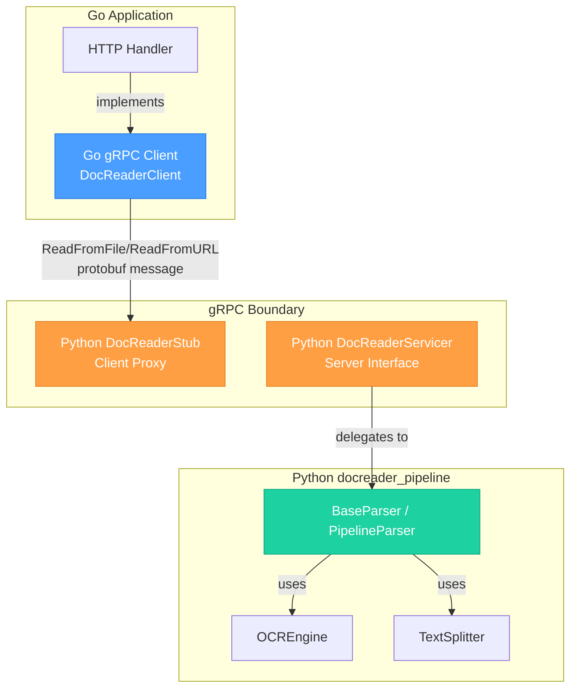

# python_grpc_stub_and_servicer_bindings 模块深度解析

## 概述：为什么这个模块存在

想象一下，你有一个用 Python 编写的强大文档解析引擎（`docreader_pipeline`），它能处理 PDF、Word、Excel、Markdown 等各种格式，提取文本、识别图片、生成摘要。但你的主应用是用 Go 编写的。如何让 Go 代码调用 Python 的解析能力？

这就是 `python_grpc_stub_and_servicer_bindings` 模块存在的根本原因。它是一个**跨语言 RPC 桥接层**，通过 gRPC 协议在 Go 和 Python 之间建立通信通道。这个模块本身是**自动生成的代码**（由 protobuf 编译器生成），它定义了 Python 端的 gRPC 客户端存根（Stub）和服务端基类（Servicer），使得：

1. **Go 作为 gRPC 客户端** 可以调用 Python 提供的文档解析服务
2. **Python 作为 gRPC 服务端** 可以接收来自 Go 的解析请求并返回结果

这个设计的关键洞察是：**将计算密集型的文档解析逻辑隔离在 Python 生态中**（利用其丰富的文档处理库），同时**保持主应用架构在 Go 的类型安全和并发优势中**。如果没有这种 RPC 桥接，你要么重写所有解析器（成本极高），要么在 Go 中嵌入 Python 解释器（复杂且难以维护）。

---

## 架构与数据流



### 数据流详解

**请求路径（Go → Python）**：
1. Go 应用中的 HTTP Handler 接收到文件上传或 URL 解析请求
2. Go 的 `DocReaderClient` 通过 gRPC 通道发送 `ReadFromFileRequest` 或 `ReadFromURLRequest`
3. Python 端的 `DocReaderStub` 接收请求，反序列化为 protobuf 消息
4. 请求被路由到实现 `DocReaderServicer` 的具体服务类
5. 服务类调用对应的 `BaseParser` 子类（如 `PDFParser`、`DocxParser`）

**响应路径（Python → Go）**：
1. Parser 解析文档，生成 `Document` 对象（包含文本内容和 Chunk 列表）
2. `Document` 被转换为 `ReadResponse` protobuf 消息
3. 响应通过 gRPC 通道返回给 Go 客户端
4. Go 代码将响应转换为内部数据结构并返回给 HTTP 客户端

### 模块的架构角色

这个模块在整个系统中扮演**协议适配器**的角色：

| 维度 | 说明 |
|------|------|
| **位置** | 位于 `docreader_pipeline` 模块的边界，是 Python 解析引擎的对外接口层 |
| **职责** | 将 gRPC 协议消息转换为 Python 对象，反之亦然 |
| **耦合** | 紧耦合于 protobuf 定义（`docreader_pb2`），松耦合于具体解析逻辑 |
| **调用者** | Go 端的 `docreader_grpc.pb.go` 生成的客户端代码 |
| **被调用者** | `docreader.parser.base_parser.BaseParser` 及其子类 |

---

## 核心组件深度解析

### 1. DocReaderStub：客户端代理

**设计意图**：`DocReaderStub` 是一个**客户端存根（Client Stub）**，它的存在是为了让远程调用看起来像本地方法调用。这是 RPC 框架的经典模式——**位置透明性**。

```python
class DocReaderStub(object):
    def __init__(self, channel):
        self.ReadFromFile = channel.unary_unary(
            '/docreader.DocReader/ReadFromFile',
            request_serializer=docreader__pb2.ReadFromFileRequest.SerializeToString,
            response_deserializer=docreader__pb2.ReadResponse.FromString,
        )
        self.ReadFromURL = channel.unary_unary(
            '/docreader.DocReader/ReadFromURL',
            request_serializer=docreader__pb2.ReadFromURLRequest.SerializeToString,
            response_deserializer=docreader__pb2.ReadResponse.FromString,
        )
```

**内部机制**：
- `channel` 参数是一个 gRPC 通道，底层封装了 HTTP/2 连接、序列化、重试逻辑
- `unary_unary` 表示这是一个**单次请求 - 单次响应**的 RPC 类型（区别于流式 RPC）
- `request_serializer` 和 `response_deserializer` 是 protobuf 的序列化/反序列化函数

**使用方式**（在 Python 端作为客户端时）：
```python
import grpc
from docreader.proto.docreader_pb2_grpc import DocReaderStub
from docreader.proto.docreader_pb2 import ReadFromFileRequest

# 建立 gRPC 通道
channel = grpc.insecure_channel('localhost:50051')
stub = DocReaderStub(channel)

# 发起远程调用（看起来像本地方法）
request = ReadFromFileRequest(file_path="/path/to/doc.pdf")
response = stub.ReadFromFile(request)
```

**关键参数**：
| 参数 | 类型 | 说明 |
|------|------|------|
| `channel` | `grpc.Channel` | gRPC 通信通道，可配置 TLS、认证、负载均衡等 |

**返回值**：`ReadResponse` protobuf 消息，包含解析后的文档内容和 Chunk 列表

**副作用**：触发网络请求，可能抛出 `grpc.RpcError` 异常

---

### 2. DocReaderServicer：服务端接口契约

**设计意图**：`DocReaderServicer` 定义了**服务端必须实现的方法签名**。它类似于 Java 中的接口或 Go 中的 interface，但使用了**模板方法模式**——基类提供默认实现（抛出未实现异常），子类覆盖具体方法。

```python
class DocReaderServicer(object):
    def ReadFromFile(self, request, context):
        """从文件读取文档"""
        context.set_code(grpc.StatusCode.UNIMPLEMENTED)
        context.set_details('Method not implemented!')
        raise NotImplementedError('Method not implemented!')

    def ReadFromURL(self, request, context):
        """从 URL 读取文档"""
        context.set_code(grpc.StatusCode.UNIMPLEMENTED)
        context.set_details('Method not implemented!')
        raise NotImplementedError('Method not implemented!')
```

**为什么这样设计**：
1. **编译时检查**：如果子类忘记实现某个方法，调用时会立即看到 `UNIMPLEMENTED` 错误
2. **向后兼容**：如果 protobuf 定义新增方法，旧代码不会编译失败，只会在新方法被调用时报错
3. **上下文传递**：`context` 参数携带了 gRPC 调用的元数据（认证信息、超时、追踪 ID 等）

**实际实现示例**：
```python
from docreader.proto.docreader_pb2_grpc import DocReaderServicer
from docreader.proto.docreader_pb2 import ReadResponse
from docreader.parser.pdf_parser import PDFParser

class DocReaderServiceImpl(DocReaderServicer):
    def ReadFromFile(self, request, context):
        # 从请求中提取文件路径
        file_path = request.file_path
        
        # 创建对应的 Parser
        parser = PDFParser(file_name=file_path)
        
        # 读取文件内容
        with open(file_path, 'rb') as f:
            content = f.read()
        
        # 执行解析
        document = parser.parse(content)
        
        # 转换为 protobuf 响应
        response = ReadResponse()
        for chunk in document.chunks:
            response.chunks.add(
                seq=chunk.seq,
                content=chunk.content,
                start=chunk.start,
                end=chunk.end
            )
        
        return response
```

**关键参数**：
| 参数 | 类型 | 说明 |
|------|------|------|
| `request` | `ReadFromFileRequest` / `ReadFromURLRequest` | 客户端发送的 protobuf 消息 |
| `context` | `grpc.ServicerContext` | gRPC 调用上下文，可获取元数据、设置状态码、取消检查等 |

**返回值**：`ReadResponse` protobuf 消息

**异常处理**：
- 通过 `context.set_code()` 设置 gRPC 状态码（如 `INVALID_ARGUMENT`、`INTERNAL`）
- 通过 `context.set_details()` 提供错误详情
- 抛出异常会被 gRPC 框架捕获并转换为 `INTERNAL` 错误

---

### 3. add_DocReaderServicer_to_server：服务注册函数

**设计意图**：这个函数将 `DocReaderServicer` 的实现**注册到 gRPC 服务器**，建立方法名到处理函数的映射。这是 gRPC 服务器的**路由配置**。

```python
def add_DocReaderServicer_to_server(servicer, server):
    rpc_method_handlers = {
        'ReadFromFile': grpc.unary_unary_rpc_method_handler(
            servicer.ReadFromFile,
            request_deserializer=docreader__pb2.ReadFromFileRequest.FromString,
            response_serializer=docreader__pb2.ReadResponse.SerializeToString,
        ),
        'ReadFromURL': grpc.unary_unary_rpc_method_handler(
            servicer.ReadFromURL,
            request_deserializer=docreader__pb2.ReadFromURLRequest.FromString,
            response_serializer=docreader__pb2.ReadResponse.SerializeToString,
        ),
    }
    generic_handler = grpc.method_handlers_generic_handler(
        'docreader.DocReader', rpc_method_handlers)
    server.add_generic_rpc_handlers((generic_handler,))
    server.add_registered_method_handlers('docreader.DocReader', rpc_method_handlers)
```

**内部机制**：
1. 为每个 RPC 方法创建 `grpc.unary_unary_rpc_method_handler`，绑定处理函数和序列化器
2. 使用 `method_handlers_generic_handler` 将所有方法打包成一个通用处理器
3. 调用 `server.add_generic_rpc_handlers()` 注册到服务器

**使用方式**：
```python
from grpc import server
from docreader.proto.docreader_pb2_grpc import add_DocReaderServicer_to_server

# 创建 gRPC 服务器
grpc_server = server()

# 注册服务实现
service_impl = DocReaderServiceImpl()
add_DocReaderServicer_to_server(service_impl, grpc_server)

# 启动服务器
grpc_server.add_insecure_port('[::]:50051')
grpc_server.start()
grpc_server.wait_for_termination()
```

**关键参数**：
| 参数 | 类型 | 说明 |
|------|------|------|
| `servicer` | `DocReaderServicer` 子类实例 | 实际处理 RPC 请求的对象 |
| `server` | `grpc.Server` | gRPC 服务器实例 |

---

### 4. DocReader：实验性静态方法类

**设计意图**：`DocReader` 类提供了一组**静态方法**，用于在不创建 Stub 实例的情况下发起 RPC 调用。这是 gRPC Python 的**实验性 API**，设计目的是简化一次性调用的场景。

```python
class DocReader(object):
    @staticmethod
    def ReadFromFile(request, target, options=(), channel_credentials=None, ...):
        return grpc.experimental.unary_unary(
            request,
            target,
            '/docreader.DocReader/ReadFromFile',
            docreader__pb2.ReadFromFileRequest.SerializeToString,
            docreader__pb2.ReadResponse.FromString,
            options, channel_credentials, insecure, call_credentials,
            compression, wait_for_ready, timeout, metadata,
        )
```

**与 Stub 的区别**：
| 特性 | `DocReaderStub` | `DocReader` 静态方法 |
|------|-----------------|---------------------|
| 使用方式 | 先创建 Stub 实例，再调用方法 | 直接调用静态方法 |
| 连接管理 | 复用 `channel` 对象 | 每次调用可能创建新连接 |
| 推荐程度 | **推荐** | 实验性，不推荐生产使用 |

**为什么不推荐使用**：
1. **性能**：每次调用可能创建新的 gRPC 连接，无法复用连接池
2. **可测试性**：难以注入 mock 通道进行单元测试
3. **稳定性**：标记为 `EXPERIMENTAL API`，未来可能变更

---

## 依赖关系分析

### 上游依赖（被谁调用）

```
Go Application (docreader_grpc.pb.go)
    ↓ gRPC 调用
python_grpc_stub_and_servicer_bindings
    ↓ 委托调用
docreader_pipeline (BaseParser, PipelineParser)
```

**Go 端的对应接口**：
```go
// docreader_grpc.pb.go 中定义的接口
type DocReaderClient interface {
    ReadFromFile(ctx context.Context, in *ReadFromFileRequest, opts ...grpc.CallOption) (*ReadResponse, error)
    ReadFromURL(ctx context.Context, in *ReadFromURLRequest, opts ...grpc.CallOption) (*ReadResponse, error)
}

type DocReaderServer interface {
    ReadFromFile(context.Context, *ReadFromFileRequest) (*ReadResponse, error)
    ReadFromURL(context.Context, *ReadFromURLRequest) (*ReadResponse, error)
    mustEmbedUnimplementedDocReaderServer()
}
```

**数据契约**：
| 消息类型 | 字段 | 说明 |
|----------|------|------|
| `ReadFromFileRequest` | `file_path`, `file_content` | 文件路径或文件内容（base64） |
| `ReadFromURLRequest` | `url`, `timeout` | 文档 URL 和超时设置 |
| `ReadResponse` | `chunks[]`, `document_text`, `images[]` | 解析后的 Chunk 列表、全文、图片信息 |

### 下游依赖（调用谁）

```
python_grpc_stub_and_servicer_bindings
    ↓ 实例化并调用
docreader.parser.base_parser.BaseParser
    ↓ 多态调用具体子类
docreader.parser.pdf_parser.PDFParser
docreader.parser.docx_parser.DocxParser
docreader.parser.markdown_parser.MarkdownParser
...
```

**关键调用链**：
1. `DocReaderServicer.ReadFromFile()` → `BaseParser.parse()` → 具体 Parser 的 `parse_into_text()`
2. `BaseParser.parse()` → `TextSplitter.split_text()` → 生成 Chunk 列表
3. 如果启用多模态 → `BaseParser.process_chunks_images()` → `OCREngine.predict()`

---

## 设计决策与权衡

### 1. 为什么使用 gRPC 而不是 REST/HTTP？

**选择 gRPC 的原因**：
- **性能**：基于 HTTP/2，支持多路复用、头部压缩，比 REST 快 3-5 倍
- **强类型契约**：protobuf 提供编译时类型检查，避免 JSON 的运行时错误
- **代码生成**：自动为 Go 和 Python 生成客户端/服务端代码，减少手写样板
- **流式支持**：未来可扩展为流式 RPC（如边解析边返回 Chunk）

**代价**：
- **调试复杂度**：需要专用工具（如 BloomRPC、grpcurl）查看请求/响应
- **浏览器不友好**：无法直接从前端调用，需要 Envoy 等代理
- **版本管理**：protobuf 定义变更需要谨慎处理向后兼容

### 2. 为什么是 Go 调用 Python，而不是反过来？

**架构决策**：
- **主应用在 Go**：业务逻辑、HTTP 服务、数据库访问都在 Go 中
- **Python 作为计算服务**：文档解析是计算密集型任务，Python 生态更丰富
- **进程隔离**：解析任务可能崩溃（内存泄漏、C 扩展 bug），隔离在独立进程中

**替代方案对比**：
| 方案 | 优点 | 缺点 |
|------|------|------|
| **gRPC（当前）** | 进程隔离、语言无关、可水平扩展 | 网络开销、序列化成本 |
| **子进程调用** | 简单、无网络开销 | 难以管理、无法跨机器 |
| **嵌入 Python 解释器** | 低延迟 | 复杂、GIL 限制、调试困难 |
| **消息队列** | 异步、解耦 | 延迟高、需要额外基础设施 |

### 3. 为什么使用 unary-unary 而不是流式 RPC？

**当前设计**：
```python
self.ReadFromFile = channel.unary_unary(...)  # 单次请求 - 单次响应
```

**权衡考虑**：
- **简单性**：文档解析通常在几秒内完成，不需要流式返回
- **原子性**：要么全部成功，要么失败，避免部分结果的状态管理
- **未来扩展**：如果处理大文件（>100MB），可改为 `unary_stream`（边解析边返回 Chunk）

### 4. 自动生成代码 vs 手写代码

**为什么接受自动生成的代码**：
- **一致性**：Go 和 Python 端的代码从同一 protobuf 定义生成，保证契约一致
- **维护成本**：protobuf 变更时，重新生成即可，无需手动同步
- **错误减少**：避免手写序列化/反序列化逻辑的 bug

**风险缓解**：
- **版本锁定**：代码顶部检查 `GRPC_GENERATED_VERSION` 与运行时版本匹配
- **不直接修改**：生成的代码不应手动修改，变更应通过 protobuf 定义

---

## 使用指南与示例

### 场景 1：在 Python 端实现 DocReader 服务

```python
from concurrent import futures
import grpc
from docreader.proto.docreader_pb2_grpc import (
    DocReaderServicer, 
    add_DocReaderServicer_to_server
)
from docreader.proto.docreader_pb2 import ReadResponse
from docreader.parser.pdf_parser import PDFParser
from docreader.parser.docx_parser import DocxParser

class DocReaderServiceImpl(DocReaderServicer):
    """DocReader gRPC 服务实现"""
    
    def __init__(self):
        self.parsers = {
            '.pdf': PDFParser,
            '.docx': DocxParser,
            # ... 其他格式
        }
    
    def ReadFromFile(self, request, context):
        try:
            # 根据文件扩展名选择 Parser
            file_ext = os.path.splitext(request.file_path)[1].lower()
            parser_cls = self.parsers.get(file_ext)
            
            if not parser_cls:
                context.set_code(grpc.StatusCode.INVALID_ARGUMENT)
                context.set_details(f'Unsupported file type: {file_ext}')
                return ReadResponse()
            
            # 创建 Parser 并解析
            parser = parser_cls(
                file_name=request.file_path,
                chunk_size=request.chunk_size,
                enable_multimodal=request.enable_multimodal,
            )
            
            with open(request.file_path, 'rb') as f:
                document = parser.parse(f.read())
            
            # 构建响应
            response = ReadResponse()
            response.document_text = document.content
            for chunk in document.chunks:
                chunk_proto = response.chunks.add()
                chunk_proto.seq = chunk.seq
                chunk_proto.content = chunk.content
                chunk_proto.start = chunk.start
                chunk_proto.end = chunk.end
            
            return response
            
        except FileNotFoundError:
            context.set_code(grpc.StatusCode.NOT_FOUND)
            context.set_details(f'File not found: {request.file_path}')
            return ReadResponse()
        except Exception as e:
            context.set_code(grpc.StatusCode.INTERNAL)
            context.set_details(str(e))
            return ReadResponse()

# 启动服务
def serve():
    server = grpc.server(futures.ThreadPoolExecutor(max_workers=10))
    add_DocReaderServicer_to_server(DocReaderServiceImpl(), server)
    server.add_insecure_port('[::]:50051')
    server.start()
    print('DocReader service started on port 50051')
    server.wait_for_termination()

if __name__ == '__main__':
    serve()
```

### 场景 2：配置 gRPC 通道选项

```python
import grpc
from docreader.proto.docreader_pb2_grpc import DocReaderStub

# 配置 gRPC 通道选项
options = [
    ('grpc.max_receive_message_length', 100 * 1024 * 1024),  # 100MB 最大响应
    ('grpc.max_send_message_length', 50 * 1024 * 1024),      # 50MB 最大请求
    ('grpc.keepalive_time_ms', 30000),                        # 30 秒心跳
    ('grpc.keepalive_timeout_ms', 10000),                     # 10 秒超时
]

# 创建带 TLS 的通道（生产环境）
credentials = grpc.ssl_channel_credentials(
    root_certificates=open('ca.crt', 'rb').read(),
)
channel = grpc.secure_channel('docreader.internal:50051', credentials, options=options)

# 创建 Stub
stub = DocReaderStub(channel)
```

### 场景 3：错误处理与重试

```python
import grpc
from grpc import RpcError

def call_with_retry(stub, request, max_retries=3):
    for attempt in range(max_retries):
        try:
            response = stub.ReadFromFile(request, timeout=30.0)
            return response
        except RpcError as e:
            if e.code() == grpc.StatusCode.UNAVAILABLE and attempt < max_retries - 1:
                # 服务不可用，重试
                time.sleep(2 ** attempt)  # 指数退避
                continue
            elif e.code() == grpc.StatusCode.DEADLINE_EXCEEDED:
                # 超时，记录日志但不重试
                logger.error(f"Request timeout: {e.details()}")
                raise
            else:
                # 其他错误，直接抛出
                raise
```

---

## 边界情况与陷阱

### 1. 大文件处理

**问题**：文档超过 gRPC 默认消息大小限制（4MB）时会失败

**症状**：
```
grpc._channel._MultiThreadedRendezvous: StatusCode.RESOURCE_EXHAUSTED
Received message larger than max (5242880 vs. 4194304)
```

**解决方案**：
```python
# 在客户端和服务器端都配置最大消息大小
options = [
    ('grpc.max_receive_message_length', 100 * 1024 * 1024),
    ('grpc.max_send_message_length', 100 * 1024 * 1024),
]
```

**更好的方案**：对于超大文件，考虑分块上传或使用对象存储（S3/COS）传递文件，gRPC 只传递元数据。

### 2. 版本不匹配

**问题**：生成的代码与运行时 gRPC 库版本不兼容

**症状**：
```
RuntimeError: The grpc package installed is at version 1.60.0, 
but the generated code in docreader_pb2_grpc.py depends on grpcio>=1.76.0.
```

**解决方案**：
```bash
# 升级 gRPC 库
pip install --upgrade 'grpcio>=1.76.0' 'grpcio-tools>=1.76.0'

# 或重新生成代码以匹配当前版本
python -m grpc_tools.protoc -I. --python_out=. --grpc_python_out=. docreader.proto
```

### 3. 连接泄漏

**问题**：未正确关闭 gRPC 通道导致连接泄漏

**错误示例**：
```python
def parse_file(file_path):
    channel = grpc.insecure_channel('localhost:50051')
    stub = DocReaderStub(channel)
    return stub.ReadFromFile(request)
    # channel 未关闭！
```

**正确做法**：
```python
def parse_file(file_path):
    channel = grpc.insecure_channel('localhost:50051')
    try:
        stub = DocReaderStub(channel)
        return stub.ReadFromFile(request)
    finally:
        channel.close()

# 或使用上下文管理器
with grpc.insecure_channel('localhost:50051') as channel:
    stub = DocReaderStub(channel)
    response = stub.ReadFromFile(request)
```

### 4. 超时设置

**问题**：未设置超时导致长时间阻塞

**建议**：
```python
# 始终设置超时
response = stub.ReadFromFile(request, timeout=60.0)

# 对于大文件，根据文件大小动态计算超时
timeout = min(300, 10 + len(file_content) / (1024 * 1024) * 5)  # 10 秒 + 5 秒/MB
```

### 5. 并发限制

**问题**：Python 解析器可能不是线程安全的，并发调用导致竞态条件

**解决方案**：
```python
class DocReaderServiceImpl(DocReaderServicer):
    def __init__(self):
        self._lock = threading.Lock()
    
    def ReadFromFile(self, request, context):
        with self._lock:  # 串行化解析调用
            # ... 解析逻辑
```

或者在服务器端限制并发：
```python
server = grpc.server(
    futures.ThreadPoolExecutor(max_workers=5),  # 限制最大并发数
    maximum_concurrent_rpcs=10
)
```

---

## 相关模块参考

- **[docreader_pipeline](docreader_pipeline.md)**：Python 文档解析引擎，包含各种格式的具体 Parser 实现
- **[parser_framework_and_orchestration](parser_framework_and_orchestration.md)**：解析器框架的抽象基类和管道编排逻辑
- **[format_specific_parsers](format_specific_parsers.md)**：PDF、Word、Markdown 等具体格式的解析器

---

## 总结

`python_grpc_stub_and_servicer_bindings` 模块是整个文档解析系统的**跨语言边界层**。它的设计体现了几个关键原则：

1. **关注点分离**：Go 处理业务逻辑，Python 处理计算密集型解析
2. **契约优先**：通过 protobuf 定义明确的接口契约
3. **自动化优先**：代码生成减少手写错误，保证多语言一致性
4. **可演进性**：gRPC 的流式支持为未来扩展留下空间

理解这个模块的关键是认识到它**不是业务逻辑**，而是**基础设施**——它的价值不在于代码本身，而在于它使 Go 和 Python 能够高效、可靠地协作。
