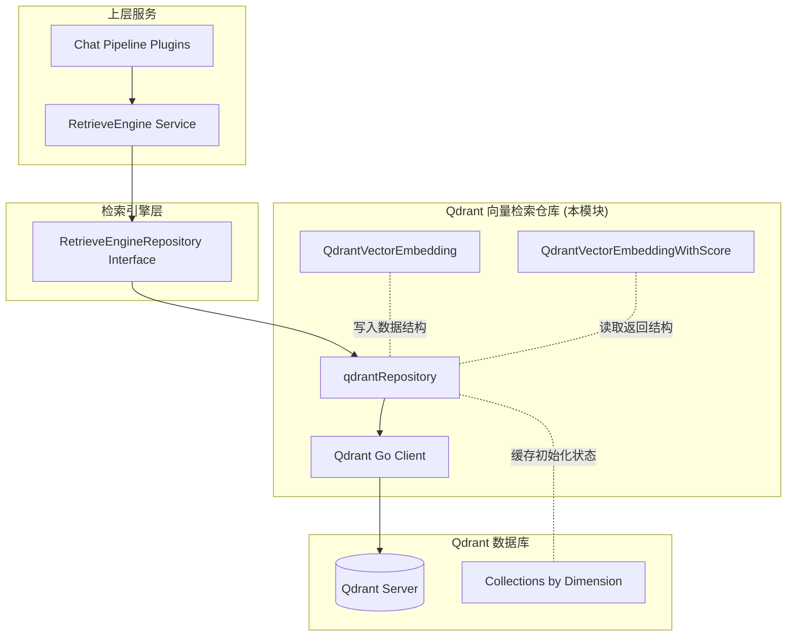

# Qdrant Vector Retrieval Repository

## 概述

想象一下，你有一个巨大的图书馆，里面存放着数百万本书的"语义指纹"——每本书都被转换成了一串数字向量，相似的书籍在数学空间中彼此靠近。当用户问一个问题时，你需要在毫秒级时间内找到语义上最相关的那些书。**`qdrant_vector_retrieval_repository` 模块就是这个图书馆的智能索引系统**。

这个模块是系统中多个向量检索后端之一（其他包括 [Elasticsearch](elasticsearch_vector_retrieval_repository.md)、[Milvus](milvus_vector_retrieval_repository.md)、[PostgreSQL](postgres_vector_retrieval_repository.md)），它使用 [Qdrant](https://qdrant.tech/) 作为底层向量数据库。Qdrant 是一个专为向量相似度搜索设计的数据库，特别适合高维向量的快速检索和过滤。

**为什么需要专门的向量检索后端？** 朴素的做法是把所有向量存在关系型数据库里，然后计算每个向量与查询向量的距离——但这在数据量达到百万级时会变得不可接受地慢。Qdrant 使用 HNSW（Hierarchical Navigable Small World）等近似最近邻算法，能在亚秒级时间内从数亿向量中找到最相似的结果，同时支持基于元数据的过滤（比如"只搜索某个知识库内的内容"）。

这个模块的核心职责是：
1. **存储**：将文档片段的向量表示及其元数据持久化到 Qdrant
2. **检索**：根据查询向量快速找到最相似的文档片段
3. **管理**：支持批量操作、条件删除、状态更新等运维需求

---

## 架构与数据流



### 架构角色解析

**qdrantRepository** 是整个模块的核心协调者，它扮演着**网关 + 缓存层**的角色：

1. **网关职责**：将系统内部的统一接口（`RetrieveEngineRepository`）转换为 Qdrant 特有的 API 调用
2. **缓存层职责**：通过 `initializedCollections sync.Map` 缓存已初始化的集合，避免每次操作都检查集合是否存在

**数据流动路径**（以检索操作为例）：

```
用户查询 → Chat Pipeline → RetrieveEngineService → qdrantRepository.Retrieve()
    → Qdrant Client.Search() → Qdrant Server → 返回带分数的向量
    → 转换为 QdrantVectorEmbeddingWithScore → 转换为 types.RetrieveResult → 返回上层
```

**关键设计洞察**：注意 `collectionBaseName` 字段——这意味着系统会为不同维度的向量创建不同的 Qdrant 集合（例如 `vectors_384`、`vectors_768`）。这种设计避免了在同一个集合中混合不同维度的向量（这会导致检索错误），同时允许系统支持多种嵌入模型。

---

## 核心组件深度解析

### 1. `qdrantRepository`

**设计意图**：这是模块的主要实现类，封装了与 Qdrant 数据库的所有交互。它不是简单的 CRUD 包装器，而是承担了**连接管理、集合生命周期管理、批量操作优化**等多重职责。

```go
type qdrantRepository struct {
    client             *qdrant.Client
    collectionBaseName string
    // Cache for initialized collections (dimension -> true)
    initializedCollections sync.Map
}
```

**字段解析**：

| 字段 | 类型 | 设计意图 |
|------|------|----------|
| `client` | `*qdrant.Client` | Qdrant Go 官方客户端实例，负责所有底层通信 |
| `collectionBaseName` | `string` | 集合命名前缀，配合维度生成完整集合名（如 `vectors_384`） |
| `initializedCollections` | `sync.Map` | **线程安全的缓存**，记录哪些维度的集合已初始化，避免重复检查 |

**为什么使用 `sync.Map`？** 这是一个关键的性能优化。在高并发场景下，多个 goroutine 可能同时尝试写入同一个维度的集合。`sync.Map` 提供了无锁读取和细粒度锁写入，比传统 `map + mutex` 更适合"读多写少"的缓存场景。

**隐式契约**：
- 该结构体实现了 `internal.types.interfaces.retriever.RetrieveEngineRepository` 接口（虽然方法实现未在当前代码片段中展示，但从接口定义可推断）
- 集合命名遵循 `{collectionBaseName}_{dimension}` 模式
- 所有方法应该是**线程安全**的（因为 `client` 和 `initializedCollections` 都是并发安全的）

---

### 2. `QdrantVectorEmbedding`

**设计意图**：这是写入 Qdrant 的**数据模型**，它将系统内部的 `IndexInfo` 转换为 Qdrant 可存储的格式。注意它包含了丰富的元数据字段——这些不仅是"附加信息"，更是**检索时过滤和溯源的关键**。

```go
type QdrantVectorEmbedding struct {
    Content         string    `json:"content"`
    SourceID        string    `json:"source_id"`
    SourceType      int       `json:"source_type"`
    ChunkID         string    `json:"chunk_id"`
    KnowledgeID     string    `json:"knowledge_id"`
    KnowledgeBaseID string    `json:"knowledge_base_id"`
    TagID           string    `json:"tag_id"`
    Embedding       []float32 `json:"embedding"`
    IsEnabled       bool      `json:"is_enabled"`
}
```

**字段语义与用途**：

| 字段 | 用途 | 检索时的作用 |
|------|------|--------------|
| `Content` | 原始文本内容 | 返回给用户的结果展示 |
| `SourceID` | 源文档 ID | 溯源：用户点击结果可跳转到原文档 |
| `SourceType` | 源类型（FAQ/手动/自动提取） | 过滤：某些场景只搜索特定类型的内容 |
| `ChunkID` | 分块 ID | **精确删除/更新**：按分块 ID 删除或更新状态 |
| `KnowledgeID` | 知识 ID | 过滤：限定搜索范围到特定知识 |
| `KnowledgeBaseID` | 知识库 ID | **最常用的过滤条件**：用户通常只搜索自己有权访问的知识库 |
| `TagID` | 标签 ID | FAQ 优先级过滤：带标签的 FAQ 通常质量更高 |
| `Embedding` | 向量本身 | 相似度计算的核心 |
| `IsEnabled` | 启用状态 | 软删除：禁用而非物理删除，便于恢复 |

**设计权衡**：
- **冗余 vs 查询效率**：`KnowledgeBaseID`、`KnowledgeID` 等字段在 Qdrant 中会作为 payload（有效载荷）存储，支持过滤。这增加了存储开销，但避免了"先查向量再查元数据"的两次查询。
- **`[]float32` vs `[]float64`**：选择 `float32` 是因为 Qdrant 原生支持 32 位浮点数，且对于向量相似度搜索，32 位精度已足够，同时节省一半存储空间。

**与 `IndexInfo` 的映射关系**：
```
IndexInfo (内部统一模型)          QdrantVectorEmbedding (Qdrant 专用模型)
├── ID              ──────────────→ (不直接存储，作为 Qdrant Point ID)
├── Content         ──────────────→ Content
├── SourceID        ──────────────→ SourceID
├── SourceType      ──────────────→ SourceType
├── ChunkID         ──────────────→ ChunkID
├── KnowledgeID     ──────────────→ KnowledgeID
├── KnowledgeBaseID ──────────────→ KnowledgeBaseID
├── KnowledgeType   ──────────────→ (用于选择集合，不存储在向量中)
├── TagID           ──────────────→ TagID
├── IsEnabled       ──────────────→ IsEnabled
└── IsRecommended   ──────────────→ (未在此结构体中，可能在其他后端使用)
```

---

### 3. `QdrantVectorEmbeddingWithScore`

**设计意图**：这是检索操作的**返回模型**，它在 `QdrantVectorEmbedding` 的基础上增加了相似度分数。使用嵌入（embedding）而非组合（composition）的设计模式，使得返回结果可以直接访问所有元数据字段。

```go
type QdrantVectorEmbeddingWithScore struct {
    QdrantVectorEmbedding
    Score float64
}
```

**为什么 `Score` 是 `float64` 而 `Embedding` 是 `[]float32`？**
- Qdrant 返回的相似度分数通常是 64 位浮点数（内部计算精度更高）
- 向量本身使用 32 位是因为存储和传输开销考虑
- 这是一个**精度与性能的平衡**：向量不需要双精度，但分数的高精度有助于排序和阈值过滤

**典型使用场景**：
```go
// 检索后过滤低分结果
results, _ := repo.Retrieve(ctx, params)
for _, r := range results {
    if r.Score < 0.7 {  // 阈值过滤
        continue
    }
    // 处理高分结果...
}
```

---

## 依赖关系分析

### 上游依赖（谁调用本模块）

```
application_services_and_orchestration
└── retrieval_and_web_search_services
    └── retriever_engine_composition_and_registry
        ├── CompositeRetrieveEngine
        └── RetrieveEngineRegistry
            └── [qdrantRepository 实例]
```

**调用链示例**：
1. `PluginSearch`（搜索插件）发起检索请求
2. `CompositeRetrieveEngine` 根据租户配置选择合适的检索引擎
3. `RetrieveEngineRegistry` 解析出 `qdrantRepository` 实例
4. 调用 `qdrantRepository.Retrieve()` 执行实际检索

**契约期望**：
- 上层期望 `Retrieve()` 方法在超时时间内返回（通常 < 500ms）
- 上层期望错误是**可分类的**（网络错误 vs 查询错误 vs 权限错误）
- 上层期望返回结果按分数**降序排列**

### 下游依赖（本模块调用谁）

```
qdrantRepository
└── github.com/qdrant/go-client/qdrant (Qdrant 官方 Go 客户端)
    └── gRPC 连接 → Qdrant Server
```

**关键依赖特性**：
- Qdrant Go 客户端是**线程安全**的，支持并发调用
- 客户端内部维护连接池，无需手动管理连接
- 客户端会自动处理重试和故障转移（如果配置了多节点）

### 数据契约

**写入契约**（`Save` / `BatchSave`）：
```go
// 输入
indexInfo *types.IndexInfo  // 必须包含有效的 KnowledgeBaseID 和 ChunkID
embedding []float32         // 维度必须与集合匹配

// 输出
error  // nil 表示成功，非 nil 可能是网络错误或维度不匹配
```

**读取契约**（`Retrieve`）：
```go
// 输入
params types.RetrieveParams{
    Query: "...",              // 查询文本（某些实现会内部嵌入）
    Embedding: []float32{...}, // 查询向量（必需）
    KnowledgeBaseIDs: [...],   // 过滤条件（可选）
    TopK: 10,                  // 返回数量
    Threshold: 0.7,            // 分数阈值（可选）
}

// 输出
[]*types.RetrieveResult{
    {
        Results: []*IndexWithScore{...},  // 按分数降序
        Error: nil,
    },
}
```

---

## 设计决策与权衡

### 1. 为什么选择 Qdrant 而非其他向量数据库？

**Qdrant 的优势**（相对于 Milvus、Elasticsearch、PostgreSQL/pgvector）：

| 维度 | Qdrant | Milvus | Elasticsearch | pgvector |
|------|--------|--------|---------------|----------|
| 部署复杂度 | 低（单二进制） | 高（多组件） | 中 | 低（PG 插件） |
| 过滤性能 | 优秀（原生 payload 过滤） | 良好 | 优秀 | 一般 |
| HNSW 实现 | 高度优化 | 高度优化 | 一般 | 基础 |
| 云原生支持 | 优秀 | 优秀 | 优秀 | 依赖 PG |
| 学习曲线 | 低 | 高 | 中 | 低（如果熟悉 PG） |

**本系统的选择逻辑**：系统支持**多后端并存**（通过 `RetrieverEngines` 配置），租户可以根据自身需求选择。Qdrant 通常是默认推荐，因为它在**过滤性能**和**部署简单性**之间取得了最佳平衡。

### 2. 集合按维度分离 vs 单一集合

**当前设计**：`collectionBaseName + dimension` → 多个集合

**替代方案**：单一集合，向量字段带维度元数据

**为什么选择多集合**：
- **类型安全**：Qdrant 不允许在同一集合中混合不同维度的向量，尝试这样做会导致运行时错误
- **性能**：HNSW 图是针对固定维度优化的，混合维度会破坏图结构
- **运维清晰**：可以独立管理不同嵌入模型的索引（例如单独删除 `vectors_384` 而不影响 `vectors_768`）

**代价**：
- 集合数量 = 使用的嵌入模型数量 × 知识类型数量
- 需要额外的逻辑来路由到正确的集合

### 3. `IsEnabled` 软删除 vs 物理删除

**设计选择**：使用 `IsEnabled` 字段标记启用状态，而非直接删除记录

**原因**：
- **可恢复性**：误操作禁用可以立即恢复
- **审计追踪**：保留历史记录便于排查问题
- **批量操作效率**：`BatchUpdateChunkEnabledStatus` 比批量删除再插入更高效

**代价**：
- 检索时需要额外过滤 `IsEnabled = true`
- 存储空间不会自动释放（需要定期清理）

### 4. `sync.Map` 缓存初始化状态

**设计选择**：使用 `sync.Map` 缓存哪些维度的集合已初始化

**为什么不每次操作都检查集合存在性**：
- Qdrant 的 `CollectionExists` 调用需要网络往返（~1-5ms）
- 在高并发场景下，这会成为瓶颈
- 集合一旦创建就会持续存在（除非手动删除）

**潜在风险**：
- 如果集合在外部被删除，缓存会"过期"，导致后续操作失败
- **缓解策略**：操作失败时清除缓存并重试（典型实现模式）

---

## 使用指南与示例

### 基本检索流程

```go
// 1. 准备检索参数
params := types.RetrieveParams{
    Query: "如何重置密码？",
    Embedding: queryEmbedding,  // 由嵌入模型生成
    KnowledgeBaseIDs: []string{"kb_123"},
    TopK: 10,
    Threshold: 0.7,
    KnowledgeType: "faq",
}

// 2. 执行检索
results, err := qdrantRepo.Retrieve(ctx, params)
if err != nil {
    // 处理错误（网络错误、集合不存在等）
    return err
}

// 3. 处理结果
for _, result := range results {
    fmt.Printf("内容：%s\n", result.Content)
    fmt.Printf("分数：%f\n", result.Score)
    fmt.Printf("来源：%s\n", result.SourceID)
}
```

### 批量写入示例

```go
// 准备一批向量
indexInfos := []*types.IndexInfo{
    {
        ID: "idx_1",
        Content: "密码重置步骤...",
        ChunkID: "chunk_1",
        KnowledgeBaseID: "kb_123",
        KnowledgeType: "faq",
        IsEnabled: true,
    },
    // ... 更多索引
}

// 批量保存
err := qdrantRepo.BatchSave(ctx, indexInfos, map[string]any{
    "dimension": 384,  // 指定集合维度
})
```

### 按条件删除

```go
// 删除某个知识库的所有向量
err := qdrantRepo.DeleteByKnowledgeIDList(
    ctx,
    []string{"knowledge_456"},
    384,  // 维度
    "faq", // 知识类型
)
```

---

## 边界情况与注意事项

### 1. 维度不匹配错误

**症状**：写入或检索时返回类似 "vector dimension mismatch" 的错误

**原因**：尝试将 768 维向量写入 384 维集合，或反之

**排查方法**：
```go
// 检查嵌入模型配置与集合维度是否一致
// 通常维度由嵌入模型决定：
// - bge-small: 384
// - bge-base: 768
// - text-embedding-ada-002: 1536
```

**解决方案**：确保 `BatchSave` 时传入的 `dimension` 参数与嵌入模型输出一致。

### 2. 集合未初始化

**症状**：首次写入时失败，提示集合不存在

**原因**：`initializedCollections` 缓存未命中，且自动创建逻辑失败

**典型场景**：
- Qdrant 服务不可达
- 权限不足无法创建集合
- 集合名包含非法字符

**建议处理**：
```go
// 在生产环境中，应在应用启动时预创建常用维度的集合
// 而不是依赖运行时自动创建
func InitializeCollections(ctx context.Context, dimensions []int) error {
    for _, dim := range dimensions {
        err := repo.ensureCollection(ctx, dim)
        if err != nil {
            return fmt.Errorf("failed to init collection for dim %d: %w", dim, err)
        }
    }
    return nil
}
```

### 3. 过滤条件与性能的权衡

**陷阱**：过度使用过滤条件会显著降低检索性能

**原因**：Qdrant 的 HNSW 索引针对"无过滤"场景优化，添加过滤条件后需要：
1. 先找到候选向量
2. 再应用过滤条件
3. 如果过滤后结果不足，需要扩大搜索范围

**最佳实践**：
- 优先使用 `KnowledgeBaseID` 过滤（最常用的访问模式）
- 避免同时使用多个高基数过滤条件（如同时过滤 100+ 个 `TagID`）
- 对于 `TopK` 较小的查询（< 10），过滤影响较小

### 4. 并发写入与一致性

**注意**：`BatchSave` 不是原子的——部分写入可能成功，部分失败

**场景**：批量写入 1000 条，网络在第 500 条时中断

**影响**：前 500 条已写入，后 500 条丢失

**建议**：
- 实现幂等性：使用 `ChunkID` 作为去重键
- 实现重试逻辑：失败后重新尝试未成功的批次
- 对于关键数据，使用事务性保证（需要上层服务协调）

### 5. 分数阈值的选择

**经验值**：
| 使用场景 | 推荐阈值 | 说明 |
|----------|----------|------|
| FAQ 检索 | 0.75-0.85 | FAQ 通常短小精悍，分数区分度高 |
| 长文档检索 | 0.6-0.7 | 长文本相似度普遍偏低 |
| 混合检索 | 0.65-0.75 | 平衡精确率和召回率 |

**警告**：阈值过高会导致"无结果"，阈值过低会返回大量噪声。建议通过 A/B 测试或用户反馈调整。

---

## 与其他检索后端的对比

| 特性 | Qdrant | [Elasticsearch](elasticsearch_vector_retrieval_repository.md) | [Milvus](milvus_vector_retrieval_repository.md) | [PostgreSQL](postgres_vector_retrieval_repository.md) |
|------|--------|--------|--------|----------|
| 向量检索性能 | ⭐⭐⭐⭐⭐ | ⭐⭐⭐ | ⭐⭐⭐⭐⭐ | ⭐⭐⭐ |
| 过滤性能 | ⭐⭐⭐⭐⭐ | ⭐⭐⭐⭐⭐ | ⭐⭐⭐⭐ | ⭐⭐⭐ |
| 部署复杂度 | ⭐⭐⭐⭐ | ⭐⭐⭐ | ⭐⭐ | ⭐⭐⭐⭐⭐ |
| 运维成熟度 | ⭐⭐⭐⭐ | ⭐⭐⭐⭐⭐ | ⭐⭐⭐⭐ | ⭐⭐⭐⭐⭐ |
| 混合检索支持 | ⭐⭐⭐ | ⭐⭐⭐⭐⭐ | ⭐⭐⭐⭐ | ⭐⭐⭐ |
| 推荐场景 | 默认选择 | 需要全文 + 向量混合检索 | 超大规模（亿级向量） | 已有 PG 生态 |

**选择建议**：
- **新项目**：优先选择 Qdrant（简单、性能好）
- **已有 Elasticsearch**：可复用 ES 的向量检索能力
- **超大规模**：考虑 Milvus 的分布式能力
- **PG 重度用户**：pgvector 可减少技术栈复杂度

---

## 扩展点

### 添加自定义过滤条件

当前实现支持基于 `KnowledgeBaseID`、`TagID` 等字段的过滤。如需添加新的过滤维度：

1. 在 `QdrantVectorEmbedding` 中添加新字段
2. 在 Qdrant 集合配置中将该字段声明为可过滤 payload
3. 在 `Retrieve` 方法中解析新的过滤参数并构建 Qdrant 过滤条件

### 支持新的嵌入维度

无需修改代码——`initializedCollections` 缓存和动态集合创建逻辑会自动处理新维度。只需确保：
1. 在租户配置中注册新的嵌入模型
2. 首次使用时会自动创建对应维度的集合

---

## 参考文档

- [RetrieveEngineRepository 接口定义](core_domain_types_and_interfaces.md)（定义本模块实现的契约）
- [Elasticsearch 向量检索仓库](elasticsearch_vector_retrieval_repository.md)（替代实现）
- [Milvus 向量检索仓库](milvus_vector_retrieval_repository.md)（替代实现）
- [PostgreSQL 向量检索仓库](postgres_vector_retrieval_repository.md)（替代实现）
- [CompositeRetrieveEngine](application_services_and_orchestration.md)（上层编排服务）
- [RetrieveParams](core_domain_types_and_interfaces.md)（检索参数定义）
