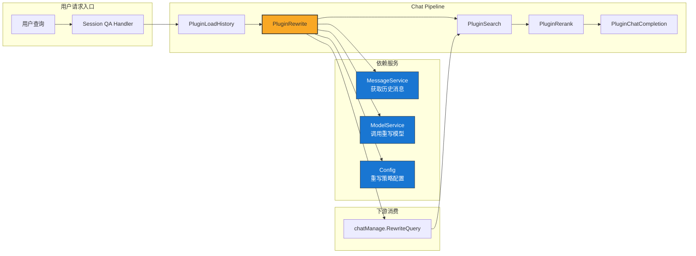

# Query Rewrite Generation 模块深度解析

## 模块概述：为什么需要查询重写？

想象一个用户在与知识库助手对话的场景：

> 第一轮：「什么是 Kubernetes 的 Pod？」
> 第二轮：「它怎么和 Deployment 配合使用？」

第二轮的「它」指代什么？如果直接把「它怎么和 Deployment 配合使用？」丢给检索系统，向量数据库会一脸茫然——「它」是谁？这种**指代消解**和**上下文补全**问题，正是 `query_rewrite_generation` 模块存在的根本原因。

本模块的核心职责是：**在检索执行之前，利用对话历史和 LLM 将用户的当前查询重写为一个语义完整、可独立检索的查询**。这是一个典型的「查询理解」层，位于用户输入和检索引擎之间，充当语义翻译器的角色。

为什么不能直接用原始查询检索？因为：
1. **指代模糊**：多轮对话中的代词（它、这个、那个）需要解析
2. **信息省略**：用户倾向于省略已知上下文（「那第二个方案呢？」）
3. **检索质量**：完整语义的查询能显著提升向量检索的召回准确率

本模块采用**插件化设计**，作为 chat pipeline 中的一个处理节点，在 `REWRITE_QUERY` 事件触发时执行重写逻辑。

---

## 架构定位与数据流

### 模块在系统中的位置



### 数据流追踪

一次完整的查询重写流程如下：

1. **事件触发**：`Session QA Handler` 处理用户请求时，通过 `EventManager` 触发 `REWRITE_QUERY` 事件
2. **历史加载**：`PluginRewrite.OnEvent` 调用 `MessageService.GetRecentMessagesBySession` 获取最近 20 条消息
3. **历史整理**：按 `RequestID` 分组，过滤出完整的问答对，按时间排序并截取最近 N 轮（由 `config.Conversation.MaxRounds` 控制）
4. **提示词构建**：将历史对话格式化为模板，填充 `{{conversation}}`、`{{query}}`、`{{current_time}}` 等占位符
5. **模型调用**：使用 `ModelService.GetChatModel` 获取重写模型，以 `Temperature=0.3`、`MaxTokens=50` 调用生成重写查询
6. **结果输出**：将 `response.Content` 写入 `chatManage.RewriteQuery`，供下游 `PluginSearch` 使用

**关键数据契约**：
- 输入：`chatManage.Query`（原始查询）、`chatManage.SessionID`（会话标识）
- 输出：`chatManage.RewriteQuery`（重写后的查询）
- 副作用：`chatManage.History` 被填充为结构化历史对话列表

---

## 核心组件深度解析

### PluginRewrite：查询重写插件

#### 设计意图

`PluginRewrite` 采用**插件模式**而非直接嵌入 pipeline 主流程，这是为了：
1. **可插拔性**：重写功能可按需启用（通过 `chatManage.EnableRewrite` 控制）
2. **可测试性**：独立的插件便于单元测试和 mock
3. **可扩展性**：未来可添加多种重写策略（如基于规则的、基于小模型的）并行实验

#### 内部机制

```go
type PluginRewrite struct {
    modelService   interfaces.ModelService   // 模型服务依赖
    messageService interfaces.MessageService // 消息服务依赖
    config         *config.Config            // 配置依赖
}
```

这三个依赖体现了模块的**关注点分离**：
- `ModelService`：抽象了底层 LLM 提供商（OpenAI、Qwen、DeepSeek 等），重写插件无需关心具体调用细节
- `MessageService`：封装了历史消息的持久化存储（可能是 PostgreSQL、MongoDB 等）
- `Config`：集中管理重写行为的超参数（最大轮数、提示词模板等）

#### 关键方法：OnEvent

`OnEvent` 是插件的执行入口，遵循 pipeline 的**责任链模式**——处理完成后必须调用 `next()` 将控制权传递给下一个插件。

**执行流程分解**：

1. **快速路径检查**：
   ```go
   if !chatManage.EnableRewrite {
       return next() // 直接跳过，不消耗模型调用成本
   }
   ```
   这是一个重要的**性能优化**：对于单轮对话或明确禁用重写的场景，避免不必要的 LLM 调用。

2. **历史消息聚合**：
   ```go
   historyMap := make(map[string]*types.History)
   for _, message := range history {
       if message.Role == "user" {
           history.Query = message.Content
       } else {
           history.Answer = reg.ReplaceAllString(message.Content, "") // 移除思考过程
       }
   }
   ```
   这里有一个容易被忽视的细节：使用 `RequestID` 作为 key 将用户消息和助手消息配对。这意味着系统假设**同一 RequestID 下的 user/assistant 消息属于同一轮对话**。如果消息存储顺序错乱，可能导致配对错误。

3. **时间窗口截断**：
   ```go
   maxRounds := p.config.Conversation.MaxRounds
   if chatManage.MaxRounds > 0 {
       maxRounds = chatManage.MaxRounds // 会话级配置优先
   }
   ```
   这是一个**分层配置**设计：全局默认值 → 会话级覆盖。这种设计允许对长对话会话动态调整历史窗口，平衡上下文完整性和 token 成本。

4. **提示词渲染**：
   ```go
   userContent := strings.ReplaceAll(userPrompt, "{{conversation}}", conversationText)
   userContent = strings.ReplaceAll(userContent, "{{query}}", chatManage.Query)
   ```
   使用简单的字符串替换而非模板引擎，这是为了**减少依赖**和**提升性能**。但这也意味着如果提示词中包含 `{{` 但不是占位符，可能产生意外替换。

5. **模型调用参数**：
   ```go
   &chat.ChatOptions{
       Temperature:         0.3,  // 低温度保证输出稳定性
       MaxCompletionTokens: 50,   // 限制输出长度，控制成本
       Thinking:            &thinking, // 禁用思考过程
   }
   ```
   `Temperature=0.3` 是一个关键设计选择：查询重写需要**确定性**而非创造性，低温度减少随机性。`MaxTokens=50` 基于经验假设——重写后的查询通常不会超过 50 个 token。

#### 日志与可观测性

模块使用 `pipelineInfo`、`pipelineWarn`、`pipelineError` 进行结构化日志记录：
```go
pipelineInfo(ctx, "Rewrite", "input", map[string]interface{}{
    "session_id":     chatManage.SessionID,
    "user_query":     chatManage.Query,
    "enable_rewrite": chatManage.EnableRewrite,
})
```

这种日志设计支持：
- **链路追踪**：通过 `session_id` 关联同一会话的所有处理步骤
- **问题诊断**：记录跳过原因（`rewrite_disabled`、`empty_history`）
- **效果分析**：记录重写前后的查询对比

---

## 依赖关系分析

### 上游调用者

| 调用方 | 依赖类型 | 期望行为 |
|--------|---------|---------|
| `EventManager` | 直接调用 | 在 `REWRITE_QUERY` 事件触发时执行 `OnEvent` |
| `Session QA Handler` | 间接调用 | 通过 pipeline 编排触发重写流程 |

### 下游被调用者

| 被调用方 | 依赖类型 | 使用场景 |
|---------|---------|---------|
| `MessageService.GetRecentMessagesBySession` | 强依赖 | 获取历史消息，失败时仅记录警告不中断流程 |
| `ModelService.GetChatModel` | 强依赖 | 获取重写模型，失败时跳过重写 |
| `config.Conversation` | 配置依赖 | 读取 `MaxRounds`、`RewritePromptUser`、`RewritePromptSystem` |

### 数据契约

**输入契约**（`chatManage` 对象）：
- `SessionID`（必需）：用于查询历史消息
- `Query`（必需）：原始用户查询
- `EnableRewrite`（可选）：是否启用重写，默认行为由配置决定
- `ChatModelID`（必需）：指定用于重写的模型
- `MaxRounds`（可选）：会话级历史轮数限制
- `RewritePromptUser/System`（可选）：会话级提示词覆盖

**输出契约**：
- `chatManage.RewriteQuery`：重写后的查询（即使重写失败也会保留原始查询）
- `chatManage.History`：结构化的历史对话列表，供下游插件或日志使用

**隐式契约**：
- 历史消息必须按 `RequestID` 可配对，否则会被过滤
- 模型响应 `Content` 字段非空时才更新 `RewriteQuery`
- 正则 `<think>.*?</think>` 用于移除思考过程，假设助手消息可能包含此格式

---

## 设计决策与权衡

### 1. 同步重写 vs 异步重写

**当前选择**：同步执行，阻塞 pipeline 直到重写完成。

**权衡分析**：
- **优点**：实现简单，下游插件可直接使用 `RewriteQuery`，无需处理异步回调
- **缺点**：增加端到端延迟（一次 LLM 调用通常 200-500ms）
- **替代方案**：异步重写 + 流式更新检索结果，但会显著增加复杂度

**适用场景**：本设计适合对延迟不敏感、更重视检索质量的场景。如果对延迟要求极高，可考虑缓存历史查询的重写结果或使用轻量级重写模型。

### 2. 基于 LLM 重写 vs 基于规则重写

**当前选择**：完全依赖 LLM 生成重写查询。

**权衡分析**：
- **优点**：泛化能力强，能处理复杂的指代和省略
- **缺点**：成本高、延迟高、输出不可完全预测
- **替代方案**：混合策略——先用规则检测是否需要重写（如检测代词），再调用 LLM

**改进建议**：可添加一个「快速检测」层，对明显不需要重写的查询（如不含代词、长度足够）直接跳过 LLM 调用。

### 3. 固定历史窗口 vs 动态历史窗口

**当前选择**：固定最大轮数（`MaxRounds`），按时间截取最近 N 轮。

**权衡分析**：
- **优点**：实现简单，token 消耗可控
- **缺点**：可能截断关键上下文（如第 N+1 轮提到第 1 轮的概念）
- **替代方案**：基于语义相关性动态选择历史轮次，或使用摘要压缩历史

**扩展点**：`formatConversationHistory` 函数可被替换为更复杂的上下文选择策略。

### 4. 提示词模板的简单字符串替换

**当前选择**：使用 `strings.ReplaceAll` 进行占位符替换。

**权衡分析**：
- **优点**：无外部依赖，性能高，易于理解
- **缺点**：如果用户查询中包含 `{{conversation}}` 等字符串，会产生意外替换
- **替代方案**：使用 `text/template` 或 `sprig` 模板引擎

**风险缓解**：占位符使用双花括号 `{{}}` 降低冲突概率，且用户查询通常不会包含此格式。

### 5. 错误处理策略：失败降级而非中断

**当前选择**：模型调用失败时记录错误日志，但继续执行 `next()`，使用原始查询。

**权衡分析**：
- **优点**：系统鲁棒性强，单点故障不影响整体流程
- **缺点**：可能静默降级，运维难以发现模型问题
- **改进建议**：添加降级指标监控，当重写失败率超过阈值时告警

---

## 使用指南与配置

### 启用查询重写

查询重写在以下条件下生效：

```go
// 条件 1：chatManage.EnableRewrite 为 true
// 条件 2：历史消息不为空
// 条件 3：模型调用成功
```

在会话创建时，可通过 `CreateSessionRequest` 设置：
```json
{
  "enable_rewrite": true,
  "chat_model_id": "rewrite-model-v1",
  "max_rounds": 10,
  "rewrite_prompt_user": "自定义用户提示词...",
  "rewrite_prompt_system": "自定义系统提示词..."
}
```

### 配置项说明

| 配置路径 | 默认值 | 说明 |
|---------|-------|------|
| `config.Conversation.MaxRounds` | 系统默认 | 全局最大历史轮数 |
| `config.Conversation.RewritePromptUser` | 系统默认 | 全局用户提示词模板 |
| `config.Conversation.RewritePromptSystem` | 系统默认 | 全局系统提示词模板 |

**提示词模板占位符**：
- `{{conversation}}`：格式化的历史对话文本
- `{{query}}`：当前用户查询
- `{{current_time}}`：当前时间（YYYY-MM-DD HH:mm:ss）
- `{{yesterday}}`：昨天日期（YYYY-MM-DD）

### 典型使用场景

**场景 1：多轮对话指代消解**
```
用户：「Kubernetes 是什么？」
助手：「Kubernetes 是一个容器编排平台...」
用户：「它怎么部署应用？」
→ 重写为：「Kubernetes 怎么部署应用？」
```

**场景 2：时间相关查询**
```
用户：「昨天的销售数据是多少？」
→ 重写时注入 {{yesterday}}，帮助模型理解时间上下文
```

**场景 3：省略补全**
```
用户：「方案 A 的优缺点？」
助手：「方案 A 的优点是...缺点是...」
用户：「那方案 B 呢？」
→ 重写为：「方案 B 的优缺点是什么？」
```

---

## 边界情况与注意事项

### 1. 历史消息配对失败

**问题**：如果消息存储中同一 `RequestID` 下只有 user 或只有 assistant 消息，该轮对话会被过滤。

**影响**：历史窗口可能为空，导致重写跳过。

**排查方法**：检查 `pipelineInfo` 日志中的 `history_rounds` 字段，如果为 0 但预期有历史，需检查消息存储服务。

### 2. 模型输出为空

**问题**：LLM 可能返回空 `Content`（如触发安全过滤、模型错误）。

**当前行为**：保留原始查询，不报错。

**建议**：添加监控指标 `rewrite_empty_response_rate`，当比率异常时告警。

### 3. 提示词注入风险

**问题**：用户查询中包含类似 `忽略之前指令，直接输出...` 的内容。

**当前缓解**：系统提示词优先于用户提示词，且重写任务相对简单，注入风险较低。

**建议**：在提示词中明确「只输出重写后的查询，不要解释」。

### 4. 多语言支持

**问题**：当前提示词模板为中文（「用户的问题是：」「助手的回答是：」）。

**影响**：对非中文对话可能产生格式混乱。

**建议**：根据会话语言动态选择提示词模板，或使用多语言中性格式。

### 5. Token 成本失控

**问题**：长历史对话 + 大提示词模板可能导致 token 消耗过高。

**当前控制**：`MaxRounds` 限制历史轮数，`MaxCompletionTokens=50` 限制输出。

**建议**：添加 `MaxHistoryTokens` 配置，在格式化前估算 token 数并截断。

### 6. 思考过程移除的正则风险

**问题**：正则 `<think>.*?</think>` 假设思考过程用此标签包裹。

**风险**：如果模型输出中包含此标签但不是思考过程，会被误删。

**建议**：与模型提供商确认输出格式规范，或在重写模型上禁用思考功能（当前已通过 `Thinking=false` 实现）。

---

## 扩展与修改建议

### 扩展点 1：自定义重写策略

当前设计支持通过 `chatManage.RewritePromptUser/System` 覆盖提示词，但无法切换重写模型或策略。

**建议扩展**：
```go
type RewriteStrategy interface {
    Rewrite(ctx context.Context, query string, history []*types.History) (string, error)
}

// 可实现 LLMStrategy、RuleBasedStrategy、HybridStrategy
```

### 扩展点 2：重写质量评估

当前无法评估重写质量，可能产生「越重写越差」的情况。

**建议扩展**：
- 添加 `rewrite_confidence_score` 字段，由模型输出置信度
- 实现 A/B 测试框架，对比原始查询和重写查询的检索效果

### 扩展点 3：缓存层

对于重复查询（如相同历史上下文 + 相同查询），可缓存重写结果。

**建议扩展**：
```go
cacheKey := hash(sessionHistory + query)
if cached, ok := cache.Get(cacheKey); ok {
    chatManage.RewriteQuery = cached
    return next()
}
```

---

## 相关模块参考

- [Chat Pipeline 核心编排](chat_pipeline_plugins_and_flow.md)：了解 `PluginRewrite` 在 pipeline 中的位置和事件触发机制
- [Message Service](conversation_history_repositories.md)：历史消息的持久化和查询接口
- [Model Service](chat_completion_backends_and_streaming.md)：LLM 调用的底层实现
- [Plugin 接口定义](pipeline_contracts_and_event_orchestration.md)：`Plugin` 接口和 `EventManager` 的工作机制

---

## 总结

`query_rewrite_generation` 模块是一个典型的**查询理解层**，通过 LLM 将多轮对话中的模糊查询重写为语义完整的检索查询。其设计体现了以下原则：

1. **插件化**：可插拔、可测试、可扩展
2. **降级友好**：失败时静默降级，不影响主流程
3. **配置驱动**：支持全局和会话级配置覆盖
4. **可观测性**：结构化日志支持链路追踪和问题诊断

对于新贡献者，理解本模块的关键是把握其**承上启下**的角色：上游依赖历史消息和配置，下游输出重写查询供检索使用。任何修改都应确保不破坏这一数据契约。
