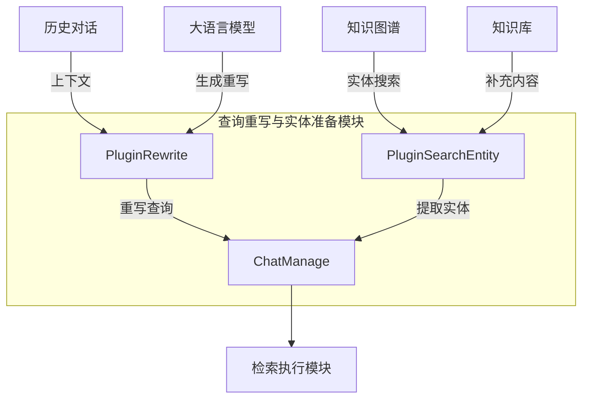

# 查询重写与实体准备模块

## 概述

想象一下，当您与一个智能助手对话时，您可能会说"告诉我更多关于它的信息"或者"还有什么相关的？"。如果没有上下文，这些问题几乎无法理解。`query_rewriting_and_entity_preparation` 模块就是解决这个问题的核心组件——它负责理解对话的上下文，将模糊的查询转化为精确的检索指令，并从知识图谱中提取相关实体信息。

这个模块在整个聊天流水线中扮演着"翻译官"和"情报收集者"的双重角色：它将用户的自然语言查询转换为系统可以高效检索的形式，同时从知识图谱中挖掘相关的实体和关系，为后续的回答生成提供丰富的背景信息。

## 架构概览



这个模块由两个核心插件组成，它们按顺序工作：

1. **PluginRewrite**：首先使用历史对话和 LLM 将用户的原始查询重写为更明确、更适合检索的形式
2. **PluginSearchEntity**：然后从重写后的查询中提取实体，并在知识图谱中搜索相关的节点和关系

两者都通过事件驱动的方式与流水线交互，遵循管道模式，每个插件处理完数据后将结果传递给下一个环节。

### 数据流转过程

1. **查询重写阶段**：
   - PluginRewrite 接收原始用户查询
   - 从 MessageService 获取最近的对话历史
   - 将历史对话和当前查询一起发送给 LLM
   - LLM 返回重写后的查询，存储在 ChatManage.RewriteQuery 中
   - 同时将整理好的历史对话存储在 ChatManage.History 中

2. **实体准备阶段**：
   - PluginSearchEntity 从重写后的查询中提取实体
   - 在知识图谱中并行搜索相关实体节点和关系
   - 从搜索到的图节点中提取关联的文档块
   - 将图数据和新增的检索结果合并到 ChatManage 中

## 核心设计决策

### 1. 事件驱动的插件架构

**选择**：采用事件驱动的插件模式，而非直接的函数调用链。

**原因**：
- 提供了极大的灵活性——可以轻松添加、移除或重新排序插件
- 每个插件都是独立的，便于单独测试和维护
- 通过事件类型解耦，插件只关注自己关心的事件

**权衡**：
- 增加了一定的间接层，调试时需要追踪事件流
- 插件之间的数据传递依赖于共享的 ChatManage 结构体，需要 careful state management

### 2. LLM 辅助的查询重写

**选择**：使用 LLM 而非简单的规则进行查询重写。

**原因**：
- 自然语言的上下文理解是复杂的，规则难以覆盖所有情况
- LLM 可以理解指代消解（如"它"、"这个"指的是什么）
- 可以处理更复杂的对话上下文，如多轮对话中的主题转移

**权衡**：
- 增加了延迟——每次查询重写都需要调用 LLM
- 增加了成本——LLM 调用不是免费的
- 存在不确定性——LLM 的重写结果可能不稳定

### 3. 并行知识图谱搜索

**选择**：在多个知识库/文件中并行搜索实体。

**原因**：
- 知识图谱搜索可能涉及多个独立的数据源
- 并行处理可以显著减少总体延迟
- 各个搜索任务之间没有依赖关系，非常适合并行化

**权衡**：
- 增加了系统的并发复杂度
- 需要使用互斥锁保护共享数据结构
- 可能在短时间内对底层存储造成较大压力

### 4. 图数据与文本检索结果的融合

**选择**：将知识图谱搜索结果与传统文本检索结果合并。

**原因**：
- 知识图谱可以提供结构化的关系信息，补充纯文本检索的不足
- 图节点通常关联到具体的文档块，可以直接用于回答生成
- 两种检索方式可以互相补充，提高整体召回率

**权衡**：
- 需要处理重复结果（同一个文档块可能被多种方式检索到）
- 不同类型的结果需要统一的评分和排序机制
- 增加了结果处理的复杂度

## 子模块详解

本模块包含两个主要子模块：

### 查询重写生成 (query_rewrite_generation)

这个子模块由 `PluginRewrite` 实现，负责将用户的原始查询转换为更适合检索的形式。它的核心思想是利用历史对话上下文，将模糊、指代性的查询转换为明确、自包含的查询。

**关键特性**：
- 智能历史对话管理：自动过滤不完整的对话，按时间排序
- 灵活的提示模板：支持系统级和会话级的自定义提示
- 安全的思考过程清理：自动移除 LLM 的思考过程（<think>标签内容）
- 可配置的历史轮数：支持全局和会话级别的历史对话长度限制

**使用示例**：
```go
// PluginRewrite 会自动处理 REWRITE_QUERY 事件
// 配置后无需手动调用，通过事件管理器触发
```

[查询重写生成子模块详细文档](query_rewrite_generation.md)

### 搜索准备的实体提取 (entity_extraction_for_search_preparation)

这个子模块由 `PluginSearchEntity` 实现，负责从重写后的查询中提取实体，并在知识图谱中搜索相关信息。它的核心思想是利用知识图谱的结构化信息，为回答生成提供更丰富的背景知识。

**关键特性**：
- 双模式搜索：支持按知识库批量搜索和按单个文件搜索
- 并行执行：自动并行化多个搜索任务，提高效率
- 智能去重：自动过滤已经检索到的文档块
- 结果融合：将图搜索结果与文本检索结果无缝合并

**使用示例**：
```go
// PluginSearchEntity 会自动处理 ENTITY_SEARCH 事件
// 前置条件：ChatManage.Entity 和 ChatManage.EntityKBIDs 需要预先设置
```

[实体提取子模块详细文档](entity_extraction_for_search_preparation.md)

## 跨模块依赖

这个模块在整个系统中处于承上启下的位置，与多个关键模块有紧密的交互：

### 上游依赖

1. **[history_context_loading](query_understanding_and_retrieval_flow-history_context_loading.md)**：
   - 提供对话历史的加载和预处理
   - PluginRewrite 进一步细化和格式化这些历史信息

2. **[pipeline_core_and_instrumentation](chat_pipeline_plugins_and_flow-pipeline_core_and_instrumentation.md)**：
   - 提供事件管理和插件注册机制
   - 两个插件都依赖 EventManager 进行注册和事件触发

### 下游依赖

1. **[retrieval_execution](query_understanding_and_retrieval_flow-retrieval_execution.md)**：
   - 接收重写后的查询进行检索
   - 使用实体搜索结果补充检索结果

2. **[retrieval_result_refinement_and_merge](query_understanding_and_retrieval_flow-retrieval_result_refinement_and_merge.md)**：
   - 对包括实体搜索结果在内的所有检索结果进行精排和合并

### 外部依赖

1. **ModelService**：
   - 用于调用 LLM 进行查询重写
   - 需要支持 chat completion 接口

2. **MessageService**：
   - 用于获取历史对话消息
   - 需要支持按会话获取最近消息

3. **RetrieveGraphRepository**：
   - 用于在知识图谱中搜索实体
   - 需要支持按命名空间和实体列表搜索

4. **ChunkRepository 和 KnowledgeRepository**：
   - 用于获取与图节点关联的文档块内容
   - 需要支持批量获取操作

## 新贡献者指南

### 常见陷阱

1. **ChatManage 状态管理**：
   - 插件之间通过 ChatManage 共享状态，修改时要小心
   - 特别是 SearchResult 数组，多个插件可能都会向其中添加内容
   - 记得调用 `removeDuplicateResults` 去重

2. **历史对话处理**：
   - PluginRewrite 中的历史对话处理逻辑比较复杂
   - 注意它是按 RequestID 分组的，这意味着一个请求-响应对构成一轮对话
   - 不完整的对话（只有问题或只有回答）会被过滤掉

3. **实体搜索的前置条件**：
   - PluginSearchEntity 假设 ChatManage.Entity 和 ChatManage.EntityKBIDs 已经设置
   - 如果这些字段为空，插件会直接跳过，不会报错
   - 在调试时，如果发现实体搜索没有执行，首先检查这些字段是否正确设置

4. **并发安全**：
   - PluginSearchEntity 中使用了 sync.Mutex 保护共享数据
   - 如果修改这部分代码，要注意保持并发安全性
   - 不要在持有锁的情况下执行耗时操作（如 IO 操作）

### 扩展点

1. **自定义查询重写提示**：
   - 可以通过 config.Conversation.RewritePromptUser 和 RewritePromptSystem 全局配置
   - 也可以在会话级别通过 ChatManage.RewritePromptUser 和 RewritePromptSystem 覆盖

2. **实体搜索范围控制**：
   - 通过 EntityKBIDs 控制在哪些知识库中搜索
   - 通过 EntityKnowledge 精确控制在哪些文件中搜索

3. **插件顺序调整**：
   - 通过修改事件触发顺序可以调整插件执行顺序
   - 注意查询重写应该在实体搜索之前执行

### 调试技巧

1. **查看详细日志**：
   - 两个插件都有详细的日志输出，使用 pipelineInfo、pipelineWarn、pipelineError
   - 在调试时，可以关注这些日志来了解插件的执行情况

2. **检查 ChatManage 状态**：
   - 在每个插件执行前后，检查 ChatManage 中相关字段的变化
   - 特别关注 RewriteQuery、History、Entity、GraphResult、SearchResult

3. **禁用查询重写**：
   - 可以通过设置 EnableRewrite 为 false 来禁用查询重写
   - 这在调试实体搜索或其他下游插件时很有用

4. **限制历史对话轮数**：
   - 可以通过 MaxRounds 字段控制使用多少轮历史对话
   - 这在调试历史对话相关问题时很有用
