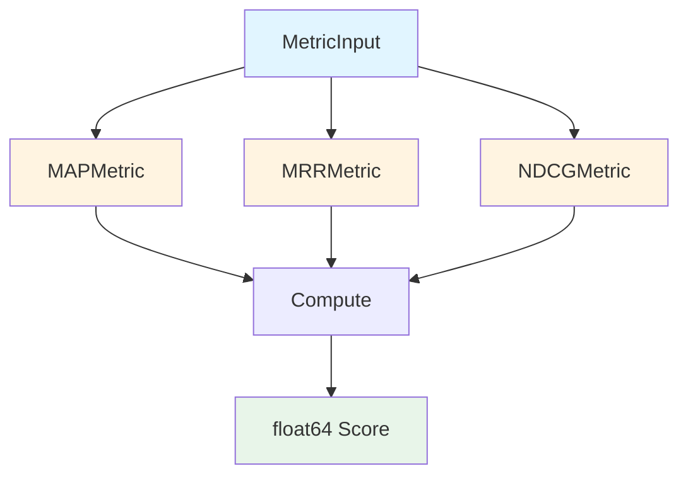
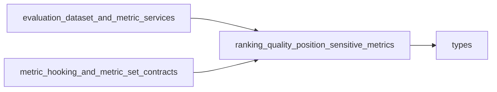

# 排序质量位置敏感指标模块 (ranking_quality_position_sensitive_metrics)

## 1. 概述

当您向搜索引擎查询"如何制作咖啡"时，您最希望看到的是最相关的结果出现在页面顶部，而不是 buried 在第10页。这个模块就是专门用来评估排序系统是否做到了这一点的。

**ranking_quality_position_sensitive_metrics** 模块提供了三个核心的位置敏感排序质量评估指标：
- **MAP (Mean Average Precision)**：平均准确率，衡量整体排序质量
- **MRR (Mean Reciprocal Rank)**：平均倒数排名，关注第一个相关结果的位置
- **NDCG (Normalized Discounted Cumulative Gain)**：归一化折损累计增益，考虑位置权重和相关性等级

这些指标不仅仅是数学公式，它们是评估检索系统是否真正理解用户意图的"裁判"。

## 2. 架构设计

### 2.1 核心组件关系图



### 2.2 设计思想

这个模块采用了**策略模式**的设计思想，每个指标都是一个独立的策略类，实现了相同的接口。这种设计有几个关键优势：

1. **松耦合**：每个指标独立实现，修改一个不会影响其他
2. **可扩展**：添加新指标只需创建新类，无需修改现有代码
3. **一致性**：所有指标都通过 `Compute` 方法提供统一的调用接口

### 2.3 数据流

当评估一个检索系统时，数据流程如下：

1. **输入准备**：`MetricInput` 包含真实相关文档 (`RetrievalGT`) 和预测排序结果 (`RetrievalIDs`)
2. **指标计算**：选择一个指标类（如 `MAPMetric`）调用其 `Compute` 方法
3. **结果输出**：返回 0-1 之间的分数，越高表示排序质量越好

## 3. 核心组件详解

### 3.1 MAPMetric - 平均准确率

**设计意图**：MAP 衡量的是"在每个相关文档出现的位置，我们已经找到了多少相关文档"。这就像考试时，不仅要答对题，还要按重要性顺序答题。

**计算逻辑**：
- 对每个查询，计算从第1位到第k位的准确率
- 只在相关文档出现的位置计算准确率
- 对所有相关文档的准确率取平均，得到单查询的 AP
- 对所有查询的 AP 取平均，得到最终 MAP

**适用场景**：当您关心所有相关文档的整体排序质量时

### 3.2 MRRMetric - 平均倒数排名

**设计意图**：MRR 只关心"第一个相关文档出现在哪里"。这就像搜索引擎的"首页质量"评估——用户最关心的是第一个结果是否相关。

**计算逻辑**：
- 对每个查询，找到第一个相关文档的位置
- 计算该位置的倒数（如第1位是1/1=1，第2位是1/2=0.5）
- 对所有查询的倒数值取平均

**适用场景**：当您最关心"最相关的结果是否排在前面"时

### 3.3 NDCGMetric - 归一化折损累计增益

**设计意图**：NDCG 考虑了两个重要因素：
1. **位置折扣**：排在前面的结果更重要
2. **相关性等级**：不仅区分"相关"和"不相关"，还可以区分"非常相关"和"有点相关"

**计算逻辑**：
- 计算 DCG：对每个位置，用相关性分数除以位置的对数折扣
- 计算 IDCG：理想情况下的最大 DCG（所有相关文档按相关性排序在前）
- NDCG = DCG / IDCG（归一化到 0-1 范围）

**适用场景**：当您有相关性等级数据，且非常关心 top-k 结果时

## 4. 设计决策与权衡

### 4.1 为什么选择独立的 struct 而不是函数？

**决策**：每个指标都是一个独立的 struct，即使有些没有状态（如 MAP 和 MRR）

**权衡分析**：
- ✅ **一致性**：所有指标使用相同的模式
- ✅ **未来扩展**：可以轻松添加状态（如 NDCG 的 k 参数）
- ✅ **接口统一**：便于后续添加指标注册和发现机制
- ❌ **轻微 overhead**：对于无状态的指标，创建实例有轻微开销

### 4.2 为什么使用 map[int]struct{} 而不是其他数据结构？

**决策**：在 MAP 和 MRR 中使用空结构体 map 作为集合

**权衡分析**：
- ✅ **空间效率**：空结构体不占用额外空间
- ✅ **查找性能**：O(1) 时间复杂度的成员检查
- ✅ **语义清晰**：明确表示这是一个集合，不是键值对
- ❌ **内存分配**：对于小数据集，可能比线性扫描稍重

### 4.3 为什么 NDCG 的相关性分数硬编码为 0/1？

**决策**：当前实现中，相关性只有 0（不相关）和 1（相关）两个等级

**权衡分析**：
- ✅ **简化实现**：无需处理复杂的相关性等级输入
- ✅ **通用性**：适用于只有二元相关性判断的场景
- ❌ **未充分利用 NDCG 优势**：NDCG 的真正威力在于处理多级相关性
- 🔮 **未来扩展**：可以修改 `MetricInput` 以支持相关性分数

## 5. 使用指南

### 5.1 基本使用

```go
// 创建指标实例
mapMetric := metric.NewMAPMetric()
mrrMetric := metric.NewMRRMetric()
ndcgMetric := metric.NewNDCGMetric(10) // 评估 top-10 结果

// 准备输入数据
input := &types.MetricInput{
    RetrievalGT: [][]int{
        {1, 3, 5},  // 查询1的相关文档ID
        {2, 4},     // 查询2的相关文档ID
    },
    RetrievalIDs: []int{1, 2, 3, 4, 5, 6, 7, 8, 9, 10}, // 排序结果
}

// 计算分数
mapScore := mapMetric.Compute(input)
mrrScore := mrrMetric.Compute(input)
ndcgScore := ndcgMetric.Compute(input)
```

### 5.2 关键注意事项

⚠️ **输入格式约束**：
- `RetrievalGT` 是一个二维切片，每个子切片对应一个查询的相关文档
- `RetrievalIDs` 是一个一维切片，表示单个排序结果（注意：这个设计有些特殊）
- 文档ID必须是整数类型

⚠️ **边界情况**：
- 如果没有相关文档（`len(gtSets) == 0`），所有指标返回 0
- NDCG 中如果理想 DCG 为 0，返回 0
- NDCG 会自动截断结果到 top-k

## 6. 子模块说明

这个模块包含三个子模块，每个子模块负责一个具体的指标实现：

- [mean_average_precision_metric](mean_average_precision_metric.md)：详细讲解 MAP 指标的实现细节
- [mean_reciprocal_rank_metric](mean_reciprocal_rank_metric.md)：深入分析 MRR 指标的设计与实现
- [normalized_discounted_cumulative_gain_metric](normalized_discounted_cumulative_gain_metric.md)：探索 NDCG 指标的数学原理和代码实现

## 7. 与其他模块的关系

### 7.1 依赖关系



### 7.2 关键依赖

- **types 模块**：提供 `MetricInput` 数据结构
- **retrieval_quality_metrics 父模块**：组织和协调各个检索质量指标
- **metric_hooking_and_metric_set_contracts**：可能使用这些指标构建评估管道

## 8. 总结

ranking_quality_position_sensitive_metrics 模块是评估检索系统质量的核心工具包。它通过三个经典的位置敏感指标，从不同角度衡量排序结果的质量：

- **MAP**：关注整体，像是严格的老师，检查每一个相关答案
- **MRR**：关注首位，像是急性子的用户，只看第一个结果
- **NDCG**：关注细节，像是精细的美食家，品味每个位置的好坏

这个模块的设计既保持了数学严谨性，又具有良好的扩展性，是整个评估系统的坚实基础。
