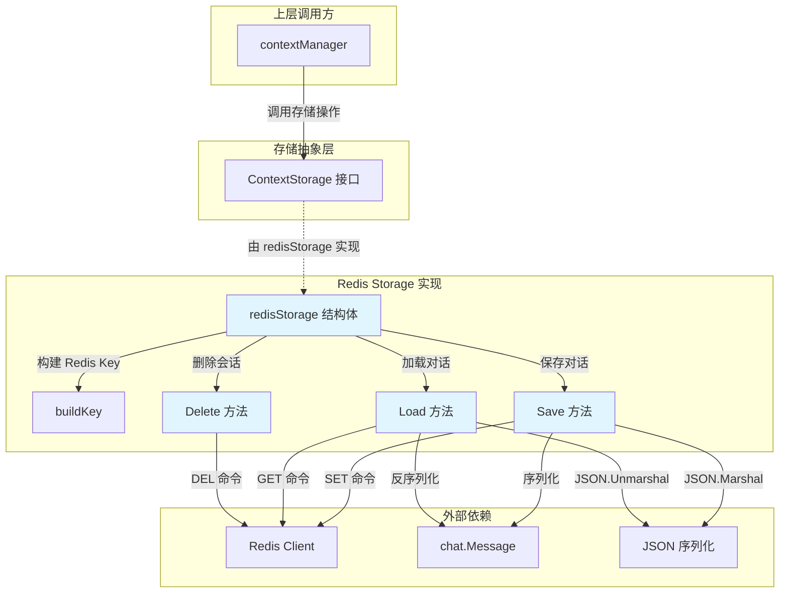

# Redis Context Storage Implementation

## 概述

想象一下你正在和一个 AI 助手进行多轮对话。每一轮问答都需要记住之前的对话内容，否则 AI 就会像得了失忆症一样，每次都要你重新介绍自己。`redis_context_storage_implementation` 模块就是这个系统的"长期记忆中枢"——它负责把对话历史持久化存储到 Redis 中，确保即使服务重启、进程重启，用户的对话上下文也不会丢失。

这个模块存在的核心原因是：**LLM 的上下文窗口是有限的，但对话可能是无限的**。系统需要在多个会话之间持久化存储对话历史，同时支持高效的读写操作。为什么选择 Redis 而不是数据库？因为对话上下文是典型的"热数据"——最近几轮对话被频繁访问，而旧对话逐渐冷却。Redis 的内存存储特性提供了微秒级的读写延迟，配合 TTL（生存时间）机制自动清理过期会话，完美契合这一场景。如果 naive 地直接存数据库，每次对话都要查 SQL，延迟会累积到用户无法接受的程度；如果只用内存，服务重启后所有对话历史都会丢失。

本模块实现了 [`ContextStorage`](#contextstorage-接口) 接口，与 [`memoryStorage`](in_memory_context_storage_implementation.md) 一起为 [`contextManager`](context_manager_orchestration.md) 提供可插拔的存储后端。

---

## 架构与数据流



### 组件角色说明

| 组件 | 职责 | 类比 |
|------|------|------|
| **redisStorage** | 核心结构体，持有 Redis 客户端连接、TTL 配置和 Key 前缀 | 像一个图书管理员，负责把对话记录存到正确的书架上 |
| **buildKey** | 构建 Redis Key，格式为 `{prefix}{sessionID}` | 给每本书记录生成唯一的索书号 |
| **Save** | 将对话消息序列化为 JSON 并存入 Redis，带 TTL | 把对话写进档案袋，贴上过期标签后放入档案柜 |
| **Load** | 从 Redis 读取并反序列化为消息列表 | 从档案柜取出档案袋，展开阅读 |
| **Delete** | 删除会话对应的 Redis Key | 销毁过期档案 |

### 数据流动路径

**保存对话（Save 路径）**：
```
contextManager.Save() 
  → redisStorage.Save(ctx, sessionID, messages)
    → buildKey(sessionID) → "context:session_123"
    → json.Marshal(messages) → []byte
    → redis.Client.Set(key, data, ttl)
    → 日志记录
```

**加载对话（Load 路径）**：
```
contextManager.Load()
  → redisStorage.Load(ctx, sessionID)
    → buildKey(sessionID) → "context:session_123"
    → redis.Client.Get(key).Bytes()
    → json.Unmarshal(data, &messages)
    → 返回 []chat.Message
```

**删除会话（Delete 路径）**：
```
contextManager.Delete()
  → redisStorage.Delete(ctx, sessionID)
    → buildKey(sessionID)
    → redis.Client.Del(key)
    → 日志记录
```

---

## 组件深度解析

### redisStorage 结构体

```go
type redisStorage struct {
    client *redis.Client  // Redis 客户端连接
    ttl    time.Duration  // 会话数据的生存时间
    prefix string         // Redis Key 的前缀
}
```

**设计意图**：这个结构体采用了**依赖注入**模式，所有外部依赖（Redis 客户端）和配置参数（TTL、前缀）都在构造时注入，而不是在方法内部创建。这样做的好处是：
1. **可测试性**：测试时可以传入 mock 的 Redis 客户端
2. **配置集中化**：所有配置在 `NewRedisStorage` 中统一处理
3. **无状态设计**：结构体本身不保存会话状态，每个请求都是独立的，天然支持并发

**字段详解**：
- `client`：来自 `github.com/redis/go-redis/v9` 的客户端，封装了所有 Redis 操作
- `ttl`：默认 24 小时，意味着会话数据在 24 小时后自动过期。这个值需要权衡——太短会导致用户稍后回来对话历史丢失，太长会占用过多内存
- `prefix`：默认 `"context:"`，用于在 Redis 中隔离不同类型的数据。如果系统还有其他功能也用 Redis，前缀可以避免 Key 冲突

---

### NewRedisStorage 构造函数

```go
func NewRedisStorage(client *redis.Client, ttl time.Duration, prefix string) (ContextStorage, error)
```

**为什么返回接口而不是具体类型？** 这是 Go 的"依赖倒置"实践——调用方依赖的是 `ContextStorage` 接口，而不是具体的 `redisStorage` 实现。这样未来如果想切换到其他存储后端（比如 etcd 或本地文件），调用方代码无需修改。

**连接验证逻辑**：
```go
_, err := client.Ping(context.Background()).Result()
if err != nil {
    return nil, fmt.Errorf("failed to connect to Redis: %w", err)
}
```

这个设计体现了 **"Fail Fast" 原则**——在构造时就验证 Redis 连接是否可用，而不是等到第一次调用 `Save` 或 `Load` 时才发现连不上。这避免了在运行时出现难以调试的错误。

**默认值处理**：
```go
if ttl == 0 {
    ttl = 24 * time.Hour // Default TTL 24 hours
}
if prefix == "" {
    prefix = "context:" // Default prefix
}
```

这里有一个**设计权衡**：为什么允许传入 0 或空字符串，而不是强制要求调用方提供有效值？答案是**灵活性**——调用方可以显式传入 0 来表示"使用默认值"，而不需要在调用前自己判断。但这种设计也有风险：如果调用方误传了 0，可能不是本意。这是一个典型的"约定优于配置"的取舍。

---

### Save 方法

```go
func (rs *redisStorage) Save(ctx context.Context, sessionID string, messages []chat.Message) error
```

**内部机制**：
1. **Key 构建**：`buildKey(sessionID)` 生成类似 `context:session_abc123` 的 Key
2. **序列化**：使用 `json.Marshal` 将 `[]chat.Message` 转为 JSON 字节数组
3. **存储**：调用 `redis.Client.Set(key, data, ttl)`，注意这里传入了 TTL
4. **日志**：记录保存的消息数量和 TTL

**为什么每次 Save 都覆盖整个消息列表？** 这是一个重要的设计决策。另一种方案是增量更新（比如用 Redis List 的 `RPUSH`），但当前实现选择全量覆盖的原因是：
- **简单性**：全量覆盖逻辑简单，不需要处理增量更新的边界情况
- **一致性**：每次 Save 都是完整的快照，不会出现部分更新导致的数据不一致
- **压缩友好**：[`contextManager`](context_manager_orchestration.md) 在 Save 之前会调用压缩策略，消息列表可能已经被裁剪或摘要，全量存储更合理

**潜在性能问题**：当对话轮数很多时（比如 100+ 轮），JSON 序列化和网络传输的开销会显著增加。这也是为什么 [`contextManager`](context_manager_orchestration.md) 会配合 [`CompressionStrategy`](compression_strategies.md) 使用——在 Save 之前先压缩上下文。

**错误处理**：
```go
if err != nil {
    logger.Errorf(ctx, "[RedisStorage][Session-%s] Failed to marshal messages: %v", sessionID, err)
    return fmt.Errorf("failed to marshal messages: %w", err)
}
```

这里使用了 `fmt.Errorf` 的 `%w` 动词进行**错误包装**，调用方可以用 `errors.Is` 或 `errors.As` 判断错误类型。日志中包含了 Session ID，便于排查问题时定位具体会话。

---

### Load 方法

```go
func (rs *redisStorage) Load(ctx context.Context, sessionID string) ([]chat.Message, error)
```

**特殊处理：Key 不存在的情况**：
```go
if err == redis.Nil {
    logger.Debugf(ctx, "[RedisStorage][Session-%s] No context found in Redis", sessionID)
    return []chat.Message{}, nil
}
```

这里返回空切片而不是 `nil`，是一个**防御性编程**实践。调用方可以安全地遍历返回的切片，无需检查 `nil`。如果返回 `nil`，调用方遍历时可能会 panic（虽然 Go 的 `range` 对 `nil` 切片是安全的，但显式返回空切片更清晰）。

**反序列化风险**：
```go
err = json.Unmarshal(data, &messages)
if err != nil {
    logger.Errorf(ctx, "[RedisStorage][Session-%s] Failed to unmarshal messages: %v", sessionID, err)
    return nil, fmt.Errorf("failed to unmarshal messages: %w", err)
}
```

如果 Redis 中的数据格式与当前的 `chat.Message` 结构不兼容（比如字段类型变更），反序列化会失败。这是一个**隐式契约**——存储的数据格式必须与代码中的结构体定义保持一致。如果未来需要修改 `Message` 结构，需要考虑**向后兼容**或**数据迁移**策略。

---

### Delete 方法

```go
func (rs *redisStorage) Delete(ctx context.Context, sessionID string) error
```

**幂等性**：Redis 的 `DEL` 命令对不存在的 Key 是幂等的（返回 0 但不报错），所以 `Delete` 方法可以安全地多次调用。这对于清理逻辑很重要——你不需要先检查 Key 是否存在再删除。

**使用场景**：
- 用户主动删除会话
- 会话过期后的主动清理（虽然 Redis TTL 会自动过期，但业务层可能需要同步清理其他关联数据）
- 测试环境的数据清理

---

## 依赖分析

### 本模块调用的组件

| 依赖 | 来源 | 用途 | 耦合程度 |
|------|------|------|----------|
| `redis.Client` | `github.com/redis/go-redis/v9` | Redis 操作客户端 | **紧耦合**：直接依赖具体类型，但可通过接口抽象降低耦合 |
| `chat.Message` | [`internal/models/chat/chat`](model_providers_and_ai_backends.md) | 对话消息数据结构 | **紧耦合**：序列化/反序列化的目标类型 |
| `json.Marshal/Unmarshal` | Go 标准库 | JSON 序列化 | **松耦合**：标准库，稳定 |
| `logger` | `internal/logger` | 日志记录 | **松耦合**：可替换 |

### 调用本模块的组件

| 调用方 | 来源 | 期望 |
|--------|------|------|
| [`contextManager`](context_manager_orchestration.md) | `internal/application/service/llmcontext/context_manager` | 期望 `ContextStorage` 接口提供持久化存储能力 |
| [`memoryStorage`](in_memory_context_storage_implementation.md) | `internal/application/service/llmcontext/memory_storage` | 作为对比实现，共享同一接口 |

### 数据契约

**输入契约**：
- `sessionID`：非空字符串，用于唯一标识一个会话
- `messages`：`[]chat.Message` 切片，可以为空但不应为 `nil`（虽然代码能处理）

**输出契约**：
- `Save` / `Delete`：成功返回 `nil`，失败返回包装后的错误
- `Load`：成功返回 `[]chat.Message`（空切片表示无历史），失败返回 `nil` 和错误

**隐式契约**：
1. **TTL 语义**：调用方需要理解数据会在 TTL 后自动过期，不能依赖永久存储
2. **并发安全**：Redis 本身是单线程的，但多个 goroutine 同时调用 `Save` 可能导致后写入的覆盖先写入的。调用方需要确保对同一 sessionID 的写入是串行的（通常由 [`contextManager`](context_manager_orchestration.md) 保证）
3. **大小限制**：Redis 的 Value 大小有限制（默认 512MB），虽然对话上下文通常远小于这个值，但极端情况下可能触发

---

## 设计决策与权衡

### 1. 为什么选择 Redis 而不是数据库？

**选择 Redis 的理由**：
- **低延迟**：内存存储，读写延迟在微秒级，适合高频访问的对话上下文
- **TTL 原生支持**：Redis 的 `SET key value EX seconds` 原生支持过期时间，无需额外的定时清理任务
- **简单性**：Key-Value 模型与"会话 ID → 消息列表"的映射天然契合

**放弃数据库的理由**：
- **过度设计**：对话上下文不需要复杂查询，数据库的关系模型用不上
- **性能开销**：SQL 解析、事务、索引等机制对简单读写是负担
- **成本**：数据库连接池管理比 Redis 客户端更复杂

**权衡点**：Redis 是内存存储，成本高于磁盘。如果对话历史需要永久保存或支持复杂查询，可能需要"Redis + 数据库"的双写架构。当前实现假设对话历史是"临时热数据"，过期后可以丢弃。

---

### 2. 为什么全量覆盖而不是增量更新？

**当前方案（全量覆盖）**：
```go
redis.Client.Set(key, data, ttl)  // 每次 Save 都覆盖整个 Value
```

**替代方案（增量更新）**：
```go
redis.Client.RPush(key, newMessage)  // 追加新消息到 List
```

**选择全量覆盖的原因**：
1. **与压缩策略配合**：[`contextManager`](context_manager_orchestration.md) 在 Save 之前会调用 [`CompressionStrategy`](compression_strategies.md)，可能删除旧消息或替换为摘要。增量更新无法处理这种"中间删除"的场景。
2. **简化并发控制**：全量覆盖是原子操作，不需要处理 List 的并发追加问题。
3. **读取简单**：`GET` 比 `LRANGE 0 -1` 更简单，且返回的数据是完整的快照。

**代价**：
- 当消息列表很大时，每次 Save 都要传输完整数据，网络开销更大
- 无法利用 Redis List 的原生命令（如 `LPOP` 删除旧消息）

这是一个**以写换读**的权衡——写入时多传一些数据，换取读取时的简单性和与压缩策略的兼容性。

---

### 3. TTL 默认 24 小时是否合理？

**24 小时的考量**：
- **用户行为**：大多数对话集中在短时间内完成，24 小时覆盖了"当天对话"的场景
- **内存成本**：自动过期避免无限增长，控制 Redis 内存占用
- **隐私合规**：对话数据自动清理，降低隐私风险

**可能的调整方向**：
- **按租户配置**：不同租户可能有不同的保留策略（企业租户可能需要更长的保留期）
- **按会话类型**：重要会话（如客服工单）可能需要永久保存
- **分层存储**：热数据存 Redis，冷数据归档到对象存储

当前实现是**固定 TTL**，未来可能需要扩展为可配置策略。

---

### 4. 为什么 Key 前缀是硬编码的？

```go
if prefix == "" {
    prefix = "context:" // Default prefix
}
```

**设计意图**：前缀用于在 Redis 中隔离不同业务的数据。如果系统还有其他功能也用 Redis（比如缓存、会话、队列），前缀可以避免 Key 冲突。

**潜在问题**：如果未来需要支持多租户隔离，可能需要更复杂的 Key 结构，比如 `context:{tenantID}:{sessionID}`。当前实现将前缀作为构造参数，调用方可以传入 `context:tenant123:` 来实现租户隔离，但这需要调用方自己处理前缀拼接逻辑。

**改进建议**：可以在结构体中增加 `tenantID` 字段，在 `buildKey` 中自动拼接：
```go
func (rs *redisStorage) buildKey(sessionID string) string {
    if rs.tenantID != "" {
        return fmt.Sprintf("%s%s:%s", rs.prefix, rs.tenantID, sessionID)
    }
    return fmt.Sprintf("%s%s", rs.prefix, sessionID)
}
```

---

## 使用指南

### 基本用法

```go
import (
    "time"
    "github.com/redis/go-redis/v9"
    "github.com/Tencent/WeKnora/internal/application/service/llmcontext"
)

// 1. 创建 Redis 客户端
rdb := redis.NewClient(&redis.Options{
    Addr: "localhost:6379",
})

// 2. 创建存储实例
storage, err := llmcontext.NewRedisStorage(rdb, 24*time.Hour, "context:")
if err != nil {
    // 处理连接失败
    log.Fatal(err)
}

// 3. 保存对话
messages := []chat.Message{
    {Role: "user", Content: "你好"},
    {Role: "assistant", Content: "你好！有什么可以帮助你的？"},
}
err = storage.Save(ctx, "session_123", messages)

// 4. 加载对话
loaded, err := storage.Load(ctx, "session_123")

// 5. 删除会话
err = storage.Delete(ctx, "session_123")
```

### 与 contextManager 配合使用

```go
// 创建压缩策略
strategy := llmcontext.NewSlidingWindowStrategy(10)  // 保留最近 10 轮

// 创建 contextManager
manager, err := llmcontext.NewContextManager(storage, strategy, 4096)

// 添加消息（自动触发压缩和保存）
err = manager.AddMessage(ctx, "session_123", newUserMessage)

// 获取压缩后的上下文
context, err := manager.GetContext(ctx, "session_123")
```

详细用法参考 [`contextManager`](context_manager_orchestration.md) 文档。

### 配置建议

| 配置项 | 推荐值 | 说明 |
|--------|--------|------|
| `ttl` | 24 小时 | 覆盖大多数对话场景，平衡内存成本和数据保留 |
| `prefix` | `"context:"` | 避免与其他 Redis 数据冲突 |
| `maxTokens`（contextManager） | 4096 | 根据 LLM 的上下文窗口调整 |

---

## 边界情况与注意事项

### 1. Redis 连接失败

**现象**：`NewRedisStorage` 返回 `failed to connect to Redis` 错误

**原因**：Redis 服务不可用、网络问题、认证失败

**处理建议**：
- 启动时检查 Redis 连接，失败则阻止服务启动（Fail Fast）
- 考虑实现降级策略：Redis 不可用时切换到 [`memoryStorage`](in_memory_context_storage_implementation.md)

---

### 2. 序列化失败

**现象**：`Save` 返回 `failed to marshal messages` 错误

**可能原因**：
- `chat.Message` 中包含无法序列化的字段（如循环引用）
- 消息列表过大超过内存限制

**处理建议**：
- 确保 `chat.Message` 的所有字段都可序列化
- 在 Save 之前限制消息列表大小（由 [`contextManager`](context_manager_orchestration.md) 的压缩策略处理）

---

### 3. 反序列化失败

**现象**：`Load` 返回 `failed to unmarshal messages` 错误

**可能原因**：
- Redis 中的数据是旧版本的 `Message` 结构
- 数据被意外修改或损坏

**处理建议**：
- 修改 `Message` 结构时保持向后兼容（只增删可选字段，不修改现有字段类型）
- 考虑实现数据版本标记，支持迁移逻辑

---

### 4. 并发写入冲突

**现象**：多个 goroutine 同时调用 `Save` 同一 sessionID，后写入的覆盖先写入的

**原因**：Redis 的 `SET` 是原子操作，但多个 `SET` 之间没有顺序保证

**处理建议**：
- 由 [`contextManager`](context_manager_orchestration.md) 确保对同一 sessionID 的串行访问
- 使用 Redis 的 `WATCH`/`MULTI`/`EXEC` 实现乐观锁（当前未实现）

---

### 5. 内存溢出风险

**现象**：Redis 内存占用持续增长，触发 OOM

**原因**：
- TTL 设置过长或为 0（永不过期）
- 会话数量过多，超出 Redis 内存容量

**处理建议**：
- 监控 Redis 内存使用率，设置告警
- 实现 LRU 淘汰策略或主动清理长期未访问的会话
- 考虑使用 Redis 的 `maxmemory-policy` 配置

---

### 6. Key 命名冲突

**现象**：不同业务的 Key 意外重叠

**原因**：前缀设置不当或 sessionID 生成逻辑有冲突

**处理建议**：
- 使用统一的前缀规范，如 `app:module:entity:id`
- 确保 sessionID 使用 UUID 等全局唯一标识

---

## 扩展点

### 实现自定义存储后端

如果需要其他存储后端（如 etcd、本地文件），只需实现 `ContextStorage` 接口：

```go
type ContextStorage interface {
    Save(ctx context.Context, sessionID string, messages []chat.Message) error
    Load(ctx context.Context, sessionID string) ([]chat.Message, error)
    Delete(ctx context.Context, sessionID string) error
}
```

参考 [`memoryStorage`](in_memory_context_storage_implementation.md) 的实现示例。

### 添加统计指标

当前实现只有日志，没有暴露指标。可以扩展为：

```go
type redisStorage struct {
    client *redis.Client
    ttl    time.Duration
    prefix string
    metrics *Metrics  // 新增
}

func (rs *redisStorage) Save(...) error {
    start := time.Now()
    err := rs.client.Set(...).Err()
    rs.metrics.recordSaveDuration(time.Since(start))
    rs.metrics.recordSaveError(err)
    return err
}
```

---

## 相关模块

- [`ContextStorage 接口`](context_storage_contract.md)：存储抽象接口定义
- [`memoryStorage`](in_memory_context_storage_implementation.md)：内存存储实现，适用于测试或单实例部署
- [`contextManager`](context_manager_orchestration.md)：上下文管理编排层，协调存储和压缩策略
- [`CompressionStrategy`](compression_strategies.md)：压缩策略接口，包括滑动窗口和智能压缩
- [`chat.Message`](model_providers_and_ai_backends.md)：对话消息数据模型

---

## 总结

`redis_context_storage_implementation` 是一个**简单但关键**的模块。它的设计哲学是：

1. **单一职责**：只做一件事——把对话历史存到 Redis
2. **接口抽象**：通过 `ContextStorage` 接口与上层解耦
3. **Fail Fast**：构造时验证 Redis 连接
4. **约定优于配置**：提供合理的默认值（24 小时 TTL、`context:` 前缀）

理解这个模块的关键是认识到它是**整个 LLM 上下文管理系统的持久化层**。它不负责压缩、裁剪或业务逻辑，只负责可靠地存储和读取。这种"薄"设计使得它易于测试、易于替换，但也意味着调用方（[`contextManager`](context_manager_orchestration.md)）需要承担更多的责任（如并发控制、压缩策略）。
