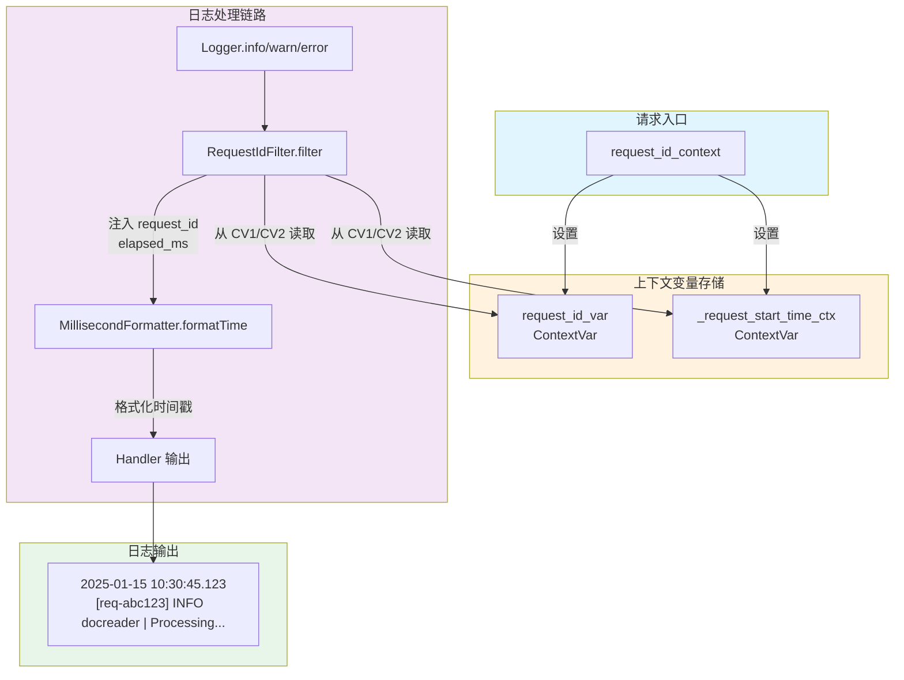

# request_time_formatting_utils 模块深度解析

## 概述：为什么需要这个模块

想象一下，你的系统正在处理成百上千个并发请求，日志像瀑布一样滚动。突然，用户报告了一个问题。你如何在海量日志中快速定位**这个特定请求**的所有相关日志？又如何知道这个请求在每个处理阶段花了多长时间？

`request_time_formatting_utils` 模块正是为了解决这个**分布式追踪的可观测性问题**而存在的。它不是一个复杂的 APM 系统，而是一个轻量级的日志增强层，通过两个核心能力让日志变得"可追踪"：

1. **请求级日志关联**：为每个请求分配唯一 ID，自动注入到该请求生命周期内的所有日志行中
2. **毫秒级时间精度**：将标准日志的微秒时间戳（6 位）截断为毫秒（3 位），既保留足够的调试精度，又让日志更整洁易读

这个模块的设计哲学是"**零侵入增强**"——业务代码不需要显式传递请求 ID 或计算耗时，只需在请求入口处包裹一个上下文管理器，后续所有日志自动携带追踪元数据。

---

## 架构与数据流



### 数据流 walkthrough

1. **请求开始**：调用 `request_id_context` 上下文管理器，它生成或接收一个请求 ID，记录当前时间戳，并将两者存入 `contextvars`
2. **日志记录**：业务代码调用 `logger.info()` 时，日志记录先经过 `RequestIdFilter.filter()`
3. **元数据注入**：Filter 从上下文变量中读取请求 ID 和起始时间，计算耗时，将这些值附加到 `LogRecord` 对象上
4. **时间格式化**：`MillisecondFormatter.formatTime()` 被调用，将时间戳格式化为 `YYYY-MM-DD HH:MM:SS.fff` 格式（毫秒精度）
5. **最终输出**：Handler 使用格式化后的模板输出完整日志行

### 模块在系统中的位置

这个模块位于 [`docreader_pipeline`](../docreader_pipeline.md) 模块的 `document_models_and_chunking_support` 子模块下。它被设计为一个**横切关注点（cross-cutting concern）**——不直接参与文档解析或分块逻辑，而是为整个 `docreader` 子系统提供可观测性基础设施。

**谁调用它**：
- 文档解析请求的入口处理函数（通常在 HTTP handler 或 gRPC servicer 层）
- 需要追踪执行时间的批处理任务

**它调用谁**：
- 标准库 `logging` 模块（扩展 `Formatter` 和 `Filter`）
- `contextvars` 模块（维护请求级状态）
- `time` 和 `uuid` 模块（时间戳和 ID 生成）

---

## 核心组件深度解析

### MillisecondFormatter

**设计意图**：Python 标准日志的 `%(asctime)s` 默认包含 6 位微秒（如 `10:30:45.123456`），但在大多数业务调试场景中，毫秒精度（`10:30:45.123`）已经足够，且更易于人眼阅读和对齐。

**内部机制**：
```python
def formatTime(self, record, datefmt=None):
    result = super().formatTime(record, datefmt)
    if datefmt and ".%f" in datefmt:
        parts = result.split(".")
        if len(parts) > 1 and len(parts[1]) >= 6:
            millis = parts[1][:3]  # 截断为 3 位
            result = f"{parts[0]}.{millis}"
    return result
```

这个实现采用了一种**保守的截断策略**：
- 只有当 `datefmt` 明确包含 `.%f` 时才进行处理（避免破坏其他格式）
- 先调用父类方法获取完整格式化结果，再后处理截断（而不是重新实现时间格式化逻辑）
- 检查微秒部分是否至少有 6 位，防止边界情况下的索引错误

**设计权衡**：
- **为什么不用 `%(msecs)03d`**：标准日志的 `%(msecs)` 只表示毫秒部分（0-999），不包含在 `asctime` 中。这个类的设计是为了在 `asctime` 内部直接截断，保持格式字符串的简洁性。
- **为什么不直接修改 datefmt**：因为 `datefmt` 是传递给 `strftime` 的，而 `strftime` 的 `%f` 是固定 6 位的，无法通过格式字符串控制精度。

**使用方式**：
```python
formatter = MillisecondFormatter(
    fmt="%(asctime)s [%(request_id)s] %(levelname)s %(message)s",
    datefmt="%Y-%m-%d %H:%M:%S.%f"  # 注意这里用 .%f，Formatter 会自动截断
)
```

---

### RequestIdFilter

**设计意图**：这是一个日志过滤器（`logging.Filter`），它的职责不是"过滤"日志，而是**增强**日志记录——为每个 `LogRecord` 注入请求 ID 和执行时间。

**核心逻辑**：
```python
def filter(self, record: LogRecord) -> bool:
    request_id = request_id_var.get()
    if request_id is not None:
        # 截断请求 ID 以提高可读性
        if len(request_id) > 8:
            short_id = request_id[:8]
            if "-" in request_id:
                parts = request_id.split("-")
                if len(parts) >= 3:
                    short_id = f"{parts[0]}-{parts[1]}-{parts[2]}"
            record.request_id = short_id
        else:
            record.request_id = request_id

        # 计算并注入执行时间
        start_time = _request_start_time_ctx.get()
        if start_time is not None:
            elapsed_ms = int((time.time() - start_time) * 1000)
            record.elapsed_ms = elapsed_ms
            record.msg = f"{record.msg} (elapsed: {elapsed_ms}ms)"
    else:
        record.request_id = "no-req-id"
    return True
```

**关键设计决策**：

1. **请求 ID 截断策略**：
   - 完整 UUID（如 `550e8400-e29b-41d4-a716-446655440000`）在日志中占用过多空间
   - 默认截取前 8 个字符（`550e8400`），在可读性和唯一性之间取得平衡
   - 对于结构化 ID（如 `test-req-1-abc123`），优先保留前 3 段（`test-req-1`），这样能保留更多语义信息

2. **执行时间注入方式**：
   - 直接修改 `record.msg`，在原始消息后追加 `(elapsed: XXXms)`
   - 使用 `message_with_elapsed` 标志防止重复追加（同一条日志记录可能被多个过滤器处理）
   - **副作用警告**：这种原地修改是一种侵入式做法，但在日志场景下是可接受的，因为 `LogRecord` 是临时对象

3. **无请求 ID 的降级处理**：
   - 当日志在请求上下文之外被记录时（如启动时的配置日志），使用 `no-req-id` 占位符
   - 这确保了日志格式的一致性，便于日志解析工具处理

**与 MillisecondFormatter 的协作**：
- `RequestIdFilter` 负责注入 `request_id` 和 `elapsed_ms` 属性
- `MillisecondFormatter` 负责格式化时间戳
- 两者通过日志模板组合：`"%(asctime)s.%(msecs)03d [%(request_id)s] %(levelname)-5s %(name)-20s | %(message)s"`

---

### request_id_context

**设计意图**：这是一个上下文管理器，用于**界定请求的生命周期**。它确保请求 ID 和时间戳在请求开始时设置，在请求结束时清理，避免上下文泄漏。

**实现细节**：
```python
@contextlib.contextmanager
def request_id_context(request_id: str = None):
    req_id = request_id or str(uuid.uuid4())
    start_time = time.time()
    req_token = request_id_var.set(req_id)
    time_token = _request_start_time_ctx.set(start_time)

    logger.info(f"Starting new request with ID: {req_id}")

    try:
        yield request_id_var.get()
    finally:
        elapsed_ms = int((time.time() - start_time) * 1000)
        logger.info(f"Request {req_id} completed in {elapsed_ms}ms")
        request_id_var.reset(req_token)
        _request_start_time_ctx.reset(time_token)
```

**为什么使用 contextvars 而不是 thread-local**：
- `contextvars` 是 Python 3.7+ 引入的，专为异步协程设计
- 在异步环境中，多个协程可能在同一个线程中交错执行，thread-local 会导致上下文污染
- `contextvars` 保证每个异步任务（asyncio.Task）有独立的上下文副本

**Token 机制**：
- `set()` 返回一个 token，用于后续 `reset()` 恢复之前的值
- 这支持上下文嵌套：如果外层已经设置了请求 ID，内层可以临时覆盖，退出内层后自动恢复外层值
- **注意**：在当前实现中，嵌套场景较少见，但这是一个良好的防御性设计

**使用模式**：
```python
# 同步代码
with request_id_context("req-123"):
    process_document()  # 这个函数内的所有日志都带有 req-123

# 异步代码
async def handle_request():
    with request_id_context():  # 自动生成 UUID
        await process_document()
```

---

### 辅助函数

| 函数 | 用途 | 使用场景 |
|------|------|----------|
| `set_request_id(request_id)` | 手动设置当前上下文的请求 ID | 当无法使用上下文管理器时（如某些框架的中间件） |
| `get_request_id()` | 获取当前上下文的请求 ID | 需要在业务逻辑中访问请求 ID（如返回给客户端） |
| `init_logging_request_id()` | 初始化日志系统，为所有 Handler 添加 RequestIdFilter 和自定义 Formatter | 应用启动时调用一次 |

---

## 依赖关系分析

### 上游依赖（被谁调用）

这个模块主要被 `docreader` 文档解析流水线的入口层调用：

1. **gRPC 服务层**：`docreader.proto.docreader_grpc.pb.DocReaderServicer` 的实现类在处理 `ReadFromFileRequest` 或 `ReadFromURLRequest` 时，会包裹 `request_id_context`
2. **HTTP 处理层**：如果 `docreader` 暴露 HTTP 接口，handler 会在请求处理前初始化上下文
3. **批处理任务**：批量处理文档时，每个批次或每个文档可能使用独立的请求 ID

### 下游依赖（调用谁）

这个模块的依赖非常轻量，全部来自标准库：

- `logging`：扩展 `Formatter` 和 `Filter`
- `contextvars`：维护请求级状态
- `time`：记录时间戳和计算耗时
- `uuid`：生成默认请求 ID
- `contextlib`：实现上下文管理器

### 数据契约

**输入**：
- 可选的请求 ID 字符串（如果为 `None` 则自动生成 UUID）

**输出**：
- 增强的日志记录，包含 `request_id` 和 `elapsed_ms` 属性
- 格式化的日志输出字符串

**隐式契约**：
- 调用者必须在请求入口处使用 `request_id_context`，否则日志中的 `request_id` 会显示为 `no-req-id`
- `init_logging_request_id()` 必须在任何日志记录之前调用，否则 Handler 不会包含 RequestIdFilter

---

## 设计决策与权衡

### 1. 为什么选择日志增强而不是独立追踪系统？

**选择**：在现有日志系统中注入追踪元数据，而不是引入 Jaeger、Zipkin 等独立 APM 系统。

**权衡**：
- **优点**：零额外基础设施依赖，部署简单，学习成本低
- **缺点**：功能有限（无分布式追踪图、无性能分析），日志量增加
- **适用场景**：单体或微服务数量较少的系统，调试需求大于性能分析需求

### 2. 为什么使用 contextvars 而不是显式参数传递？

**选择**：使用上下文变量隐式传递请求 ID，而不是在每个函数签名中添加 `request_id` 参数。

**权衡**：
- **优点**：业务代码零侵入，深层调用栈不需要逐层传递
- **缺点**：隐式依赖，阅读代码时不易发现上下文依赖；调试时需要理解 contextvars 机制
- **替代方案**：使用依赖注入容器或显式上下文对象（如 `RequestContext` 类）

### 3. 为什么直接修改 LogRecord.msg？

**选择**：在 `RequestIdFilter` 中直接修改 `record.msg` 追加执行时间。

**权衡**：
- **优点**：简单直接，执行时间直接显示在日志消息中
- **缺点**：副作用，如果多个过滤器按顺序处理同一条日志，可能重复追加
- **缓解措施**：使用 `message_with_elapsed` 标志防止重复

**更好的做法**（如果重构）：
- 使用自定义字段 `elapsed_ms`，在 Formatter 模板中引用：`"%(message)s (elapsed: %(elapsed_ms)ms)"`
- 但这需要自定义 Formatter 来格式化 `elapsed_ms`，增加复杂度

### 4. 为什么截断请求 ID 而不是完整显示？

**选择**：将长 UUID 截断为 8 字符或结构化前缀。

**权衡**：
- **优点**：日志更整洁，人眼更容易扫描；减少日志存储占用
- **缺点**：理论上可能冲突（但 8 字符的碰撞概率在实际场景中极低）
- **注意**：如果需要完整 ID 进行日志关联查询，需要在其他地方（如结构化日志字段）保留完整 ID

---

## 使用指南与示例

### 基本用法

```python
import logging
from docreader.utils.request import request_id_context, init_logging_request_id

# 应用启动时初始化
init_logging_request_id()

logger = logging.getLogger(__name__)

# 在请求入口处使用上下文管理器
def handle_document_request(request_id: str = None):
    with request_id_context(request_id):
        logger.info("开始处理文档")
        # ... 业务逻辑 ...
        logger.info("文档处理完成")
```

### 输出示例

```
2025-01-15 10:30:45.123 [req-abc123] INFO  docreader.parser | 开始解析 PDF (elapsed: 0ms)
2025-01-15 10:30:45.456 [req-abc123] INFO  docreader.splitter | 分块完成 (elapsed: 333ms)
2025-01-15 10:30:46.789 [req-abc123] INFO  docreader | 请求完成 (elapsed: 1666ms)
```

### 异步场景

```python
async def async_process_document():
    with request_id_context():  # 自动生成 UUID
        logger.info("异步处理开始")
        await some_async_operation()
        logger.info("异步处理完成")
```

### 手动设置请求 ID（中间件场景）

```python
def logging_middleware(request, call_next):
    request_id = request.headers.get("X-Request-ID")
    set_request_id(request_id)
    _request_start_time_ctx.set(time.time())
    
    response = call_next(request)
    
    # 清理（如果需要）
    request_id_var.set(None)
    return response
```

---

## 边界情况与注意事项

### 1. 上下文泄漏风险

**问题**：如果在异步代码中不正确使用 `request_id_context`，可能导致上下文泄漏到后续请求。

**示例**：
```python
# 错误用法
async def handler():
    request_id_var.set("req-123")  # 没有 reset
    await process()  # 如果 process 抛出异常，上下文永远不会清理

# 正确用法
async def handler():
    with request_id_context("req-123"):
        await process()  # 即使抛出异常，finally 块也会清理
```

### 2. 嵌套上下文的意外行为

**问题**：虽然 `contextvars` 支持嵌套，但当前实现中内层上下文会完全覆盖外层。

```python
with request_id_context("outer"):
    logger.info("外层")  # request_id = outer
    with request_id_context("inner"):
        logger.info("内层")  # request_id = inner
    logger.info("回到外层")  # request_id = outer（正确恢复）
```

如果业务逻辑依赖外层的请求 ID，嵌套可能导致混淆。

### 3. 执行时间的精度问题

**问题**：`elapsed_ms` 使用 `time.time()` 计算，精度受系统时钟影响，且是**累积时间**而非 CPU 时间。

- 如果请求中有 I/O 等待，`elapsed_ms` 会包含等待时间
- 对于高精度性能分析，应使用 `time.perf_counter()`

### 4. 日志格式的全局影响

**问题**：`init_logging_request_id()` 会修改**所有**根日志处理器的 Formatter。

- 如果系统中其他模块依赖特定的日志格式，可能被意外覆盖
- **建议**：在应用启动早期调用，或只针对特定 logger 配置

### 5. 无请求 ID 的日志

**问题**：在请求上下文之外的日志（如启动日志、定时任务）会显示 `no-req-id`。

- 这不是错误，是预期行为
- 如果需要区分，可以在调用 `init_logging_request_id()` 前配置单独的 Handler

---

## 相关模块参考

- [`docreader_pipeline`](../docreader_pipeline.md)：父模块，包含文档解析和分块的核心逻辑
- [`parser_framework_and_orchestration`](../parser_framework_and_orchestration.md)：解析器框架，`request_time_formatting_utils` 主要服务于该子系统的可观测性
- [`grpc_service_interfaces_and_clients`](../grpc_service_interfaces_and_clients.md)：gRPC 服务层，通常是 `request_id_context` 的调用位置

---

## 总结

`request_time_formatting_utils` 是一个典型的"**小模块解决大问题**"的设计。它通过不到 150 行代码，为整个文档解析流水线提供了请求级追踪能力。其核心设计思想是：

1. **隐式上下文传递**：使用 `contextvars` 避免参数污染
2. **日志增强而非替换**：扩展现有日志系统，降低采用门槛
3. **可读性优先**：截断时间戳和请求 ID，优化人眼阅读体验

对于新加入的开发者，理解这个模块的关键是掌握 `contextvars` 的工作机制和日志 Filter/Formatter 的生命周期。一旦理解这些，你就可以轻松扩展它（例如添加用户 ID 追踪、租户 ID 追踪等）。
