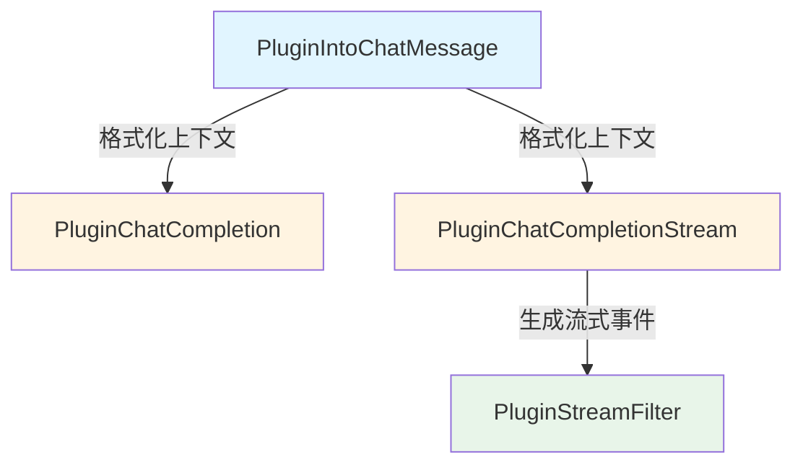
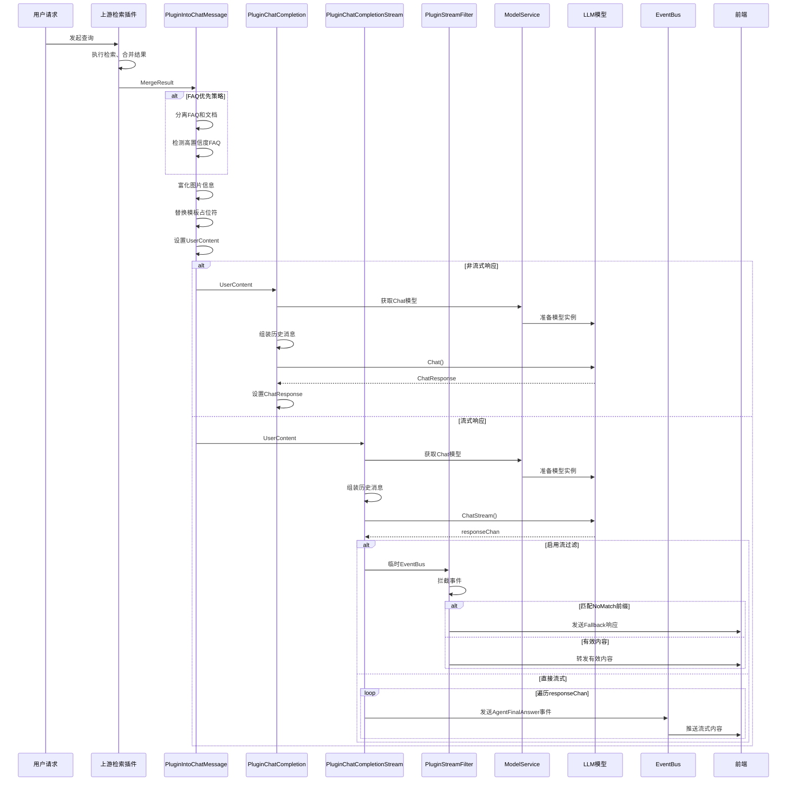

# response_assembly_and_generation 模块技术深度解析

## 模块概述

`response_assembly_and_generation` 模块是聊天流水线的最后一公里——它负责将检索到的知识转化为最终的 LLM 响应。如果把整个聊天系统比作一家餐厅，这个模块就是"后厨"：前面的流水线已经准备好食材（检索结果），现在需要由它将这些食材精心烹饪成美味佳肴（最终回答）。

这个模块解决的核心问题是：**如何将结构化的检索结果转换为自然、流畅、有上下文的人类可读回答**。它不仅仅是调用 LLM，还包括上下文格式化、流式处理、响应过滤等一系列复杂工作。

## 架构设计

### 核心组件图

### 完整数据流向图

### 数据流向详解

当用户发起查询后，数据在这个模块中的流动路径是：

1. **上下文准备阶段**：`PluginIntoChatMessage` 接收检索结果，将其格式化为 LLM 可理解的提示词
   - 分离 FAQ 和文档结果（如果启用 FAQ 优先）
   - 检测高置信度 FAQ 并标记
   - 富化图片信息（OCR 文本、描述）
   - 替换模板占位符

2. **响应生成阶段**：根据配置选择非流式或流式方式调用 LLM
   - **非流式**：`PluginChatCompletion` 一次性获取完整响应
   - **流式**：`PluginChatCompletionStream` 通过 goroutine 异步消费响应流

3. **流式过滤阶段**（可选）：如果启用了前缀过滤，`PluginStreamFilter` 会拦截并处理流式响应
   - 使用临时 EventBus 拦截事件
   - 检测是否匹配 "无匹配" 前缀
   - 根据情况发送有效内容或备用响应

## 核心组件详解

### PluginIntoChatMessage：上下文装配工程师

这个组件的职责是将原始检索结果"烹饪"成 LLM 喜欢的"食材"。

**核心功能**：
- 将检索结果格式化为结构化的上下文
- 支持 FAQ 优先策略，高置信度 FAQ 会被特别标记
- 处理图片信息的 OCR 文本和描述
- 替换模板中的占位符（查询、上下文、时间等）

**设计亮点**：
- FAQ 与文档分离展示，FAQ 优先时会有明确的视觉区分
- 图片信息智能合并，既支持 Markdown 链接中的图片，也处理额外的图片信息
- 输入安全性验证，防止潜在的注入攻击

### PluginChatCompletion：非流式响应生成器

这个组件负责一次性生成完整的 LLM 响应。

**核心功能**：
- 准备聊天模型和参数
- 组装包含历史记录的消息列表
- 调用模型服务生成响应
- 将响应保存到 `ChatManage` 中

**设计特点**：
- 清晰的职责分离：只负责调用 LLM，不处理业务逻辑
- 完整的可观测性：记录输入、模型调用、输出等各个环节

### PluginChatCompletionStream：流式响应生成器

这个组件实现了实时的流式响应生成，让用户能够"看着"回答逐字出现。

**核心功能**：
- 初始化流式模型调用
- 通过 goroutine 异步消费响应流
- 将思考内容用 `<think>` 标签包装，确保前端一致性展示
- 通过 EventBus 实时发送响应事件

**设计亮点**：
- 独立的 goroutine 处理流，不阻塞主流水线
- 思考内容与回答内容的统一处理，确保历史记录和实时展示的一致性
- 完善的错误处理，流中的错误也会通过事件系统传递

### PluginStreamFilter：流式响应过滤器

这个组件是一个智能"阀门"，可以过滤掉不想要的响应前缀。

**核心功能**：
- 拦截流式事件
- 检测响应是否以指定的"无匹配"前缀开头
- 如果检测到前缀，使用备用响应；否则正常转发

**设计巧妙之处**：
- 使用临时 EventBus 拦截事件，实现透明的过滤
- 累积式检测：只有在确定不是前缀时才开始发送内容
- 优雅的降级策略：如果整个响应都是前缀，使用备用响应

## 设计决策与权衡

### 1. 插件架构 vs 单体架构

**选择**：插件架构，每个功能作为独立插件

**原因**：
- 灵活性：可以根据需要选择不同的插件组合（流式/非流式）
- 可测试性：每个插件可以独立测试
- 可扩展性：添加新的处理步骤只需要新增插件

**权衡**：
- 增加了一定的间接层和复杂度
- 需要维护插件注册和事件系统

### 2. FAQ 优先策略的实现

**选择**：在上下文中明确区分 FAQ 和文档，高置信度 FAQ 特别标记

**替代方案**：
- 简单地按分数排序混合展示
- 完全分离 FAQ 和文档的处理流程

**原因**：
- FAQ 通常具有更高的准确性，应该优先展示
- 保持单一流程，减少维护成本
- 通过视觉标记让 LLM 也能理解优先级

### 3. 流式响应中思考内容的处理

**选择**：将思考内容用 `<think>` 标签包装在回答流中

**替代方案**：
- 完全分离思考和回答事件
- 不展示思考内容

**原因**：
- 确保前端展示的一致性：历史记录和实时流使用相同的格式
- 简化前端逻辑：只需要处理一种类型的事件
- 保持思考内容的可追溯性

### 4. 流式过滤的实现方式

**选择**：使用临时 EventBus 拦截事件

**替代方案**：
- 修改流式生成器直接支持过滤
- 在前端进行过滤

**原因**：
- 透明性：对上游生成器无侵入
- 集中控制：过滤逻辑在一个地方
- 灵活性：可以独立启用/禁用过滤

## 子模块概览

### chat_message_assembly
负责将检索结果转换为格式化的聊天消息。这是整个模块的入口点，处理 FAQ 优先级、图片信息合并等工作。

详细文档请参考：[chat_message_assembly](chat_message_assembly.md)

### llm_response_generation
负责调用 LLM 生成响应，包括非流式和流式两种方式。这是模块的核心，封装了与模型服务的交互。

详细文档请参考：
- [llm_non_streaming_response_generation](llm_non_streaming_response_generation.md)
- [llm_streaming_response_generation](llm_streaming_response_generation.md)

### stream_output_filtering
负责过滤流式输出，特别是处理"无匹配"前缀的情况。这是一个可选的增强组件，提供了优雅的降级策略。

详细文档请参考：[stream_output_filtering](stream_output_filtering.md)

## 与其他模块的交互

### 依赖关系

- **上游**：[query_understanding_and_retrieval_flow](application_services_and_orchestration-chat_pipeline_plugins_and_flow-query_understanding_and_retrieval_flow.md) 提供检索结果
- **模型服务**：依赖 [model_providers_and_ai_backends](model_providers_and_ai_backends.md) 提供的模型接口
- **事件系统**：使用 [platform_infrastructure_and_runtime-event_bus_and_agent_runtime_event_contracts](platform_infrastructure_and_runtime-event_bus_and_agent_runtime_event_contracts.md) 进行流式事件传递

### 数据契约

- **输入**：`types.ChatManage` 对象，包含：
  - `MergeResult`：检索结果列表
  - `SummaryConfig`：摘要配置（模板、前缀等）
  - `History`：对话历史
  - `ChatModelID`：使用的模型 ID
  
- **输出**：
  - 非流式：`ChatManage.ChatResponse` 包含完整响应
  - 流式：通过 EventBus 发送 `EventAgentFinalAnswer` 事件

## 新贡献者指南

### 常见陷阱

1. **FAQ 优先级逻辑**：注意 `FAQPriorityEnabled` 和 `FAQDirectAnswerThreshold` 的交互，高置信度 FAQ 只会标记第一个
2. **图片信息处理**：`enrichContentWithImageInfo` 同时处理 URL 和 OriginalURL，确保图片信息不会丢失
3. **流式思考标签**：思考内容的 `<think>` 标签是手动添加的，确保开始和结束标签成对出现
4. **EventBus 恢复**：`PluginStreamFilter` 会替换 EventBus，务必确保在函数结束时恢复原始的

### 扩展点

1. **自定义上下文格式**：修改 `PluginIntoChatMessage` 中的上下文构建逻辑
2. **新的过滤策略**：在 `PluginStreamFilter` 中添加新的过滤条件
3. **流式响应后处理**：在 `PluginChatCompletionStream` 的 goroutine 中添加自定义处理逻辑

### 调试技巧

- 查看 pipeline 日志：所有插件都使用 `pipelineInfo` 和 `pipelineError` 记录关键信息
- 检查 EventBus 事件：可以订阅相关事件来追踪流式响应的完整流程
- 验证模板替换：在 `PluginIntoChatMessage` 结束后检查 `chatManage.UserContent` 的值
