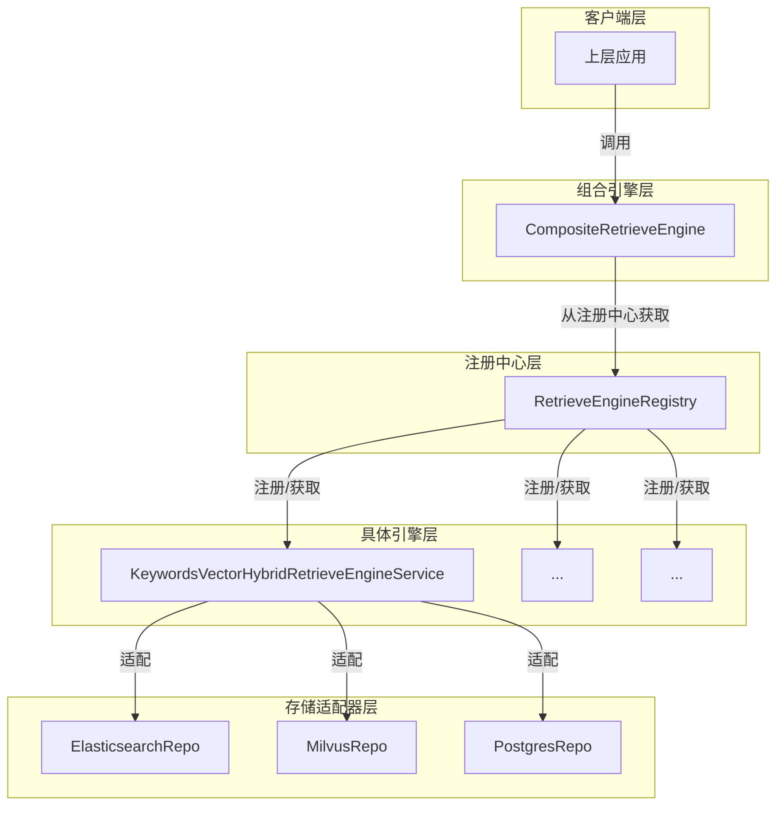

# 检索引擎组合与注册中心

## 概述

想象一下，你需要为一个大型搜索引擎系统构建检索能力：不同的场景需要不同的检索技术——有时需要精确的关键词匹配，有时需要语义理解的向量检索，有时需要两者的结合。更复杂的是，底层的存储引擎可能从Elasticsearch切换到Milvus，再到PostgreSQL。如果每次变更都需要修改上层业务逻辑，那将是一场维护噩梦。

`retriever_engine_composition_and_registry` 模块正是为了解决这个问题而设计的。它通过**组合模式**和**服务注册发现机制**，将多种检索引擎（如关键词检索、向量检索、混合检索）统一管理，同时支持灵活配置和动态扩展。上层应用只需面对一个统一的检索接口，而无需关心底层具体使用了哪种检索技术或存储引擎。

## 架构概览



### 核心组件职责

1. **CompositeRetrieveEngine**：组合模式的核心，对外提供统一的检索接口，内部将请求路由到合适的具体引擎。它就像一个"智能路由器"，根据检索类型将请求分发到对应的引擎实例。

2. **RetrieveEngineRegistry**：服务注册中心，负责管理所有可用的检索引擎实例。它类似于"服务目录"，存储了所有可用引擎的类型信息和实例引用。

3. **KeywordsVectorHybridRetrieveEngineService**：一个具体的混合检索引擎实现，同时支持关键词检索和向量检索。它封装了向量嵌入生成、批量索引优化等复杂逻辑。

4. **engineInfo**：辅助结构，用于关联具体的检索引擎实例与它支持的检索类型。

### 数据流向

以一次典型的检索请求为例：

1. 上层应用构建多个 `RetrieveParams`，每个参数指定了检索类型（如关键词、向量或混合）
2. 应用调用 `CompositeRetrieveEngine.Retrieve()` 方法
3. `CompositeRetrieveEngine` 并发处理每个检索参数
4. 对于每个参数，它遍历已注册的引擎，找到支持该检索类型的引擎
5. 将请求委托给找到的具体引擎执行
6. 收集所有引擎的结果并合并返回

对于索引操作（如保存向量嵌入），流程类似，但请求会被广播到**所有**已注册的引擎，确保数据在多个存储后端保持一致。

## 核心设计模式与决策

### 1. 组合模式 (Composite Pattern)

**选择原因**：
- 客户端需要透明地对待单个引擎和多个引擎的组合
- 需要支持动态添加/移除检索引擎而不影响客户端代码
- 检索操作具有相似的接口语义（Retrieve, Index, Delete等）

**设计细节**：
`CompositeRetrieveEngine` 实现了与具体引擎相同的接口，但内部持有多个引擎实例。对于检索类操作（Retrieve），它选择合适的引擎委托；对于管理类操作（Index, Delete），它广播到所有引擎。

**权衡**：
✅ 优点：客户端代码无需关心底层有多少引擎，简化了调用逻辑  
❌ 缺点：组合引擎本身不实现具体的检索逻辑，增加了一层间接调用的开销

### 2. 注册发现模式 (Registry Pattern)

**选择原因**：
- 系统需要支持多种检索引擎，且引擎类型可能在运行时扩展
- 不同的租户可能配置不同的检索引擎组合
- 需要避免在代码中硬编码引擎实例的创建逻辑

**设计细节**：
`RetrieveEngineRegistry` 使用线程安全的 map 存储引擎实例，提供注册、查询和枚举功能。引擎在初始化时将自己注册到注册表中，组合引擎通过注册表获取所需的引擎实例。

**权衡**：
✅ 优点：支持动态注册和扩展，实现了引擎的解耦  
❌ 缺点：增加了组件间的依赖，需要确保注册顺序的正确性

### 3. 并发处理策略

**选择原因**：
- 检索操作通常是IO密集型的，并发处理可以显著提高吞吐量
- 批量索引操作需要处理大量数据，需要并行化以提高效率
- 多个检索引擎之间的操作是独立的，天然适合并发执行

**设计细节**：
- 检索参数处理使用无界并发（因为参数数量通常可控）
- 批量索引使用有界并发（通过信号量限制并发数，避免压垮后端存储）
- 所有共享状态访问都使用互斥锁保护

**权衡**：
✅ 优点：充分利用多核资源，显著提高了批量操作的性能  
❌ 缺点：增加了代码复杂度，需要小心处理并发安全问题

### 4. 混合检索引擎的重试与批处理策略

**选择原因**：
- 向量嵌入生成可能因网络波动或服务限流而失败
- 批量操作可以减少网络往返次数，提高效率
- 不同规模的批次需要不同的并发策略

**设计细节**：
- 批量嵌入生成有5次重试机会，每次失败后等待100ms
- 批次大小固定为40，平衡了内存使用和网络效率
- 对于小批量（≤5个批次）使用无界并发，大批量使用有界并发（最大5个并发）

**权衡**：
✅ 优点：提高了系统的鲁棒性和吞吐量  
❌ 缺点：硬编码的批次大小和并发数可能不适合所有场景

## 关键组件详解

### CompositeRetrieveEngine

`CompositeRetrieveEngine` 是整个模块的门面，它封装了多引擎协作的复杂性。

**核心机制**：
- 它通过 `NewCompositeRetrieveEngine` 从注册表和配置参数构建引擎组合
- 每个 `engineInfo` 条目关联一个引擎实例和它支持的检索类型列表
- `Retrieve` 方法使用并发处理多个检索参数，每个参数找到对应引擎后委托执行
- 管理类方法（如 `Index`、`Delete`）使用 `concurrentExecWithError` 广播到所有引擎

**使用示例**：
```go
// 从注册表创建组合引擎
composite, err := NewCompositeRetrieveEngine(registry, engineParams)
if err != nil {
    // 处理错误
}

// 执行检索
results, err := composite.Retrieve(ctx, retrieveParams)
if err != nil {
    // 处理错误
}

// 索引数据
err = composite.Index(ctx, embedder, indexInfo)
```

**注意事项**：
- 如果某个检索类型没有对应的引擎，`Retrieve` 方法会返回错误
- 对于管理类操作，任何一个引擎失败都会导致整个操作失败
- 组合引擎不保存状态，所有状态都在具体的引擎实例中

### KeywordsVectorHybridRetrieveEngineService

这是一个具体的混合检索引擎实现，它同时支持关键词和向量检索。

**核心职责**：
- 根据配置的检索类型决定是否生成向量嵌入
- 优化批量索引操作，包括并发控制和错误重试
- 将实际的存储操作委托给底层的 `RetrieveEngineRepository`

**关键实现细节**：
- `Index` 方法：单条索引，仅在需要向量检索时生成嵌入
- `BatchIndex` 方法：批量索引，实现了复杂的并发和重试逻辑
- 对于向量检索，它会先生成所有嵌入，然后分批并发保存
- 对于非向量检索，它直接并发批量保存

**性能优化**：
- 批量大小固定为40，平衡内存和网络
- 最大并发数限制为5，避免压垮后端
- 嵌入生成失败有5次重试机会

### RetrieveEngineRegistry

注册表是整个模块的服务发现中心，它管理所有可用的检索引擎。

**核心机制**：
- 使用线程安全的 map 存储引擎实例
- 注册时检查重复，避免同一类型的引擎被多次注册
- 获取引擎时使用读锁，注册时使用写锁，平衡并发性能和安全性

**使用示例**：
```go
// 创建注册表
registry := NewRetrieveEngineRegistry()

// 注册引擎
err := registry.Register(kvHybridEngine)
if err != nil {
    // 处理重复注册错误
}

// 获取引擎
engine, err := registry.GetRetrieveEngineService(engineType)
if err != nil {
    // 处理引擎不存在错误
}
```

## 与其他模块的关系

### 依赖关系

**依赖的模块**：
- [core_domain_types_and_interfaces](core_domain_types_and_interfaces.md)：提供了 `RetrieveEngineService`、`RetrieveEngineRegistry` 等核心接口定义
- [model_providers_and_ai_backends](model_providers_and_ai_backends.md)：提供了 `Embedder` 接口，用于生成向量嵌入
- [data_access_repositories](data_access_repositories.md)：提供了具体的存储实现，如 Elasticsearch、Milvus、PostgreSQL 的检索仓库

**被依赖的模块**：
- [application_services_and_orchestration](application_services_and_orchestration.md)：特别是检索执行插件，会使用组合引擎进行实际的检索操作
- [chat_pipeline_plugins_and_flow](application_services_and_orchestration-chat_pipeline_plugins_and_flow.md)：在查询理解和检索流程中使用

### 交互模式

上层应用通常通过以下方式与本模块交互：
1. 初始化阶段：创建注册表，注册所有可用的检索引擎
2. 配置阶段：根据租户配置或系统配置，创建 `CompositeRetrieveEngine` 实例
3. 运行阶段：使用组合引擎执行检索、索引、删除等操作

## 子模块概览

本模块包含以下子模块，每个子模块都有详细的文档：

- [composite_retriever_engine_orchestration](application_services_and_orchestration-retrieval_and_web_search_services-retriever_engine_composition_and_registry-composite_retriever_engine_orchestration.md)：组合检索引擎的编排逻辑
- [keywords_vector_hybrid_retrieve_engine_service](application_services_and_orchestration-retrieval_and_web_search_services-retriever_engine_composition_and_registry-keywords_vector_hybrid_retrieve_engine_service.md)：关键词向量混合检索引擎的详细实现
- [retrieve_engine_registry_management](application_services_and_orchestration-retrieval_and_web_search_services-retriever_engine_composition_and_registry-retrieve_engine_registry_management.md)：检索引擎注册中心的管理机制

## 常见陷阱与注意事项

1. **引擎注册顺序**：确保在创建 `CompositeRetrieveEngine` 之前，所有需要的引擎都已经注册到注册表中。否则会导致引擎找不到的错误。

2. **检索类型与引擎支持**：配置 `RetrieverEngineParams` 时，确保指定的检索类型确实被对应的引擎支持。否则 `NewCompositeRetrieveEngine` 会返回错误。

3. **并发安全**：`CompositeRetrieveEngine` 的所有方法都是并发安全的，但底层的 `RetrieveEngineRepository` 实现需要自己保证并发安全。

4. **错误处理**：对于管理类操作（如 `Index`、`Delete`），任何一个引擎失败都会导致整个操作失败。设计时需要考虑是否需要部分失败的处理策略。

5. **批量大小配置**：`KeywordsVectorHybridRetrieveEngineService` 中的批量大小（40）和最大并发数（5）是硬编码的。对于不同的部署环境，可能需要调整这些参数。

6. **重试逻辑**：批量嵌入生成有5次重试机会，但重试之间的等待时间是固定的（100ms）。对于某些场景，可能需要实现指数退避策略。

## 扩展点

1. **自定义检索引擎**：实现 `RetrieveEngineService` 接口，并将其注册到 `RetrieveEngineRegistry` 中，即可添加新的检索引擎。

2. **自定义组合策略**：继承或修改 `CompositeRetrieveEngine`，可以实现不同的引擎选择和组合策略。

3. **批量参数配置**：可以修改 `KeywordsVectorHybridRetrieveEngineService`，使其批量大小和并发数可配置，而不是硬编码。

4. **错误处理策略**：可以扩展 `CompositeRetrieveEngine`，实现更灵活的错误处理策略，如部分失败时的回退或降级。
