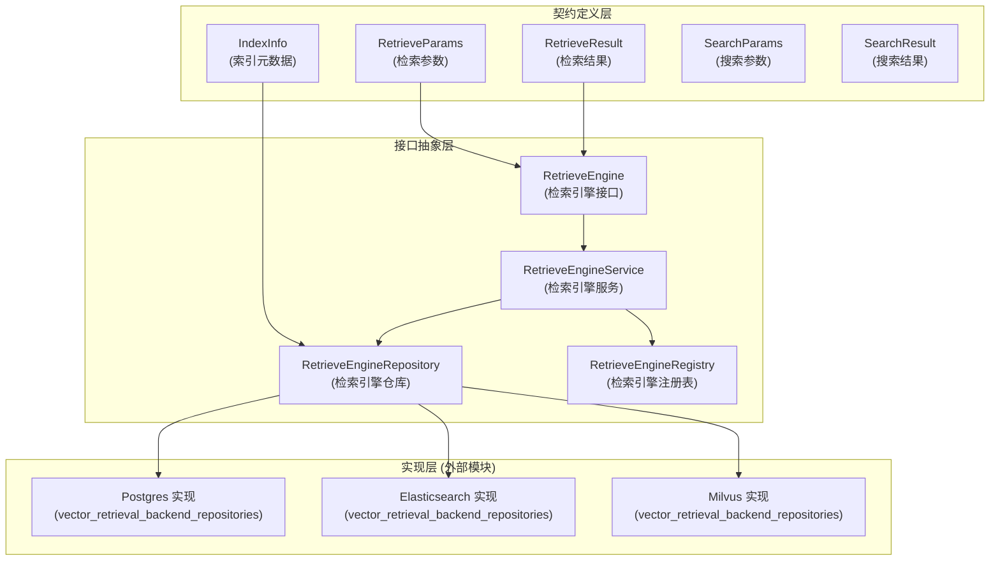

# 检索引擎与搜索契约 (retrieval_engine_and_search_contracts)

## 模块概览

这个模块是整个系统检索能力的"骨架"和"通用语言"。它不直接执行检索，而是定义了**检索是什么、如何进行检索、以及检索结果长什么样**的统一契约。想象一下，如果你要打造一个支持多种搜索引擎（Elasticsearch、Milvus、Postgres等）和多种检索方式（向量、关键词、网络搜索）的系统，你需要一个中间层来隔离这些差异——这就是本模块的作用。

## 架构概览



**架构说明**：
1. **契约定义层**：定义了数据结构和类型，是整个检索系统的"通用词汇表"
2. **接口抽象层**：定义了核心行为接口，隔离了具体实现
3. **实现层**：由其他模块提供具体的检索引擎实现

## 核心设计理念

### 1. 多引擎支持的抽象

系统设计之初就面临一个选择：是深度绑定某一个检索引擎，还是提供抽象层支持多种引擎？这个模块选择了后者。

**设计决策**：通过 `RetrieveEngine` 接口抽象检索行为，通过 `RetrieverEngineType` 枚举支持多种引擎类型。

**权衡分析**：
- ✅ **优点**：灵活性高，可以根据场景选择不同引擎（如Postgres适合小规模，Elasticsearch适合大规模）
- ⚠️ **缺点**：增加了抽象层的复杂度，无法充分利用特定引擎的高级特性

### 2. 混合检索的统一表示

现代检索系统通常不是单一检索方式，而是向量检索、关键词检索、网络搜索等多种方式的组合。

**设计决策**：
- 通过 `RetrieverType` 区分不同检索方式
- 通过 `MatchType` 记录结果的匹配来源
- 通过 `IndexWithScore` 统一带评分的检索结果

**为什么这样设计**：混合检索是常态，统一的结果表示让上层应用不需要关心结果来自哪个检索器。

### 3. 索引与检索的分离

这个模块清晰地分离了"索引写入"和"检索查询"两个关注点。

**设计决策**：
- `RetrieveEngine` 专注于查询
- `RetrieveEngineRepository` 专注于索引管理
- `RetrieveEngineService` 协调两者

**类比**：就像图书馆，`Repository` 负责把书放到书架上（索引），`Engine` 负责帮你找到书（检索），`Service` 是图书管理员，协调两者工作。

## 核心组件详解

### 索引元数据模型

#### [IndexInfo](index_metadata_and_scored_reference_models.md#indexinfo)
这是索引数据的"身份证"。它不包含向量本身（向量存储在具体引擎中），但包含了所有用于检索过滤和结果呈现的元数据。

**关键字段**：
- `ID`：索引的唯一标识
- `Content`：实际内容文本
- `SourceID`/`SourceType`：内容来源信息
- `KnowledgeID`/`KnowledgeBaseID`：知识库层级标识
- `TagID`：用于FAQ优先级过滤
- `IsEnabled`：是否启用检索

**设计洞察**：注意 `KnowledgeType` 字段——它决定了使用哪个索引。这意味着FAQ和手册内容可能存储在不同的索引中，这是性能优化的关键点。

### 检索参数与结果

#### [RetrieveParams](retrieval_execution_parameters_and_result_contracts.md#retrieveparams)
这是检索请求的"任务清单"。它包含了执行一次检索所需的所有信息。

**关键设计点**：
- 同时支持 `Query`（文本）和 `Embedding`（向量）——这是混合检索的基础
- `KnowledgeBaseIDs`/`KnowledgeIDs`/`TagIDs`：多层级过滤
- `AdditionalParams`：扩展性设计，不同检索器可以有不同参数
- `TopK`/`Threshold`：结果质量控制

#### [RetrieveResult](retrieval_execution_parameters_and_result_contracts.md#retrieveresult)
这是检索结果的"包裹"。它不仅包含结果列表，还记录了结果来自哪个引擎和哪种检索方式。

**设计洞察**：注意 `Error` 字段是结果的一部分——这允许部分失败的场景（比如一个检索器失败了，其他检索器的结果仍然可用）。

### 搜索契约

#### [SearchParams](search_query_filtering_and_paginated_result_contracts.md#searchparams)
与 `RetrieveParams` 不同，这是面向**最终用户搜索**的参数。

**关键区别**：
- `RetrieveParams` 是给检索引擎用的，更底层
- `SearchParams` 是给用户搜索用的，更高层
- `SearchParams` 有 `DisableKeywordsMatch`/`DisableVectorMatch` 这样的控制开关

#### [SearchResult](search_query_filtering_and_paginated_result_contracts.md#searchresult)
这是面向用户的搜索结果。注意它包含了 `MatchedContent` 字段——这在FAQ场景中特别有用，可以显示"你匹配到了这个问题"。

**设计洞察**：`SearchResult` 实现了 `driver.Valuer` 和 `sql.Scanner` 接口——这意味着它可以直接存储到数据库中，这是为了支持搜索结果缓存和历史记录。

### 检索引擎接口

#### [RetrieveEngine](retrieval_engine_service_registry_and_repository_interfaces.md#retrieveengine)
这是检索引擎的"最小接口"。任何实现了这个接口的类型都可以作为检索引擎使用。

**核心方法**：
- `EngineType()`：标识自己是什么类型的引擎
- `Retrieve()`：执行检索
- `Support()`：声明支持哪些检索类型

**设计原则**：接口最小化——只做检索，不做索引管理。

#### [RetrieveEngineRepository](retrieval_engine_service_registry_and_repository_interfaces.md#retrieveenginerepository)
这是索引管理的接口。它继承了 `RetrieveEngine`，同时增加了索引写入、更新、删除的能力。

**关键能力**：
- `Save`/`BatchSave`：索引写入
- `DeleteBy*`：各种维度的索引删除
- `CopyIndices`：索引复制（性能优化亮点）
- `BatchUpdateChunkEnabledStatus`/`BatchUpdateChunkTagID`：批量元数据更新

**设计洞察**：注意 `CopyIndices` 方法——这是为了避免重新计算嵌入向量，当复制知识库时可以直接复制索引，这是一个重要的性能优化。

#### [RetrieveEngineService](retrieval_engine_service_registry_and_repository_interfaces.md#retrieveengineservice)
这是检索引擎的"服务层"接口。它协调嵌入生成和索引存储。

**与 Repository 的区别**：
- `Repository` 只处理索引存储
- `Service` 额外处理嵌入生成（通过 `embedder` 参数）

**设计洞察**：注意 `Index` 和 `BatchIndex` 方法都接受 `retrieverTypes` 参数——这意味着同一份内容可以用多种方式索引（同时做向量索引和关键词索引）。

#### [RetrieveEngineRegistry](retrieval_engine_service_registry_and_repository_interfaces.md#retrieveengineregistry)
这是检索引擎的"注册中心"。它使用了注册模式，让系统可以动态发现和使用不同的检索引擎。

**设计模式**：这是经典的**注册表模式**，配合接口使用，实现了良好的扩展性。

## 数据流向分析

### 索引写入流程

```
知识摄入 → IndexInfo 创建 → RetrieveEngineService.Index() 
→ embedder 生成向量 → RetrieveEngineRepository.Save() 
→ 具体引擎存储
```

**关键点**：
1. `IndexInfo` 在知识摄入时创建，包含所有元数据
2. `Service` 层负责协调嵌入生成
3. `Repository` 层负责实际存储

### 检索查询流程

```
用户搜索 → SearchParams → RetrieveParams 
→ RetrieveEngine.Retrieve() → 具体引擎查询 
→ RetrieveResult → SearchResult → 用户
```

**关键点**：
1. 从用户友好的 `SearchParams` 转换为引擎友好的 `RetrieveParams`
2. 具体引擎返回 `RetrieveResult`，再转换为用户友好的 `SearchResult`
3. 中间可能经过混合检索、重排序等处理

### 知识库复制流程（性能优化场景）

```
复制知识库 → CopyIndices 调用 
→ 直接复制索引（不重新计算嵌入）→ 完成
```

**设计洞察**：这是一个典型的性能优化场景。嵌入计算通常是昂贵的（需要调用AI模型），直接复制索引可以节省大量时间和成本。

## 子模块说明

### [索引元数据与评分引用模型](retrieval_engine_and_search_contracts-index_metadata_and_scored_reference_models.md)
定义了索引元数据结构和带评分的索引引用模型，是整个检索系统的数据基础。

### [检索执行参数与结果契约](retrieval_engine_and_search_contracts-retrieval_execution_parameters_and_result_contracts.md)
定义了检索请求参数和响应结果的数据结构，以及检索引擎的核心接口。

### [检索引擎服务、注册表与仓库接口](retrieval_engine_and_search_contracts-retrieval_engine_service_registry_and_repository_interfaces.md)
定义了检索引擎的服务层、仓库层和注册表接口，是索引管理和引擎协调的核心。

### [搜索查询过滤与分页结果契约](retrieval_engine_and_search_contracts-search_query_filtering_and_paginated_result_contracts.md)
定义了面向用户的搜索参数和结果结构，以及分页支持，是连接用户和底层检索的桥梁。

## 跨模块依赖关系

### 依赖此模块的模块
- [vector_retrieval_backend_repositories](../data_access_repositories-vector_retrieval_backend_repositories.md)：具体的检索引擎实现
- [retrieval_and_web_search_services](../application_services_and_orchestration-retrieval_and_web_search_services.md)：检索服务编排
- [query_understanding_and_retrieval_flow](../application_services_and_orchestration-chat_pipeline_plugins_and_flow-query_understanding_and_retrieval_flow.md)：检索流程插件

### 此模块依赖的模块
- [embedding_core_contracts_and_batch_orchestration](../model_providers_and_ai_backends-embedding_interfaces_batching_and_backends-embedding_core_contracts_and_batch_orchestration.md)：嵌入生成接口

## 新贡献者注意事项

### 1. 不要混淆 SearchParams 和 RetrieveParams
- `SearchParams` 是给用户用的，高层
- `RetrieveParams` 是给引擎用的，底层
- 两者之间需要转换，不要直接传递

### 2. IndexInfo 不包含向量
- 向量存储在具体引擎中
- IndexInfo 只包含元数据
- 不要试图在 IndexInfo 中添加向量字段

### 3. CopyIndices 是性能关键点
- 实现新引擎时，不要忘记实现 CopyIndices
- 它可以避免重新计算嵌入，这是很大的性能优化

### 4. MatchType 的设计意图
- MatchType 不仅记录匹配方式，还用于结果融合
- 不同的 MatchType 可能有不同的评分权重
- 添加新的 MatchType 时要考虑结果融合策略

### 5. 错误处理策略
- RetrieveResult 包含 Error 字段
- 这是为了支持部分失败场景
- 不要因为一个检索器失败就放弃所有结果

## 总结

这个模块是整个检索系统的"脊梁"。它通过精心设计的接口和数据结构，实现了：

1. **多引擎支持**：不绑定特定检索引擎
2. **混合检索**：统一多种检索方式的结果
3. **性能优化**：通过 CopyIndices 等设计避免重复计算
4. **扩展性**：通过接口和注册表模式支持未来扩展

理解这个模块的关键是理解它的**抽象意图**——它不是要自己做检索，而是要定义"检索应该是什么样子"，让具体的实现可以插拔。
