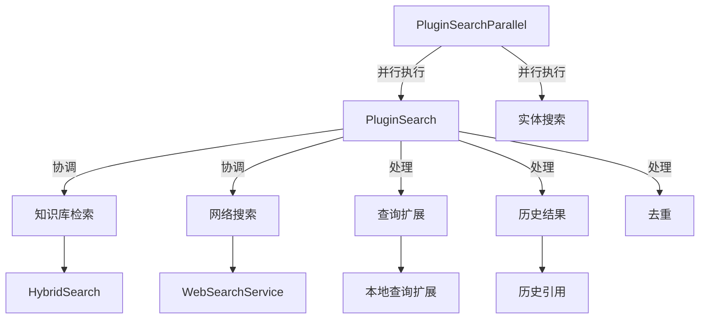

# retrieval_execution 模块技术文档

## 1. 模块概述

### 什么是 retrieval_execution？

retrieval_execution 模块是系统中负责协调和执行检索任务的核心组件。它的作用是将用户的查询转换为具体的检索操作，协调知识库检索和网络搜索，并将结果整合成一个统一的集合供后续处理使用。

**为什么这个模块很重要？**

想象一下，当你问一个问题时，你不仅想从内部文档中找到答案，还想了解网络上的最新信息。这个模块就像一个智能搜索协调者：它同时进行知识库检索和网络搜索，然后将结果合并，确保你得到最全面的信息。

### 解决的核心问题

- **检索协调问题**：如何同时从多个数据源（知识库、网络）获取信息而不增加用户等待时间
- **结果合并问题**：如何将来自不同来源、不同格式的结果整合成一个统一的集合
- **低召回率处理**：当初步检索结果不足时，如何扩展查询以获取更多相关结果
- **去重处理**：如何避免重复的检索结果

## 2. 架构设计

### 核心架构概览



### 主要组件说明

#### PluginSearch（单查询检索执行插件）

这是模块的核心组件，负责协调整个检索过程。它的主要职责包括：

1. 同时启动知识库检索和网络搜索（并发执行）
2. 当检索结果不足时，执行查询扩展
3. 从聊天历史中提取相关引用
4. 对所有结果进行去重处理

详细信息请参考 [单查询检索执行插件文档](application_services_and_orchestration-chat_pipeline_plugins_and_flow-query_understanding_and_retrieval_flow-retrieval_execution-single_query_retrieval_execution_plugin.md)。

#### PluginSearchParallel（并行检索执行插件）

这是一个增强版的检索协调器，它在 PluginSearch 的基础上增加了实体搜索功能，并将块检索和实体搜索并行执行，以提高整体检索效率。

详细信息请参考 [并行检索执行插件文档](application_services_and_orchestration-chat_pipeline_plugins_and_flow-query_understanding_and_retrieval_flow-retrieval_execution-parallel_retrieval_execution_plugin.md)。

## 3. 核心设计理念

### 并发优先的设计

**设计决策**：模块采用并发执行多个检索任务的方式，而不是顺序执行。

**为什么这样设计？**

- **性能优化**：知识库检索和网络搜索都是 I/O 密集型操作，并发执行可以显著减少总体等待时间
- **用户体验**：用户不需要等待一个检索完成后再开始另一个，而是几乎同时看到所有结果

**权衡分析**：
- ✅ **优点**：显著提高检索速度，改善用户体验
- ⚠️ **缺点**：增加了系统资源消耗，需要更复杂的错误处理

### 容错设计

**设计决策**：即使某个检索任务失败，只要还有其他成功的结果，整个流程就会继续进行。

**为什么这样设计？**

- **可靠性**：确保即使某个数据源暂时不可用，用户仍然能获得其他来源的结果
- **渐进式降级**：系统可以在部分功能失效的情况下继续提供服务

## 4. 数据流程

### 完整检索流程

让我们详细追踪一次典型的检索请求是如何在系统中流动的：

1. **事件触发**：当聊天管道到达 `CHUNK_SEARCH` 或 `CHUNK_SEARCH_PARALLEL` 事件时，相应的插件被激活

2. **并行检索启动**：
   - 知识库检索开始执行
   - 网络搜索（如果启用）同时开始执行

3. **结果收集**：
   - 两个检索任务的结果被收集到一个统一的结果集中
   - 如果启用了查询扩展且初始结果不足，会执行查询扩展并收集额外结果

4. **历史结果添加**：从聊天历史中提取相关的知识引用

5. **去重处理**：移除重复的检索结果

6. **结果合并**：所有结果合并后传递给下一个管道阶段

### 关键数据流

```
用户查询 → 查询重写 → 并行检索(知识库/网络) → 结果收集 → 查询扩展(可选) → 
历史结果添加 → 去重 → 结果合并 → 下一个管道阶段
```

## 5. 关键组件详解

### PluginSearch.OnEvent - 主检索协调方法

这是整个模块的核心方法，它 orchestrates 整个检索过程。让我们看看它的工作原理：

**主要步骤**：
1. 检查是否有检索目标或网络搜索启用
2. 同时启动知识库检索和网络搜索
3. 收集所有结果
4. 如果结果不足，执行查询扩展
5. 添加历史结果
6. 去重
7. 传递结果给下一个阶段

**值得注意的设计细节**：
- 使用 `sync.WaitGroup` 和 `sync.Mutex` 来安全地协调并发任务
- 详细的日志记录，便于调试和性能分析
- 智能的查询扩展策略，只在需要时执行

### PluginSearchParallel.OnEvent - 并行检索增强

这个方法在 PluginSearch 的基础上增加了实体搜索功能，并将块检索和实体搜索并行执行：

**主要特点**：
- 使用两个独立的 `ChatManage` 副本避免并发写入冲突
- 即使一个搜索失败，只要另一个成功，整个流程就会继续
- 最后合并两个搜索的结果并去重

### 查询扩展机制

当检索结果不足时，模块会执行本地查询扩展，生成多个查询变体来提高召回率：

**扩展技术**：
1. 移除停用词，创建纯关键词变体
2. 提取引用短语或关键片段
3. 按常见分隔符分割并使用最长片段
4. 移除疑问词

**设计亮点**：
- 完全本地执行，不依赖 LLM，避免了额外的延迟和成本
- 限制扩展数量，避免过度扩展导致性能下降

## 6. 与其他模块的关系

### 依赖关系

retrieval_execution 模块依赖以下关键模块：

1. **knowledge_and_chunk_api** - 提供知识库和块的访问接口
2. **retrieval_and_web_search_services** - 提供检索引擎和网络搜索服务
3. **tenant_and_evaluation_api** - 提供租户配置信息
4. **platform_infrastructure_and_runtime** - 提供配置和日志等基础设施

### 被依赖关系

这个模块被以下模块依赖：

1. **query_understanding_and_retrieval_flow** - 作为查询理解和检索流程的一部分
2. **chat_pipeline_plugins_and_flow** - 作为聊天管道的插件之一

## 7. 使用指南与注意事项

### 常见使用场景

1. **标准知识库检索**：当用户询问与内部文档相关的问题时
2. **知识库+网络搜索**：当用户需要最新信息或内部文档可能不足时
3. **并行块+实体搜索**：当用户的问题可能涉及结构化知识时

### 注意事项与最佳实践

1. **并发控制**：查询扩展时使用了信号量控制并发数，避免系统过载
2. **直接加载限制**：直接加载块时有 50 个块的限制，避免内存溢出
3. **错误处理**：即使某个检索任务失败，系统仍会继续处理其他结果
4. **去重策略**：去重不仅基于 ID，还基于内容签名，避免内容相同但 ID 不同的重复结果

### 调试技巧

1. **查看日志**：模块有详细的日志记录，包括搜索输入、计划、结果分数等
2. **监控结果数量**：注意观察初始结果数量和去重后的结果数量差异
3. **检查查询扩展**：如果启用了查询扩展，观察扩展生成的查询变体和命中情况

## 8. 总结

retrieval_execution 模块是系统中负责协调和执行检索任务的核心组件。它通过并发执行、智能查询扩展、容错设计等策略，确保用户能够快速、全面地获取相关信息。

模块的设计体现了以下几个关键原则：
- **并发优先**：最大化利用系统资源，减少用户等待时间
- **容错设计**：确保系统在部分功能失效时仍能提供服务
- **智能扩展**：在需要时自动扩展查询，提高召回率
- **去重优化**：确保结果质量，避免冗余信息

通过理解这个模块的设计思想和实现细节，您可以更好地使用和扩展系统的检索功能。
