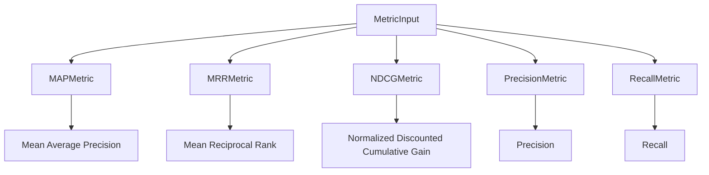

# retrieval_quality_metrics 模块深度解析

## 模块概述

**retrieval_quality_metrics** 模块是一个专门用于评估检索系统质量的工具集合。想象一下，你有一个搜索引擎，你需要知道它返回的结果好不好——这个模块就是为此而生的。它提供了一套标准化的指标来衡量检索系统的性能，帮助开发者理解和改进检索算法的效果。

### 核心问题
在信息检索领域，如何客观评价一个检索系统的好坏？我们需要回答：
- 返回的结果是否相关？（Precision/Recall）
- 相关结果的位置好不好？（MAP/MRR/NDCG）
- 多个查询的平均表现如何？（Mean系列指标）

### 为什么需要这个模块？
如果没有标准化的质量评估指标，我们就无法：
1. 客观比较不同检索算法的优劣
2. 量化检索系统改进的效果
3. 建立自动化的检索质量监控体系

## 架构概览

这个模块采用了简洁的接口设计模式：每个指标都是一个独立的结构体，都实现了相同的 `Compute` 方法，接收统一的 `MetricInput` 输入，返回一个浮点分数。

### 数据流向
1. **输入准备**：系统将检索结果（`RetrievalIDs`）和标准答案（`RetrievalGT`）打包成 `MetricInput`
2. **指标计算**：根据需要选择一个或多个指标进行计算
3. **结果输出**：每个指标返回 0-1 之间的分数，越高表示质量越好

### 子模块说明

本模块包含以下子模块，每个子模块专注于一类检索质量指标：

#### 1. 位置敏感的排序质量指标
- **[mean_average_precision_metric](retrieval_quality_metrics-ranking_quality_position_sensitive_metrics-mean_average_precision_metric.md)** - 计算平均精度均值，考虑所有相关文档的位置
- **[mean_reciprocal_rank_metric](retrieval_quality_metrics-ranking_quality_position_sensitive_metrics-mean_reciprocal_rank_metric.md)** - 计算倒数排名均值，只关注第一个相关文档的位置
- **[normalized_discounted_cumulative_gain_metric](retrieval_quality_metrics-ranking_quality_position_sensitive_metrics-normalized_discounted_cumulative_gain_metric.md)** - 计算归一化折损累计增益，支持多级相关性评分

#### 2. 基础检索质量指标
- **[retrieval_precision_metric](retrieval_quality_metrics-retrieval_precision_metric.md)** - 计算精度，衡量返回结果中有多少是相关的
- **[retrieval_recall_metric](retrieval_quality_metrics-retrieval_recall_metric.md)** - 计算召回率，衡量所有相关文档中有多少被返回了

## 核心设计理念

### 1. 单一职责原则
每个指标类只负责计算一种指标，这使得：
- 代码清晰易懂，易于维护
- 可以独立测试每个指标
- 灵活组合多个指标进行综合评估

### 2. 统一接口设计
所有指标都使用相同的输入类型和方法签名，这种设计：
- 简化了调用方代码
- 便于添加新指标
- 支持批量计算多个指标

### 3. 性能优化考虑
在实现中可以看到一些性能优化的设计：
- 使用 map 进行 O(1) 时间复杂度的相关文档查找
- 提前终止不必要的计算（如 MRR 找到第一个相关文档就停止）
- 避免不必要的内存分配

## 关键设计决策

### 1. 为什么选择 float64 作为返回类型？
**决策**：所有指标都返回 float64 类型
**原因**：
- 保留足够的精度，避免在多查询平均时丢失信息
- 统一的类型便于后续处理和比较
- 符合学术和工业界的标准做法

### 2. 为什么不使用接口？
**观察**：代码中没有定义统一的 Metric 接口，虽然所有指标都有 Compute 方法
**可能的原因**：
- 简化设计，避免过度抽象
- 当前使用场景不需要多态
- 保持模块的简单性和可读性
**权衡**：失去了一些灵活性，但换来了更简单的代码结构

### 3. NDCG 的 k 参数设计
**决策**：NDCGMetric 在构造时需要指定 k 值
**原因**：
- NDCG 通常只关注前 k 个结果
- 固定 k 值可以使不同系统的比较更公平
- 避免每次调用都传入 k 参数的冗余

## 新开发者注意事项

### 1. 输入数据格式
确保 `MetricInput` 的数据格式正确：
- `RetrievalGT` 是一个二维切片，每个子切片代表一个查询的相关文档 ID
- `RetrievalIDs` 是检索系统返回的文档 ID 列表
- 文档 ID 必须是整数类型

### 2. 边界情况处理
代码中已经处理了一些边界情况：
- 当没有标准答案时返回 0
- 当没有相关文档时的处理
- 除零保护

### 3. 指标选择建议
根据你的使用场景选择合适的指标：
- 如果只关心有没有找到相关文档 → MRR
- 如果关心所有相关文档的位置 → MAP
- 如果有不同级别的相关性 → NDCG
- 基础评估 → Precision + Recall

### 4. 性能考虑
对于大规模评估：
- 考虑复用指标实例
- 批量处理多个查询
- 注意内存使用，特别是当 RetrievalGT 很大时

## 与其他模块的关系

本模块位于 [evaluation_dataset_and_metric_services](application_services_and_orchestration-evaluation_dataset_and_metric_services.md) 模块下，是评估系统的核心组成部分。它依赖于 `internal/types` 包中的数据类型定义，并被上层的评估编排服务调用。

---

这个模块虽然小，但却是检索系统质量评估的基石。理解每个指标的含义和计算方法，对于开发和优化检索系统至关重要。
