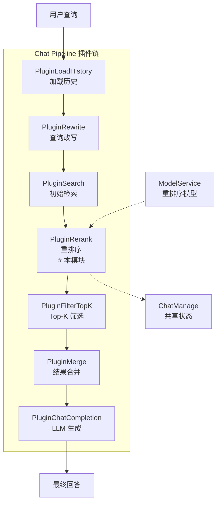

# retrieval_reranking_plugin 模块深度解析

## 模块概述：为什么需要重排序？

想象一下，你正在图书馆找一本书。图书管理员（检索系统）根据关键词从几十万本书中快速筛选出 50 本可能相关的书——但这 50 本书的排序只是基于简单的关键词匹配度。有些书虽然关键词匹配度高，但实际内容与你的问题关联不大；有些书关键词不那么显眼，但恰恰能精准回答你的问题。

**`retrieval_reranking_plugin` 模块解决的就是这个"粗排 vs 精排"的问题。**

在知识问答系统中，初始检索（由 [`PluginSearch`](chat_pipeline_plugins_and_flow.md) 执行）通常使用向量相似度或关键词匹配，这些方法计算快、适合大规模候选集，但精度有限。重排序插件的核心职责是：**对初筛出的候选结果进行精细化重排，确保最终呈现给用户的 Top-K 结果真正与问题高度相关。**

这个模块的设计洞察在于：**检索是一个多阶段漏斗**。第一阶段追求召回率（宁可多不可少），第二阶段追求准确率（只留最相关的）。重排序就是第二阶段的守门员，它使用更昂贵但更精准的交叉编码器（Cross-Encoder）模型，对每个"查询 - 文档"对进行深度语义匹配打分。

---

## 架构定位与数据流

### 模块在系统中的位置



### 数据流追踪

重排序插件的数据流遵循典型的**输入 - 处理 - 输出**模式，但有几个关键的设计细节：

1. **输入阶段**：从 `ChatManage.SearchResult` 读取初始检索结果（通常 20-100 条），同时读取配置参数（`RerankModelID`、`RerankThreshold`、`RerankTopK`）

2. **处理阶段**：
   - 分离 `DirectLoad` 类型结果（直接加载的已知相关 chunk，跳过重排序）
   - 对其余候选构建富文本 passage（合并 Content + ImageInfo OCR + GeneratedQuestions）
   - 调用重排序模型 API 获取相关性分数
   - 应用阈值过滤（对 History 匹配类型使用更宽松的阈值）
   - 计算复合分数（模型分 + 基础分 + 来源权重 + 位置先验）
   - 应用 MMR 算法进行多样性去重

3. **输出阶段**：将最终排序结果写入 `ChatManage.RerankResult`，供下游插件使用

### 依赖关系分析

| 依赖类型 | 组件 | 作用 | 耦合程度 |
|---------|------|------|---------|
| **强依赖** | `interfaces.ModelService` | 获取重排序模型实例 | 高（接口抽象，可替换） |
| **强依赖** | `types.ChatManage` | 读写共享状态（SearchResult/RerankResult） | 高（隐式契约） |
| **强依赖** | `chat_pipline.EventManager` | 注册为 CHUNK_RERANK 事件处理器 | 中（插件模式解耦） |
| **弱依赖** | `searchutil` | 文本分词、Jaccard 相似度计算 | 低（纯工具函数） |
| **弱依赖** | `models/rerank` | 重排序模型接口定义 | 中（多后端支持） |

**关键架构决策**：模块采用**插件模式**而非直接函数调用，这使得重排序阶段可以：
- 被动态启用/禁用（通过事件注册机制）
- 支持多插件监听同一事件（虽然当前只有一个）
- 在测试中容易被 mock 或替换

---

## 核心组件深度解析

### PluginRerank 结构体

```go
type PluginRerank struct {
    modelService interfaces.ModelService
}
```

**设计意图**：这是一个典型的**无状态服务组件**。它不保存任何请求级状态，所有上下文信息都通过 `ChatManage` 传递。这种设计的好处是：
- 线程安全（多个请求可并发调用同一实例）
- 易于测试（只需 mock `modelService`）
- 内存开销小（无需为每个请求创建新实例）

**构造函数**：
```go
func NewPluginRerank(eventManager *EventManager, modelService interfaces.ModelService) *PluginRerank
```
构造函数完成两件事：初始化依赖、向事件管理器注册自己。这是**依赖注入**模式的体现——插件不自己创建依赖，而是由外部传入。

---

### OnEvent 方法：主处理逻辑

这是整个模块的**核心入口点**，遵循插件接口的标准签名：

```go
func (p *PluginRerank) OnEvent(
    ctx context.Context,
    eventType types.EventType, 
    chatManage *types.ChatManage,
    next func() *PluginError,
) *PluginError
```

#### 参数语义解析

| 参数 | 作用 | 设计考量 |
|-----|------|---------|
| `ctx` | 请求上下文 | 支持超时控制、链路追踪、日志关联 |
| `eventType` | 触发事件类型 | 当前固定为 `CHUNK_RERANK`，预留多事件支持 |
| `chatManage` | 共享状态对象 | **关键设计**：所有插件通过它传递数据，避免参数爆炸 |
| `next` | 责任链下一跳 | 实现**责任链模式**，插件决定何时移交控制权 |

#### 执行流程详解

**阶段 1：快速失败检查**
```go
if len(chatManage.SearchResult) == 0 {
    return next() // 无结果，直接跳过
}
if chatManage.RerankModelID == "" {
    return next() // 未配置模型，降级处理
}
```
这是**防御性编程**的体现：在投入昂贵计算前，先检查是否有必要执行。

**阶段 2：候选分离与文本增强**
```go
for _, result := range chatManage.SearchResult {
    if result.MatchType == types.MatchTypeDirectLoad {
        directLoadResults = append(directLoadResults, result)
        continue // 跳过重排序
    }
    passage := getEnrichedPassage(ctx, result)
    passages = append(passages, passage)
}
```

**关键设计决策**：为什么 `DirectLoad` 类型要跳过重排序？

`DirectLoad` 表示这些 chunk 是通过**确定性规则**选中的（例如用户明确引用的文档、历史对话中已验证相关的内容），它们的相关性已经由业务逻辑保证，不需要再用模型判断。这是一种**混合策略**：规则系统处理确定性场景，模型处理模糊匹配场景。

**文本增强逻辑**（`getEnrichedPassage`）：
```go
combinedText := result.Content
// 添加图片描述和 OCR 文本
if result.ImageInfo != "" {
    // 解析并提取 img.Caption 和 img.OCRText
}
// 添加生成的相关问题
if len(result.ChunkMetadata) > 0 {
    // 解析并提取 GeneratedQuestions
}
```

**为什么需要文本增强？** 重排序模型只能看到传入的文本。如果 chunk 包含图片，但只传纯文本内容，模型会丢失关键信息。通过预先合并图片描述、OCR 识别文本、生成的相关问题，我们让模型在**信息完整**的上下文中做判断。

**阶段 3：阈值降级策略**
```go
rerankResp = p.rerank(ctx, chatManage, rerankModel, chatManage.RewriteQuery, passages, candidatesToRerank)

if len(rerankResp) == 0 && originalThreshold > 0.3 {
    degradedThreshold := originalThreshold * 0.7
    rerankResp = p.rerank(ctx, chatManage, rerankModel, chatManage.RewriteQuery, passages, candidatesToRerank)
}
```

**这是一个关键的容错设计**。当阈值设置过高（如 0.8）时，可能过滤掉所有结果，导致用户看到空响应。降级策略的逻辑是：
1. 首次调用后如果无结果
2. 且原阈值 > 0.3（有降级空间）
3. 则将阈值降至原来的 70%（但不低于 0.3）
4. 重新执行重排序

**为什么是 0.3？** 这是经验值——低于 0.3 的结果通常噪声太大，即使降级也不应接受。

**阶段 4：复合分数计算**
```go
sr.Score = compositeScore(sr, modelScore, base)
```

这是整个模块最复杂的计算逻辑，详见下文 `compositeScore` 解析。

**阶段 5：MMR 多样性选择**
```go
final := applyMMR(ctx, reranked, chatManage, min(len(reranked), max(1, chatManage.RerankTopK)), 0.7)
```

**为什么需要 MMR？** 假设用户问"如何配置 Kubernetes 集群"，初始检索可能返回 10 个高度相似的结果（都讲 pod 配置）。MMR 的作用是**在相关性和多样性之间找平衡**，确保选出的 Top-K 结果覆盖不同方面（网络配置、存储配置、安全配置等）。

---

### compositeScore 函数：多因子评分融合

```go
func compositeScore(sr *types.SearchResult, modelScore, baseScore float64) float64 {
    sourceWeight := 1.0
    switch strings.ToLower(sr.KnowledgeSource) {
    case "web_search":
        sourceWeight = 0.95  // 网络搜索结果略微降权
    }
    
    positionPrior := 1.0
    if sr.StartAt >= 0 {
        positionPrior += searchutil.ClampFloat(
            1.0-float64(sr.StartAt)/float64(sr.EndAt+1), 
            -0.05, 0.05
        )
    }
    
    composite := 0.6*modelScore + 0.3*baseScore + 0.1*sourceWeight
    composite *= positionPrior
    return clamp(composite, 0, 1)
}
```

**设计哲学**：这是一个**加权融合策略**，背后的思考是：

| 因子 | 权重 | 理由 |
|-----|------|-----|
| 模型分 (`modelScore`) | 0.6 | 重排序模型最了解语义相关性，应占主导 |
| 基础分 (`baseScore`) | 0.3 | 初始检索分数仍有参考价值（尤其是向量相似度） |
| 来源权重 (`sourceWeight`) | 0.1 | 知识库内容通常比网络搜索更可靠 |
| 位置先验 (`positionPrior`) | 乘性因子 | chunk 在文档中的位置隐含重要性（开头/结尾通常更关键） |

**为什么是乘性而非加性？** 位置先验使用乘法而非加法，是因为它应该**放大或缩小**整体分数，而不是简单叠加。如果位置因子是 0.95（表示位置不太重要），它会将整体分数降低 5%，保持相对比例不变。

**潜在问题**：这个函数的权重是硬编码的，缺乏可配置性。如果业务场景变化（例如网络搜索质量提升），需要修改代码而非配置。

---

### applyMMR 函数：最大边际相关性算法

```go
func applyMMR(ctx context.Context, results []*types.SearchResult, k int, lambda float64) []*types.SearchResult {
    // 预计算所有 token 集合（性能优化）
    allTokenSets := make([]map[string]struct{}, len(results))
    for i, r := range results {
        allTokenSets[i] = searchutil.TokenizeSimple(getEnrichedPassage(ctx, r))
    }
    
    selected := make([]*types.SearchResult, 0, k)
    
    for len(selected) < k {
        bestIdx := -1
        bestScore := -1.0
        
        for i, r := range results {
            if _, isSelected := selectedIndices[i]; isSelected {
                continue
            }
            
            relevance := r.Score
            redundancy := 0.0
            
            for _, selTokens := range selectedTokenSets {
                sim := searchutil.Jaccard(allTokenSets[i], selTokens)
                if sim > redundancy {
                    redundancy = sim
                }
            }
            
            // MMR 核心公式
            mmr := lambda*relevance - (1.0-lambda)*redundancy
            
            if mmr > bestScore {
                bestScore = mmr
                bestIdx = i
            }
        }
        
        selected = append(selected, results[bestIdx])
    }
    
    return selected
}
```

**算法原理**：MMR（Maximal Marginal Relevance）的数学表达式是：

$$\text{MMR} = \lambda \cdot \text{Relevance} - (1-\lambda) \cdot \text{Redundancy}$$

其中：
- `Relevance` 是文档与查询的相关性（这里用 `sr.Score`）
- `Redundancy` 是文档与已选文档的最大相似度（用 Jaccard 系数）
- `λ` 控制两者的权衡（这里固定为 0.7）

**λ = 0.7 的含义**：70% 关注相关性，30% 关注多样性。如果设为 1.0，就退化为纯按分数排序；如果设为 0.5，多样性权重会更高。

**性能优化**：注意代码中的**预计算策略**——在进入主循环前，先计算所有文档的 token 集合。这是因为 Jaccard 相似度计算需要频繁访问 token 集合，如果每次循环都重新分词，时间复杂度会从 O(n²) 变成 O(n² × m)（m 是平均文档长度）。

**算法复杂度**：MMR 是贪心算法，时间复杂度为 O(k × n × s)，其中：
- k 是要选择的文档数
- n 是候选文档总数
- s 是已选文档的平均相似度计算成本

对于 n=50, k=10 的典型场景，这是可接受的。

---

### rerank 方法：模型调用与阈值过滤

```go
func (p *PluginRerank) rerank(ctx context.Context, 
    chatManage *types.ChatManage, 
    rerankModel rerank.Reranker, 
    query string, 
    passages []string,
    candidates []*types.SearchResult,
) []rerank.RankResult {
    
    rerankResp, err := rerankModel.Rerank(ctx, query, passages)
    
    // 阈值过滤（History 类型特殊处理）
    rankFilter := []rerank.RankResult{}
    for _, result := range rerankResp {
        th := chatManage.RerankThreshold
        matchType := candidates[result.Index].MatchType
        
        if matchType == types.MatchTypeHistory {
            th = math.Max(th-0.1, 0.5)  // History 匹配降低阈值
        }
        
        if result.RelevanceScore > th {
            rankFilter = append(rankFilter, result)
        }
    }
    return rankFilter
}
```

**特殊处理 History 匹配**：为什么对 `MatchTypeHistory` 降低阈值？

历史对话中的内容已经经过一轮验证（用户之前的问题和回答），即使重排序分数略低，也可能对当前问题有上下文价值。降低 0.1 的阈值（但不低于 0.5）是一种**保守的宽松策略**——既不过度信任历史，也不轻易丢弃。

---

## 设计决策与权衡分析

### 1. 插件模式 vs 直接函数调用

**选择**：采用插件模式（实现 `Plugin` 接口，通过 `EventManager` 注册）

**权衡**：
- ✅ **优点**：可扩展（可添加多个重排序插件）、可测试（容易 mock）、可配置（通过事件启用/禁用）
- ❌ **缺点**：增加了一层间接性、调试链路变长、需要维护事件系统

**适用场景**：当系统需要支持多种重排序策略（例如 A/B 测试不同模型）时，插件模式的优势明显。如果只有单一固定策略，直接函数调用更简单。

### 2. 复合分数 vs 纯模型分数

**选择**：使用复合分数（模型分 60% + 基础分 30% + 来源权重 10%）

**权衡**：
- ✅ **优点**：更稳健（模型失效时有兜底）、可解释性强（可追溯各因子贡献）
- ❌ **缺点**：权重需要调优、增加了计算复杂度

**替代方案**：有些系统直接用模型分排序。选择复合分数的原因是：初始检索分数（尤其是向量相似度）包含了几何空间信息，完全丢弃是浪费。

### 3. MMR 去重 vs 简单去重

**选择**：使用 MMR 算法进行多样性选择

**权衡**：
- ✅ **优点**：数学上有保证、可调节多样性程度、结果更丰富
- ❌ **缺点**：计算成本高（O(k×n²)）、需要分词和相似度计算

**替代方案**：
- 简单去重：只保留内容哈希不同的文档（太粗糙）
- 聚类后选代表：先聚类再每类选最高分（实现复杂）

MMR 是在效果和复杂度之间的折中选择。

### 4. 阈值降级策略

**选择**：当无结果时自动降低阈值重试

**权衡**：
- ✅ **优点**：提高召回率、避免空响应、用户体验更好
- ❌ **缺点**：可能引入低质量结果、增加一次模型调用成本

**关键考量**：降级只在原阈值 > 0.3 时触发，且最低降到 0.3，这是为了防止过度降级。

### 5. 文本增强策略

**选择**：在调用模型前合并 Content + ImageInfo + GeneratedQuestions

**权衡**：
- ✅ **优点**：模型看到更完整信息、提升多模态场景效果
- ❌ **缺点**：增加文本长度（可能超出模型限制）、解析失败时可能引入噪声

**风险点**：如果图片 OCR 质量差，错误文本会误导模型。代码中通过日志记录解析错误，但没有降级策略（例如 OCR 置信度低时忽略）。

---

## 使用指南与配置

### 启用重排序

重排序插件在 Chat Pipeline 初始化时自动注册：

```go
eventManager := NewEventManager()
modelService := ... // 注入 ModelService

rerankPlugin := NewPluginRerank(eventManager, modelService)
// 插件已自动注册到 CHUNK_RERANK 事件
```

### 关键配置参数

通过 `ChatManage` 结构体传递：

| 参数 | 类型 | 默认值 | 说明 |
|-----|------|--------|------|
| `RerankModelID` | string | 必填 | 重排序模型 ID，空则跳过重排序 |
| `RerankTopK` | int | 建议 5-10 | 最终输出的结果数量 |
| `RerankThreshold` | float64 | 建议 0.5-0.7 | 最低相关性阈值 |
| `FAQScoreBoost` | float64 | 1.0（不增强） | FAQ 结果分数倍增系数 |
| `FAQPriorityEnabled` | bool | false | 是否启用 FAQ 优先策略 |

### 配置示例

```go
chatManage := &types.ChatManage{
    RerankModelID:   "rerank-v1-large",
    RerankTopK:      8,
    RerankThreshold: 0.6,
    FAQScoreBoost:   1.2,  // FAQ 结果分数提升 20%
    FAQPriorityEnabled: true,
}
```

---

## 边界情况与注意事项

### 1. 空结果处理

当重排序后无结果时，返回 `ErrSearchNothing` 错误：

```go
if len(chatManage.RerankResult) == 0 {
    return ErrSearchNothing
}
```

**调用方需注意**：下游插件（如 `PluginFilterTopK`）应处理此错误，触发降级策略（如使用初始检索结果、返回友好提示等）。

### 2. DirectLoad 类型的特殊处理

`MatchTypeDirectLoad` 的结果**不参与重排序**，但会加入最终结果：

```go
for _, sr := range directLoadResults {
    modelScore := 1.0  // 假设完全相关
    sr.Score = compositeScore(sr, modelScore, base)
    reranked = append(reranked, sr)
}
```

**风险**：如果 DirectLoad 逻辑有误，可能引入不相关内容且无法被重排序过滤。

### 3. 模型调用失败

重排序模型调用失败时返回 nil，导致无结果：

```go
rerankResp, err := rerankModel.Rerank(ctx, query, passages)
if err != nil {
    return nil  // 调用方需处理 nil
}
```

**建议改进**：当前实现没有降级到初始检索分数排序，这是一个潜在的可用性风险。

### 4. 文本长度限制

重排序模型通常有输入长度限制（如 512 token）。`getEnrichedPassage` 合并多源文本后可能超限：

```go
// 当前代码没有截断逻辑
combinedText += strings.Join(enrichments, "\n")
```

**建议**：添加长度检查和截断策略，优先保留 Content，其次 ImageInfo，最后 GeneratedQuestions。

### 5. 并发安全

`PluginRerank` 本身是无状态的，但 `ChatManage` 是请求级共享状态：

```go
// 安全：每个请求有自己的 ChatManage 实例
chatManage.RerankResult = final
```

**注意**：不要在插件内部缓存请求级数据，否则会导致并发请求间数据污染。

### 6. FAQ 分数增强的边界

FAQ 增强有上限保护：

```go
sr.Score = math.Min(sr.Score*chatManage.FAQScoreBoost, 1.0)
```

**设计意图**：分数不应超过 1.0，避免破坏分数语义。但如果原始分数很低（如 0.3），即使 boost 后也可能排不到前面。

---

## 性能考量

### 时间复杂度分析

| 阶段 | 复杂度 | 典型耗时 |
|-----|--------|---------|
| 文本增强 | O(n × m) | ~10ms（n=50 候选，m=平均长度） |
| 模型调用 | O(n) API 调用 | ~100-500ms（网络 + 推理） |
| 阈值过滤 | O(n) | ~1ms |
| 复合分数计算 | O(n) | ~1ms |
| MMR 选择 | O(k × n × s) | ~20-50ms（k=10, n=50） |
| **总计** | - | **~150-600ms** |

**瓶颈**：模型调用占主导（70%+ 耗时）。优化方向：
- 批量调用（当前已支持）
- 模型蒸馏（用小模型换速度）
- 缓存（相同 query 复用结果）

### 内存占用

主要内存消耗在：
- `allTokenSets`：O(n × m) 存储所有 token 集合
- `selectedTokenSets`：O(k × m) 存储已选 token 集合

对于 n=100, m=200 的场景，约占用几百 KB，可接受。

---

## 扩展点与二次开发

### 扩展重排序策略

如需支持多种重排序算法，可实现新的插件：

```go
type PluginRerankV2 struct {
    modelService interfaces.ModelService
    // 新增：支持多模型融合
    primaryModel   rerank.Reranker
    fallbackModel  rerank.Reranker
}

func (p *PluginRerankV2) ActivationEvents() []types.EventType {
    return []types.EventType{types.CHUNK_RERANK}
}

func (p *PluginRerankV2) OnEvent(...) *PluginError {
    // 自定义重排序逻辑
}
```

**注意**：同一事件只能有一个插件生效（除非修改 `EventManager` 支持链式调用）。

### 自定义复合分数

如需调整评分权重，可修改 `compositeScore` 或注入策略函数：

```go
type ScoreStrategy func(*types.SearchResult, float64, float64) float64

type PluginRerank struct {
    modelService interfaces.ModelService
    scoreStrategy ScoreStrategy  // 可注入
}
```

### 替换 MMR 算法

如需其他多样性算法（如聚类、MMR 变体），可替换 `applyMMR`：

```go
func (p *PluginRerank) applyDiversity(
    ctx context.Context,
    results []*types.SearchResult,
    k int,
) []*types.SearchResult {
    // 使用 Maximal Marginal Relevance 的变体
    // 或使用聚类后选代表
}
```

---

## 相关模块参考

- **[chat_pipeline_plugins_and_flow.md](chat_pipeline_plugins_and_flow.md)**：了解插件在 Chat Pipeline 中的整体位置
- **[PluginSearch](chat_pipeline_plugins_and_flow.md)**：重排序的上游，提供初始检索结果
- **[PluginFilterTopK](chat_pipeline_plugins_and_flow.md)**：重排序的下游，进行最终 Top-K 筛选
- **[ModelService](agent_identity_tenant_and_configuration_services.md)**：提供重排序模型实例
- **[Reranker 接口](model_providers_and_ai_backends.md)**：重排序模型的后端实现（Aliyun、Jina、Zhipu 等）

---

## 总结：核心设计原则

1. **多阶段漏斗**：检索是粗排，重排序是精排，各司其职
2. **混合策略**：规则（DirectLoad）+ 模型（重排序）+ 启发式（MMR）
3. **防御性设计**：阈值降级、空结果检查、解析错误日志
4. **可解释性**：复合分数可追溯、日志详细记录各阶段分数
5. **性能意识**：预计算 token 集合、批量模型调用、无状态设计

这个模块体现了**工程实践中的平衡艺术**：在精度和速度之间、在复杂度和可维护性之间、在规则确定性和模型灵活性之间，找到适合业务场景的平衡点。
