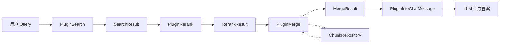

# retrieval_result_merge_plugin 模块深度解析

## 概述：为什么需要这个模块？

想象一下，你正在拼一幅拼图，但有人把同一区域的几块拼图都给了你——它们部分重叠、边界模糊，甚至有些是重复的。如果你直接把所有拼图块都展示给用户，会看到重复的内容、断裂的上下文，以及混乱的信息。

**`PluginMerge` 就是那个拼图整理师。** 它的核心职责是在检索和重排序之后、LLM 生成答案之前，对检索到的知识片段（chunks）进行**智能合并与上下文增强**。

这个模块存在的根本原因是：**原始检索结果不能直接喂给 LLM**。原因有三：

1. **重叠问题**：向量检索和关键词检索可能返回同一文档的不同片段，这些片段在原文中可能重叠或相邻。直接拼接会导致内容重复，浪费 LLM 的上下文窗口。

2. **FAQ 特殊处理**：FAQ 类型的 chunk 在检索时只匹配了问题，但用户需要的是答案。需要在合并阶段从元数据中提取并格式化答案内容。

3. **上下文碎片化**：检索到的文本片段可能太短（比如只有 100 字），缺乏足够的上下文让 LLM 理解。需要向前后扩展邻居 chunk，形成连贯的语义单元。

**设计洞察**：合并不是简单的去重，而是在保留信息来源追踪能力的前提下，构建**非重叠、上下文完整、类型感知**的知识片段集合。这是一个典型的"后处理优化"模式——在检索质量已定的情况下，通过智能组装最大化信息密度。

---

## 架构与数据流

### 模块在系统中的位置



`PluginMerge` 位于检索流水线的**中后段**，承接 `PluginRerank` 的输出，为后续的 `PluginIntoChatMessage` 提供干净的上下文数据。它是检索结果到 LLM 输入之间的**关键转换器**。

### 核心数据流

```
输入：chatManage.RerankResult (或 fallback 到 SearchResult)
       ↓
按 KnowledgeID + ChunkType 分组
       ↓
组内按 StartAt 排序 → 合并重叠/相邻 chunk
       ↓
FAQ chunk 内容填充（从元数据提取答案）
       ↓
短文本 chunk 上下文扩展（拉取邻居 chunk）
       ↓
输出：chatManage.MergeResult
```

### 依赖关系

| 依赖方向 | 组件 | 作用 |
|---------|------|------|
| **被调用** | `EventManager` | 通过事件系统触发 `CHUNK_MERGE` 事件 |
| **调用** | `ChunkRepository.ListChunksByID()` | 获取 FAQ 元数据和邻居 chunk |
| **输入契约** | `types.SearchResult` | 检索结果结构，包含位置、分数、内容 |
| **输出契约** | `types.ChatManage.MergeResult` | 合并后的结果集 |

---

## 核心组件深度解析

### PluginMerge 结构体

```go
type PluginMerge struct {
    chunkRepo interfaces.ChunkRepository
}
```

**设计意图**：这是一个**无状态插件**（stateless plugin），唯一的依赖是 `ChunkRepository`。无状态设计使得它可以安全地在并发请求间复用，符合流水线的插件化架构。

#### 注册与激活机制

```go
func NewPluginMerge(eventManager *EventManager, chunkRepo interfaces.ChunkRepository) *PluginMerge {
    res := &PluginMerge{
        chunkRepo: chunkRepo,
    }
    eventManager.Register(res)  // 注册到事件系统
    return res
}

func (p *PluginMerge) ActivationEvents() []types.EventType {
    return []types.EventType{types.CHUNK_MERGE}
}
```

**模式分析**：采用**事件驱动插件模式**。`PluginMerge` 实现 `Plugin` 接口，声明自己只处理 `CHUNK_MERGE` 事件。这种设计的好处是：
- 插件之间解耦，通过事件顺序隐式定义执行顺序
- 易于测试和替换（可以注册 mock 插件）
- 支持动态扩展（新增事件类型不影响现有插件）

---

### OnEvent 方法：主处理逻辑

```go
func (p *PluginMerge) OnEvent(ctx context.Context,
    eventType types.EventType, chatManage *types.ChatManage, next func() *PluginError,
) *PluginError
```

**参数解析**：
- `ctx`：携带 `TenantID` 等上下文信息，用于多租户隔离
- `chatManage`：流水线的**共享状态对象**，包含输入（`RerankResult`）和输出（`MergeResult`）
- `next`：责任链模式的延续函数，调用 `next()` 将控制权交给下一个插件

#### 处理流程详解

##### 1. 输入选择与降级策略

```go
searchResult := chatManage.RerankResult
if len(searchResult) == 0 {
    searchResult = chatManage.SearchResult  // Fallback
}
```

**设计权衡**：优先使用重排序结果，但如果重排序模型失败或返回空，降级到原始检索结果。这是一种**防御性编程**——保证流水线在部分组件失效时仍能继续运行。

**潜在风险**：如果 `RerankResult` 为空是因为重排序模型认为所有结果都不相关，降级到 `SearchResult` 可能会降低答案质量。但这是"有答案但质量稍差"vs"无答案"的权衡。

##### 2. 按知识源分组

```go
knowledgeGroup := make(map[string]map[string][]*types.SearchResult)
for _, chunk := range searchResult {
    knowledgeGroup[chunk.KnowledgeID][chunk.ChunkType] = append(...)
}
```

**为什么分组？** 合并只能在**同一文档内**进行。不同文档的 chunk 即使内容相似也不能合并，因为它们的 `StartAt`/`EndAt` 位置是相对于各自文档的。

**双层分组结构**：
- 第一层：`KnowledgeID`（文档级别）
- 第二层：`ChunkType`（chunk 类型，如 `text`、`faq`、`table`）

这种设计确保了**类型安全的合并**——FAQ chunk 不会和文本 chunk 混在一起合并。

##### 3. 重叠合并算法

```go
sort.Slice(chunks, func(i, j int) bool {
    if chunks[i].StartAt == chunks[j].StartAt {
        return chunks[i].EndAt < chunks[j].EndAt
    }
    return chunks[i].StartAt < chunks[j].StartAt
})

knowledgeMergedChunks := []*types.SearchResult{chunks[0]}
for i := 1; i < len(chunks); i++ {
    lastChunk := knowledgeMergedChunks[len(knowledgeMergedChunks)-1]
    if chunks[i].StartAt > lastChunk.EndAt {
        knowledgeMergedChunks = append(knowledgeMergedChunks, chunks[i])
        continue
    }
    // 合并重叠部分
    if chunks[i].EndAt > lastChunk.EndAt {
        contentRunes := []rune(chunks[i].Content)
        offset := len(contentRunes) - (chunks[i].EndAt - lastChunk.EndAt)
        lastChunk.Content = lastChunk.Content + string(contentRunes[offset:])
        lastChunk.EndAt = chunks[i].EndAt
        lastChunk.SubChunkID = append(lastChunk.SubChunkID, chunks[i].ID)
        mergeImageInfo(ctx, lastChunk, chunks[i])
    }
    if chunks[i].Score > lastChunk.Score {
        lastChunk.Score = chunks[i].Score
    }
}
```

**算法核心**：这是一个经典的**区间合并算法**（Interval Merge），时间复杂度 O(n log n)，主要来自排序。

**关键设计决策**：

1. **按 StartAt 排序**：确保按文档顺序处理，这是区间合并的前提。

2. **重叠判断**：`chunks[i].StartAt > lastChunk.EndAt` 表示不重叠。注意这里是**严格大于**，意味着 `StartAt == EndAt` 被视为相邻，需要合并。

3. **内容拼接策略**：
   ```go
   offset := len(contentRunes) - (chunks[i].EndAt - lastChunk.EndAt)
   lastChunk.Content = lastChunk.Content + string(contentRunes[offset:])
   ```
   只追加**新增部分**，避免重复。这是基于字符位置的精确计算。

4. **SubChunkID 追踪**：合并后保留原始 chunk ID 列表，用于**来源追溯**。这对于调试和引用展示至关重要。

5. **分数继承**：`lastChunk.Score = max(lastChunk.Score, chunks[i].Score)` —— 合并后的 chunk 继承最高分，保证排序时不会降级。

6. **Unicode 安全**：使用 `[]rune` 而非 `[]byte` 处理字符串，确保多字节字符（如中文）不会被截断。

##### 4. ImageInfo 合并

```go
func mergeImageInfo(ctx context.Context, target *types.SearchResult, source *types.SearchResult) error {
    // 反序列化 → 合并 → 去重（按 URL）→ 序列化
}
```

**为什么需要合并图片？** 当两个 chunk 合并时，它们可能各自引用了不同的图片。合并后的 chunk 需要包含所有相关图片。

**去重策略**：以 `URL` 作为唯一标识。这是合理的，因为同一张图片在同一文档中不应该有多个不同的 URL。

**容错处理**：
- 如果 `source` 没有图片，直接返回
- 如果 `target` 反序列化失败，直接用 `source` 的图片（降级策略）
- 所有错误只记录日志，不中断流程（**最佳努力合并**）

---

### populateFAQAnswers：FAQ 内容填充

```go
func (p *PluginMerge) populateFAQAnswers(ctx context.Context, chatManage *types.ChatManage, results []*types.SearchResult) []*types.SearchResult
```

**问题背景**：FAQ chunk 在检索时，`Content` 字段存储的是**问题文本**（用于向量匹配），但用户需要的是**答案**。

**处理逻辑**：
1. 筛选出 `ChunkType == FAQ` 的 chunk
2. 批量从数据库获取完整 chunk 记录（包含元数据）
3. 解析 `FAQChunkMetadata`，提取 `StandardQuestion` 和 `Answers`
4. 格式化为 `Q: ...\nAnswer:\n- ...\n` 结构
5. 替换 `SearchResult.Content`

**为什么不在检索阶段就填充？** 因为检索阶段只需要问题文本做向量相似度计算，提前拉取完整元数据会增加不必要的 I/O。合并阶段是**按需加载**的最佳时机。

**性能优化**：使用 `ListChunksByID` 批量查询，避免 N+1 问题。

**格式示例**：
```
Q: 如何重置密码？
Answer:
- 登录账户后进入设置页面
- 点击"安全"选项卡
- 选择"重置密码"并按提示操作
```

---

### expandShortContextWithNeighbors：短上下文扩展

```go
func (p *PluginMerge) expandShortContextWithNeighbors(ctx context.Context, chatManage *types.ChatManage, results []*types.SearchResult) []*types.SearchResult
```

**核心问题**：检索到的文本 chunk 可能太短（如 100 字），缺乏足够上下文让 LLM 理解。例如：
> "该系统支持多种认证方式。"

这句话本身没有信息量，但如果扩展前后文：
> "WeKnora 知识库系统支持多种认证方式，包括 OAuth2、SAML 和 LDAP。管理员可以在租户设置中配置。"

**扩展策略**：
1. 识别短 chunk（`runeLen < 350`）
2. 通过 `PreChunkID`/`NextChunkID` 获取前后邻居
3. 迭代扩展直到达到最小长度（350）或最大长度（850）
4. 保持 chunk 边界信息（`StartAt`/`EndAt` 调整）

**关键设计决策**：

1. **长度阈值**：
   - `minLen = 350`：低于此值认为上下文不足
   - `maxLen = 850`：防止扩展过多浪费上下文窗口
   
   这些值是经验值，平衡了"足够理解"和"不过载"。

2. **迭代扩展**：
   ```go
   for {
       merged = mergeOrderedContent(prevContent, baseChunk.Content, nextContent, maxLen)
       if runeLen(merged) >= minLen { break }
       if prevCursor == "" && nextCursor == "" { break }
       // 继续拉取更多邻居
   }
   ```
   不是一次性拉取所有邻居，而是**按需迭代**。如果扩展一轮后已达到 `minLen`，就停止，避免不必要的数据库查询。

3. **跨文档保护**：
   ```go
   if prevChunk := chunkMap[prevCursor]; prevChunk != nil && 
      prevChunk.KnowledgeID == baseChunk.KnowledgeID {
       // 只有同一文档才扩展
   }
   ```
   确保不会跨越文档边界扩展，避免内容污染。

4. **重叠检测**：`concatNoOverlap` 函数检测并移除相邻 chunk 之间的重叠部分（如段落结尾和开头可能重复的标点或短语）。

5. **缓存机制**：`chunkMap` 缓存已加载的 chunk，避免重复查询。

**性能考量**：
- 最坏情况下，一个短 chunk 可能触发多次数据库查询（迭代扩展）
- 使用 `fetchChunksIfMissing` 批量预取，减少查询次数
- 设置 `maxLen` 上限，防止无限扩展

---

## 设计权衡与决策分析

### 1. 合并策略：激进 vs 保守

**当前选择**：**激进合并**——只要重叠就合并，只保留非重复部分。

**替代方案**：保守策略——保留所有原始 chunk，让 LLM 自己处理重复。

**权衡分析**：
- 激进合并节省上下文窗口，但可能丢失细微差异（如两个相似但不同的段落）
- 保守策略保留更多信息，但浪费 token，且可能让 LLM 困惑

**为什么选择激进**：在 RAG 场景中，上下文窗口是稀缺资源。实验表明，合并后的 chunk 质量通常优于重复 chunk，因为 LLM 更擅长从连贯文本中提取信息。

### 2. 分数继承：取最大值 vs 加权平均

**当前选择**：`lastChunk.Score = max(lastChunk.Score, chunks[i].Score)`

**替代方案**：加权平均、求和、或保持第一个 chunk 的分数。

**为什么取最大值**：合并后的 chunk 代表了多个检索结果的并集，其相关性不应低于任何一个组成部分。取最大值是**乐观策略**，确保合并不会降低排序优先级。

### 3. FAQ 填充时机：检索时 vs 合并时

**当前选择**：合并时填充。

**替代方案**：检索阶段就从数据库加载完整 FAQ 元数据。

**为什么延迟到合并时**：
- 检索阶段只需要问题文本做向量匹配
- 提前加载会增加不必要的 I/O（尤其是 top-k 较大时）
- 合并阶段是**数据富化**的自然位置（类似数据库的 JOIN 操作）

### 4. 上下文扩展：固定邻居数 vs 动态长度

**当前选择**：动态长度（350-850 字符）。

**替代方案**：固定扩展 N 个邻居 chunk。

**为什么动态长度**：
- 不同 chunk 的内容密度不同，固定数量可能导致过度扩展或扩展不足
- 动态长度确保每个 chunk 都有**足够的语义信息**，同时不浪费 token
- 上限保护防止极端情况（如整个文档被拉取）

### 5. 错误处理：严格失败 vs 最佳努力

**当前选择**：**最佳努力**——所有错误只记录日志，不中断流程。

**替代方案**：遇到错误立即返回，终止合并。

**为什么最佳努力**：
- 合并是**优化步骤**，不是核心功能。即使失败，流水线仍能输出结果（只是质量稍差）
- 图片合并、FAQ 元数据解析等是**增强功能**，不应阻塞主流程
- 日志记录足够用于事后分析和修复

**风险**：可能掩盖系统性问题（如数据库连接失败）。需要通过监控和告警补充。

---

## 使用与配置

### 插件注册

```go
// 在应用启动时注册
eventManager := NewEventManager()
chunkRepo := NewChunkRepository(db)
mergePlugin := NewPluginMerge(eventManager, chunkRepo)

// 插件自动注册到 CHUNK_MERGE 事件
```

### 触发条件

当流水线执行到 `CHUNK_MERGE` 事件时，`PluginMerge.OnEvent` 会被自动调用。无需手动触发。

### 输入输出契约

**输入**（通过 `ChatManage`）：
- `RerankResult`：重排序后的检索结果（优先）
- `SearchResult`：原始检索结果（降级）

**输出**（写入 `ChatManage`）：
- `MergeResult`：合并后的结果集

### 依赖配置

| 配置项 | 说明 | 默认值 |
|--------|------|--------|
| `ChunkRepository` | 数据库访问接口 | 必需 |
| `TenantID` | 多租户隔离 | 从 context 或 chatManage 获取 |

---

## 边界情况与陷阱

### 1. TenantID 缺失

```go
tenantID, _ := ctx.Value(types.TenantIDContextKey).(uint64)
if tenantID == 0 && chatManage != nil {
    tenantID = chatManage.TenantID
}
if tenantID == 0 {
    // 跳过 FAQ 填充和上下文扩展
    return results
}
```

**陷阱**：如果 `TenantID` 缺失，FAQ 填充和上下文扩展会被跳过，但基础合并仍会执行。这可能导致**部分功能失效但不报错**。

**调试提示**：检查日志中的 `faq_enrich_skip` 或 `expand_skip` 警告。

### 2. Unicode 截断风险

```go
func runeLen(s string) int {
    return len([]rune(s))  // 正确：按 rune 计数
}
```

**陷阱**：如果使用 `len(s)`（按字节计数），中文字符可能被截断，导致乱码。

**验证方法**：确保所有长度计算都使用 `runeLen` 辅助函数。

### 3. 循环扩展风险

```go
for {
    // ... 扩展逻辑
    if !expanded {
        break  // 关键：防止死循环
    }
}
```

**陷阱**：如果 `PreChunkID`/`NextChunkID` 形成环（数据错误），可能导致无限循环。

**保护机制**：`expanded` 标志确保每轮至少扩展一个 chunk，否则退出。

### 4. 图片合并的 JSON 错误

```go
if err := json.Unmarshal([]byte(source.ImageInfo), &sourceImageInfos); err != nil {
    return err  // 只记录日志，不中断
}
```

**陷阱**：如果 `ImageInfo` 字段损坏，反序列化会失败。

**容错策略**：失败时只记录日志，继续使用其他图片。最坏情况是丢失图片引用，不影响文本内容。

### 5. 邻居 chunk 跨文档污染

```go
if prevChunk.KnowledgeID == baseChunk.KnowledgeID {
    // 只有同一文档才合并
}
```

**陷阱**：如果 `PreChunkID` 指向不同文档的 chunk（数据不一致），可能导致内容污染。

**保护机制**：显式检查 `KnowledgeID` 一致性。

---

## 性能考量

### 数据库查询模式

| 操作 | 查询次数 | 优化策略 |
|------|----------|----------|
| FAQ 填充 | 1 次批量查询 | `ListChunksByID` 批量获取 |
| 上下文扩展 | 1-N 次迭代查询 | `chunkMap` 缓存 + 批量预取 |

**最坏情况**：一个短 chunk 需要扩展 5 轮，每轮拉取 2 个邻居，共 10 次查询。但实际中 `chunkMap` 缓存会大幅减少查询次数。

### 内存使用

- `knowledgeGroup`：O(n)，n 为检索结果数
- `chunkMap`：O(m)，m 为需要扩展的 chunk 数
- 合并操作：原地修改，无额外分配

**风险点**：如果检索结果数很大（如 top-k=100），分组映射可能占用较多内存。但这是正常情况，因为后续会传递给 LLM。

### 时间复杂度

- 排序：O(n log n)
- 合并：O(n)
- FAQ 填充：O(f)，f 为 FAQ chunk 数
- 上下文扩展：O(s × e)，s 为短 chunk 数，e 为平均扩展轮数

**总体**：O(n log n)，主导因素是排序。

---

## 扩展点

### 1. 自定义合并策略

当前合并策略是硬编码的。如果需要更复杂的合并逻辑（如基于语义相似度而非位置），可以：

```go
type MergeStrategy interface {
    ShouldMerge(a, b *types.SearchResult) bool
    Merge(a, b *types.SearchResult) *types.SearchResult
}
```

### 2. 可配置的长度阈值

当前 `minLen=350`、`maxLen=850` 是硬编码。可以通过配置注入：

```go
type PluginMergeConfig struct {
    MinContextLen int
    MaxContextLen int
}
```

### 3. 异步上下文扩展

当前上下文扩展是同步的，会阻塞流水线。对于延迟敏感的场景，可以考虑：
- 预取邻居 chunk（在检索阶段并行加载）
- 异步扩展（先返回基础结果，后台扩展）

---

## 相关模块

- [PluginRerank](rerank_plugin.md)：上游模块，提供重排序结果
- [PluginSearch](search_plugin.md)：检索执行模块，提供原始搜索结果
- [PluginIntoChatMessage](into_chat_message_plugin.md)：下游模块，将合并结果组装为 LLM 输入
- [ChunkRepository](chunk_repository.md)：数据访问层，提供 chunk 持久化

---

## 总结

`PluginMerge` 是 RAG 流水线中的**质量增强器**。它不做检索，不做生成，而是专注于**让检索结果更适合 LLM 消费**。

**核心价值**：
1. 消除重复，节省上下文窗口
2. 填充 FAQ 答案，提升信息完整性
3. 扩展短上下文，增强语义理解

**设计哲学**：最佳努力、防御性编程、按需加载。

**关键洞察**：合并不是简单的去重，而是在**信息密度**和**上下文完整性**之间找到平衡点。这个模块的每个设计决策都围绕这个平衡展开。
