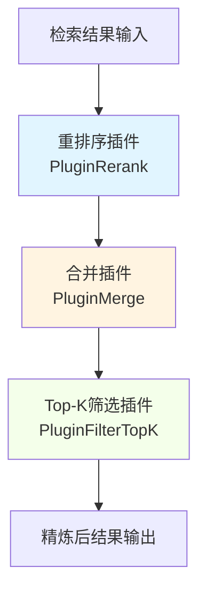

# 检索结果精炼与合并模块

## 概述

当您在文档库中搜索"如何配置 Redis 缓存"时，系统可能会返回几十个相关的文本片段——有些来自同一文档的不同部分，有些是重复的，有些相关性较低。`retrieval_result_refinement_and_merge` 模块就像一位专业的编辑，它会：

1. **重新排序**这些片段，把最相关的放在前面
2. **合并**属于同一文档的相邻片段，恢复完整的上下文
3. **筛选**出最有价值的结果，避免信息过载
4. **补充**上下文信息，让结果更易理解

这个模块是整个检索流程的"最后一公里"，它将原始的、可能杂乱的检索结果转化为结构清晰、相关性高、易于理解的内容集合。

## 架构概览



### 数据流向

1. **输入阶段**：接收来自检索执行阶段的原始搜索结果（`SearchResult`）
2. **重排序阶段**：通过 `PluginRerank` 对结果进行相关性重排序，应用 MMR 算法减少冗余
3. **合并阶段**：通过 `PluginMerge` 合并同一文档的相邻片段，补充 FAQ 答案和上下文
4. **筛选阶段**：通过 `PluginFilterTopK` 保留最相关的 Top-K 个结果
5. **输出阶段**：将精炼后的结果传递给后续的上下文构建和回答生成阶段

## 核心设计决策

### 1. 管道式插件架构

**选择**：采用事件驱动的管道式插件架构，每个功能作为独立插件

**为什么**：
- 灵活性：可以根据需要启用/禁用特定步骤
- 可测试性：每个插件可以独立测试
- 可扩展性：易于添加新的精炼步骤

**替代方案**：
- 单体式实现：更简单但缺乏灵活性
- 函数式组合：难以维护复杂的状态管理

### 2. 复合分数计算

**选择**：使用模型分数、基础分数、来源权重和位置先验的加权组合

```go
composite := 0.6*modelScore + 0.3*baseScore + 0.1*sourceWeight
composite *= positionPrior
```

**为什么**：
- 平衡了多种信号：模型相关性、检索匹配度、来源可靠性
- 可调权重：可以根据实际效果调整各因素的重要性
- 位置感知：文档开头的内容通常更重要

### 3. MMR 去重算法

**选择**：使用最大边际相关性（MMR）算法进行结果选择

**为什么**：
- 平衡相关性和多样性：避免返回高度相似的结果
- 可配置：通过 lambda 参数控制相关性与多样性的权衡
- 预计算优化：预先计算 token 集合提高性能

### 4. 阈值降级策略

**选择**：当初始阈值过高导致无结果时，自动降低阈值重试

**为什么**：
- 鲁棒性：避免因为阈值设置不当导致空结果
- 用户体验：宁可返回一些不太相关的结果，也比什么都没有好

## 子模块详解

### 检索重排序插件 (retrieval_reranking_plugin)

这个子模块负责重新排序检索结果，将最相关的内容放在前面。它不仅仅是简单的排序，还包括：

- 使用专门的重排序模型评估结果相关性
- 应用复合分数计算，结合多种信号
- 使用 MMR 算法平衡相关性和多样性
- 支持 FAQ 结果的特殊处理和分数提升

详细内容请参考 [retrieval_reranking_plugin 文档](retrieval_reranking_plugin.md)。

### Top-K 结果筛选插件 (top_k_result_selection_plugin)

这个子模块负责从精炼后的结果中选择最相关的 Top-K 个。它的设计非常简洁但具有灵活性：

- 可以处理不同阶段的结果（合并结果、重排序结果或原始搜索结果）
- 简单的截断策略，保持结果的顺序
- 可配置的 K 值，适应不同的应用场景

详细内容请参考 [top_k_result_selection_plugin 文档](top_k_result_selection_plugin.md)。

### 检索结果合并插件 (retrieval_result_merge_plugin)

这个子模块负责将分散的检索结果合并成更完整、更有意义的内容块：

- 按知识源分组并合并相邻的文本片段
- 补充 FAQ 答案内容
- 为过短的文本片段扩展上下文
- 合并图片信息等元数据

详细内容请参考 [retrieval_result_merge_plugin 文档](retrieval_result_merge_plugin.md)。

## 跨模块依赖关系

### 输入依赖

- **检索执行模块** ([retrieval_execution](application_services_and_orchestration-chat_pipeline_plugins_and_flow-query_understanding_and_retrieval_flow-retrieval_execution.md))：提供原始搜索结果
- **模型服务** ([model_providers_and_ai_backends](model_providers_and_ai_backends.md))：提供重排序模型
- **块存储库** ([data_access_repositories](data_access_repositories.md))：用于获取完整的块信息和相邻块

### 输出流向

- **上下文构建模块**：使用精炼后的结果构建 LLM 上下文
- **回答生成模块**：基于精炼结果生成最终回答

## 常见问题与注意事项

### 1. 阈值设置

重排序阈值是一个敏感参数，设置过高会导致结果过少，设置过低会引入不相关内容。建议：
- 从 0.5-0.6 开始
- 根据实际效果调整
- 利用模块内置的阈值降级机制

### 2. 性能考虑

- 重排序模型调用是主要的性能瓶颈
- MMR 算法的时间复杂度是 O(n²)，但通过预计算 token 集合进行了优化
- 合并阶段的邻居块获取可能会增加数据库查询压力

### 3. 结果一致性

- 重排序可能会改变原始检索的结果顺序
- 合并操作可能会创建新的结果块，这些块在原始检索中不存在
- FAQ 内容的填充会改变原始结果的内容

## 扩展点

1. **自定义重排序策略**：可以通过实现新的重排序插件来替换默认策略
2. **复合分数调整**：可以调整 `compositeScore` 函数中的权重
3. **合并规则扩展**：可以添加新的合并规则，如跨文档合并
4. **MMR 参数调整**：可以调整 lambda 参数来改变相关性与多样性的权衡

## 总结

`retrieval_result_refinement_and_merge` 模块是检索系统中连接原始检索结果和最终用户体验的关键环节。它通过重排序、合并和筛选，将原始的检索结果转化为更有价值的内容集合。

这个模块的设计体现了几个重要的原则：
- **平衡多种信号**：不仅仅依赖单一的相关性分数
- **鲁棒性**：通过阈值降级等机制保证系统的稳定性
- **用户体验优先**：宁可返回一些不太相关的结果，也比什么都没有好
- **可配置性**：几乎所有重要参数都可以调整

理解这个模块的工作原理，对于优化整个检索系统的效果至关重要。
