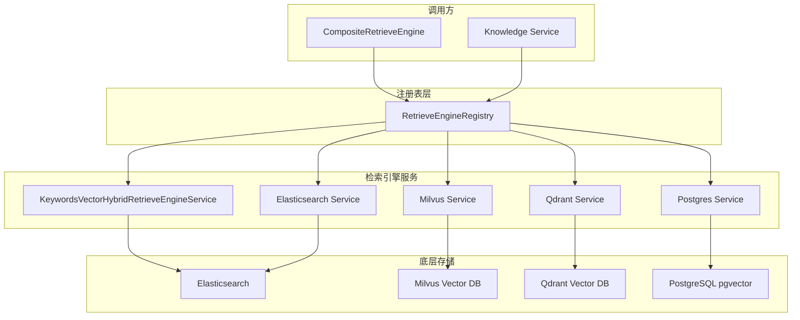

# Retrieve Engine Registry Management

## 模块概述

想象你正在经营一家大型图书馆，里面有多种不同的检索系统：有的擅长关键词搜索，有的专精向量相似度匹配，有的则面向特定数据库后端（如 Elasticsearch、Milvus、Qdrant）。当用户发起一次查询时，系统需要知道**有哪些检索引擎可用**、**如何找到它们**、以及**如何协调它们协同工作**。

`retrieve_engine_registry_management` 模块正是解决这个问题的核心枢纽。它实现了一个**服务注册表模式（Service Registry Pattern）**，为系统中所有检索引擎提供一个统一的注册、发现和获取机制。这个模块的存在源于一个关键的设计洞察：**检索后端是多样化的，但调用方不应该关心具体实现**。

为什么不能简单地硬编码检索引擎？因为系统需要支持：
1. **多租户配置**：不同租户可能使用不同的向量数据库
2. **混合检索**：一次查询可能需要同时调用关键词检索和向量检索
3. **可扩展性**：未来可能新增检索后端（如新增 Meilisearch 或 Vespa），而不修改调用方代码
4. **运行时灵活性**：某些检索引擎可能动态启用或禁用

该模块通过一个线程安全的注册表，将检索引擎的**类型标识**（`RetrieverEngineType`）与**服务实例**（`RetrieveEngineService`）解耦，使得上层业务逻辑只需面向接口编程，而无需感知底层存储的具体实现。

---

## 架构设计



### 架构角色说明

**注册表（Registry）** 是整个模块的核心，它扮演着"电话簿"的角色：
- 不直接执行检索，只负责**服务发现**
- 维护 `RetrieverEngineType` 到 `RetrieveEngineService` 的映射关系
- 保证并发安全（使用 `sync.RWMutex`）

**检索引擎服务（RetrieveEngineService）** 是实际执行索引和检索操作的组件：
- 每个服务对应一种检索后端（Elasticsearch、Milvus 等）
- 实现统一的接口，包括索引、删除、检索等操作
- 通过 `EngineType()` 方法向注册表声明自己的类型

**调用方**（如 [`CompositeRetrieveEngine`](composite_retriever_engine_orchestration.md)）：
- 从注册表获取所需的服务实例
- 不直接依赖具体实现，只依赖接口
- 可以动态组合多个引擎实现混合检索

### 数据流示例：一次检索请求的生命周期

1. **请求入口**：用户发起知识检索请求，携带查询文本和知识库 ID
2. **引擎发现**：`CompositeRetrieveEngine` 调用 `GetAllRetrieveEngineServices()` 获取所有可用引擎
3. **并行检索**：对每个支持的引擎并发调用 `Retrieve()` 方法
4. **结果聚合**：收集各引擎返回的 `RetrieveResult`，进行去重、排序、截断
5. **返回响应**：将聚合后的结果返回给调用方

关键在于：**注册表在整个流程中只参与第 2 步**，它确保调用方能找到正确的服务实例，但不介入实际的检索逻辑。

---

## 核心组件深度解析

### RetrieveEngineRegistry

**设计意图**：提供一个线程安全的服务注册表，实现检索引擎的**延迟绑定**（Late Binding）。这意味着引擎的注册和消费可以在不同的时间点发生，系统启动时注册，请求时获取。

**内部机制**：
```go
type RetrieveEngineRegistry struct {
    repositories map[types.RetrieverEngineType]interfaces.RetrieveEngineService
    mu           sync.RWMutex
}
```

- `repositories` 字段是一个映射表，键为引擎类型（如 `"elasticsearch"`、`"milvus"`），值为服务实例
- `mu` 是读写锁，保证并发安全：**注册时加写锁，获取时加读锁**
- 使用 `sync.RWMutex` 而非 `sync.Mutex` 是因为**读操作远多于写操作**（注册只在启动时发生，获取在每次请求时发生）

#### Register 方法

```go
func (r *RetrieveEngineRegistry) Register(repo interfaces.RetrieveEngineService) error
```

**参数**：
- `repo`：要实现 `RetrieveEngineService` 接口的服务实例

**返回值**：
- `error`：如果该类型已注册，返回错误；否则返回 `nil`

**副作用**：
- 将服务实例存入内部映射表
- 如果类型已存在，**拒绝覆盖**（这是设计决策，防止配置错误导致的服务替换）

**设计考量**：为什么注册失败时返回错误而不是静默覆盖？
- **安全性优先**：如果两个模块尝试注册同一类型的引擎，这通常是配置错误或代码重复，应该立即暴露问题
- **可预测性**：调用方可以依赖"注册成功即唯一"的语义，无需担心运行时服务被意外替换

#### GetRetrieveEngineService 方法

```go
func (r *RetrieveEngineRegistry) GetRetrieveEngineService(
    repoType types.RetrieverEngineType,
) (interfaces.RetrieveEngineService, error)
```

**参数**：
- `repoType`：要获取的引擎类型标识

**返回值**：
- `RetrieveEngineService`：找到的服务实例
- `error`：如果类型不存在，返回错误

**使用模式**：
```go
service, err := registry.GetRetrieveEngineService(types.RetrieverEngineTypeElasticsearch)
if err != nil {
    // 处理引擎不可用的情况（降级或返回错误）
}
results, err := service.Retrieve(ctx, params)
```

**设计考量**：为什么返回错误而不是 `nil`？
- **显式失败**：调用方必须处理引擎不可用的情况，避免空指针 panic
- **降级策略**：调用方可以根据错误类型决定是否尝试其他引擎或返回缓存结果

#### GetAllRetrieveEngineServices 方法

```go
func (r *RetrieveEngineRegistry) GetAllRetrieveEngineServices() []interfaces.RetrieveEngineService
```

**返回值**：所有已注册服务的切片（**副本**，非原始引用）

**关键细节**：方法返回的是**拷贝**而非原始映射的引用：
```go
result := make([]interfaces.RetrieveEngineService, 0, len(r.repositories))
for _, v := range r.repositories {
    result = append(result, v)
}
```

**为什么这么做？**
- **并发安全**：如果返回原始引用，调用方可能在遍历过程中修改映射（虽然 Go 的 map 遍历本身不支持修改，但返回切片可以避免调用方持有内部状态的引用）
- **隔离性**：注册表内部状态与外部使用解耦，后续注册/注销不影响已返回的切片

---

### RetrieveEngineService 接口

虽然这个接口定义在 [`internal/types/interfaces`](core_domain_types_and_interfaces.md) 包中，但它是理解注册表价值的关键。

**核心职责**：
1. **索引管理**：`Index`、`BatchIndex`、`DeleteByChunkIDList` 等
2. **检索执行**：通过嵌入的 `RetrieveEngine` 接口提供 `Retrieve` 方法
3. **元数据查询**：`EngineType()`、`Support()` 等

**关键设计**：接口中包含了**复制索引**（`CopyIndices`）这样的特殊操作，这是为了支持知识库克隆场景——直接从源知识库复制向量索引，避免重新计算嵌入，这是一个**性能优化**的体现。

---

### CompositeRetrieveEngine 与注册表的协作

[`CompositeRetrieveEngine`](composite_retriever_engine_orchestration.md) 是注册表的主要消费者之一。它的核心思路是：

```go
type CompositeRetrieveEngine struct {
    engineInfos []*engineInfo  // 每个 engineInfo 包含一个服务和它支持的检索类型
}
```

**初始化流程**：
1. 从注册表获取所有 `RetrieveEngineService`
2. 对每个服务，查询其 `Support()` 方法获取支持的检索类型
3. 构建 `engineInfo` 列表，建立"检索类型 → 服务"的映射

**检索流程**：
1. 根据请求的 `RetrieverType` 找到所有支持该类型的服务
2. 并发调用各服务的 `Retrieve()` 方法
3. 聚合结果，处理冲突（同一文档被多个引擎返回）

这种设计使得系统可以**动态组合检索能力**：例如，一次查询可以同时使用 Elasticsearch 的关键词检索和 Milvus 的向量检索，然后对结果进行融合排序。

---

## 依赖关系分析

### 注册表依赖的组件

| 依赖组件 | 类型 | 作用 |
|---------|------|------|
| `types.RetrieverEngineType` | 类型定义 | 引擎的唯一标识符（字符串枚举） |
| `interfaces.RetrieveEngineService` | 接口 | 注册表存储和返回的服务类型 |
| `interfaces.RetrieveEngineRegistry` | 接口 | 注册表自身实现的接口（用于依赖注入） |

### 依赖注册表的组件

| 依赖组件 | 使用方式 | 期望行为 |
|---------|---------|---------|
| [`CompositeRetrieveEngine`](composite_retriever_engine_orchestration.md) | 获取所有服务，构建复合引擎 | 注册表在引擎使用前已初始化完成 |
| [`KnowledgeService`](knowledge_ingestion_orchestration.md) | 获取特定引擎进行索引操作 | 请求的引擎类型必须已注册 |
| [`KeywordsVectorHybridRetrieveEngineService`](keywords_vector_hybrid_retrieve_engine_service.md) | 可能通过注册表获取其他引擎（取决于实现） | 支持跨引擎协作 |

### 数据契约

**注册时的契约**：
```go
// 服务必须能正确返回自己的类型
service.EngineType() // 必须返回唯一且一致的标识

// 注册后，服务实例应保持可用状态
// 注册表不管理服务的生命周期，只持有引用
```

**获取时的契约**：
```go
// 如果引擎类型未注册，返回 error
// 调用方必须处理此错误，不能假设服务一定存在
service, err := registry.GetRetrieveEngineService(engineType)
```

**并发契约**：
```go
// 注册表保证：
// 1. 注册操作是原子的（不会部分写入）
// 2. 获取操作不会读到脏数据
// 3. 获取返回的切片是快照，不受后续注册影响
```

---

## 设计决策与权衡

### 1. 为什么使用注册表模式而不是依赖注入框架？

**选择**：手动实现轻量级注册表，而非引入 Wire、Fx 等 DI 框架

**权衡**：
- **优点**：
  - 代码透明，逻辑清晰，新成员容易理解
  - 无外部依赖，减少构建复杂性
  - 运行时注册（而非编译时），支持动态配置
- **缺点**：
  - 需要手动管理注册顺序
  - 缺少编译时的依赖校验

**适用场景**：系统规模适中，依赖关系相对简单，且需要运行时灵活性

### 2. 为什么注册时不允许覆盖？

**选择**：如果类型已存在，`Register` 返回错误

**替代方案**：
- 静默覆盖（可能导致配置错误被掩盖）
- 记录警告日志但继续（可能产生不一致状态）

**决策理由**：
- **故障快速暴露**：重复注册通常是代码错误或配置问题，应该立即失败
- **可预测性**：调用方可以假设"注册成功即唯一"

**潜在问题**：如果确实需要热替换服务（如故障转移），当前设计不支持。这是**简化常见场景，牺牲边缘场景**的权衡。

### 3. 为什么使用 `sync.RWMutex` 而不是 `sync.Map`？

**选择**：`map + RWMutex` 组合

**替代方案**：`sync.Map`（Go 1.9+ 提供的并发安全 map）

**决策理由**：
- `sync.Map` 适用于**键空间稳定、读写比例极端**的场景
- 本场景中，键（引擎类型）是固定的，但需要**类型安全的迭代**（`GetAllRetrieveEngineServices` 返回有序切片）
- `map + RWMutex` 更直观，性能在低并发下足够好

### 4. 为什么 `GetAllRetrieveEngineServices` 返回切片而非迭代器？

**选择**：返回 `[]RetrieveEngineService`

**替代方案**：
- 返回 `chan RetrieveEngineService`（迭代器模式）
- 提供 `Range(func(type, service) bool)` 方法

**决策理由**：
- Go 的 `for range` 语法对切片支持最好
- 切片可以方便地进行并发处理（`errgroup` 等）
- 调用方通常需要**多次遍历**结果（如先过滤再映射），切片比单次迭代器更灵活

---

## 使用指南

### 基本使用模式

**注册引擎**（通常在应用启动时）：
```go
registry := retriever.NewRetrieveEngineRegistry()

// 创建并注册 Elasticsearch 引擎
esService := NewElasticsearchService(config)
err := registry.Register(esService)
if err != nil {
    log.Fatalf("Failed to register ES service: %v", err)
}

// 注册 Milvus 引擎
milvusService := NewMilvusService(config)
err = registry.Register(milvusService)
```

**获取并使用引擎**：
```go
// 获取特定引擎
service, err := registry.GetRetrieveEngineService(types.RetrieverEngineTypeElasticsearch)
if err != nil {
    // 处理引擎不可用：降级或返回错误
    return nil, err
}

// 执行检索
results, err := service.Retrieve(ctx, types.RetrieveParams{
    Query: "如何重置密码？",
    TopK:  10,
})
```

**获取所有引擎进行复合检索**：
```go
services := registry.GetAllRetrieveEngineServices()

// 并发检索
var allResults []*types.RetrieveResult
var wg sync.WaitGroup
var mu sync.Mutex

for _, svc := range services {
    wg.Add(1)
    go func(svc interfaces.RetrieveEngineService) {
        defer wg.Done()
        results, err := svc.Retrieve(ctx, params)
        if err != nil {
            log.Printf("Engine %s failed: %v", svc.EngineType(), err)
            return
        }
        mu.Lock()
        allResults = append(allResults, results...)
        mu.Unlock()
    }(svc)
}
wg.Wait()
```

### 配置建议

**启动顺序**：
1. 加载配置文件，确定启用的引擎类型
2. 创建各引擎的服务实例
3. 注册到全局注册表
4. 创建 `CompositeRetrieveEngine`，从注册表获取服务

**错误处理**：
- 注册失败：应该**终止启动**（这是配置错误）
- 获取失败：根据业务场景决定**降级**或**返回错误**

---

## 边界情况与注意事项

### 1. 并发注册问题

**风险**：如果在运行时并发调用 `Register`，可能导致竞态条件

**现状**：`RWMutex` 已保护，但**逻辑上不应该在运行时注册**

**建议**：
- 所有注册操作应在应用启动的单线程初始化阶段完成
- 如果确实需要动态注册，考虑添加 `Unregister` 方法并完善生命周期管理

### 2. 服务生命周期管理

**问题**：注册表持有服务实例的引用，但**不管理其生命周期**

**风险**：
- 如果服务需要清理资源（如关闭数据库连接），注册表不会自动处理
- 服务实例可能在注册表之前被垃圾回收（如果外部引用丢失）

**建议**：
- 服务实例应由**创建者管理生命周期**
- 应用关闭时，先关闭注册表中的服务，再销毁注册表

### 3. 引擎类型冲突

**问题**：两个不同实现可能使用相同的 `EngineType`

**场景**：
- 租户 A 使用 Elasticsearch v7，租户 B 使用 v8
- 两者都注册为 `types.RetrieverEngineTypeElasticsearch`

**现状**：后注册者会失败

**解决方案**：
- 使用更细粒度的类型标识（如 `elasticsearch-v7`、`elasticsearch-v8`）
- 或在服务内部处理多版本逻辑

### 4. 空注册表行为

**问题**：如果没有任何引擎注册，`GetAllRetrieveEngineServices` 返回空切片

**影响**：
- `CompositeRetrieveEngine` 会返回空结果（而非错误）
- 调用方可能误以为"无匹配结果"而非"无可用引擎"

**建议**：
- 启动时检查注册表非空
- 或在 `CompositeRetrieveEngine` 中添加校验逻辑

### 5. 错误信息不够详细

**现状**：错误信息如 `"repository type %s not found"` 只包含类型

**改进空间**：
- 添加可用类型列表：`"repository type %s not found; available types: [%v]"`
- 便于调试和运维

---

## 扩展点

### 添加新的检索引擎

1. 实现 `RetrieveEngineService` 接口
2. 定义新的 `RetrieverEngineType` 常量
3. 在启动代码中创建并注册服务

```go
// 1. 定义类型
const RetrieverEngineTypeMeilisearch RetrieverEngineType = "meilisearch"

// 2. 实现服务
type MeilisearchService struct {
    client *meilisearch.Client
}

func (m *MeilisearchService) EngineType() types.RetrieverEngineType {
    return RetrieverEngineTypeMeilisearch
}

// 实现其他接口方法...

// 3. 注册
service := &MeilisearchService{client: client}
registry.Register(service)
```

### 添加服务发现功能

当前设计是**静态注册**，如需支持动态服务发现（如从 Consul 或 etcd 获取）：

```go
// 扩展注册表
type DynamicRetrieveEngineRegistry struct {
    *RetrieveEngineRegistry
    discoveryClient DiscoveryClient
}

func (d *DynamicRetrieveEngineRegistry) StartDiscovery() {
    // 定期从服务发现系统拉取可用引擎
    go func() {
        for {
            services := d.discoveryClient.Discover("retriever-engine")
            for _, svc := range services {
                // 动态创建并注册
            }
            time.Sleep(30 * time.Second)
        }
    }()
}
```

---

## 相关模块

- [`composite_retriever_engine_orchestration`](composite_retriever_engine_orchestration.md)：注册表的主要消费者，实现多引擎复合检索
- [`keywords_vector_hybrid_retrieve_engine_service`](keywords_vector_hybrid_retrieve_engine_service.md)：混合检索引擎服务示例
- [`vector_retrieval_backend_repositories`](vector_retrieval_backend_repositories.md)：各向量数据库的仓库实现
- [`core_domain_types_and_interfaces`](core_domain_types_and_interfaces.md)：接口和类型定义

---

## 总结

`retrieve_engine_registry_management` 模块是一个**小而精**的设计典范：
- **职责单一**：只做服务注册和发现，不介入业务逻辑
- **接口清晰**：三个方法覆盖所有使用场景
- **并发安全**：使用 `RWMutex` 平衡性能和安全
- **易于扩展**：新增引擎只需实现接口并注册

它的存在使得系统能够**优雅地管理检索后端的多样性**，同时保持调用方代码的简洁和可测试性。理解这个模块的关键在于认识到：**注册表不是检索逻辑的一部分，而是检索能力的"目录"** —— 它告诉你有什么可用，但不告诉你怎么用。
