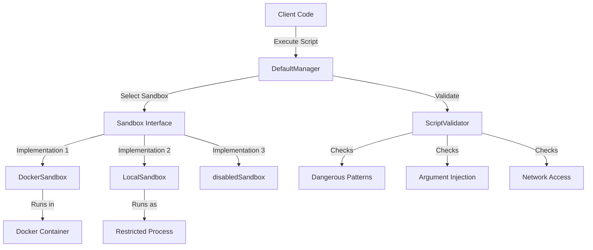

# Sandbox Execution and Script Safety 模块

## 概述

想象一下，你的系统允许用户上传或生成脚本文件，然后在服务器上执行这些脚本。你如何防止恶意脚本删除系统文件、窃取敏感数据或消耗所有服务器资源？这就是 `sandbox_execution_and_script_safety` 模块要解决的问题。

这个模块为系统提供了一个安全的"隔离舱"（sandbox），用于执行不受信任的脚本。它就像给脚本套上了一层防护罩：脚本可以在里面运行，但无法接触到防护罩外的系统资源。

## 架构概览



### 核心组件角色

1. **DefaultManager**：模块的"指挥中心"，负责沙箱选择、验证和执行流程
2. **ScriptValidator**：安全"检查站"，在执行前检查脚本内容、参数和输入
3. **Sandbox Interface**：统一的"隔离舱"接口，定义了沙箱必须实现的方法
4. **DockerSandbox**：基于 Docker 容器的强隔离实现
5. **LocalSandbox**：基于本地进程的轻量级隔离实现（作为 Docker 不可用时的备选）
6. **Config & ExecuteConfig**：配置"蓝图"，定义沙箱的行为和限制

### 数据流向

1. 客户端调用 `DefaultManager.Execute()` 并传入执行配置
2. `DefaultManager` 首先使用 `ScriptValidator` 验证脚本内容、参数和标准输入
3. 如果验证通过，选择合适的沙箱实现（Docker 优先，本地备选）
4. 在选中的沙箱中执行脚本
5. 返回执行结果（标准输出、标准错误、退出码等）

## 核心设计决策

### 1. 多层安全防护策略

**设计选择**：采用"多层防线"的安全策略，而不是依赖单一的隔离机制。

**为什么这样设计**：
- 没有任何单一的安全措施是完美的
- 多层防护可以在某一层失效时提供后备保护
- 符合"深度防御"（defense in depth）的安全原则

**具体实现**：
1. 脚本内容验证（静态检查）
2. 参数和输入验证（防止注入攻击）
3. 沙箱隔离（运行时限制）
4. 资源限制（防止资源耗尽）

### 2. Docker 优先，本地备选的沙箱策略

**设计选择**：优先使用 Docker 容器提供强隔离，但在 Docker 不可用时可以降级到本地进程隔离。

**为什么这样设计**：
- Docker 提供了最强的隔离性（命名空间、控制组、只读文件系统等）
- 但 Docker 可能在某些环境中不可用（如开发环境、受限的 CI/CD 环境）
- 本地沙箱虽然隔离性较弱，但仍能提供基本的安全保障

**权衡分析**：
- ✅ 强隔离：Docker 提供了最好的安全性
- ✅ 高可用性：即使没有 Docker，系统仍能工作
- ⚠️ 安全降级：本地沙箱的隔离性较弱，需要明确告知用户

### 3. 声明式配置与可插拔架构

**设计选择**：使用清晰的配置结构和统一的接口，允许不同的沙箱实现互换。

**为什么这样设计**：
- 灵活性：可以根据环境选择不同的沙箱实现
- 可测试性：可以轻松替换沙箱实现进行测试
- 可扩展性：未来可以添加新的沙箱实现（如基于 KVM、gVisor 等）

### 4. 提前验证，快速失败

**设计选择**：在执行脚本之前进行全面的安全验证，一旦发现问题立即拒绝执行。

**为什么这样设计**：
- 防止恶意脚本在被检测到之前造成损害
- 提供清晰的错误信息，帮助调试和修复问题
- 减少资源浪费（不会启动沙箱来执行明显恶意的脚本）

## 子模块摘要

本模块分为以下几个子模块，每个子模块负责特定的功能：

- [sandbox_contracts_and_execution_models](platform_infrastructure_and_runtime-sandbox_execution_and_script_safety-sandbox_contracts_and_execution_models.md)：定义了核心接口、数据结构和配置选项
- [sandbox_runtime_implementations](platform_infrastructure_and_runtime-sandbox_execution_and_script_safety-sandbox_runtime_implementations.md)：包含 Docker 和本地沙箱的具体实现
- [sandbox_manager_and_fallback_control](platform_infrastructure_and_runtime-sandbox_execution_and_script_safety-sandbox_manager_and_fallback_control.md)：管理沙箱选择、验证和执行流程
- [script_validation_and_safety_checks](platform_infrastructure_and_runtime-sandbox_execution_and_script_safety-script_validation_and_safety_checks.md)：提供脚本内容、参数和输入的安全验证

## 跨模块依赖

这个模块是一个相对独立的基础设施模块，主要被需要执行用户脚本的上层服务使用。它不依赖于系统的其他业务模块，但可能被以下模块使用：

- `agent_runtime_and_tools`：可能需要在沙箱中执行代理生成的脚本
- `application_services_and_orchestration`：可能需要在工作流中执行脚本

## 使用指南

### 基本使用

```go
// 创建默认配置的沙箱管理器
config := sandbox.DefaultConfig()
config.Type = sandbox.SandboxTypeDocker  // 优先使用 Docker
config.FallbackEnabled = true             // 允许降级到本地沙箱

manager, err := sandbox.NewManager(config)
if err != nil {
    log.Fatalf("Failed to create sandbox manager: %v", err)
}

// 准备执行配置
execConfig := &sandbox.ExecuteConfig{
    Script:  "/path/to/script.py",
    Args:    []string{"arg1", "arg2"},
    Timeout: 30 * time.Second,
}

// 执行脚本
result, err := manager.Execute(context.Background(), execConfig)
if err != nil {
    log.Fatalf("Execution failed: %v", err)
}

// 检查结果
if result.IsSuccess() {
    fmt.Printf("Output: %s\n", result.GetOutput())
} else {
    fmt.Printf("Error: %s\n", result.Error)
    fmt.Printf("Stderr: %s\n", result.Stderr)
}
```

### 安全最佳实践

1. **始终启用验证**：除非你完全信任脚本来源，否则不要设置 `SkipValidation: true`
2. **使用 Docker 沙箱**：在生产环境中，尽可能使用 Docker 沙箱而不是本地沙箱
3. **设置合理的超时**：防止脚本无限期运行
4. **限制资源使用**：通过 `MemoryLimit` 和 `CPULimit` 防止资源耗尽
5. **使用只读文件系统**：在 Docker 沙箱中启用 `ReadOnlyRootfs` 可以防止脚本修改系统文件
6. **禁用网络访问**：除非脚本确实需要网络访问，否则保持 `AllowNetwork: false`

### 常见陷阱

1. **相对路径问题**：`LocalSandbox` 要求脚本路径必须是绝对路径
2. **环境变量注入**：即使使用沙箱，也要小心传递给脚本的环境变量
3. **Docker 镜像安全**：确保使用的 Docker 镜像是安全的，不要包含不必要的工具
4. **验证不是万能的**：验证器可以检测常见的攻击模式，但无法保证 100% 安全
5. **资源限制的有效性**：在本地沙箱中，资源限制可能不如 Docker 中那样有效

## 扩展点

这个模块设计了几个关键的扩展点：

1. **自定义沙箱实现**：通过实现 `Sandbox` 接口，可以添加新的沙箱类型（如基于 gVisor、KVM 等）
2. **自定义验证规则**：可以扩展 `ScriptValidator` 或创建自己的验证器
3. **配置自定义**：通过 `Config` 和 `ExecuteConfig` 可以调整沙箱的行为
4. **管理器扩展**：可以实现自己的 `Manager` 接口来处理特殊的沙箱选择逻辑

## 总结

`sandbox_execution_and_script_safety` 模块为系统提供了一个安全、灵活、可扩展的脚本执行环境。它采用多层安全防护策略，优先使用 Docker 容器提供强隔离，但在 Docker 不可用时可以降级到本地进程隔离。通过提前验证、快速失败的设计，它能够在脚本执行前检测到大多数常见的安全威胁。

对于新加入团队的开发者，理解这个模块的关键是要认识到：安全是一个持续的过程，没有任何单一的措施是完美的。这个模块提供了一个坚实的基础，但你仍然需要根据具体的使用场景和风险评估来配置和使用它。
