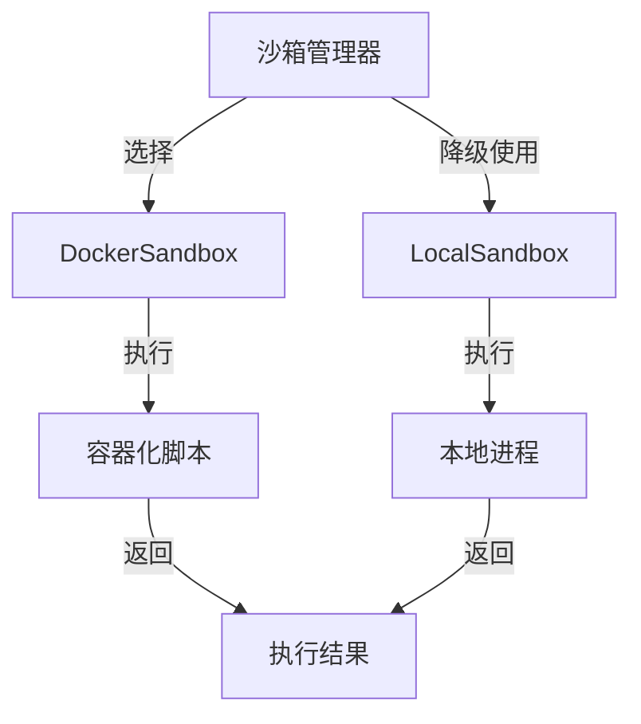

# 沙箱运行时实现 (sandbox_runtime_implementations)

## 概述

当你需要在系统中执行用户提交的脚本或任意代码时，安全隔离是首要考虑的问题。这个模块提供了一套完整的沙箱执行解决方案，允许你在受控制的环境中运行代码，同时最大限度地降低安全风险。

想象一下，你有一个需要处理用户提交的 Python 脚本的服务。如果直接在服务器上执行这些脚本，恶意代码可能会：
- 访问或修改服务器上的敏感文件
- 消耗大量 CPU/内存资源导致服务崩溃
- 通过网络发送敏感数据
- 执行系统命令获取服务器控制权

这个模块通过两种互补的沙箱实现来解决这些问题：Docker 容器隔离（首选，提供强隔离）和本地进程隔离（备用，提供基本安全）。

## 架构概览

**核心组件角色说明：**

1. **DockerSandbox**：使用 Docker 容器提供强隔离，是生产环境的首选方案。它通过控制容器资源、网络访问和文件系统权限来实现安全执行。

2. **LocalSandbox**：在 Docker 不可用时的降级方案，使用本地进程并通过工作目录限制、命令白名单和环境变量过滤来提供基本安全。

两种实现都遵循相同的 `Sandbox` 接口，确保在降级时不会改变调用代码的行为。

## 设计决策

### 1. 双重实现策略（Docker 优先，本地降级）
**选择**：提供两种沙箱实现，Docker 为首选，本地为后备
**原因**：
- Docker 提供了更强的隔离性，但需要 Docker 守护进程运行
- 本地实现虽然隔离性较弱，但始终可用，确保服务连续性
- **权衡**：增加了代码维护成本，但提高了系统的可靠性

### 2. 接口一致性
**选择**：两种实现都遵循相同的接口
**原因**：
- 允许上层代码在运行时无缝切换实现
- 简化了测试和降级逻辑
- **权衡**：限制了特定实现可以暴露的高级功能

### 3. 资源限制与超时控制
**选择**：在两种实现中都强制执行资源限制和超时
**原因**：
- 防止恶意代码消耗过多系统资源
- 确保脚本执行不会无限期挂起
- **权衡**：需要合理配置默认值，避免误杀合法但资源密集的脚本

### 4. 最小权限原则
**选择**：两种实现都应用最小权限原则
- Docker：非 root 用户、只读文件系统、禁用所有能力
- 本地：工作目录限制、命令白名单、环境变量过滤
**原因**：最小化潜在攻击面
- **权衡**：增加了配置复杂度，某些合法脚本可能需要额外权限

## 子模块说明

### Docker 基础沙箱运行时
这是生产环境的首选方案，使用 Docker 容器提供强隔离。它支持完整的资源限制、网络控制和文件系统隔离。

[详细文档请参考：sandbox_runtime_implementations-docker_based_sandbox_runtime.md](sandbox_runtime_implementations-docker_based_sandbox_runtime.md)

### 本地进程沙箱运行时
在 Docker 不可用时的降级方案，使用本地进程并通过多种安全措施提供基本隔离。虽然隔离性较弱，但确保了服务的基本可用性。

[详细文档请参考：sandbox_runtime_implementations-local_process_sandbox_runtime.md](sandbox_runtime_implementations-local_process_sandbox_runtime.md)

## 跨模块依赖

本模块作为平台基础设施的一部分，主要被以下模块依赖：
- [沙箱管理器和降级控制](platform_infrastructure_and_runtime-sandbox_execution_and_script_safety-sandbox_manager_and_fallback_control.md)：负责选择合适的沙箱实现并处理降级逻辑
- [脚本验证和安全检查](platform_infrastructure_and_runtime-sandbox_execution_and_script_safety-script_validation_and_safety_checks.md)：在执行前对脚本进行安全验证

## 新贡献者注意事项

1. **Docker 镜像要求**：DockerSandbox 依赖于预配置的 Docker 镜像，确保镜像包含所需的解释器且安全加固
2. **路径处理**：LocalSandbox 对脚本路径有严格要求，必须使用绝对路径且在允许的路径列表中
3. **超时处理**：两种实现都有超时机制，但 Docker 的超时由 Docker 守护进程处理，而本地实现使用进程组终止
4. **环境变量**：注意环境变量过滤机制，某些关键变量（如 LD_PRELOAD）会被自动过滤
5. **测试策略**：测试时需要同时测试两种实现，确保它们的行为一致
