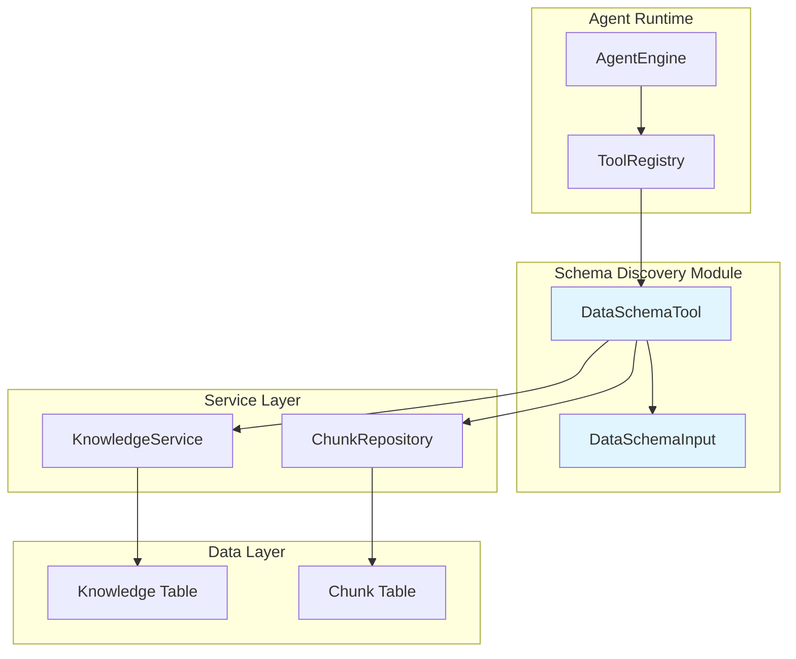

# Schema Discovery and Introspection 模块深度解析

## 模块概述

想象一下，你有一个智能助手，它能够回答关于公司内部数据的问题。但当用户问"这个 CSV 文件里有哪些列？"或者"这个 Excel 表格的结构是什么？"时，助手需要一种方式来"查看"这些文件的元数据，而不需要真正打开文件逐行解析。这就是 `schema_discovery_and_introspection` 模块存在的意义。

这个模块的核心职责是**为 Agent 提供数据表结构的 introspection（内省）能力**。它通过查询预先存储在系统中的 Chunk（文本块）来获取 CSV 或 Excel 文件的 schema 信息——包括表名、列定义和行数。这种设计的巧妙之处在于，它不需要在运行时直接访问原始文件，而是依赖于文档 ingestion（摄入）阶段就已经提取并存储好的结构化元数据。

为什么不能简单地让 Agent 直接读取文件？原因有三：
1. **性能**：文件可能存储在对象存储中，每次查询都下载解析会带来巨大延迟
2. **安全**：直接文件访问需要复杂的权限控制和沙箱隔离
3. **架构一致性**：系统已经将所有文档内容转化为 Chunk 存储在数据库中，复用这套存储层更简洁

因此，这个模块本质上是一个**元数据查询适配器**——它将 Agent 的工具调用请求，转化为对 Chunk 存储层的查询，并将结果格式化为 LLM 可理解的自然语言输出。

---

## 架构与数据流



### 组件角色说明

| 组件 | 职责 | 类比 |
|------|------|------|
| `DataSchemaTool` | 核心执行器，协调服务层调用并组装结果 | 像图书馆的目录查询员——你不直接进书库找书，而是告诉查询员你要什么，它帮你查目录并返回位置信息 |
| `DataSchemaInput` | 输入参数契约，仅包含 `KnowledgeID` | 像一张查询单，只填一个字段："我要查哪个文件" |
| `KnowledgeService` | 获取 Knowledge 元数据（主要是 TenantID） | 像档案管理员，告诉你某个文件属于哪个部门 |
| `ChunkRepository` | 查询特定类型的 Chunk 记录 | 像数据库索引，快速定位特定类型的文本块 |

### 数据流追踪

当 Agent 决定调用 `data_schema` 工具时，数据经历以下路径：

1. **工具解析阶段**：`AgentEngine` 从 LLM 返回的工具调用请求中提取工具名和参数，通过 `ToolRegistry` 解析出对应的 `DataSchemaTool` 实例
2. **参数验证阶段**：原始 JSON 参数被反序列化为 `DataSchemaInput` 结构体
3. **租户解析阶段**：调用 `KnowledgeService.GetKnowledgeByIDOnly()` 获取 `TenantID`——注意这里使用 `ByIDOnly` 方法是为了支持跨租户共享的知识库场景
4. **Chunk 查询阶段**：通过 `ChunkRepository.ListPagedChunksByKnowledgeID()` 查询该 Knowledge 下所有 `table_summary` 和 `table_column` 类型的 Chunk
5. **结果组装阶段**：遍历 Chunk 列表，按类型分离内容，组装为自然语言输出和结构化数据
6. **返回阶段**：返回 `ToolResult`，包含 `Success`、`Output`（人类可读）和 `Data`（程序可用）

---

## 核心组件深度解析

### DataSchemaTool：工具执行器

**设计意图**

`DataSchemaTool` 是典型的 **Command Pattern（命令模式）** 实现。它将"查询数据表结构"这个业务操作封装为一个可执行对象，符合 Agent 工具系统的设计哲学：每个工具都是一个独立的、可组合的能力单元。

**内部机制**

```go
type DataSchemaTool struct {
    BaseTool
    knowledgeService interfaces.KnowledgeService
    chunkRepo        interfaces.ChunkRepository
    targetChunkTypes []types.ChunkType
}
```

结构体嵌入 `BaseTool` 是 Go 中常见的**组合优于继承**模式。`BaseTool` 提供了工具的元数据（名称、描述、参数 Schema），而 `DataSchemaTool` 专注于业务逻辑。

`targetChunkTypes` 字段是一个关键设计。它允许工具在构造时指定要查询的 Chunk 类型，默认为：
- `ChunkTypeTableSummary`：表的摘要信息（表名、行数等）
- `ChunkTypeTableColumn`：列的定义信息（列名、类型、描述等）

这种设计的好处是**可扩展**——如果未来需要查询其他类型的元数据（如索引信息、约束信息），只需在构造时传入新的类型即可，无需修改 `Execute` 方法。

**Execute 方法的关键决策点**

1. **为什么使用 `GetKnowledgeByIDOnly` 而不是 `GetKnowledgeByID`？**
   
   代码注释明确说明："use IDOnly to support cross-tenant shared KB"。在共享知识库场景下，当前租户可能访问其他租户创建的 KB。`ByIDOnly` 方法跳过租户过滤，在权限校验层（通常在 Service 上层）已经验证过访问权限，这里只需要获取 `TenantID` 用于后续 Chunk 查询。

2. **为什么分页大小设为 100？**
   
   注释写道："Should be enough for schema chunks"。这是一个**基于领域知识的优化**：一个数据表的 schema 信息通常很小——即使有 100 列，`table_summary` + `table_column` 的 Chunk 数量也远小于 100。这个值在"避免多次查询"和"防止内存浪费"之间取得平衡。

3. **错误处理策略**
   
   方法返回两种错误信息：
   - `ToolResult.Error`：人类可读的错误描述，用于展示给用户或 LLM
   - `error` 返回值：Go 标准错误，用于上层日志记录
   
   这种**双重错误返回**模式在 Agent 工具系统中很常见，因为 LLM 需要理解错误原因来决定下一步行动（例如重试、换一种方式查询、或告知用户）。

### DataSchemaInput：输入契约

**设计意图**

`DataSchemaInput` 是一个极简的 DTO（Data Transfer Object），仅包含一个字段：

```go
type DataSchemaInput struct {
    KnowledgeID string `json:"knowledge_id" jsonschema:"id of the knowledge to query"`
}
```

这种设计反映了**最小权限原则**：工具只需要知道"查哪个文件"，不需要知道租户 ID、表名等其他信息。租户信息从 Knowledge 记录中派生，表名从 Chunk 内容中提取。

**jsonschema 标签的作用**

`jsonschema` 标签用于生成 JSON Schema，供 LLM 理解工具的参数格式。LLM 在决定调用工具时，会根据这个 Schema 生成符合格式的参数。标签中的描述文本"id of the knowledge to query"会出现在 LLM 的系统提示中，帮助它理解何时使用这个工具。

---

## 依赖关系分析

### 上游调用者

| 调用者 | 依赖关系 | 期望行为 |
|--------|----------|----------|
| `AgentEngine` | 间接通过 `ToolRegistry` | 期望工具在合理时间内返回确定性的结果，错误可恢复 |
| `ToolRegistry` | 直接持有 `DataSchemaTool` 实例 | 期望工具实现 `Tool` 接口，`Execute` 方法不 panic |

### 下游被调用者

| 被调用者 | 依赖原因 | 契约假设 |
|----------|----------|----------|
| `KnowledgeService.GetKnowledgeByIDOnly` | 获取 TenantID 用于 Chunk 查询 | 假设 Knowledge 存在且未删除；假设返回的 TenantID 有效 |
| `ChunkRepository.ListPagedChunksByKnowledgeID` | 查询 schema Chunk | 假设 Chunk 已预先通过文档处理流程生成；假设 `table_summary` 和 `table_column` 类型 Chunk 同时存在或同时不存在 |

### 数据契约

**输入契约**（来自 LLM）：
```json
{
  "knowledge_id": "uuid-string"
}
```

**输出契约**（返回给 LLM）：
```json
{
  "success": true,
  "output": "表名：sales_data\n总行数：10000\n\n列名：order_id, 类型：VARCHAR\n列名：amount, 类型：DECIMAL",
  "data": {
    "summary": "表名：sales_data\n总行数：10000",
    "columns": "列名：order_id, 类型：VARCHAR\n..."
  }
}
```

**关键假设**：
1. Knowledge 必须已经过文档处理流程，生成了对应的 schema Chunk
2. `table_summary` 和 `table_column` Chunk 必须成对存在（否则返回错误）
3. Chunk 的 `Content` 字段包含格式化的自然语言描述，而非原始 JSON

---

## 设计决策与权衡

### 1. 查询预计算元数据 vs 实时解析文件

**选择**：查询预计算的 Chunk

**权衡分析**：
- **优点**：
  - 性能：数据库查询比文件下载 + 解析快 1-2 个数量级
  - 一致性：所有工具都通过 Chunk 层访问数据，避免不同工具看到不同版本
  - 解耦：工具不需要知道文件存储细节（COS、本地、MinIO 等）
  
- **缺点**：
  - 延迟：文件更新后，需要重新处理才能更新 schema Chunk
  - 存储冗余：元数据在原始文件和 Chunk 中各存一份

**为什么这个权衡合理**：在知识库场景中，文件更新频率远低于查询频率，且文档处理是异步的，用户预期有延迟。

### 2. 使用 ChunkRepository 而非 KnowledgeService

**选择**：直接依赖 `ChunkRepository`

**权衡分析**：
- **优点**：
  - 精确控制：直接指定 Chunk 类型和分页参数
  - 避免过度封装：Service 层可能添加不必要的业务逻辑
  
- **缺点**：
  - 耦合：工具直接依赖 Repository 层，违反传统分层架构
  - 测试复杂度：需要 mock Repository 而非 Service

**为什么这个权衡合理**：在 Agent 工具场景中，工具本身就是"服务层"，它协调多个 Repository 完成特定任务。这种**CQRS 风格**的设计（查询直接走 Repository）在读取场景中很常见。

### 3. 同时返回 Output 和 Data

**选择**：`ToolResult` 包含 `Output`（字符串）和 `Data`（结构化对象）

**权衡分析**：
- **优点**：
  - 灵活性：LLM 消费 `Output`，前端可以解析 `Data` 做可视化
  - 向后兼容：如果未来需要更多字段，不影响现有 LLM 提示
  
- **缺点**：
  - 冗余：两份数据需要保持一致
  - 维护成本：修改输出格式需要同时更新两处

**为什么这个权衡合理**：这是 Agent 系统的**标准模式**，LLM 需要自然语言，但下游系统可能需要结构化数据。冗余的成本远小于灵活性的收益。

### 4. 硬编码分页大小 vs 可配置

**选择**：硬编码 `PageSize: 100`

**权衡分析**：
- **优点**：简单，无需配置管理
- **缺点**：如果未来有超大表（>100 列），需要改代码

**为什么这个权衡合理**：基于领域知识，99% 的数据表列数远小于 100。这是一个**YAGNI（You Aren't Gonna Need It）** 决策——等真正需要时再重构。

---

## 使用指南与示例

### 工具注册

```go
// 在 Agent 初始化时注册工具
tool := NewDataSchemaTool(knowledgeService, chunkRepo)
toolRegistry.Register(tool)
```

### 自定义目标 Chunk 类型

```go
// 如果未来需要查询其他类型的元数据
tool := NewDataSchemaTool(
    knowledgeService, 
    chunkRepo,
    types.ChunkTypeTableSummary,
    types.ChunkTypeTableColumn,
    types.ChunkTypeTableIndex, // 假设未来新增
)
```

### LLM 调用示例

当用户问"这个文件有哪些列？"时，LLM 可能生成：

```json
{
  "tool_call": {
    "name": "data_schema",
    "arguments": {
      "knowledge_id": "550e8400-e29b-41d4-a716-446655440000"
    }
  }
}
```

Agent 执行后返回：

```
表名：customer_orders
总行数：150000

列名：order_id, 类型：VARCHAR(36), 描述：订单唯一标识
列名：customer_id, 类型：VARCHAR(36), 描述：客户 ID
列名：order_date, 类型：TIMESTAMP, 描述：下单时间
列名：total_amount, 类型：DECIMAL(10,2), 描述：订单金额
```

---

## 边界情况与陷阱

### 1. 跨租户共享知识库

**问题**：当查询共享知识库时，`GetKnowledgeByIDOnly` 返回的 `TenantID` 是知识库所有者的租户 ID，而非当前用户租户 ID。

**影响**：`ListPagedChunksByKnowledgeID` 需要使用正确的 `TenantID` 查询，否则可能因租户隔离查不到数据。

**解决方案**：当前代码已正确处理——使用 `knowledge.TenantID` 而非从上下文提取租户 ID。

**注意事项**：如果未来修改此代码，**不要**从 `ctx` 中提取租户 ID，必须使用 Knowledge 记录的 `TenantID`。

### 2. Schema Chunk 缺失

**问题**：如果文件上传后尚未完成处理（异步任务），或处理失败，schema Chunk 可能不存在。

**当前行为**：返回错误 "No table schema information found for knowledge ID 'xxx'"

**潜在改进**：可以区分"处理中"和"处理失败"两种情况，返回不同的错误提示。当前实现将两种情况混为一谈。

**调试技巧**：如果频繁遇到此错误，检查：
1. 文档处理异步任务是否正常运行
2. 文件类型是否为 CSV/Excel（只有这些类型会生成 schema Chunk）
3. 日志中是否有解析错误

### 3. Chunk 类型不匹配

**问题**：代码假设 `table_summary` 和 `table_column` Chunk 同时存在或同时不存在。

**风险**：如果由于某种原因（如部分处理失败）只有一个类型存在，代码会返回错误，即使有部分信息可用。

**改进建议**：可以考虑返回部分信息，并在 `Output` 中说明缺失的内容：

```go
if summaryContent == "" && columnContent == "" {
    return error
}
if summaryContent == "" {
    output = columnContent + "\n\n[警告：表摘要信息缺失]"
}
```

### 4. 大数据表性能

**问题**：虽然分页大小为 100，但如果一个表有数千列（极端情况），可能需要多次查询。

**当前行为**：只查询第一页（100 条），可能遗漏列信息。

**改进建议**：如果业务场景确实需要支持超大表，可以添加循环查询逻辑：

```go
var allChunks []*Chunk
for len(chunks) == page.PageSize {
    allChunks = append(allChunks, chunks...)
    page.Page++
    chunks, _ = chunkRepo.ListPagedChunksByKnowledgeID(...)
}
```

### 5. 内容格式假设

**问题**：代码假设 Chunk 的 `Content` 字段包含格式化的自然语言文本。

**风险**：如果未来 Chunk 生成逻辑改变（如改为 JSON 格式），此工具的 `Output` 格式会受影响。

**建议**：在 `Data` 字段中返回更结构化的数据，减少对 `Content` 格式的依赖：

```go
Data: map[string]interface{}{
    "tableName":   extractTableName(summaryContent),
    "rowCount":    extractRowCount(summaryContent),
    "columns":     parseColumns(columnContent),
}
```

---

## 扩展点

### 1. 支持更多元数据类型

如果需要查询索引、外键约束等信息：

```go
// 1. 在 types/chunk.go 中新增常量
const ChunkTypeTableIndex ChunkType = "table_index"

// 2. 在文档处理流程中生成对应 Chunk

// 3. 修改工具默认类型
targetChunkTypes = []types.ChunkType{
    types.ChunkTypeTableSummary,
    types.ChunkTypeTableColumn,
    types.ChunkTypeTableIndex,
}
```

### 2. 支持直接 SQL 查询

如果需要实时查询数据库 schema（而非预计算 Chunk）：

```go
type DataSchemaTool struct {
    BaseTool
    knowledgeService interfaces.KnowledgeService
    chunkRepo        interfaces.ChunkRepository
    dbConnector      interfaces.DatabaseConnector // 新增
    useLiveQuery     bool // 新增配置
}
```

### 3. 缓存优化

如果同一 Knowledge 被频繁查询：

```go
type DataSchemaTool struct {
    BaseTool
    knowledgeService interfaces.KnowledgeService
    chunkRepo        interfaces.ChunkRepository
    cache            *sync.Map // KnowledgeID -> SchemaResult
    cacheTTL         time.Duration
}
```

---

## 相关模块参考

- [Agent Core Orchestration](agent_core_orchestration_and_tooling_foundation.md)：了解 `AgentEngine` 和 `ToolRegistry` 如何协调工具调用
- [Knowledge Access and Corpus Navigation Tools](knowledge_access_and_corpus_navigation_tools.md)：查看其他知识查询工具的设计模式
- [Data and Database Introspection Tools](data_and_database_introspection_tools.md)：了解同组的其他数据查询工具（如 `DatabaseQueryTool`）
- [Content and Knowledge Management Repositories](content_and_knowledge_management_repositories.md)：深入了解 `ChunkRepository` 的实现细节

---

## 总结

`schema_discovery_and_introspection` 模块是一个**小而美**的设计典范：

1. **职责单一**：只负责查询预计算的 schema 元数据
2. **依赖清晰**：通过接口依赖 `KnowledgeService` 和 `ChunkRepository`，易于测试和 mock
3. **扩展友好**：`targetChunkTypes` 参数允许未来扩展而不修改核心逻辑
4. **错误透明**：双重错误返回让 LLM 和开发者都能理解问题

理解这个模块的关键是认识到它**不是真正的 introspection**——它不直接检查文件结构，而是查询 ingestion 阶段生成的元数据副本。这种"预计算 + 缓存"的模式在知识库系统中非常普遍，是性能与一致性之间的经典权衡。
