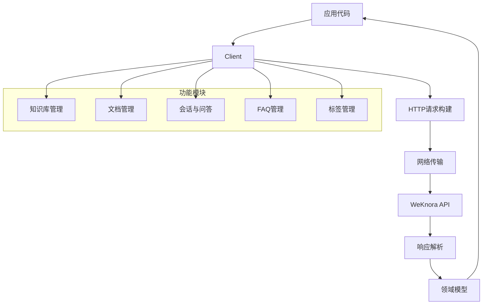

# SDK 客户端库 (sdk_client_library)

## 概述

SDK 客户端库是一个用于与 WeKnora API 交互的 Go 语言客户端实现。它封装了与服务端的通信细节，提供了友好的接口供调用者使用，使开发者能够轻松地管理知识库、进行问答交互、处理文档等操作，而无需直接处理底层的 HTTP 请求和响应。

## 架构设计

### 核心组件

SDK 客户端库采用分层架构设计，主要包含以下核心组件：

1. **客户端核心** (`Client`): 负责处理底层 HTTP 通信、请求构建和响应解析
2. **领域模型**: 定义了知识库、文档块、会话、消息等核心数据结构
3. **功能模块**: 提供了针对不同功能领域的 API 封装

### 数据流图



## 核心设计理念

### 1. 简洁性与灵活性的平衡

SDK 设计遵循"简单事情简单做，复杂事情可定制"的原则。例如：
- 提供了 `AgentQAStream` 方法用于简单的问答场景
- 同时也提供了 `AgentQAStreamWithRequest` 方法支持完整的自定义配置

### 2. 强类型化的 API 设计

所有 API 都使用强类型的请求和响应结构，这提供了：
- 编译时类型检查，减少运行时错误
- 更好的 IDE 自动补全支持
- 清晰的 API 文档和使用示例

### 3. 流式处理支持

对于需要实时交互的场景（如问答），SDK 提供了基于回调的流式处理机制，使得：
- 可以实时显示响应内容
- 支持中间状态展示（如思考过程、工具调用）
- 提供更好的用户体验

## 主要功能模块

### 客户端核心 ([client.client](sdk_client_library-client-client.md))

客户端核心是整个 SDK 的基础，负责处理 HTTP 通信、认证、请求序列化和响应反序列化。它提供了：
- 可配置的 HTTP 客户端
- 认证令牌管理
- 请求/响应处理管道
- 错误处理机制

### Agent 会话与问答 ([agent_session_and_message_api](sdk_client_library-agent_session_and_message_api.md))

这个模块提供了与智能 Agent 交互的功能，包括：
- 创建和管理 Agent 会话
- 发送问题并接收流式响应
- 处理 Agent 的思考过程和工具调用
- 管理对话历史

### 知识库与文档管理 ([knowledge_and_chunk_api](sdk_client_library-knowledge_and_chunk_api.md))

这个模块负责知识库和文档的管理，包括：
- 创建、查询、更新和删除知识库
- 上传和管理文档（支持文件和 URL）
- 文档块（Chunk）的管理
- 混合搜索功能

### FAQ 管理 ([faq_api](sdk_client_library-faq_api.md))

FAQ 管理模块提供了问答对的管理功能，包括：
- FAQ 条目的创建、更新和删除
- 批量导入和导出
- FAQ 搜索功能
- 导入进度跟踪

### 标签管理 ([tag_api](sdk_client_library-tag_api.md))

标签管理模块用于组织和分类内容，包括：
- 标签的创建、更新和删除
- 标签使用统计
- 按标签筛选内容

### 知识库配置 ([knowledge_base_api](sdk_client_library-knowledge_base_api.md))

这个模块提供了知识库的配置管理，包括：
- 知识库配置（分块、图像处理、FAQ 设置）
- 知识库复制
- 搜索参数配置

### 模型管理 ([model_api](sdk_client_library-model_api.md))

模型管理模块用于管理不同类型的 AI 模型，包括：
- 模型的创建、更新和删除
- 模型类型管理（嵌入、聊天、重排序等）
- 模型参数配置

### 租户与评估 ([tenant_and_evaluation_api](sdk_client_library-tenant_and_evaluation_api.md))

这个模块提供了多租户支持和模型评估功能，包括：
- 租户管理
- 检索引擎配置
- 评估任务创建和监控
- 评估结果获取

## 使用示例

### 基本使用流程

1. **创建客户端**
```go
client := NewClient("https://api.weknora.com", WithToken("your-api-key"))
```

2. **创建知识库**
```go
kb := &KnowledgeBase{
    Name: "My Knowledge Base",
    Description: "A sample knowledge base",
}
createdKB, err := client.CreateKnowledgeBase(ctx, kb)
```

3. **上传文档**
```go
knowledge, err := client.CreateKnowledgeFromFile(ctx, createdKB.ID, "/path/to/document.pdf", nil, nil, "")
```

4. **创建会话**
```go
session, err := client.CreateSession(ctx, &CreateSessionRequest{
    Title: "My Session",
})
```

5. **进行问答**
```go
err := client.AgentQAStream(ctx, session.ID, "What is this document about?", 
    func(response *AgentStreamResponse) error {
        // 处理响应
        fmt.Println(response.Content)
        return nil
    })
```

## 设计权衡与决策

### 1. 同步 vs 异步 API

**决策**: 对于长时间运行的操作（如文档导入、FAQ 批量处理），采用异步任务模式；对于快速操作，采用同步 API。

**原因**: 
- 异步操作避免了长时间阻塞客户端
- 提供了任务进度跟踪能力
- 同步 API 简化了常见场景的使用

### 2. 回调 vs 通道

**决策**: 流式 API 使用回调函数而不是通道。

**原因**:
- 回调提供了更简单的错误处理机制
- 更容易集成到现有代码中
- 避免了通道管理的复杂性

### 3. 强类型 vs 动态结构

**决策**: 所有 API 使用强类型结构。

**原因**:
- 提供编译时类型检查
- 更好的 IDE 支持
- 自文档化的 API 设计

## 注意事项与最佳实践

### 1. 错误处理

SDK 会返回详细的错误信息，建议在应用层进行适当的错误处理和重试逻辑。

### 2. 流式响应处理

在处理流式响应时，确保回调函数快速返回，避免阻塞后续事件的处理。

### 3. 资源管理

对于文件上传和下载操作，确保正确管理文件资源，及时关闭文件句柄。

### 4. 并发安全

`Client` 实例是并发安全的，可以在多个 goroutine 中共享使用。

## 与其他模块的关系

SDK 客户端库是一个独立的模块，但它与以下模块有紧密的关系：

- **核心客户端运行时** ([core_client_runtime](sdk_client_library-core_client_runtime.md)): 提供了底层的客户端运行时支持
- **前端契约与状态** ([frontend_contracts_and_state](frontend_contracts_and_state.md)): 定义了与前端交互的契约
- **应用服务与编排** ([application_services_and_orchestration](application_services_and_orchestration.md)): 是 SDK 调用的后端服务实现

## 总结

SDK 客户端库是一个功能完整、设计优雅的 API 客户端，它通过提供简洁的接口和强大的功能，使得与 WeKnora 平台的交互变得简单而高效。无论是构建简单的问答应用还是复杂的知识管理系统，这个 SDK 都能提供所需的支持。
