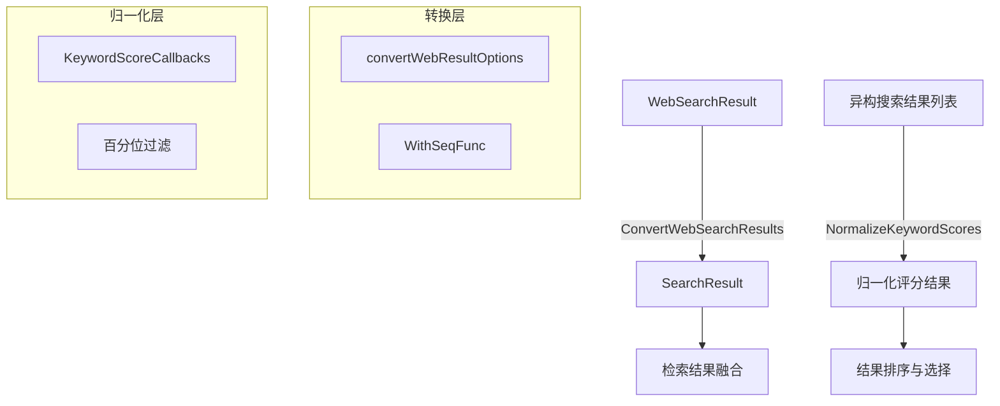

# search_result_conversion_and_normalization_utilities 模块技术文档

## 概述

想象一下，你正在处理来自不同搜索引擎的搜索结果：有的结果分数范围在 0-100，有的在 0-1，有的甚至没有分数；有的结果有完整的元数据，有的只有标题和 URL。这个模块就是为了解决这种混乱而存在的——它像一个"结果转换器"和"公平评分器"，将异构的网络搜索结果统一转换成系统内部的标准格式，并确保评分在同一尺度上进行比较。

这个模块解决了两个核心问题：
1. **格式统一**：将来自不同搜索引擎的 `WebSearchResult` 转换成系统内部通用的 `SearchResult` 结构
2. **评分归一化**：对关键词匹配结果的分数进行标准化处理，消除不同搜索引擎评分尺度的差异

## 架构概览



这个模块是一个**数据转换与标准化层**，位于搜索服务和检索结果融合之间。它不包含业务逻辑，而是专注于数据格式的统一和评分的标准化，使得后续的结果融合和排序能够在一致的基础上进行。

### 数据流向

1. **转换流程**：
   - 输入：来自不同搜索引擎的 `[]*types.WebSearchResult`
   - 处理：通过 `ConvertWebSearchResults` 函数进行格式转换
   - 输出：标准化的 `[]*types.SearchResult`

2. **归一化流程**：
   - 输入：包含异构评分的搜索结果列表
   - 处理：通过 `NormalizeKeywordScores` 函数进行评分归一化
   - 输出：评分标准化到 [0, 1] 范围的结果列表

## 核心设计决策

### 1. 函数选项模式用于配置转换行为

**选择**：使用函数选项模式（Functional Options Pattern）来配置 `ConvertWebSearchResults` 的行为。

**原因**：
- 提供了灵活的配置方式，同时保持了向后兼容性
- 避免了参数过多的函数签名
- 允许在不破坏现有代码的情况下添加新的配置选项

**权衡**：
- ✅ 优点：灵活性高，易于扩展，API 清晰
- ❌ 缺点：需要额外的结构体和函数定义，增加了少量代码复杂度

### 2. 百分位过滤的鲁棒归一化

**选择**：在 `NormalizeKeywordScores` 中使用 5%-95% 百分位过滤来处理异常值。

**原因**：
- 真实世界的搜索分数经常有极端值（outliers），直接使用最小最大值归一化会导致结果失真
- 百分位过滤提供了鲁棒性，能够在保持大部分数据分布的同时减少异常值的影响
- 只在样本量足够大（≥10）时启用，避免在小样本情况下过度处理

**权衡**：
- ✅ 优点：对异常值不敏感，归一化结果更稳定
- ❌ 缺点：在某些情况下可能会丢失极端但有意义的评分信息

### 3. 回调钩子用于可观测性

**选择**：通过 `KeywordScoreCallbacks` 结构体提供归一化过程的钩子函数。

**原因**：
- 允许调用者在不修改核心逻辑的情况下监控归一化过程
- 便于调试和日志记录
- 符合开闭原则（Open/Closed Principle）

**权衡**：
- ✅ 优点：提高了可观测性和可扩展性
- ❌ 缺点：增加了 API 表面，需要调用者理解回调的触发时机

### 4. 泛型设计的归一化函数

**选择**：`NormalizeKeywordScores` 使用泛型（Generics）设计，可以处理任意类型的搜索结果。

**原因**：
- 提高了代码的复用性，不需要为每种结果类型写重复的归一化逻辑
- 通过函数参数（`isKeyword`、`getScore`、`setScore`）定义行为，保持了灵活性
- 类型安全，编译时检查

**权衡**：
- ✅ 优点：高度可复用，类型安全，灵活性强
- ❌ 缺点：函数签名相对复杂，需要调用者提供多个函数参数

## 子模块

### web_result_conversion_options

负责网络搜索结果转换的配置选项，提供了灵活的方式来定制转换行为。主要组件包括 `convertWebResultOptions` 结构体和 `WithSeqFunc` 函数。

[查看详细文档](web_result_conversion_options.md)

### keyword_score_normalization_callbacks

负责关键词评分归一化的回调机制，提供了可观测性和扩展点。主要组件是 `KeywordScoreCallbacks` 结构体和 `NormalizeKeywordScores` 函数。

[查看详细文档](keyword_score_normalization_callbacks.md)

## 跨模块依赖

### 输入依赖

- **types.WebSearchResult**：来自 [web_search_domain_models](core_domain_types_and_interfaces-mcp_web_search_and_eventing_contracts.md)，定义了网络搜索结果的原始格式
- **types.SearchResult**：来自 [retrieval_engine_and_search_contracts](core_domain_types_and_interfaces-knowledge_graph_retrieval_and_content_contracts-retrieval_engine_and_search_contracts.md)，定义了系统内部的搜索结果格式

### 输出依赖

转换和归一化后的结果主要被以下模块使用：
- **retrieval_result_refinement_and_merge**：用于检索结果的精炼和融合
- **retrieval_reranking_plugin**：用于结果的重排序
- **top_k_result_selection_plugin**：用于选择 top-k 结果

## 使用指南

### 转换网络搜索结果

```go
// 基本用法
results := searchutil.ConvertWebSearchResults(webResults)

// 自定义序列函数
results := searchutil.ConvertWebSearchResults(
    webResults,
    searchutil.WithSeqFunc(func(idx int) int {
        return idx + 1 // 使用索引作为序列号
    }),
)
```

### 归一化关键词评分

```go
// 归一化搜索结果的评分
searchutil.NormalizeKeywordScores(
    results,
    func(r *types.SearchResult) bool {
        return r.MatchType == types.MatchTypeKeyword
    },
    func(r *types.SearchResult) float64 {
        return r.Score
    },
    func(r *types.SearchResult, score float64) {
        r.Score = score
    },
    searchutil.KeywordScoreCallbacks{
        OnNoVariance: func(count int, score float64) {
            log.Printf("All %d results have the same score: %f", count, score)
        },
        OnNormalized: func(count int, rawMin, rawMax, normMin, normMax float64) {
            log.Printf("Normalized %d results: raw [%.2f, %.2f] -> norm [%.2f, %.2f]",
                count, rawMin, rawMax, normMin, normMax)
        },
    },
)
```

## 注意事项和陷阱

### 1. 空值处理

`ConvertWebResult` 会自动跳过 `nil` 的 `WebSearchResult`，但调用者仍应注意输入列表中可能存在的空值。

### 2. 内容拼接规则

内容拼接的顺序是：Title → Snippet → Content，使用双换行符分隔。如果你的搜索引擎返回的内容结构不同，可能需要在转换前进行预处理。

### 3. 固定的 web search 评分

网络搜索结果的默认评分固定为 0.6，这是一个经验值。如果你需要更精确的评分，应该在转换后结合其他信息进行调整。

### 4. 百分位过滤的触发条件

百分位过滤只在结果数量 ≥ 10 时才会启用。如果你的结果集通常较小，这个特性不会生效，你可能需要考虑其他的归一化策略。

### 5. 回调函数的性能

`KeywordScoreCallbacks` 中的回调函数会在归一化过程中同步调用，避免在回调中执行耗时操作，以免影响整体性能。

### 6. 归一化的边界情况

当所有结果的评分相同时，归一化函数会将所有评分设置为 1.0，而不是 0.0 或其他值。这是一个有意的设计决策，表示这些结果在当前上下文中是等价的。
