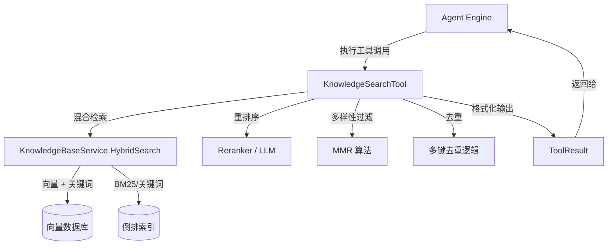

# semantic_knowledge_search 模块深度解析

## 模块概述：为什么需要语义搜索？

想象一下，用户问的是"如何配置 RAG 系统的缓存策略"，但知识库里实际存储的文档标题可能是"向量数据库检索优化指南"。传统的关键词匹配会直接返回空结果——因为字面上完全没有重叠。这就是 **语义搜索** 要解决的核心问题：**理解意图，而非匹配文字**。

`semantic_knowledge_search` 模块是 Agent 工具链中的"知识检索专家"。它不关心用户问了什么字，而是关心用户想知道什么**概念**。通过向量嵌入（Embedding）将查询和文档片段映射到同一语义空间，该模块能够找到那些"意思相近但措辞不同"的内容。这对于需要理解、推理、概念解释的任务至关重要。

但语义搜索并非银弹。本模块的设计哲学是：**混合检索 + 智能重排序 + 多样性控制**。它先通过向量 + 关键词的混合检索召回候选，然后用重排序模型精排，最后用 MMR（最大边际相关性）算法去除冗余，确保返回的结果既相关又多样。

---

## 架构定位与数据流

### 架构角色



### 组件职责

| 组件 | 职责 | 类比 |
|------|------|------|
| `KnowledgeSearchTool` |  orchestrator，协调整个检索流程 | 机场安检总控台 |
| `KnowledgeSearchInput` | 查询参数契约 | 旅客的登机牌 |
| `searchResultWithMeta` | 带元数据的搜索结果包装器 | 贴了标签的行李 |
| `chunkRange` | 连续 chunk 索引范围表示 | 书籍的页码区间 |

### 数据流追踪

一次完整的语义搜索经历以下阶段：

1. **输入解析**：Agent 引擎调用 `Execute()`，传入 JSON 参数，解析为 `KnowledgeSearchInput`
2. **搜索目标确定**：根据用户指定的 `knowledge_base_ids` 过滤预计算的 `searchTargets`
3. **并发混合检索**：对每个查询 × 每个搜索目标并发执行 `HybridSearch`，返回带 RRF 分数的结果
4. **去重**：使用多键（ID、父 chunk ID、知识 ID+ 索引、内容签名）去除重复
5. **重排序**：优先使用 Rerank 模型，失败则降级到 LLM 打分，FAQ 结果保持原序
6. **多样性过滤**：应用 MMR 算法，λ=0.7 平衡相关性与多样性
7. **格式化输出**：生成人类可读的文本和结构化数据

---

## 核心组件深度解析

### KnowledgeSearchInput：查询契约

```go
type KnowledgeSearchInput struct {
    Queries          []string `json:"queries"`
    KnowledgeBaseIDs []string `json:"knowledge_base_ids,omitempty"`
}
```

**设计意图**：这个结构体定义了 Agent 与检索系统之间的"协议"。`queries` 必须是 1-5 个**语义完整的问题或概念陈述**，而非关键词列表。这是本模块与关键词搜索工具的根本区别。

**为什么限制 5 个查询？** 这是一个工程权衡：
- 太少（1 个）：可能无法覆盖用户意图的多面性
- 太多（>5 个）：并发检索开销指数增长，且 LLM 重排序的 token 消耗过大
- 5 个是经验值，平衡了召回率和成本

**使用陷阱**：Agent 不应将用户的原始消息直接作为查询。正确的做法是先将用户意图提炼为 1-5 个概念性问题，再传入此工具。

### KnowledgeSearchTool：检索编排器

这是模块的核心类，承担了**检索策略编排者**的角色。它不直接执行向量搜索，而是协调多个下游服务完成端到端的检索流程。

#### 依赖注入设计

```go
func NewKnowledgeSearchTool(
    knowledgeBaseService interfaces.KnowledgeBaseService,  // 混合检索执行者
    knowledgeService     interfaces.KnowledgeService,      // 知识元数据
    chunkService         interfaces.ChunkService,          // Chunk 详情与 FAQ 元数据
    searchTargets        types.SearchTargets,              // 预计算的搜索目标
    rerankModel          rerank.Reranker,                  // 专用重排序模型
    chatModel            chat.Chat,                        // LLM 重排序（备选）
    cfg                  *config.Config,                   // 全局配置
) *KnowledgeSearchTool
```

**设计洞察**：这里采用了**依赖倒置**模式。`KnowledgeSearchTool` 不关心具体的向量数据库实现（Elasticsearch、Milvus、Qdrant 等），只依赖抽象接口。这使得检索后端可以独立演进，不影响工具逻辑。

#### Execute 方法：检索流水线

`Execute()` 方法是理解本模块的关键。它实现了一个多阶段的检索流水线：

```
原始查询 → 并发检索 → 去重 → 重排序 → MMR → 最终去重 → 格式化输出
```

**阶段 1：并发检索**

```go
allResults := t.concurrentSearchByTargets(ctx, queries, searchTargets,
    topK, vectorThreshold, keywordThreshold, kbTypeMap)
```

这里的关键优化是**并发**。每个查询 × 每个搜索目标都是一个独立的 goroutine。假设有 3 个查询、5 个知识库，就会启动 15 个并发搜索。这显著降低了端到端延迟，但需要注意：

- 使用 `sync.WaitGroup` 确保所有 goroutine 完成
- 使用 `sync.Mutex` 保护共享的 `allResults` 切片
- 单个搜索失败不会阻塞整体流程（记录日志后返回）

**阶段 2：去重（重排序前）**

```go
deduplicatedBeforeRerank := t.deduplicateResults(allResults)
```

**为什么在重排序前去重？** 这是一个性能优化。重排序（尤其是 LLM 重排序）是计算密集型操作。如果 100 个候选中有 30 个重复，提前去重可以节省 30% 的重排序成本。

**阶段 3：重排序策略**

```go
if t.chatModel != nil && len(deduplicatedBeforeRerank) > 0 && rerankQuery != "" {
    // 优先使用 LLM 重排序
    rerankedResults, err := t.rerankResults(ctx, rerankQuery, deduplicatedBeforeRerank)
} else if t.rerankModel != nil {
    // 降级到专用 Rerank 模型
} else {
    // 无重排序，使用原始结果
}
```

**设计权衡**：这里有一个反直觉的选择——**优先使用 LLM 而非专用 Rerank 模型**。原因是：

1. LLM 能理解更复杂的语义关系，尤其是跨段落的推理
2. 专用 Rerank 模型（如 Jina Reranker）虽然快，但对复杂查询的理解有限
3. LLM 失败时有 Rerank 模型作为降级方案

但 LLM 重排序的成本更高，因此采用**批处理**策略：每次处理 15 个结果，避免 token 溢出。

**阶段 4：MMR 多样性过滤**

```go
mmrResults := t.applyMMR(ctx, filteredResults, mmrK, 0.7)
```

**什么是 MMR？** 最大边际相关性（Maximal Marginal Relevance）算法解决的是"结果同质化"问题。想象一下，用户问"如何优化数据库性能"，如果返回的 10 个结果都在讲"索引优化"，就遗漏了"查询重写"、"缓存策略"、"分区设计"等其他重要方面。

MMR 的公式是：

$$
\text{MMR} = \lambda \times \text{Relevance} - (1 - \lambda) \times \text{Redundancy}
$$

其中：
- `Relevance` 是重排序后的分数
- `Redundancy` 是已选结果的最大相似度（Jaccard 相似度）
- `λ=0.7` 表示更重视相关性，但保留 30% 的多样性权重

**实现细节**：MMR 使用贪心算法迭代选择：
1. 选分数最高的结果加入已选集合
2. 计算剩余候选与已选集合的最大冗余度
3. 选择 MMR 分数最高的候选
4. 重复直到选满 k 个

**阶段 5：最终去重与排序**

重排序和 MMR 可能改变结果的顺序和分数，因此需要再次去重。最终按分数降序排列，分数相同时按 KnowledgeID 排序（保证确定性）。

### searchResultWithMeta：结果包装器

```go
type searchResultWithMeta struct {
    *types.SearchResult
    SourceQuery       string  // 哪个查询匹配到这个结果
    QueryType         string  // "vector" 或 "keyword"
    KnowledgeBaseID   string  // 来源知识库 ID
    KnowledgeBaseType string  // 知识库类型（document、faq 等）
}
```

**设计意图**：这个结构体是**信息丰富化**的典型例子。原始的 `SearchResult` 只包含检索结果本身，但下游（尤其是格式化输出和 Agent 决策）需要知道：

- 这个结果是由哪个查询触发的？（用于追溯意图）
- 是向量匹配还是关键词匹配？（用于判断可靠性）
- 来自哪个知识库？什么类型？（FAQ 结果有特殊处理逻辑）

通过嵌入（embedding）`*types.SearchResult`，既保留了所有原始字段，又添加了上下文元数据。

### chunkRange：连续范围表示

```go
type chunkRange struct {
    start int
    end   int
}
```

这个结构体在当前代码中定义但未直接使用。它的设计意图是表示**连续的 chunk 索引范围**，用于优化相邻 chunk 的合并展示。例如，如果检索到 chunk 5、6、7，可以合并为 `chunkRange{5, 7}`，减少输出冗余。这是一个**预留的扩展点**，未来可能用于上下文窗口优化。

---

## 依赖关系分析

### 上游调用者

| 调用者 | 期望 | 契约 |
|--------|------|------|
| `AgentEngine` | 获取语义相关的知识片段 | 通过 `ToolExecutor` 接口调用 `Execute()` |
| `ToolRegistry` | 工具注册与发现 | 工具名称 `ToolKnowledgeSearch` |

### 下游被调用者

| 被调用者 | 用途 | 失败处理 |
|----------|------|----------|
| `KnowledgeBaseService.HybridSearch` | 执行混合检索 | 记录日志，跳过该目标 |
| `Reranker.Rerank` | 专用重排序模型 | 降级到 LLM 或原始分数 |
| `Chat.Chat` | LLM 重排序 | 使用原始分数 |
| `ChunkService.GetChunkByID` | 获取 FAQ 元数据 | 缓存 nil，跳过该 chunk |
| `KnowledgeBaseService.GetKnowledgeBaseByID` | 获取 KB 类型 | 记录日志，类型为空 |

### 数据契约

**输入契约**（`KnowledgeSearchInput`）：
- `queries`: 1-5 个字符串，每个是语义完整的问题
- `knowledge_base_ids`: 0-10 个字符串，可选的知识库过滤

**输出契约**（`ToolResult`）：
- `Success`: bool，表示工具执行是否成功
- `Output`: 人类可读的文本（包含检索统计、建议）
- `Data`: 结构化数据（results 数组、count、kb_counts 等）

**关键约束**：
- 如果无结果，`Output` 必须包含明确的"下一步建议"（使用 web_search 或声明未找到）
- FAQ 结果保留原始分数，不参与重排序
- 结果必须去重且按分数降序排列

---

## 设计决策与权衡

### 1. 混合检索 vs 纯向量检索

**选择**：混合检索（向量 + 关键词）+ RRF 融合

**权衡**：
- 纯向量检索：语义理解好，但对专有名词、精确匹配弱
- 纯关键词检索：精确匹配好，但无法理解同义词、上下位词
- 混合检索：两者兼顾，但需要设计融合策略

**RRF（Reciprocal Rank Fusion）** 的选择是因为它**无需调参**。传统加权融合需要调整向量权重α和关键词权重 (1-α)，而 RRF 只依赖排名：

$$
\text{RRF}(d) = \sum_{r \in R} \frac{1}{k + \text{rank}_r(d)}
$$

其中 `k=60` 是经验常数。这避免了繁琐的权重调优。

### 2. 重排序策略：LLM vs 专用模型

**选择**：优先 LLM，降级到专用 Rerank 模型

**权衡**：
- LLM：理解能力强，可解释性好，但延迟高、成本高
- 专用 Rerank 模型：速度快、成本低，但理解能力有限

**设计洞察**：这是一个**质量优先、成本可控**的策略。对于关键的知识检索任务，质量比速度更重要。但通过批处理（15 个/批）和降级机制，控制了最坏情况下的成本。

### 3. FAQ 结果的特殊处理

**选择**：FAQ 结果不参与重排序，保持原始顺序

**原因**：FAQ 是**显式问答对**，其相关性已经由人工或高质量生成过程保证。重排序模型可能会错误地降低高质量 FAQ 的分数。这是一个**领域知识驱动**的设计决策。

### 4. 多键去重策略

**选择**：使用 4 种键进行去重
1. Chunk ID（精确匹配）
2. 父 Chunk ID（处理子 chunk 重复）
3. 知识 ID + Chunk 索引（处理跨 KB 重复）
4. 内容签名（处理近重复内容）

**权衡**：
- 单一键去重：简单，但可能漏掉语义重复
- 多键去重：复杂，但能捕获更多重复模式

**设计洞察**：这是一个**防御性编程**的例子。在实际运行中，同一个 chunk 可能通过不同路径被检索到（例如，同时属于多个知识库）。多键去重确保最终结果的纯净度。

### 5. 阈值处理的演变

**历史问题**：早期版本使用 `minScore` 过滤 RRF 结果，但 RRF 分数范围是 [0, ~0.033]，而非 [0, 1]，导致所有结果都被过滤掉。

**当前设计**：阈值过滤在 `HybridSearch` 内部完成（针对原始向量/关键词分数），RRF 融合后不再过滤。

**教训**：理解分数语义至关重要。RRF 是排名融合，不是分数融合，其数值范围与原始分数完全不同。

---

## 使用指南与示例

### 基本使用

```go
// 创建工具实例
searchTool := NewKnowledgeSearchTool(
    kbService, knowledgeService, chunkService,
    searchTargets, rerankModel, chatModel, config,
)

// 构造输入
input := KnowledgeSearchInput{
    Queries: []string{
        "RAG 系统的基本原理是什么？",
        "如何优化向量检索的性能？",
    },
    KnowledgeBaseIDs: []string{"kb-001", "kb-002"},
}

// 执行搜索
inputJSON, _ := json.Marshal(input)
result, err := searchTool.Execute(ctx, inputJSON)
```

### 配置参数

检索行为受以下配置影响（优先级：Tenant Config > Global Config > 硬编码默认值）：

| 参数 | 含义 | 默认值 | 调优建议 |
|------|------|--------|----------|
| `topK` | 每个搜索目标返回的最大结果数 | 5 | 增加可提高召回率，但增加重排序成本 |
| `vectorThreshold` | 向量相似度阈值 | 0.6 | 降低可增加召回，但可能引入噪声 |
| `keywordThreshold` | 关键词匹配阈值 | 0.5 | 同上 |
| `minScore` | 最终结果最低分数 | 0.3 | 已废弃（RRF 分数范围不同） |

### 最佳实践

1. **查询构造**：将用户意图提炼为 1-5 个概念性问题，而非直接传递原始消息
2. **知识库选择**：如果用户明确指定了知识库范围，务必传入 `knowledge_base_ids`
3. **结果处理**：检查 `result.Success`，失败时查看 `result.Error`
4. **无结果处理**：当 `result.Data["count"] == 0` 时，遵循输出中的"下一步建议"

---

## 边界情况与陷阱

### 1. 无搜索目标

**场景**：用户未指定知识库，且系统未配置默认搜索目标

**表现**：返回错误 "no knowledge bases specified and no search targets configured"

**处理**：在 Agent 层面确保 `searchTargets` 正确初始化，或在工具调用前验证

### 2. FAQ 元数据加载失败

**场景**：Chunk 关联的 FAQ 元数据不存在或加载失败

**表现**：日志记录警告，继续处理其他结果

**设计意图**：这是**优雅降级**的例子。FAQ 元数据是增强信息，不应阻塞主流程。

### 3. LLM 重排序解析失败

**场景**：LLM 返回的格式不符合预期，无法解析分数

**表现**：使用该批次的原始分数，继续处理下一批

**防御措施**：
- 分数解析使用宽松的解析策略（提取数字即可）
- 分数不足时用最后一个分数填充
- 完全失败时使用 0.5 作为默认分数

### 4. MMR 返回空结果

**场景**：极端情况下 MMR 可能返回空切片（代码逻辑问题）

**处理**：检测空结果，回退到原始结果

```go
if len(mmrResults) > 0 {
    filteredResults = mmrResults
} else {
    logger.Warnf(ctx, "MMR returned no results, using original results")
}
```

### 5. 跨租户共享知识库

**场景**：检索共享知识库时，需要使用正确的 tenant_id 查询 chunk 总数

**处理**：通过 `searchTargets.GetTenantIDForKB()` 获取有效的 tenant_id

**陷阱**：如果 KB 不在 searchTargets 中，会记录警告并跳过 chunk 统计

---

## 性能考量

### 并发度控制

当前实现中，并发度 = `queries 数量 × searchTargets 数量`。极端情况下（5 查询 × 50 知识库 = 250 个 goroutine），可能导致资源竞争。

**优化建议**：
- 添加信号量限制最大并发数
- 对 searchTargets 进行分组批处理

### 缓存策略

FAQ 元数据使用请求级缓存（`faqMetadataCache`），避免重复加载同一 chunk 的元数据。

**扩展建议**：
- 引入 Redis 缓存热点 chunk 的元数据
- 对 `getKnowledgeBaseTypes` 结果进行缓存

### Token 消耗优化

LLM 重排序的 token 消耗是主要成本驱动因素。当前优化：
- 批处理（15 个/批）
- 内容截断（800 字符上限）
- 低温度（0.1）减少重复生成

**进一步优化**：
- 对短内容跳过截断
- 使用更紧凑的 prompt 格式
- 对高分结果（>0.8）跳过重排序

---

## 扩展点

### 1. 添加新的重排序策略

实现 `rerankResults` 方法的新分支，例如：
- 基于规则的启发式重排序
- 多模型集成重排序

### 2. 自定义 MMR 参数

当前 λ=0.7 是硬编码的。可以通过配置或输入参数暴露：

```go
type KnowledgeSearchInput struct {
    Queries          []string
    KnowledgeBaseIDs []string
    MMRLambda        float64  // 新增：多样性权重
}
```

### 3. 结果后处理插件

在 `formatOutput` 之前插入后处理步骤：
- 摘要生成
- 关键句提取
- 多语言翻译

---

## 相关模块参考

- [agent_core_orchestration_and_tooling_foundation](agent_core_orchestration_and_tooling_foundation.md)：工具注册与执行框架
- [retrieval_and_web_search_services](retrieval_and_web_search_services.md)：混合检索服务实现
- [model_providers_and_ai_backends](model_providers_and_ai_backends.md)：Rerank 模型与 LLM 后端
- [knowledge_and_chunk_api](knowledge_and_chunk_api.md)：Chunk 数据模型与 API

---

## 总结

`semantic_knowledge_search` 模块是 Agent 知识检索能力的核心。它的设计体现了几个关键原则：

1. **语义优先**：理解意图而非匹配文字
2. **混合策略**：向量 + 关键词 + 重排序 + 多样性
3. **优雅降级**：每层都有备选方案，确保系统鲁棒性
4. **性能意识**：并发检索、批处理、缓存优化
5. **领域适配**：FAQ 特殊处理、多键去重、跨租户支持

理解这个模块的关键是把握其**流水线思维**：每个阶段都有明确的目标和权衡，整体效果优于任何单一策略。对于新贡献者，建议从 `Execute()` 方法入手，沿着数据流追踪每个阶段的转换逻辑，逐步建立对整体架构的直觉。
