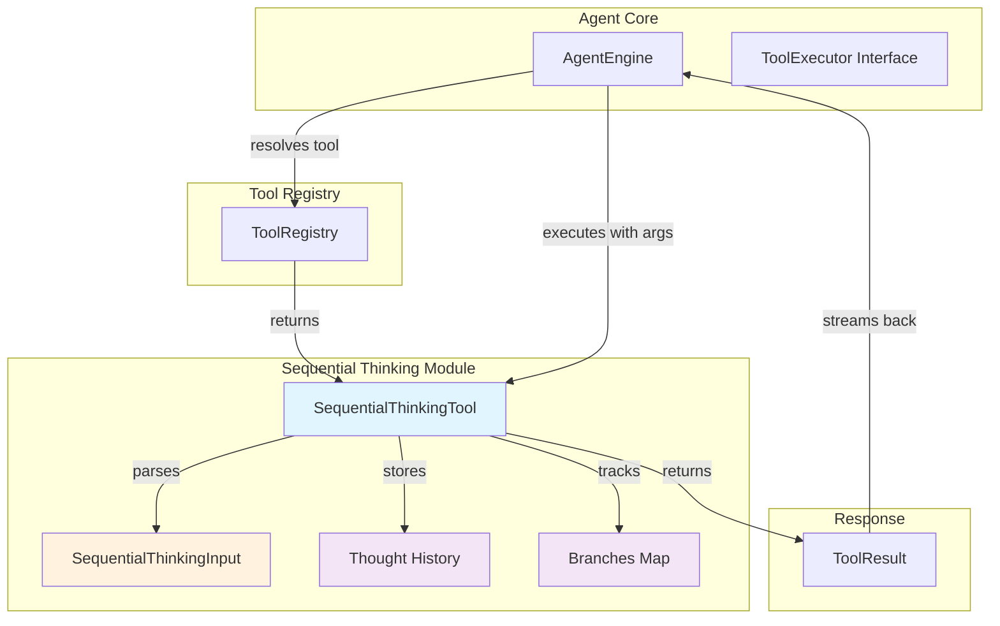

# Sequential Reasoning Tool Contracts and Execution

## 概述：为什么需要这个模块

想象一下，你正在解决一个复杂的数学证明题。你不会一口气写出最终答案，而是会在草稿纸上逐步推导：先写下已知条件，然后尝试第一步推理，发现走不通就划掉重来，遇到不确定的地方就标记下来稍后验证，有时甚至需要分叉出多条思路并行探索。

**`sequential_reasoning_tool_contracts_and_execution` 模块**正是为 Agent 提供了这样一块"数字草稿纸"。它实现了一个名为 `SequentialThinkingTool` 的工具，允许 Agent 在解决复杂问题时进行**动态的、可反思的、多步骤的思考过程**。

这个模块解决的核心问题是：**如何让 Agent 在面对复杂、模糊、多步骤的任务时，不是一次性给出答案，而是像人类一样进行逐步推理、自我质疑、修正和验证**。 naive 的方案是让 LLM 直接在对话中输出思考过程，但这样做有几个问题：

1. **思考过程无法被追踪和结构化** —— 纯文本输出难以被系统记录、可视化或用于后续分析
2. **无法维持跨步骤的上下文状态** —— 每次 LLM 调用都是独立的，思考的历史记录会丢失
3. **无法支持分支和修订** —— 人类思考时会说"等等，我刚才第三步想错了"，但纯文本对话难以表达这种元认知操作
4. **无法向用户展示思考进度** —— 用户看不到 Agent 已经思考了多少步、还需要多少步、是否有未完成的部分

本模块通过定义一套**结构化的思考协议**（`SequentialThinkingInput`）和一个**有状态的思考工具**（`SequentialThinkingTool`），让 Agent 能够以工具调用的形式进行显式的、可追踪的、可分支的序列思考。

---

## 架构与数据流



### 架构角色说明

| 组件 | 架构角色 | 职责 |
|------|----------|------|
| `SequentialThinkingTool` | **有状态工具执行器** | 维护思考历史、处理分支、验证输入、生成结构化响应 |
| `SequentialThinkingInput` | **思考协议契约** | 定义单次思考步骤的输入结构（思考内容、序号、是否需要继续等） |
| `thoughtHistory` | **状态存储器** | 按顺序记录所有思考步骤，形成完整的思考链 |
| `branches` | **分支追踪器** | 当思考需要分叉探索多条路径时，按分支 ID 组织思考步骤 |
| `ToolResult` | **执行结果契约** | 向 Agent Engine 返回思考步骤的执行状态和元数据 |

### 数据流 walkthrough

一次完整的思考流程如下：

1. **Agent Engine 发起工具调用** —— 当 LLM 决定需要进一步思考时，它会生成一个 `ToolCall`，其中 `name` 为 `sequential_thinking`，`args` 包含思考内容
2. **ToolRegistry 解析工具** —— 根据工具名称从注册表中找到 `SequentialThinkingTool` 实例
3. **SequentialThinkingTool.Execute 被调用** —— 接收 JSON 原始参数，解析为 `SequentialThinkingInput`
4. **验证与状态更新** —— 验证输入合法性，将思考步骤追加到 `thoughtHistory`，如有分支则记录到 `branches`
5. **生成响应** —— 返回 `ToolResult`，其中 `Data` 字段包含思考进度元数据（当前步数、总步数、是否有未完成步骤等）
6. **流式返回给 LLM** —— Agent Engine 将思考步骤作为事件流的一部分返回，LLM 可以看到之前的思考历史并决定下一步

---

## 核心组件深度解析

### `SequentialThinkingInput` —— 思考协议的数据契约

```go
type SequentialThinkingInput struct {
    Thought           string `json:"thought"`
    NextThoughtNeeded bool   `json:"next_thought_needed"`
    ThoughtNumber     int    `json:"thought_number"`
    TotalThoughts     int    `json:"total_thoughts"`
    IsRevision        bool   `json:"is_revision,omitempty"`
    RevisesThought    *int   `json:"revises_thought,omitempty"`
    BranchFromThought *int   `json:"branch_from_thought,omitempty"`
    BranchID          string `json:"branch_id,omitempty"`
    NeedsMoreThoughts bool   `json:"needs_more_thoughts,omitempty"`
}
```

这个结构体是**Agent 与思考工具之间的通信协议**。理解它的设计需要把握几个关键点：

#### 必填字段 vs 可选字段的设计意图

**必填字段**（`thought`, `next_thought_needed`, `thought_number`, `total_thoughts`）构成了思考的**最小完整描述**：
- `thought` —— 当前步骤的思考内容，这是思考的核心载体
- `next_thought_needed` —— 告诉系统是否需要继续思考，这是**终止条件的显式声明**
- `thought_number` / `total_thoughts` —— 提供进度感，让 Agent 和用户知道"现在在哪、还要走多远"

**可选字段**（`is_revision`, `revises_thought`, `branch_from_thought`, `branch_id`, `needs_more_thoughts`）支持**元认知操作**：
- 当你意识到之前的某步推理有误时，用 `is_revision=true` + `revises_thought=3` 表示"我在修正第 3 步"
- 当你想探索另一条思路时，用 `branch_from_thought=2` + `branch_id="alt_path"` 表示"我从第 2 步分叉出一条新路径"
- 当你以为思考结束了但突然发现还缺东西时，用 `needs_more_thoughts=true` 表示"我需要更多步骤"

这种设计体现了**渐进式复杂性**的原则：简单场景下只需要必填字段，复杂场景下可选字段提供额外的表达能力。

#### `total_thoughts` 的动态调整机制

注意 `total_thoughts` 的语义是"**当前估计**需要多少步"，而不是"一开始就确定的固定值"。这是一个关键的设计洞察：

> 人类在解决问题时，很少能一开始就准确预测需要多少步。我们通常是边走边看，发现复杂了就调整预期。

代码中有一行看似简单但很重要的逻辑：

```go
if input.ThoughtNumber > input.TotalThoughts {
    input.TotalThoughts = input.ThoughtNumber
}
```

这行代码允许 Agent **在思考过程中动态上调总步数**。比如 Agent 原本估计 5 步能解决，但走到第 5 步时发现还不够，它可以设置 `thought_number=6, total_thoughts=8`，系统会自动接受这个调整。

#### 用户友好语言约束

在 `thought` 字段的描述中，有一个非常具体但容易被忽视的要求：

> **CRITICAL**: Write your thoughts in natural, user-friendly language. NEVER mention tool names (like "grep_chunks", "knowledge_search", etc.) in your thinking process.

这个约束的设计原因是：
1. **思考过程可能被直接展示给用户** —— 如果用户看到"我要调用 grep_chunks 工具"，会感到困惑（为什么在说技术细节？）
2. **工具实现可能变化** —— 今天用 `grep_chunks`，明天可能换成别的实现，思考内容不应该耦合到具体工具名
3. **关注意图而非实现** —— 思考应该表达"我要找什么"和"为什么"，而不是"我用哪个函数"

---

### `SequentialThinkingTool` —— 有状态的思考执行器

```go
type SequentialThinkingTool struct {
    BaseTool
    thoughtHistory []SequentialThinkingInput
    branches       map[string][]SequentialThinkingInput
}
```

这个结构体的设计体现了一个关键决策：**思考工具是有状态的**。

#### 为什么需要状态？

对比一下无状态工具（比如 `WebSearchTool`）：
- 无状态工具：每次调用都是独立的，输入 → 处理 → 输出，不记得之前的调用
- 有状态工具：需要记住历史，因为当前思考步骤依赖于之前的思考

`SequentialThinkingTool` 维护两个状态：
1. `thoughtHistory` —— 按时间顺序记录所有思考步骤，形成一条主线
2. `branches` —— 当思考分叉时，按分支 ID 组织各分支的思考步骤

这个设计带来一个重要的**实现约束**：`SequentialThinkingTool` 的实例必须在**单次会话的多次工具调用之间保持存活**。如果每次工具调用都创建新实例，状态就会丢失，分支和修订功能就无法工作。

#### `Execute` 方法的核心逻辑

```go
func (t *SequentialThinkingTool) Execute(ctx context.Context, args json.RawMessage) (*types.ToolResult, error)
```

这个方法的执行流程可以分为几个阶段：

**阶段 1：解析与验证**
```go
var input SequentialThinkingInput
json.Unmarshal(args, &input)
t.validate(input)
```
这里使用 `validate` 方法进行基本校验（非空、数值范围），但**不做语义校验**。比如它不会检查 `revises_thought` 是否指向一个真实存在的历史步骤——这个责任留给了调用者（LLM）。

**阶段 2：状态更新**
```go
t.thoughtHistory = append(t.thoughtHistory, input)
if input.BranchFromThought != nil && input.BranchID != "" {
    t.branches[input.BranchID] = append(t.branches[input.BranchID], input)
}
```
这里有一个细节：即使是一个分支思考，它**同时**会被添加到 `thoughtHistory` 和 `branches` 中。这意味着主线历史包含所有思考（包括分支），而 `branches` 提供按分支 ID 的索引视图。

**阶段 3：响应生成**
```go
incomplete := input.NextThoughtNeeded || input.NeedsMoreThoughts || input.ThoughtNumber < input.TotalThoughts
responseData := map[string]interface{}{
    "thought_number":         input.ThoughtNumber,
    "total_thoughts":         input.TotalThoughts,
    "next_thought_needed":    input.NextThoughtNeeded,
    "branches":               branchKeys,
    "thought_history_length": len(t.thoughtHistory),
    "display_type":           "thinking",
    "thought":                input.Thought,
    "incomplete_steps":       incomplete,
}
```
响应中的 `incomplete_steps` 字段是一个**派生状态**，它综合了三个条件来判断思考是否完成。这个设计让前端或 Agent Engine 可以快速判断是否需要继续等待更多思考步骤。

#### `validate` 方法的边界

```go
func (t *SequentialThinkingTool) validate(data SequentialThinkingInput) error {
    if data.Thought == "" {
        return fmt.Errorf("invalid thought: must be a non-empty string")
    }
    if data.ThoughtNumber < 1 {
        return fmt.Errorf("invalid thoughtNumber: must be >= 1")
    }
    if data.TotalThoughts < 1 {
        return fmt.Errorf("invalid totalThoughts: must be >= 1")
    }
    return nil
}
```

注意验证的**最小化原则**：只检查格式和范围，不检查语义一致性。比如：
- ✅ 会检查：`thought_number` 是否 >= 1
- ❌ 不会检查：`thought_number` 是否比上一步连续（允许跳跃）
- ❌ 不会检查：`revises_thought` 是否指向存在的步骤
- ❌ 不会检查：`branch_from_thought` 是否小于当前 `thought_number`

这种设计是有意为之：**思考过程本质上是自由的、非线性的**，过度验证会限制 Agent 的表达能力。语义一致性的责任由 LLM 承担（它应该生成合理的思考序列），系统只做最基本的防护。

---

## 依赖关系分析

### 上游依赖（谁调用这个模块）

| 调用者 | 调用方式 | 期望 |
|--------|----------|------|
| [`AgentEngine`](internal.types.interfaces.agent.AgentEngine) | 通过 `ToolExecutor` 接口调用 `Execute` 方法 | 期望返回 `ToolResult`，其中 `Data` 包含思考进度元数据用于流式展示 |
| [`ToolRegistry`](internal.agent.tools.registry.ToolRegistry) | 通过 `types.Tool` 接口解析工具实例 | 期望工具符合 `BaseTool` 的 schema 和 description 契约 |
| LLM（通过 Agent） | 生成 `ToolCall` 触发工具执行 | 期望思考历史被维护，可以在后续调用中参考之前的思考 |

### 下游依赖（这个模块调用谁）

| 被调用者 | 调用方式 | 原因 |
|----------|----------|------|
| [`BaseTool`](internal.agent.tools.tool.BaseTool) | 嵌入为结构体字段 | 继承工具的基础元数据（名称、描述、JSON Schema） |
| [`types.ToolResult`](internal.types.agent.ToolResult) | 构造返回对象 | 遵循统一的工具执行结果契约 |
| `logger` | 记录日志 | 可观测性，便于调试思考过程 |

### 数据契约

**输入契约**（从 Agent 到工具）：
```json
{
  "thought": "string (required)",
  "next_thought_needed": "boolean (required)",
  "thought_number": "integer >= 1 (required)",
  "total_thoughts": "integer >= 1 (required)",
  "is_revision": "boolean (optional)",
  "revises_thought": "integer >= 1 (optional)",
  "branch_from_thought": "integer >= 1 (optional)",
  "branch_id": "string (optional)",
  "needs_more_thoughts": "boolean (optional)"
}
```

**输出契约**（从工具到 Agent）：
```json
{
  "success": "boolean",
  "output": "string",
  "data": {
    "thought_number": "integer",
    "total_thoughts": "integer",
    "next_thought_needed": "boolean",
    "branches": "string[]",
    "thought_history_length": "integer",
    "display_type": "thinking",
    "thought": "string",
    "incomplete_steps": "boolean"
  },
  "error": "string (optional)"
}
```

---

## 设计决策与权衡

### 1. 有状态 vs 无状态工具

**决策**：选择有状态设计（维护 `thoughtHistory` 和 `branches`）

**权衡**：
- ✅ 优点：支持跨步骤的上下文追踪，可以实现分支、修订等高级功能
- ❌ 缺点：工具实例必须在会话期间保持存活，增加了生命周期管理的复杂度
- ❌ 风险：如果 Agent Engine 在多次工具调用之间重建工具实例，状态会丢失

**为什么这样设计**：思考的本质是累积性的。第 N 步思考通常依赖于前 N-1 步的结论。无状态设计会迫使 LLM 在每次调用时重复之前的思考内容，浪费 token 且容易出错。

### 2. 宽松验证 vs 严格验证

**决策**：只做格式验证，不做语义验证

**权衡**：
- ✅ 优点：给予 LLM 最大的表达自由，支持非线性的思考模式
- ❌ 缺点：错误的思考序列（如引用不存在的步骤）不会被系统捕获，可能导致混乱
- ⚠️ 缓解：通过工具描述中的最佳实践引导 LLM 生成合理的序列

**为什么这样设计**：思考过程本质上是创造性的、非结构化的。过度验证会扼杀灵活性。系统选择信任 LLM 的语义判断，只在格式层面做防护。

### 3. 动态 `total_thoughts` vs 固定步数

**决策**：允许在思考过程中调整 `total_thoughts`

**权衡**：
- ✅ 优点：符合人类解决问题的实际模式（边走边调整预期）
- ❌ 缺点：无法预先知道思考何时结束，前端展示进度条时会有不确定性
- ⚠️ 缓解：通过 `incomplete_steps` 字段告知是否还有未完成的部分

**为什么这样设计**：固定步数会迫使 LLM 在开始时就做出准确预测，这在实际复杂问题中几乎不可能。动态调整更符合真实认知过程。

### 4. 分支支持 vs 线性思考

**决策**：支持显式的分支机制（`branch_from_thought`, `branch_id`）

**权衡**：
- ✅ 优点：允许并行探索多条思路，适合需要对比多种方案的场景
- ❌ 缺点：增加了状态管理的复杂度，前端展示分支思考也更复杂
- ⚠️ 现状：代码中实现了分支存储，但 `Execute` 返回的 `branches` 只包含分支 ID 列表，没有返回各分支的详细内容

**为什么这样设计**：复杂问题往往需要探索多条路径。虽然增加了复杂度，但这是支持高级推理模式的必要能力。

---

## 使用示例与配置

### 基本使用模式

```go
// 1. 创建工具实例（通常在 Agent 初始化时）
thinkingTool := NewSequentialThinkingTool()

// 2. LLM 决定需要思考，生成 ToolCall
toolCall := types.ToolCall{
    ID:   "call_123",
    Name: "sequential_thinking",
    Args: map[string]interface{}{
        "thought":             "我需要先理解用户问题的核心诉求",
        "next_thought_needed": true,
        "thought_number":      1,
        "total_thoughts":      5,
    },
}

// 3. Agent Engine 执行工具
argsJSON, _ := json.Marshal(toolCall.Args)
result, err := thinkingTool.Execute(ctx, argsJSON)

// 4. 处理结果
if result.Success {
    // result.Data 包含思考进度元数据
    // result.Output 包含人类可读的状态消息
}
```

### 多步思考流程示例

```
Step 1: LLM → Tool
{
  "thought": "用户问的是关于知识库搜索的问题，我需要先理解搜索的范围",
  "next_thought_needed": true,
  "thought_number": 1,
  "total_thoughts": 4
}

Step 2: LLM → Tool
{
  "thought": "搜索范围应该是用户指定的知识库，但我需要先确认有哪些知识库可用",
  "next_thought_needed": true,
  "thought_number": 2,
  "total_thoughts": 4
}

Step 3: LLM → Tool（发现之前估计不够）
{
  "thought": "等等，我还需要考虑权限问题，用户可能只能访问部分知识库",
  "next_thought_needed": true,
  "thought_number": 3,
  "total_thoughts": 6  // 动态上调总步数
}

Step 4-6: 继续思考...

Step 7: LLM → Tool（完成）
{
  "thought": "综上所述，我应该先列出用户可访问的知识库，再进行搜索",
  "next_thought_needed": false,
  "thought_number": 7,
  "total_thoughts": 7
}
```

### 分支思考示例

```
主线思考 1-2: 初步分析问题

分支 A（从思考 2 分叉）:
{
  "thought": "让我尝试从技术实现角度分析",
  "thought_number": 3,
  "total_thoughts": 5,
  "branch_from_thought": 2,
  "branch_id": "tech_analysis"
}

分支 B（从思考 2 分叉）:
{
  "thought": "让我也从用户体验角度分析",
  "thought_number": 4,
  "total_thoughts": 5,
  "branch_from_thought": 2,
  "branch_id": "ux_analysis"
}

主线思考 5: 综合两个分支的结论
```

---

## 边界情况与注意事项

### 1. 工具实例生命周期

**问题**：`SequentialThinkingTool` 是有状态的，但谁负责维护实例的生命周期？

**现状**：代码中没有明确说明。从设计推断，实例应该在**单次会话的 Agent 执行期间保持存活**，在会话结束后可以销毁。

**风险**：如果 Agent Engine 在多次工具调用之间重建工具实例，`thoughtHistory` 和 `branches` 会丢失，导致思考链断裂。

**建议**：在 `AgentEngine` 或 `ToolRegistry` 中实现会话级的工具实例缓存，确保同一会话内的多次工具调用使用同一个实例。

### 2. 分支内容的可访问性

**问题**：`Execute` 返回的 `branches` 字段只包含分支 ID 列表，没有各分支的思考内容。

```go
responseData := map[string]interface{}{
    "branches": branchKeys,  // 只是 []string{"branch_1", "branch_2"}
    ...
}
```

**影响**：LLM 无法通过工具返回结果看到之前分支思考的内容，只能依赖对话历史。

**建议**：考虑在 `Data` 中增加 `branch_contents` 字段，返回各分支的思考步骤详情，方便 LLM 进行跨分支的综合分析。

### 3. 思考步骤的序号连续性

**问题**：系统不验证 `thought_number` 是否连续。LLM 可以生成 `1, 2, 5, 7` 这样的序列。

**影响**：虽然功能上没问题，但可能让用户感到困惑（3 和 4 去哪了？）。

**建议**：在工具描述中明确建议 LLM 保持序号连续，或者在验证阶段增加警告（不阻止但记录日志）。

### 4. 修订语义的模糊性

**问题**：`is_revision=true` + `revises_thought=3` 的语义是什么？是"替换第 3 步"还是"对第 3 步的补充说明"？

**现状**：代码中没有明确定义，只是将修订步骤添加到历史中。

**风险**：LLM 和前端可能对修订的理解不一致。

**建议**：在工具描述中明确修订的语义，或者增加一个 `revision_type` 字段（replace/amend/cancel）。

### 5. 思考内容的长度限制

**问题**：`thought` 字段没有长度限制。如果 LLM 生成过长的思考内容，可能影响性能和展示。

**建议**：考虑增加合理的长度限制（如 2000 字符），在验证阶段进行检查。

### 6. 并发安全性

**问题**：`SequentialThinkingTool` 的 `Execute` 方法会修改 `thoughtHistory` 和 `branches`，如果多个 goroutine 并发调用，会有竞态条件。

**现状**：代码中没有加锁保护。

**假设**：设计假设是单次会话内工具调用是串行的（Agent 一次只执行一个工具）。

**建议**：如果未来支持并行工具执行，需要增加互斥锁保护状态修改。

---

## 与其他模块的关系

- **[tool_definition_and_registry](tool_definition_and_registry.md)** —— `SequentialThinkingTool` 通过 `BaseTool` 继承工具元数据，并通过 `ToolRegistry` 注册
- **[agent_engine_orchestration](agent_engine_orchestration.md)** —— `AgentEngine` 负责调用工具的 `Execute` 方法并处理返回结果
- **[agent_reasoning_and_planning_state_tools](agent_reasoning_and_planning_state_tools.md)** —— 与 `TodoWriteTool` 一起构成 Agent 的规划与推理状态管理工具集
- **[message_trace_and_tool_events_api](message_trace_and_tool_events_api.md)** —— 思考步骤作为工具调用事件被记录到消息追踪中

---

## 总结

`sequential_reasoning_tool_contracts_and_execution` 模块的核心价值在于：**为 Agent 提供了一套结构化的、可追踪的、支持元认知操作的思考协议**。

它的设计哲学可以概括为：
1. **显式优于隐式** —— 思考过程通过工具调用显式表达，而非隐藏在对话文本中
2. **灵活优于严格** —— 支持动态调整、分支、修订，适应真实思考的非线性特征
3. **状态ful 优于 stateless** —— 维护思考历史，支持跨步骤的上下文追踪
4. **用户友好优先** —— 思考内容使用自然语言，避免技术术语，便于展示给用户

理解这个模块的关键是把握它的双重角色：对 LLM 而言，它是一个表达思考的工具；对系统而言，它是一个追踪和记录思考过程的基础设施。
